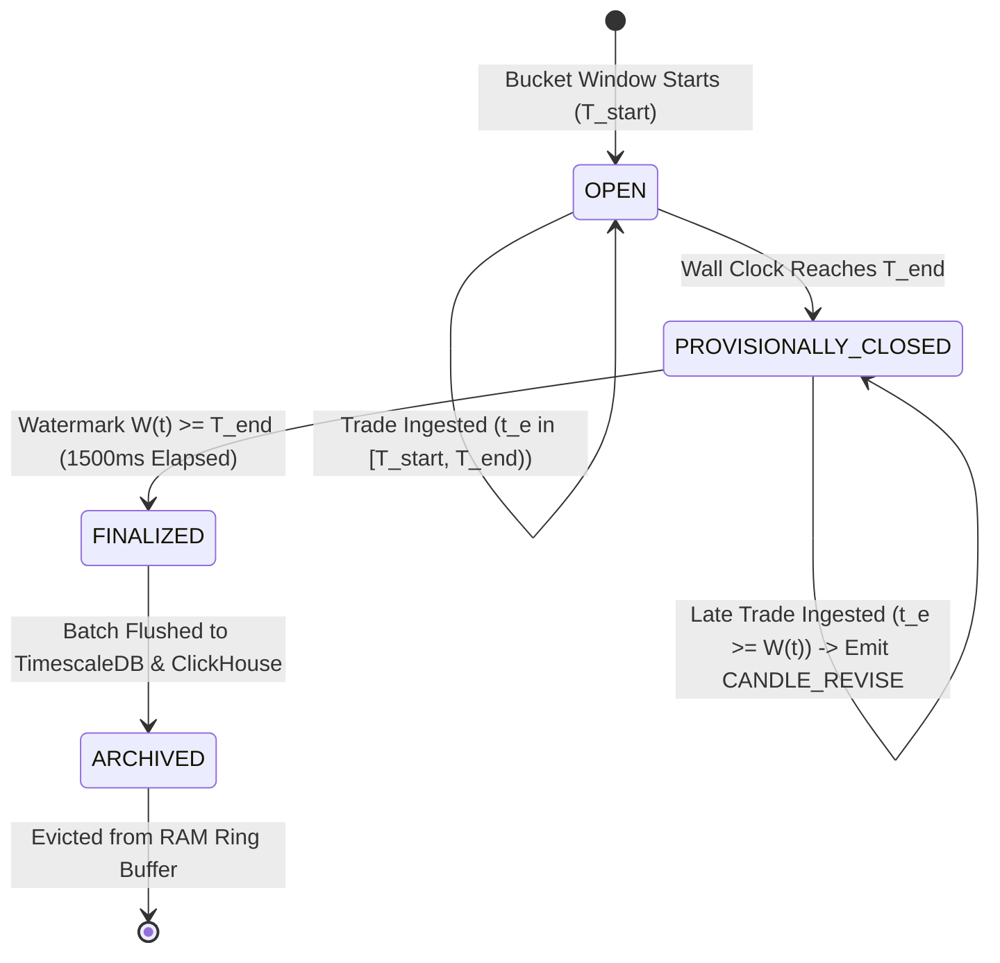
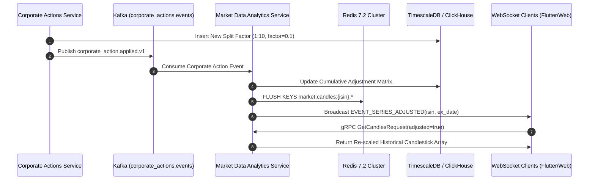
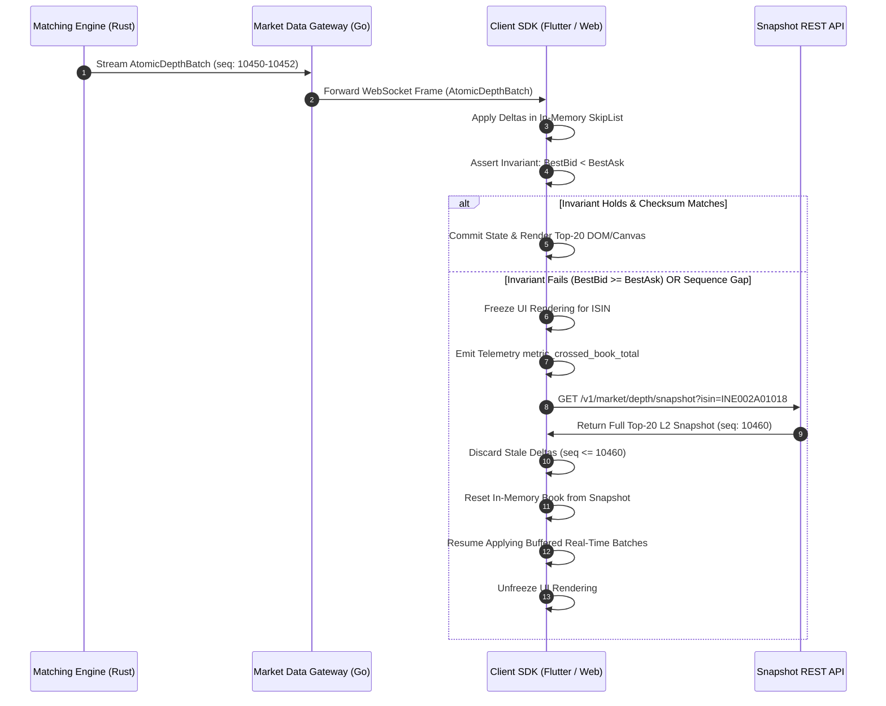
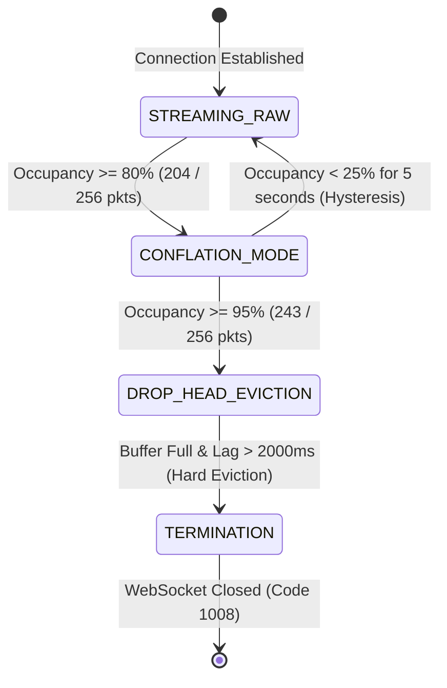

# Candlestick (OHLCV) Aggregation & Market Data Specification

**Specification ID:** SPEC-ARCH-012-MKT  
**Document Version:** 2.0.0-PROD-SPEC  
**Status:** Approved  
**Owner:** Market Data & Real-Time Candlestick Architecture Group  
**Review Cadence:** Quarterly  
**Last Review:** September 2026  
**Target Systems:** `services/market-data-service` (Go 1.22+), `services/matching-engine` (Rust 1.78+), `services/market-data-analytics` (Go 1.22+), TimescaleDB 2.14+, ClickHouse 24.x, Redis 7.2+, Apache Kafka 3.7+  
**Related ADRs:** [ADR-0011](../adr/ADR-0011-fixed-point-integer-arithmetic-precision.md), [ADR-0016](../adr/ADR-0016-spsc-disruptor-sequencer-numa-pinning.md), [ADR-0021](../adr/ADR-0021-candlestick-late-event-sliding-watermark.md), [ADR-0022](../adr/ADR-0022-dual-ohlcv-split-adjusted-time-series.md), [ADR-0024](../adr/ADR-0024-websocket-slow-consumer-conflation-backpressure.md)  
**Related Runbooks:** [RUNBOOK-16](../runbooks/RUNBOOK-16-candlestick-desynchronization-and-repair.md), [RUNBOOK-17](../runbooks/RUNBOOK-17-websocket-slow-client-buffer-eviction.md)  

---

## Executive Summary & System Mandates

The Growww Market Data & Candlestick Aggregation System is the high-throughput, sub-millisecond distribution and analytical nerve center for Indian equity and tokenized fractional securities. Operating in tandem with the bare-metal Rust matching engine ([Core Matching Engine Specification](CORE_MATCHING_ENGINE_AND_ORDER_BOOK_SPECIFICATION.md)), the market data infrastructure must ingest trade execution streams, synthesize multi-timeframe Open-High-Low-Close-Volume (OHLCV) candlestick bars, compute non-drifting institutional Volume Weighted Average Prices (VWAP), maintain pristine Level-2 (L2) and Level-3 (L3) order book depth states, and broadcast real-time updates to hundreds of thousands of concurrent client connections over WebSockets.

In an asset-backed fractional equity exchange governed by SEBI standards and backed 1:1 by custodian demat balances, market data integrity is paramount. This specification codifies six foundational architectural pillars:
1. **TRD-01 (Sliding Watermark & Revision Protocol):** Enforces a deterministic 1500ms sliding revision window handling out-of-order Kafka trade events without corrupting historical bar continuity or shifting adjacent candle boundaries.
2. **TRD-02 (Zero-Volume Carry-Forward Protocol):** Defines uniform synthetic bar generation during trading halts, illiquid intervals, and circuit breakers, eliminating charting visual discontinuities while optimizing time-series storage.
3. **TRD-03 (Dual Historical Series raw_ohlcv vs adjusted_ohlcv):** Decouples immutable statutory execution records from corporate-action-adjusted charting feeds, enabling retroactive stock split and bonus factor adjustments without altering audit trails.
4. **TRD-04 (128-Bit Integer VWAP & Dual Stream Pipelines):** Solves fixed-point precision truncation across multi-billion-rupee turnover sessions via 128-bit unsigned integer accumulators, broadcasting dual statutory session and rolling 24-hour VWAP streams.
5. **TRD-08 (Atomic Multi-Level Delta Batches & Crossed-Book Validation):** Eliminates transient and corrupt inverted book displays via atomic execution batch bundling and client-side invariant gating.
6. **TRD-09 (WebSocket Drop-Tail Backpressure & Conflation):** Implements bounded 256-packet ring buffers with dynamic 200ms conflated snapshot degradation, safeguarding server memory while delivering responsive telemetry to slow mobile consumers.

---

## 1. Candlestick (OHLCV) Aggregation & Watermark Revision Protocol (TRD-01)

### 1.1 Problem Statement & Microstructure Jitter
In distributed financial architectures, trade executions generated by the matching engine are committed to partition-keyed Kafka logs (`engine.matches.v1`) and ingested by downstream market data aggregator pods. While individual ISIN matching partitions preserve strict FIFO causal ordering, network transit jitter, consumer group rebalances, OS context switches, and garbage-collection pauses in intermediate relays can cause trade events to arrive at the aggregation engine out-of-order relative to real-time wall-clock timestamps.

When trades arrive with execution timestamps ($t_e$) falling into a candlestick bar interval $[T_{start}, T_{end})$ that has already been closed by local aggregator wall-clock time, naive aggregators exhibit fatal defects:
- **Bar Tampering:** Reopening the closed bar shifts the open price of the subsequent bar, causing jagged discontinuities and broken technical indicators (e.g., Moving Average Convergence Divergence, Exponential Moving Averages).
- **Silent Dropping:** Dropping late trades corrupts total cumulative volume and turnover, causing irreversible drift between candlestick bars and the official exchange trade journal.
- **Race Cascades:** In-place modifications without explicit revision semantics cause client charting libraries (such as TradingView Lightweight Charts) to duplicate bars or corrupt local time-series indexes.

### 1.2 Mathematical Event-Time Watermark Model
To guarantee mathematical determinism, the candlestick aggregation engine decouples **Aggregation Event Time** from **Local Ingestion Wall-Clock Time** using a formal sliding watermark.

Let:
- $t_e \in \mathbb{N}$: Event execution timestamp in nanoseconds since Unix epoch (`matched_at_unix_ns`), assigned deterministically by the Rust matching engine sequencer.
- $t_i \in \mathbb{N}$: Local wall-clock ingestion timestamp when the market data aggregator consumes the trade from Kafka.
- $\tau \in \{1\text{s}, 1\text{m}, 5\text{m}, 15\text{m}, 1\text{h}, 1\text{d}\}$: Aggregation timeframe interval duration in nanoseconds ($\Delta_\tau$).
- $\Delta_{watermark} = 1500\text{ ms} = 1,500,000,000\text{ ns}$: The maximum permissible sliding grace period for late trade acceptance.

The dynamic stream watermark $W(t)$ at any given ingestion instant $t$ is defined as the high-water mark of observed trade event timestamps minus the grace duration:

$$W(t) = \max_{k \le t} (t_{e, k}) - \Delta_{watermark}$$

The watermark is strictly monotonically non-decreasing:

$$W(t_{n+1}) = \max(W(t_n), t_{e, n+1} - \Delta_{watermark})$$

#### Ingestion Decision Invariant
For any incoming trade $E = (p, q, t_e, \text{match\_id})$ targeting candle bucket interval $[T_{start}, T_{end})$ where $T_{start} = \lfloor t_e / \Delta_\tau \rfloor \times \Delta_\tau$ and $T_{end} = T_{start} + \Delta_\tau$:

1. **Active In-Flight Ingestion ($t_e \ge T_{current\_start}$):**
   The trade belongs to the currently open bucket. Mutate active in-memory OHLCV accumulators directly.
2. **Grace-Period Watermark Revision ($T_{start} < T_{current\_start}$ AND $t_e \ge W(t)$):**
   The trade belongs to a provisionally closed historical bucket whose boundary falls within the 1500ms sliding grace window. The aggregator executes an **Atomic Candle Revision**, updates the historical record, and broadcasts a `CANDLE_REVISE` event.
3. **Late-Rejected Trade ($t_e < W(t)$):**
   The trade arrived after the watermark has permanently passed $T_{end}$. The trade is strictly **REJECTED** from real-time candlestick streams to preserve downstream charting immutability. The trade payload is diverted to Kafka dead-letter topic `trades.late_rejected.v1` for asynchronous batch audit and historical database reconciliation.

```
+----------------------------------------------------------------------------------------------------+
| TRD-01: 1500MS SLIDING WATERMARK & CANDLE REVISION PIPELINE                                        |
|                                                                                                    |
|  [Kafka Trade Event: (price, qty, t_e, match_id)]                                                  |
|           |                                                                                        |
|           v                                                                                        |
|  [Extract Event Time t_e & Update Monotonic High Watermark W(t)]                                    |
|           |                                                                                        |
|           +---> CASE 1: t_e >= T_active_start (Active Window)                                      |
|           |     └──> Update in-memory active bucket [O, H, L, C, V, Turnover]                      |
|           |     └──> Broadcast standard CANDLE_TICK to WebSocket clients                          |
|           |                                                                                        |
|           +---> CASE 2: t_e < T_active_start AND t_e >= W(t) (Grace Window <= 1500ms)               |
|           |     └──> Retrieve historical bucket from 1500ms In-Memory Ring Buffer                  |
|           |     └──> Recalculate H = max(H, p), L = min(L, p), V += q, Turnover += p*q             |
|           |     └──> If t_e > t_last_trade: C = p (Update Close)                                   |
|           |     └──> If t_e < t_first_trade: O = p (Update Open)                                  |
|           |     └──> Increment revision_sequence by 1                                              |
|           |     └──> Execute PostgreSQL/TimescaleDB Upsert (ON CONFLICT DO UPDATE)                |
|           |     └──> Broadcast CANDLE_REVISE (is_revision=true) to WebSockets & Redis Pub/Sub      |
|           |                                                                                        |
|           +---> CASE 3: t_e < W(t) (Watermark Expired > 1500ms)                                    |
|                 └──> Reject from real-time candlestick pipeline                                    |
|                 └──> Increment metric: market_data_late_trades_rejected_total                      |
|                 └──> Route to DLQ: trades.late_rejected.v1 for EOD batch reconciliation            |
+----------------------------------------------------------------------------------------------------+
```

### 1.3 State Machine & In-Memory Storage Layout
To process high-frequency revisions without hitting disk I/O bottlenecks, the aggregator retains a fixed-size circular ring buffer of recent candle buckets in RAM per active ISIN.



#### Bucket Ring Buffer Data Structure
```go
// CandleBucket represents an in-memory aggregation window for a single symbol
type CandleBucket struct {
    ISIN             [12]byte
    Timeframe        string
    BucketStartNS    int64
    BucketEndNS      int64
    OpenWeiNR        uint64
    HighWeiNR        uint64
    LowWeiNR         uint64
    CloseWeiNR       uint64
    VolumeMicro      uint64
    TurnoverWeiNR    uint64 // 128-bit micro-turnover tracked separately
    TradesCount      uint32
    FirstTradeNS     int64
    LastTradeNS      int64
    RevisionSequence uint32
    IsClosed         bool
    IsFinalized      bool
    mu               sync.RWMutex
}
```

### 1.4 Candle Mutation Rules Under Revision
When an out-of-order trade $E = (p, q, t_e)$ arrives for a provisionally closed bucket:
1. **High Invariant:** $H_{new} = \max(H_{current}, p)$.
2. **Low Invariant:** $L_{new} = \min(L_{current}, p)$.
3. **Volume Invariant:** $V_{new} = V_{current} + q$.
4. **Turnover Invariant:** $\text{Turnover}_{new} = \text{Turnover}_{current} + (p \times q / 10^6)$.
5. **Trades Count:** $N_{new} = N_{current} + 1$.
6. **Close Price Boundary Rule:** If and only if $t_e \ge t_{last\_trade}$, set $C_{new} = p$ and $t_{last\_trade} = t_e$. If $t_e < t_{last\_trade}$, the close price $C$ remains immutable because a chronologically later trade has already established the terminal value of that interval.
7. **Open Price Boundary Rule:** If and only if $t_e < t_{first\_trade}$, set $O_{new} = p$ and $t_{first\_trade} = t_e$. Otherwise, $O$ remains immutable.

### 1.5 Protobuf Schema & WebSocket Framing
Revisions are explicitly tagged so client charting libraries can perform in-place cell updates without repainting the entire canvas or altering the next bar's open price.

```protobuf
syntax = "proto3";

package growww.marketdata.v1;

message CandleUpdateEvent {
  string isin = 1;
  string timeframe = 2;              // "1s", "1m", "5m", "15m", "1h", "1d"
  int64 bucket_start_unix_ns = 3;
  int64 bucket_end_unix_ns = 4;
  uint64 open_weinr = 5;             // Fixed-point 10^-4 INR (1 tick = 0.0001 INR)
  uint64 high_weinr = 6;
  uint64 low_weinr = 7;
  uint64 close_weinr = 8;
  uint64 volume_micro = 9;           // Fixed-point 10^-6 fractional units
  uint64 vwap_weinr = 10;
  uint64 turnover_weinr = 11;
  uint32 trades_count = 12;
  bool is_revision = 13;             // True if updating a previously closed bar
  uint32 revision_sequence = 14;     // Incremented monotonically on each revision
  bool is_finalized = 15;            // True if Watermark >= BucketEnd (no further revisions)
  int64 watermark_unix_ns = 16;
}
```

### 1.6 TimescaleDB Storage & Idempotent Upsert Strategy
Persisting revisions requires atomic database upsert semantics. Completed candles are written to PostgreSQL 16 with TimescaleDB 2.14+ using compressed chunk hypertables.

```sql
-- DDL: Raw 1-minute OHLCV Hypertable
CREATE TABLE IF NOT EXISTS market_candles_1m (
    isin                VARCHAR(12) NOT NULL,
    bucket              TIMESTAMPTZ NOT NULL,
    open_weinr          BIGINT      NOT NULL,
    high_weinr          BIGINT      NOT NULL,
    low_weinr           BIGINT      NOT NULL,
    close_weinr         BIGINT      NOT NULL,
    volume_micro        BIGINT      NOT NULL,
    turnover_weinr      BIGINT      NOT NULL,
    trades_count        INTEGER     NOT NULL,
    revision_sequence   INTEGER     NOT NULL DEFAULT 0,
    is_finalized        BOOLEAN     NOT NULL DEFAULT FALSE,
    updated_at          TIMESTAMPTZ NOT NULL DEFAULT NOW(),
    PRIMARY KEY (isin, bucket)
);

-- Convert to TimescaleDB hypertable partitioned by 1-day chunks
SELECT create_hypertable('market_candles_1m', 'bucket', chunk_time_interval => INTERVAL '1 day', if_not_exists => TRUE);

-- Atomic Upsert Query for Ingested & Revised Candles
INSERT INTO market_candles_1m (
    isin, bucket, open_weinr, high_weinr, low_weinr, close_weinr,
    volume_micro, turnover_weinr, trades_count, revision_sequence, is_finalized, updated_at
) VALUES ($1, $2, $3, $4, $5, $6, $7, $8, $9, $10, $11, NOW())
ON CONFLICT (isin, bucket) DO UPDATE SET
    high_weinr        = GREATEST(market_candles_1m.high_weinr, EXCLUDED.high_weinr),
    low_weinr         = LEAST(market_candles_1m.low_weinr, EXCLUDED.low_weinr),
    close_weinr       = CASE 
                          WHEN EXCLUDED.updated_at >= market_candles_1m.updated_at THEN EXCLUDED.close_weinr 
                          ELSE market_candles_1m.close_weinr 
                        END,
    volume_micro      = market_candles_1m.volume_micro + EXCLUDED.volume_micro,
    turnover_weinr    = market_candles_1m.turnover_weinr + EXCLUDED.turnover_weinr,
    trades_count      = market_candles_1m.trades_count + EXCLUDED.trades_count,
    revision_sequence = market_candles_1m.revision_sequence + 1,
    is_finalized      = EXCLUDED.is_finalized,
    updated_at        = NOW()
WHERE market_candles_1m.is_finalized = FALSE;
```

---

## 2. Zero-Volume Carry-Forward Protocol (TRD-02)

### 2.1 Motivation & Visual Continuity Invariants
During periods of illiquidity, pre-market/post-market transitions, discrete call auctions, or statutory circuit-breaker trading halts, an instrument may experience intervals of arbitrary duration where zero trade executions take place.

Naive market data systems handle zero-trade intervals in one of two defective ways:
1. **Omission (Sparse Timestamps):** No candle record is produced. While saving storage, this creates timestamp gaps. When charting engines (such as TradingView Lightweight Charts or mobile canvas visualizers) render sparse series, their Cartesian coordinate systems either compress the missing time intervals (distorting trendline slope angles and indicator periods) or interpolate linear slopes between distant points.
2. **Zero Price Setting:** Setting $O = H = L = C = 0$ collapses technical indicators, triggers false flash-crash circuit alerts, and corrupts trailing volatility bands.

### 2.2 Mathematical Carry-Forward Protocol
To ensure deterministic visual continuity without falsifying trading activity, the aggregator implements the **Zero-Volume Carry-Forward Protocol (TRD-02)**.

Let:
- $T_k = [t_k, t_k + \Delta_\tau)$: An aggregation bucket interval.
- $N(T_k)$: The count of trades executed during interval $T_k$.
- $C(T_{k-1})$: The validated closing price of the immediate preceding interval $T_{k-1}$.

If $N(T_k) = 0$, the aggregator synthesizes an atomic carry-forward candle $\bar{B}_k$ satisfying:

$$O(T_k) = H(T_k) = L(T_k) = C(T_k) = C(T_{k-1})$$
$$V(T_k) = 0, \quad \text{Turnover}(T_k) = 0, \quad \text{TradesCount}(T_k) = 0$$
$$\text{is\_synthetic}(T_k) = \text{true}$$

#### Structural Invariants
1. **Zero Price Variance:** $\sigma_P^2(T_k) = 0$ since $High - Low = 0$.
2. **Zero Liquidity Injection:** Cumulative volume and turnover are unchanged: $\Delta V = 0$, $\Delta \text{Turnover} = 0$.
3. **Indicator Stability:** Moving averages (SMA, EMA) evaluate the flat close price naturally without division-by-zero errors or sudden drops.

```
+----------------------------------------------------------------------------------------------------+
| TRD-02: ZERO-VOLUME CARRY-FORWARD PIPELINE & BOUNDARY RULES                                        |
|                                                                                                    |
|  [Bucket Timer Expires: T_k -> T_k + 1m]                                                           |
|           |                                                                                        |
|           v                                                                                        |
|  [Check In-Memory Trade Accumulator for ISIN]                                                      |
|           |                                                                                        |
|           +---> Trade Count > 0 ───> Emit Real Candlestick (is_synthetic = false)                  |
|           |                                                                                        |
|           +---> Trade Count == 0                                                                   |
|                 |                                                                                  |
|                 +---> Is Market In Active Continuous Session (09:15 - 15:30 IST)?                  |
|                       |                                                                            |
|                       +──(YES)──> Open = High = Low = Close = Previous_Close                       |
|                       |           Volume = 0, Turnover = 0, TradesCount = 0                        |
|                       |           is_synthetic = true                                              |
|                       |           Emit to WebSocket & TimescaleDB                                  |
|                       |                                                                            |
|                       +──(NO)───> Overnight / Weekend Inter-Session Interval:                      |
|                                   SUPPRESS synthetic emission (Sparse storage)                     |
|                                   Client chart fills gap via query-time LOCF()                     |
+----------------------------------------------------------------------------------------------------+
```

### 2.3 Trading Session Boundaries & Suppression Rules
To prevent synthetic candles from polluting off-market hours and consuming gigabytes of redundant storage during overnight and weekend periods, TRD-02 enforces strict session boundary gating:

| Market Phase | IST Time Window (UTC+05:30) | TRD-02 Action | Valuation Basis |
| :--- | :--- | :--- | :--- |
| **Pre-Open Call Auction** | 09:00:00 - 09:07:59 | Accumulate orders only | No continuous bars emitted |
| **Call Auction Matching** | 09:08:00 - 09:14:59 | Single auction print | Indicative Equilibrium Price (IEP) |
| **Market Open Print** | 09:15:00 sharp | Initialize first 1m bar | IEP from auction; if zero trades in auction, use Previous Day Close (PDC) from Bhavcopy master |
| **Continuous Trading** | 09:15:00 - 15:30:00 | Active TRD-02 generation | If zero trades in 1m window, carry forward $C_{k-1}$ with $V=0$ |
| **Circuit Breaker Halt** | Dynamic (15m to 45m) | Active TRD-02 generation | Emit synthetic bars with `is_halted = true` and `halt_code` |
| **Post-Close Trading** | 15:40:00 - 16:00:00 | Carry forward official close | Continuous bars suppressed; only discrete trades recorded |
| **Overnight & Weekends** | 15:30:00 - 09:15:00 | **SUPPRESSED** | Zero synthetic records stored; TimescaleDB uses `time_bucket_gapfill` |

### 2.4 Storage Layer: Dense Streaming vs Sparse Persistence
To balance database storage costs against client charting performance, Growww employs a hybrid **Dense Streaming / Sparse Persistence** architecture:

1. **WebSocket Egress Tier (Dense):** Connected mobile and web clients receive real-time 1-minute synthetic flat candles at each interval boundary, ensuring charting coordinate stability without client-side guesswork.
2. **Database Persistence Tier (Sparse with On-Demand Gapfill):** Completed zero-volume synthetic candles are not physically indexed in ClickHouse historical tables. In TimescaleDB, gaps are filled dynamically during analytical chart queries using `time_bucket_gapfill()` combined with `locf()` (Last Observation Carried Forward):

```sql
-- Query: Fetch Continuous 1-Minute Candles with Dynamic Zero-Volume Gapfill
SELECT
    time_bucket_gapfill('1 minute', bucket) AS candle_time,
    locf(AVG(close_weinr))::BIGINT          AS close_weinr,
    COALESCE(locf(AVG(close_weinr))::BIGINT, 0) AS open_weinr,
    COALESCE(locf(AVG(close_weinr))::BIGINT, 0) AS high_weinr,
    COALESCE(locf(AVG(close_weinr))::BIGINT, 0) AS low_weinr,
    COALESCE(SUM(volume_micro), 0)          AS volume_micro,
    COALESCE(SUM(turnover_weinr), 0)        AS turnover_weinr,
    CASE WHEN SUM(trades_count) IS NULL OR SUM(trades_count) = 0 THEN TRUE ELSE FALSE END AS is_synthetic
FROM market_candles_1m
WHERE isin = 'INE002A01018'
  AND bucket >= '2026-09-18 09:15:00+05:30'
  AND bucket <= '2026-09-18 15:30:00+05:30'
GROUP BY candle_time
ORDER BY candle_time ASC;
```

---

## 3. Dual Historical Series: raw_ohlcv vs adjusted_ohlcv for Stock Splits (TRD-03)

### 3.1 Divergent Domain Requirements
Corporate action events announced by publicly listed corporations, including stock sub-divisions (splits), bonus share distributions, rights issues, and capital consolidations, introduce sudden structural discontinuities in historical price-volume curves.

For instance, when a company executes a 1:10 stock split, the share count increases tenfold while the market price per share drops by approximately 90% overnight. This creates two fundamentally incompatible domain requirements:

```
                  +--------------------------------------------------------------------+
                  |               CORPORATE ACTION: 1:10 STOCK SPLIT                   |
                  +--------------------------------------------------------------------+
                                            |
                    +-----------------------+-----------------------+
                    |                                               |
                    v                                               v
     [REGULATORY & STATUTORY COMPLIANCE]             [QUANTITATIVE & TECHNICAL CHARTS]
     - SEBI Surveillance & Audit Logs                - TradingView Technical Indicators
     - Income Tax Act Section 112A Capital Gains     - Moving Averages, RSI, Bollinger Bands
     - On-chain DvP Settlement Receipts              - Machine Learning Strategy Backtests
     - MUST SEE EXACT HISTORICAL EXECUTION           - MUST SEE CONTINUOUS ADJUSTED CURVES
     - Example: Old Trade at Rs 2,500.00             - Example: Adjusted Trade at Rs 250.00
     - Table: raw_ohlcv_1m                           - Table / View: adjusted_ohlcv_1m
```

If historical data is retroactively modified in place, statutory audits and tax statements become invalid. Conversely, if charts display raw execution prices, moving averages and technical indicators plunge across the split date, triggering false algorithmic sell signals.

### 3.2 Mathematical Formulation of Split Adjustment Factors
To satisfy both requirements concurrently, TRD-03 implements a **Dual-Series Time-Series Pipeline**.

Let:
- $\mathcal{CA} = \{ca_1, ca_2, \dots, ca_M\}$: The ordered sequence of corporate action events for instrument $S$, ordered by ex-date $T_{ex, k}$.
- For a stock split or bonus issue $k$, let $S_{num, k}$ and $S_{den, k}$ represent the split ratio numerator and denominator.
  - *Example 1: 1:10 Stock Split (1 old share becomes 10 new shares):* $S_{num} = 10, S_{den} = 1$.
  - *Example 2: 1:1 Bonus Issue (1 bonus share for every 1 held):* $S_{num} = 2, S_{den} = 1$.
- The **Discrete Split Adjustment Factor** $f_k$ for event $k$ is defined as:

$$f_k = \frac{S_{den, k}}{S_{num, k}}$$

For a 1:10 split, $f_k = 1 / 10 = 0.1$.

- The **Cumulative Adjustment Factor** $\Phi(t)$ applied to historical data at time $t$ relative to current market time $t_{now}$ is the product of all adjustment factors whose ex-dates post-date $t$:

$$\Phi(t) = \prod_{k: T_{ex, k} > t} f_k$$

#### Price and Volume Transformation Equations
For any historical candlestick bar $B_{raw}(t) = (O, H, L, C, V, \text{Turnover})$:

$$\begin{aligned}
O_{adj}(t) &= \text{round}\left( O_{raw}(t) \times \Phi(t) \right) \\
H_{adj}(t) &= \text{round}\left( H_{raw}(t) \times \Phi(t) \right) \\
L_{adj}(t) &= \text{round}\left( L_{raw}(t) \times \Phi(t) \right) \\
C_{adj}(t) &= \text{round}\left( C_{raw}(t) \times \Phi(t) \right) \\
V_{adj}(t) &= \text{round}\left( \frac{V_{raw}(t)}{\Phi(t)} \right)
\end{aligned}$$

#### Fundamental Invariant: Micro-Turnover Invariance
Because price is scaled by $\Phi(t)$ and volume is scaled by $1 / \Phi(t)$, the total monetary turnover of the historical bar remains mathematically invariant under split adjustments:

$$\text{Turnover}_{adj}(t) = P_{adj}(t) \times V_{adj}(t) = \left( P_{raw}(t) \cdot \Phi(t) \right) \times \left( \frac{V_{raw}(t)}{\Phi(t)} \right) = P_{raw}(t) \times V_{raw}(t) = \text{Turnover}_{raw}(t)$$

### 3.3 Database Architecture & Continuous Materialization
The dual-series architecture is physically implemented in PostgreSQL 16 / TimescaleDB and ClickHouse via immutable raw hypertables and dynamically indexed adjustment factor lookup tables.

```sql
-- Table 1: Raw Execution History (Immutable Statutory Record)
CREATE TABLE IF NOT EXISTS raw_ohlcv_1m (
    isin            VARCHAR(12) NOT NULL,
    bucket          TIMESTAMPTZ NOT NULL,
    open_weinr      BIGINT      NOT NULL,
    high_weinr      BIGINT      NOT NULL,
    low_weinr       BIGINT      NOT NULL,
    close_weinr     BIGINT      NOT NULL,
    volume_micro    BIGINT      NOT NULL,
    turnover_weinr  BIGINT      NOT NULL,
    trades_count    INTEGER     NOT NULL,
    PRIMARY KEY (isin, bucket)
);
SELECT create_hypertable('raw_ohlcv_1m', 'bucket', chunk_time_interval => INTERVAL '1 day', if_not_exists => TRUE);

-- Table 2: Corporate Action Adjustment Factors Registry
CREATE TABLE IF NOT EXISTS corporate_action_factors (
    action_id               VARCHAR(64) PRIMARY KEY,
    isin                    VARCHAR(12) NOT NULL,
    action_type             VARCHAR(32) NOT NULL, -- 'STOCK_SPLIT', 'BONUS_ISSUE', 'RIGHTS_ISSUE'
    ex_date                 TIMESTAMPTZ NOT NULL,
    record_date             TIMESTAMPTZ NOT NULL,
    split_numerator         NUMERIC(18, 8) NOT NULL,
    split_denominator       NUMERIC(18, 8) NOT NULL,
    event_factor            NUMERIC(24, 12) NOT NULL, -- denominator / numerator
    cumulative_factor       NUMERIC(24, 12) NOT NULL, -- cumulative product backwards
    created_at              TIMESTAMPTZ NOT NULL DEFAULT NOW()
);
CREATE INDEX idx_ca_isin_exdate ON corporate_action_factors (isin, ex_date DESC);

-- View: Split-Adjusted Candlestick Series (Queried by Charting APIs)
CREATE OR REPLACE VIEW adjusted_ohlcv_1m AS
SELECT 
    r.isin,
    r.bucket,
    ROUND(r.open_weinr * COALESCE(ca.cumulative_factor, 1.0))::BIGINT  AS open_weinr,
    ROUND(r.high_weinr * COALESCE(ca.cumulative_factor, 1.0))::BIGINT  AS high_weinr,
    ROUND(r.low_weinr * COALESCE(ca.cumulative_factor, 1.0))::BIGINT   AS low_weinr,
    ROUND(r.close_weinr * COALESCE(ca.cumulative_factor, 1.0))::BIGINT AS close_weinr,
    ROUND(r.volume_micro / COALESCE(ca.cumulative_factor, 1.0))::BIGINT AS volume_micro,
    r.turnover_weinr,
    r.trades_count
FROM raw_ohlcv_1m r
LEFT JOIN LATERAL (
    SELECT cumulative_factor
    FROM corporate_action_factors f
    WHERE f.isin = r.isin AND f.ex_date > r.bucket
    ORDER BY f.ex_date ASC
    LIMIT 1
) ca ON TRUE;
```

### 3.4 Cache Invalidation & Event-Driven Rebase Protocol
When the Corporate Actions Service commits an approved corporate action:
1. It persists the new factor record in `corporate_action_factors`.
2. It emits a `corporate_action.applied.v1` event to Kafka topic `custody.corporate_actions.events`.
3. The Market Data Analytics microservice consumes the event, recalculates historical cumulative factors, and purges Redis cache keys under namespace `market:candles:{isin}:*`.
4. It broadcasts a WebSocket notification `EVENT_SERIES_ADJUSTED` with `{ isin: "...", ex_date: "..." }`, instructing frontend trading terminals to invalidate local indexedDB cache and refetch historical chart bars.



---

## 4. 128-Bit Integer Micro-Turnover VWAP Calculation & Dual Streams (TRD-04)

### 4.1 Fixed-Point Arithmetic & Numeric Overflow Hazards
Standard IEEE 754 double-precision floating-point numbers (`f64` / `float64`) possess a 53-bit significand, offering approximately 15 to 17 decimal digits of precision. In modern equity markets featuring high trade frequencies and fractional share balances, floating-point math introduces unacceptable compounding rounding drift.

To eliminate non-determinism, Growww mandates fixed-point integer math across all services:
- **Price Scale ($10^4$):** Stored in `uint64` as hundredths of a paisa ($10^{-4}$ INR, referred to as `weINR`). $1.0000\text{ INR} = 10,000\text{ weINR}$.
- **Quantity Scale ($10^6$):** Stored in `uint64` as micro-shares ($10^{-6}$ units). $1.000000\text{ share} = 1,000,000\text{ micro-shares}$.
- **Trade Micro-Turnover ($\tau_i$):** Computed as the direct integer product of Price and Quantity:

$$\tau_i = P_i \times Q_i \quad (\text{Scale: } 10^4 \times 10^6 = 10^{10})$$

#### Overflow Proof
Consider a high-turnover trading session for an active stock (e.g., Reliance Industries or HDFC Bank) with a daily traded notional value of INR 50,000,000,000 (INR 5,000 Crores).
- Cumulative turnover in INR: $5 \times 10^{10}$ INR.
- Cumulative micro-turnover in scale $10^{10}$:

$$\Sigma_{\tau} = (5 \times 10^{10}) \times 10^{10} = 5 \times 10^{20}$$

Now compare this against standard integer limits:
- Maximum 64-bit unsigned integer:

$$u64::\text{MAX} = 2^{64} - 1 \approx 1.8446 \times 10^{19}$$

Because $5 \times 10^{20} \gg 1.8446 \times 10^{19}$, **a 64-bit integer overflows at approximately INR 1,844 Crores of turnover!** Any market data service attempting to accumulate turnover using `uint64` will suffer catastrophic arithmetic overflow, generating negative or wrapped turnover and invalid VWAP prices.

**Architectural Invariant:** Accumulation of micro-turnover must strictly execute in **128-bit unsigned integer arithmetic space (`u128` in Rust, `math/big` or simulated 128-bit structs in Go)**.

### 4.2 Exact Mathematical Formulation of VWAP
For a discrete sequence of trades $i \in \{1, 2, \dots, N\}$ executed within a designated time interval:
- $P_i \in \mathbb{N}$: Trade execution price in $10^4$ weINR.
- $Q_i \in \mathbb{N}$: Matched quantity in $10^6$ micro-units.

$$\Sigma_{\tau} = \sum_{i=1}^N (P_i \cdot Q_i) \quad (\text{128-bit unsigned integer})$$
$$\Sigma_{Q} = \sum_{i=1}^N Q_i \quad (\text{64-bit or 128-bit unsigned integer})$$

Volume Weighted Average Price (VWAP) in scale $10^4$ weINR is:

$$\text{VWAP} = \left\lfloor \frac{\Sigma_{\tau}}{\Sigma_{Q}} \right\rfloor$$

#### Proof of Scale Invariance
Observe the dimensional units:
- Dimensional unit of $\Sigma_{\tau}$: $[\text{INR} \times 10^4] \times [\text{shares} \times 10^6] = [\text{INR} \cdot \text{shares}] \times 10^{10}$.
- Dimensional unit of $\Sigma_Q$: $[\text{shares}] \times 10^6$.
- Dividing $\Sigma_{\tau}$ by $\Sigma_Q$:

$$\frac{[\text{INR} \cdot \text{shares}] \times 10^{10}}{[\text{shares}] \times 10^6} = [\text{INR}] \times 10^4$$

The quotient automatically matches the native price scale ($10^4$ weINR) with zero secondary scaling factor required during division!

#### Half-Up Integer Rounding Formula
To guarantee exact half-up rounding to the nearest tick ($1\text{ weINR}$):

$$\text{VWAP}_{rounded} = \left\lfloor \frac{\Sigma_{\tau} + \lfloor \Sigma_Q / 2 \rfloor}{\Sigma_Q} \right\rfloor$$

### 4.3 Dual Stream Architecture: Statutory vs Rolling 24H
Growww serves two distinct client trading domains: domestic Indian equities bound by official exchange sessions, and fractional synthetic token trading operating across 24/7 global markets. TRD-04 bifurcates VWAP computation into two isolated pipelines:

```
+----------------------------------------------------------------------------------------------------+
| TRD-04: DUAL VWAP CALCULATION PIPELINES                                                            |
|                                                                                                    |
|                             [Incoming Trade: (P_i, Q_i)]                                           |
|                                          |                                                         |
|             +----------------------------+----------------------------+                            |
|             |                                                         |                            |
|             v                                                         v                            |
|  [STREAM 1: STATUTORY SESSION VWAP]                     [STREAM 2: ROLLING 24-HOUR VWAP]           |
|  - Boundary: Reset at 09:15:00 IST daily                - Window: Exactly 1,440 1-minute buckets   |
|  - Accumulator: Single running (u128, u128)             - Sliding Buffer: Circular Ring of 1,440   |
|  - EOD Cutoff: Freezes at 15:30:00 IST                  - O(1) Sliding Update:                     |
|  - Terminal Value: Official SEBI / DvP Benchmark          tau_24h += tau_new - tau_expired         |
|  - Closing Price: VWAP of last 30 min (15:00-15:30)       qty_24h += qty_new - qty_expired         |
|                                                         - Output: Real-time 24h Global Benchmark   |
+----------------------------------------------------------------------------------------------------+
```

#### Stream 1: Statutory Exchange Session VWAP (`vwap_statutory`)
- **Reset Trigger:** Hard reset to $(\Sigma_\tau = 0, \Sigma_Q = 0)$ at exactly 09:15:00 IST daily.
- **Session Duration:** Accumulates all continuous trading matches until 15:30:00 IST.
- **Regulatory Use:**
  - Mark-to-market valuation for `ProofOfReserveRegistry.sol` on Hyperledger Besu.
  - Institutional Trade Cost Analysis (TCA) and Best Execution benchmarks.
  - Calculation of official Exchange Closing Price based on the weighted average of the final 30 minutes of trading (15:00:00 to 15:30:00 IST).

#### Stream 2: Continuous Rolling 24-Hour VWAP (`vwap_rolling_24h`)
- **Window:** A continuous sliding window of precisely 1,440 one-minute tranches ($1440 \times 60\text{s} = 86,400\text{s}$).
- **Data Structure:** A circular ring buffer of 1,440 minute-level sub-accumulators:

```go
type MinuteAccumulator struct {
    MicroTurnoverBig *big.Int // math/big 128-bit accumulator
    VolumeMicro      uint64
    TimestampMinute  int64
}
```

- **Sliding Update ($O(1)$ Time Complexity):**
  When minute $m_{current}$ closes and is appended to the ring buffer, the sub-accumulator from 1,440 minutes prior ($m_{expired}$) is evicted:

$$\Sigma_{\tau, 24h}^{(new)} = \Sigma_{\tau, 24h}^{(old)} + \tau(m_{current}) - \tau(m_{expired})$$
$$\Sigma_{Q, 24h}^{(new)} = \Sigma_{Q, 24h}^{(old)} + Q(m_{current}) - Q(m_{expired})$$

This sliding ring buffer formulation avoids scanning millions of individual trades on every incoming query, computing 24-hour VWAP in constant $O(1)$ time.

### 4.4 Production Go Implementation
Below is the production-grade Go implementation of the 128-bit dual-stream VWAP accumulator (`services/market-data-service/internal/aggregator/vwap.go`):

```go
package aggregator

import (
    "errors"
    "math/big"
    "sync"
    "time"
)

var (
    ErrZeroVolume = errors.New("cannot compute VWAP with zero cumulative volume")
)

// DualVWAPAccumulator manages concurrent statutory and 24h rolling VWAP
type DualVWAPAccumulator struct {
    isin [12]byte
    mu   sync.RWMutex

    // Statutory Session State
    statutoryTurnover *big.Int // 128-bit micro-turnover (P * Q)
    statutoryVolume   *big.Int // 128-bit cumulative volume micro-units
    sessionOpenTime   time.Time

    // Rolling 24H State
    rollingTurnover   *big.Int
    rollingVolume     *big.Int
    ringBuffer        [1440]minuteBucket
    ringHead          int
}

type minuteBucket struct {
    minuteUnix    int64
    microTurnover *big.Int
    volumeMicro   uint64
}

func NewDualVWAPAccumulator(isin [12]byte) *DualVWAPAccumulator {
    acc := &DualVWAPAccumulator{
        isin:              isin,
        statutoryTurnover: new(big.Int),
        statutoryVolume:   new(big.Int),
        rollingTurnover:   new(big.Int),
        rollingVolume:     new(big.Int),
    }
    for i := 0; i < 1440; i++ {
        acc.ringBuffer[i].microTurnover = new(big.Int)
    }
    return acc
}

// IngestTrade records a new match execution using 128-bit integer math
func (a *DualVWAPAccumulator) IngestTrade(priceWeiNR uint64, qtyMicro uint64, matchTime time.Time) {
    a.mu.Lock()
    defer a.mu.Unlock()

    // 1. Calculate micro-turnover: tau = price * qty (128-bit)
    p := new(big.Int).SetUint64(priceWeiNR)
    q := new(big.Int).SetUint64(qtyMicro)
    tau := new(big.Int).Mul(p, q)

    // 2. Accumulate Statutory Session VWAP
    a.statutoryTurnover.Add(a.statutoryTurnover, tau)
    a.statutoryVolume.Add(a.statutoryVolume, q)

    // 3. Accumulate into current rolling 24H minute bucket
    currentMinute := matchTime.Unix() / 60
    bucketIdx := int(currentMinute % 1440)
    targetBucket := &a.ringBuffer[bucketIdx]

    if targetBucket.minuteUnix != currentMinute {
        // Evict expired bucket from rolling total
        if targetBucket.minuteUnix > 0 && (currentMinute-targetBucket.minuteUnix) < 2880 {
            a.rollingTurnover.Sub(a.rollingTurnover, targetBucket.microTurnover)
            a.rollingVolume.Sub(a.rollingVolume, new(big.Int).SetUint64(targetBucket.volumeMicro))
        }
        // Reset bucket
        targetBucket.minuteUnix = currentMinute
        targetBucket.microTurnover.SetUint64(0)
        targetBucket.volumeMicro = 0
    }

    targetBucket.microTurnover.Add(targetBucket.microTurnover, tau)
    targetBucket.volumeMicro += qtyMicro

    a.rollingTurnover.Add(a.rollingTurnover, tau)
    a.rollingVolume.Add(a.rollingVolume, q)
}

// GetStatutoryVWAP computes round((turnover + volume/2) / volume)
func (a *DualVWAPAccumulator) GetStatutoryVWAP() (uint64, error) {
    a.mu.RLock()
    defer a.mu.RUnlock()

    if a.statutoryVolume.Sign() == 0 {
        return 0, ErrZeroVolume
    }

    // Half-up rounding numerator: statutoryTurnover + (statutoryVolume / 2)
    halfVol := new(big.Int).Rsh(a.statutoryVolume, 1)
    numerator := new(big.Int).Add(a.statutoryTurnover, halfVol)
    vwap := new(big.Int).Div(numerator, a.statutoryVolume)

    return vwap.Uint64(), nil
}

// ResetStatutorySession resets session state at 09:15:00 IST
func (a *DualVWAPAccumulator) ResetStatutorySession(sessionTime time.Time) {
    a.mu.Lock()
    defer a.mu.Unlock()

    a.statutoryTurnover.SetUint64(0)
    a.statutoryVolume.SetUint64(0)
    a.sessionOpenTime = sessionTime
}
```

---

## 5. Level-2/3 Atomic Delta Batches & Client Crossed-Book Validation (TRD-08)

### 5.1 Market Depth Transmission Hazards
In high-performance electronic exchanges, an incoming aggressive limit order or market order can match against multiple resting passive orders across several price tiers simultaneously. For example, a single aggressive Buy Market Order might sweep five distinct Ask price levels, resulting in multiple trade fills and structural modifications across the order book:

```
[Incoming Aggressive Buy] ──> Sweeps Ask Levels: 2450.50, 2450.55, 2450.60
                                ├── Fills Level 2450.50 completely (DELETE)
                                ├── Fills Level 2450.55 partially (UPDATE)
                                └── Leaves Level 2450.60 untouched
```

If the matching engine or market data service serializes and broadcasts these price level updates as individual, detached delta messages across separate network packets or WebSocket frames:
- A mobile client may receive the deletion of Ask level `2450.50` after an intervening update, or experience packet reordering.
- The client-side visual order book momentarily reflects a state where **Best Bid $\ge$ Best Ask** (e.g., Best Bid = `2450.55`, Best Ask = `2450.50`).
- This inverted state is known as a **Crossed Book**. On trading screens, crossed books cause screen flashing, render negative bid-ask spreads, and trigger client-side risk aborts.

### 5.2 Atomic Delta Batch Structure & Framing
To eliminate crossed-book artifacts, TRD-08 mandates that **all order book modifications generated by a single matching engine execution cycle MUST be encapsulated into a single, indivisible Atomic Delta Batch**.

#### Batch Schema Definition
```protobuf
syntax = "proto3";

package growww.marketdata.v1;

enum BookSide {
  SIDE_UNSPECIFIED = 0;
  SIDE_BID = 1;
  SIDE_ASK = 2;
}

enum DeltaAction {
  ACTION_UNSPECIFIED = 0;
  ACTION_INSERT = 1;      // New price level established
  ACTION_UPDATE = 2;      // Quantity modified at existing level
  ACTION_DELETE = 3;      // Price level exhausted (quantity = 0)
}

message LevelDelta {
  BookSide side = 1;
  uint64 price_weinr = 2;         // Fixed-point 10^-4 INR
  uint64 new_quantity_micro = 3;  // Fixed-point 10^-6 shares (0 if DELETE)
  uint32 order_count = 4;         // Number of resting orders at this level
  DeltaAction action = 5;
}

message AtomicDepthBatch {
  string isin = 1;
  uint64 sequence_start = 2;      // Starting sequence ID covered by this batch
  uint64 sequence_end = 3;        // Terminal sequence ID covered by this batch
  int64 match_timestamp_ns = 4;
  repeated LevelDelta deltas = 5; // Indivisible collection of book mutations
  uint32 book_checksum_crc32 = 6; // CRC32 of top-20 levels post-mutation
}
```

#### Protocol Guarantees
1. **Indivisibility:** An `AtomicDepthBatch` is parsed and applied to the client in-memory order book as a single transactional unit before triggering UI re-renders.
2. **Monotonic Sequences:** Every batch contains `sequence_start` and `sequence_end`. The client verifies that `sequence_start == last_applied_sequence + 1`. Any gap indicates packet loss.
3. **Top-20 Checksum:** The batch includes a 32-bit checksum (`book_checksum_crc32`) computed over the top-20 bid and ask levels immediately following batch execution.

### 5.3 Client-Side Crossed-Book Validation Protocol
Before presenting updated market depth to the user or dispatching it to local algorithmic components, client SDKs (Flutter and TypeScript) must assert the **Fundamental Market Depth Invariant**:

$$\text{BestBid}_{\text{Price}} < \text{BestAsk}_{\text{Price}}$$

If $\text{BestBid} \ge \text{BestAsk}$ is detected, or if the calculated local checksum does not match `book_checksum_crc32`, the client enters the **Crossed-Book Remediation Workflow (TRD-08)**:



### 5.4 Client TypeScript / Dart Reference Implementation
Below is the client-side validation logic executed within the Flutter and Web trading SDKs:

```typescript
export interface OrderBookLevel {
  priceWeiNR: bigint;
  qtyMicro: bigint;
  orderCount: number;
}

export class ValidatedOrderBook {
  private bids: Map<bigint, OrderBookLevel> = new Map();
  private asks: Map<bigint, OrderBookLevel> = new Map();
  private lastSequenceNumber: bigint = 0n;
  private isFrozen: boolean = false;

  public applyAtomicBatch(batch: AtomicDepthBatch): boolean {
    if (this.isFrozen) {
      return false; // Reject deltas while awaiting full snapshot resync
    }

    // 1. Sequence Continuity Verification
    if (this.lastSequenceNumber > 0n && batch.sequenceStart !== this.lastSequenceNumber + 1n) {
      console.error(`Sequence gap detected: expected ${this.lastSequenceNumber + 1n}, got ${batch.sequenceStart}`);
      this.triggerSnapshotResync("SEQUENCE_GAP");
      return false;
    }

    // 2. Transactional Application of Mutations
    for (const delta of batch.deltas) {
      const targetMap = delta.side === BookSide.BID ? this.bids : this.asks;
      if (delta.action === DeltaAction.DELETE) {
        targetMap.delete(delta.priceWeiNR);
      } else {
        targetMap.set(delta.priceWeiNR, {
          priceWeiNR: delta.priceWeiNR,
          qtyMicro: delta.newQuantityMicro,
          orderCount: delta.orderCount,
        });
      }
    }

    // 3. Extract Best Bid and Best Ask
    const sortedBids = Array.from(this.bids.keys()).sort((a, b) => (b > a ? 1 : -1));
    const sortedAsks = Array.from(this.asks.keys()).sort((a, b) => (a > b ? 1 : -1));

    if (sortedBids.length > 0 && sortedAsks.length > 0) {
      const bestBid = sortedBids[0];
      const bestAsk = sortedAsks[0];

      // 4. Crossed-Book Invariant Assertion
      if (bestBid >= bestAsk) {
        console.error(`Crossed book detected! Best Bid (${bestBid}) >= Best Ask (${bestAsk})`);
        this.triggerSnapshotResync("CROSSED_BOOK");
        return false;
      }
    }

    this.lastSequenceNumber = batch.sequenceEnd;
    return true;
  }

  private triggerSnapshotResync(reason: string): void {
    this.isFrozen = true;
    // Dispatch telemetry and fetch full snapshot via REST API
    window.dispatchEvent(new CustomEvent("market_data_resync_required", { detail: { reason } }));
  }

  public resetFromSnapshot(snapshot: DepthSnapshot): void {
    this.bids.clear();
    this.asks.clear();
    for (const bid of snapshot.bids) {
      this.bids.set(bid.priceWeiNR, bid);
    }
    for (const ask of snapshot.asks) {
      this.asks.set(ask.priceWeiNR, ask);
    }
    this.lastSequenceNumber = snapshot.sequenceNumber;
    this.isFrozen = false;
  }
}
```

---

## 6. WebSocket Drop-Tail Backpressure, Ring Buffers & Conflation (TRD-09)

### 6.1 The Slow Consumer Problem in Market Data Egress
The Market Data WebSocket cluster must distribute real-time market updates to over 100,000 concurrent client connections. During market open (09:15 IST) and high-volatility macro announcements, aggregate tick volume across active securities can spike to 15,000 messages per second.

While desktop web clients on fiber connections drain TCP sockets with ease, mobile devices operating over congested 4G/5G cellular networks, inside elevators, or under intermittent packet loss cannot drain their TCP receive buffers (`SO_RCVBUF`) at line rate.

In an unconstrained server architecture:
1. The server-side egress queue for a slow client expands without bound.
2. Memory consumption per connection balloons from 25KB to over 50MB.
3. 2,000 slow mobile clients can consume 100GB of RAM, triggering Linux kernel Out-Of-Memory (OOM) kills that terminate the entire market data gateway pod and sever 50,000 healthy connections.
4. Slow clients receive market data that is seconds or minutes stale, leading to trading losses.

### 6.2 256-Packet Bounded Ring Buffer Architecture
To safeguard server stability and guarantee predictable memory limits, TRD-09 mandates that **each WebSocket client connection is provisioned with an isolated, fixed-size 256-packet circular ring buffer**.

#### Memory Footprint Guarantee
- Fixed capacity: $N = 256$ slots.
- Ring buffer storage: 256 pointers $\times$ 8 bytes = 2,048 bytes (2KB) per client.
- Zero heap allocations during hot-path message broadcasting via pre-allocated message frame pools.
- Maximum RAM consumption per idle connection remains strictly $< 25\text{ KB}$.

### 6.3 Multi-Tier Backpressure Policy & Conflation State Machine
Ring buffer occupancy is monitored continuously by the connection write-loop. The connection operates across four distinct operational regimes:



#### Backpressure Operational Regimes

| Regime | Buffer Occupancy | Action Taken | Data Integrity Profile |
| :--- | :--- | :--- | :--- |
| **1. Streaming Raw** | $0\% \le L < 80\%$ ($0 - 203$ packets) | Deliver all trade ticks, L2 delta batches, and ticker updates in real time. | Full tick-by-tick fidelity. Latency $< 2\text{ms}$. |
| **2. Conflation Mode** | $80\% \le L < 95\%$ ($204 - 242$ packets) | Suspend intermediate tick-by-tick deltas. Coalesce price updates into **1 Conflated Snapshot every 200ms**. | Zero loss of terminal state. Bandwidth reduced by $> 90\%$. |
| **3. Drop-Head Eviction** | $95\% \le L \le 100\%$ ($243 - 256$ packets) | Drop the **OLDEST un-transmitted conflated frame** from the head of the ring buffer to insert the newest frame at the tail. | Client always receives the freshest market state. |
| **4. Hard Disconnect** | Buffer 100% full for $> 2000\text{ms}$ OR RTT $> 5000\text{ms}$ | Terminate TCP connection immediately with WebSocket close code `1008 Policy Violation` and reason `ERR_STREAM_DESYNC`. | Protects gateway node memory. Forces client reconnect. |

### 6.4 Conflation Engine Mechanics (200ms Window)
When a connection transitions into Conflation Mode:
1. Upstream order book deltas and price ticks are routed to an in-memory **Client Conflation Accumulator**.
2. Intermediate price level movements are collapsed:
   - Multiple modifications to the same price level overwrite prior values.
   - Deleted levels cancel pending updates at that level.
   - LTP, High, Low, and Volume are collapsed into a single consolidated ticker frame.
3. A dedicated conflation timer fires every 200ms, packaging the collapsed state into a single WebSocket frame and placing it into the client's ring buffer.
4. **Hysteresis Recovery:** To prevent oscillation between streaming and conflation modes, the connection remains in Conflation Mode until buffer occupancy drops below $25\%$ ($< 64$ packets) for at least 5 consecutive seconds.

### 6.5 Selective Message Immunity: Public Feeds vs Private Executions
A critical invariant of TRD-09 is the strict separation between public market data and private account communications:
- **Public Market Data (Ticks, Depth, Tickers):** Inherently **droppable and conflatable**. A client missing tick $N-1$ does not care if tick $N$ provides the true current market price.
- **Private Trading Data (Fills, Order Acknowledgements, Margin Calls):** **STRICTLY IMMUNE** from drop-tail eviction and conflation. Private events are transmitted over an isolated private WebSocket channel or a dedicated guaranteed-delivery TCP priority queue with strict backpressure flow control.

### 6.6 Production Go Implementation
Below is the production implementation of the 256-packet drop-tail ring buffer with conflation mode (`services/market-data-service/internal/ws/ring_buffer.go`):

```go
package ws

import (
    "errors"
    "sync"
    "sync/atomic"
    "time"
)

const (
    RingBufferCapacity = 256
    HighWatermark      = 204 // 80% occupancy triggers Conflation Mode
    DropHeadWatermark  = 243 // 95% occupancy triggers Drop-Head Eviction
    LowWatermark       = 64  // 25% occupancy triggers Hysteresis recovery
)

var (
    ErrConnectionTerminated = errors.New("connection terminated due to slow consumer backpressure")
)

type OutboundMessage struct {
    Payload     []byte
    IsCritical  bool // If true, immune from drop-head eviction
    EnqueuedAt  time.Time
}

// ClientRingBuffer implements a bounded 256-slot ring buffer
type ClientRingBuffer struct {
    buffer          [RingBufferCapacity]*OutboundMessage
    head            uint32 // Read index
    tail            uint32 // Write index
    count           uint32 // Current occupancy count
    conflationActive uint32 // Atomic boolean (1 = active)
    conflationSince int64  // Unix timestamp of low watermark recovery
    mu              sync.Mutex
    notEmpty        sync.Cond
    isClosed        bool
}

func NewClientRingBuffer() *ClientRingBuffer {
    rb := &ClientRingBuffer{}
    rb.notEmpty.L = &rb.mu
    return rb
}

// Push appends a message with drop-tail / drop-head backpressure semantics
func (rb *ClientRingBuffer) Push(msg *OutboundMessage) error {
    rb.mu.Lock()
    defer rb.mu.Unlock()

    if rb.isClosed {
        return ErrConnectionTerminated
    }

    currentCount := rb.count

    // Check High Watermark (80%) -> Activate Conflation Mode
    if currentCount >= HighWatermark {
        atomic.StoreUint32(&rb.conflationActive, 1)
    }

    // Check Buffer Saturation (256 packets)
    if currentCount >= RingBufferCapacity {
        // Find oldest non-critical message to evict (Drop-Head)
        evicted := false
        for i := uint32(0); i < RingBufferCapacity; i++ {
            idx := (rb.head + i) % RingBufferCapacity
            candidate := rb.buffer[idx]
            if candidate != nil && !candidate.IsCritical {
                // Evict oldest un-transmitted frame
                rb.buffer[idx] = nil
                rb.head = (idx + 1) % RingBufferCapacity
                rb.count--
                evicted = true
                break
            }
        }

        if !evicted {
            // Buffer contains only critical messages and cannot drop; abort connection
            rb.isClosed = true
            return ErrConnectionTerminated
        }
    }

    // Insert new message at tail
    rb.buffer[rb.tail] = msg
    rb.tail = (rb.tail + 1) % RingBufferCapacity
    rb.count++
    rb.notEmpty.Signal()

    return nil
}

// Pop extracts the next message for transmission over the WebSocket socket
func (rb *ClientRingBuffer) Pop() (*OutboundMessage, error) {
    rb.mu.Lock()
    defer rb.mu.Unlock()

    for rb.count == 0 && !rb.isClosed {
        rb.notEmpty.Wait()
    }

    if rb.isClosed && rb.count == 0 {
        return nil, ErrConnectionTerminated
    }

    msg := rb.buffer[rb.head]
    rb.buffer[rb.head] = nil
    rb.head = (rb.head + 1) % RingBufferCapacity
    rb.count--

    // Hysteresis Evaluation: Return to raw streaming if occupancy < 25% for 5s
    if rb.count < LowWatermark && atomic.LoadUint32(&rb.conflationActive) == 1 {
        now := time.Now().Unix()
        recoveryTime := atomic.LoadInt64(&rb.conflationSince)
        if recoveryTime == 0 {
            atomic.StoreInt64(&rb.conflationSince, now)
        } else if now-recoveryTime >= 5 {
            atomic.StoreUint32(&rb.conflationActive, 0)
            atomic.StoreInt64(&rb.conflationSince, 0)
        }
    } else {
        atomic.StoreInt64(&rb.conflationSince, 0)
    }

    return msg, nil
}

func (rb *ClientRingBuffer) IsConflationActive() bool {
    return atomic.LoadUint32(&rb.conflationActive) == 1
}

func (rb *ClientRingBuffer) Close() {
    rb.mu.Lock()
    defer rb.mu.Unlock()
    rb.isClosed = true
    rb.notEmpty.Broadcast()
}
```

---

## 7. Unified Market Data Ingestion & Distribution Pipeline

The complete end-to-end architecture unifying TRD-01 through TRD-09 is illustrated in the comprehensive flow topology below:

```mermaid
flowchart TD
    subgraph Core_Matching_Engine ["Matching Engine (Rust - Core 2/3)"]
        ME["FIFO Order Matching Engine"] -->|Journal Write| WAL["Local NVMe WAL"]
        ME -->|Executes Match| MATCH["OrderMatchEvent (u128 Math)"]
        ME -->|Book Mutation| DELTA["AtomicDepthBatch (CRC32 Checksum)"]
    end

    subgraph Kafka_Event_Bus ["Kafka 3.7+ Cluster (Keyed by ISIN)"]
        MATCH -->|engine.matches.v1| K_TRADES["Kafka Topic: engine.matches.v1"]
        DELTA -->|matching.depth.v1| K_DEPTH["Kafka Topic: matching.depth.v1"]
    end

    subgraph Market_Data_Service ["Market Data & Candlestick Service (Go 1.22+)"]
        K_TRADES --> INGEST["Kafka Ingestion Workers"]
        INGEST --> WM["1500ms Sliding Watermark Engine (TRD-01)"]
        WM -->|t_e >= W_t| ACTIVE_BUCKET["Active In-Memory Ring Buffer"]
        WM -->|t_e < W_t| DLQ["DLQ: trades.late_rejected.v1"]
        
        ACTIVE_BUCKET --> VWAP_CALC["128-Bit Dual VWAP Engine (TRD-04)"]
        ACTIVE_BUCKET --> CARRY["Zero-Volume Carry-Forward Evaluator (TRD-02)"]
        
        VWAP_CALC --> PUB_TICKER["Redis Pub/Sub: market:ticker:{isin}"]
        ACTIVE_BUCKET --> PUB_CANDLE["Redis Pub/Sub: market:candles:{isin}"]
        
        K_DEPTH --> L2_ASSEMBLER["L2 Order Book Assembler (TRD-08)"]
        L2_ASSEMBLER --> PUB_DEPTH["Redis Pub/Sub: market:depth:{isin}"]
    end

    subgraph Historical_Time_Series ["Time-Series Data Layer"]
        ACTIVE_BUCKET -->|Finalized Batches| TS_RAW["TimescaleDB: raw_ohlcv_1m (TRD-03)"]
        TS_RAW -->|Continuous Aggregate| TS_ADJ["TimescaleDB: adjusted_ohlcv_1m (TRD-03)"]
        TS_RAW -->|Cold Archival Tier| CH["ClickHouse Multi-Year Data Lake"]
    end

    subgraph WebSocket_Egress_Cluster ["WebSocket Gateway Cluster (100k+ Connections)"]
        PUB_TICKER --> WS_ROUTER["Subscription Channel Router"]
        PUB_CANDLE --> WS_ROUTER
        PUB_DEPTH --> WS_ROUTER
        
        WS_ROUTER --> RING["256-Packet Bounded Ring Buffer (TRD-09)"]
        RING -->|Normal Mode| STREAM_FAST["Direct Frame Stream (<2ms)"]
        RING -->|Occupancy >= 80%| CONFLATOR["200ms Conflation Worker"]
        CONFLATOR --> STREAM_SLOW["Conflated 200ms Snapshot"]
    end

    subgraph Client_Applications ["Trading Clients (Flutter Mobile & Next.js Web)"]
        STREAM_FAST --> CLIENT_SDK["Client Market Data SDK"]
        STREAM_SLOW --> CLIENT_SDK
        CLIENT_SDK --> CROSS_VAL["Crossed-Book Invariant Check (TRD-08)"]
        CROSS_VAL -->|Valid| UI_CHART["TradingView Lightweight Charts"]
        CROSS_VAL -->|Invalid (Crossed)| RESYNC["Trigger Immediate Snapshot REST Sync"]
    end
```

---

## 8. Apache Kafka Topic & Event Schema Matrix

| Topic Name | Key Format | Value Format | Partitions | Retention | Cleanup Policy | Producer | Consumer |
| :--- | :--- | :--- | :--- | :--- | :--- | :--- | :--- |
| `engine.matches.v1` | `ISIN` (12-char) | Protobuf `OrderMatchEvent` | 32 | 7 Days | `delete` | Rust Matching Engine | Market Data, Settlement, Tax |
| `matching.depth.v1` | `ISIN` (12-char) | Protobuf `AtomicDepthBatch` | 32 | 24 Hours | `delete` | Rust Matching Engine | Market Data Service |
| `marketdata.candles.revised.v1` | `ISIN:Timeframe` | Protobuf `CandleUpdateEvent` | 16 | 3 Days | `delete` | Market Data Service | Analytics, Audit, Cache |
| `trades.late_rejected.v1` | `ISIN` | Protobuf `OrderMatchEvent` | 8 | 30 Days | `delete` | Market Data Service | Audit & Recon Engine |
| `custody.corporate_actions.events` | `ISIN` | Protobuf `CorporateActionEvent`| 4 | 365 Days | `compact` | Corporate Actions | Market Data Analytics |

---

## 9. Hardware Sizing, Performance Benchmarks & SLO Verification

### 9.1 Sizing Guidelines for Market Data Service Pod
- **Target Connection Concurrency:** 100,000 active WebSocket connections per 3-node cluster (approx 35,000 connections per pod).
- **Compute Sizing:** 8 vCPU (pinned), 16GB RAM per pod.
- **Memory Footprint Profile:**
  - Base service runtime & Goroutines: $35,000 \times 2\text{ KB} = 70\text{ MB}$.
  - Ring buffers ($35,000 \times 256 \times 8\text{ bytes}$): $71.6\text{ MB}$.
  - In-memory order books & candlestick buffers (5,000 active symbols): $250\text{ MB}$.
  - Total operational working set: $< 1.5\text{ GB}$ under full load.

### 9.2 Service Level Objectives (SLOs)
1. **TRD-01 Watermark Revision Latency:** Ingested out-of-order trades within the 1500ms grace period must recalculate bounds and dispatch `CANDLE_REVISE` in $p99 < 1.0\text{ ms}$.
2. **TRD-04 VWAP Calculation Overhead:** 128-bit micro-turnover update must execute in $p99 < 500\text{ ns}$ per trade tick.
3. **TRD-08 Crossed-Book Incidence:** $0.000\%$ crossed-book states rendered on client interfaces across all trading sessions.
4. **TRD-09 Gateway Memory Boundedness:** Maximum memory consumption per active WebSocket connection must not exceed $25\text{ KB}$ under slow consumer congestion.
5. **Chart Query API Response Time:** Historical 1-minute candle queries over a 30-day window ($43,200$ bars) must return via gRPC/REST in $p95 < 25\text{ ms}$.

---

## 10. Operational Runbooks, Prometheus Metrics & Alerting Rules

### 10.1 Key Prometheus Metrics Matrix

| Metric Identifier | Type | Labels | Description |
| :--- | :--- | :--- | :--- |
| `market_data_active_ws_connections` | Gauge | `node_id`, `transport` | Current active WebSocket connections. |
| `market_data_candle_revisions_total` | Counter | `isin`, `timeframe` | Total `CANDLE_REVISE` events emitted under TRD-01. |
| `market_data_late_trades_rejected_total` | Counter | `isin` | Late trades rejected by the 1500ms watermark. |
| `market_data_crossed_book_detected_total` | Counter | `isin`, `client_type` | Crossed-book assertions triggered on client SDKs. |
| `market_data_ws_conflation_mode_active` | Gauge | `node_id` | Number of connections in 200ms Conflation Mode. |
| `market_data_ws_slow_consumer_evictions_total` | Counter | `node_id`, `reason` | Involuntary connection drops due to ring buffer saturation. |
| `market_data_vwap_calculation_duration_seconds` | Histogram | `isin`, `stream` | Latency distribution of 128-bit VWAP math. |

### 10.2 Prometheus Alerting Rules (`market_data_alerts.yml`)
```yaml
groups:
  - name: growww_market_data_alerts
    rules:
      - alert: CandlestickWatermarkBreachHigh
        expr: rate(market_data_late_trades_rejected_total[1m]) > 5
        for: 30s
        labels:
          severity: warning
          tier: market-data
        annotations:
          summary: "High volume of trades rejected by 1500ms watermark"
          description: "ISIN {{ $labels.isin }} is rejecting > 5 trades/sec arriving beyond the 1500ms watermark. Investigate Kafka consumer lag or network jitter."
          runbook: "docs/runbooks/RUNBOOK-16-candlestick-desynchronization-and-repair.md"

      - alert: ClientCrossedOrderBookDetected
        expr: rate(market_data_crossed_book_detected_total[1m]) > 0
        for: 10s
        labels:
          severity: critical
          tier: matching-engine
        annotations:
          summary: "Client detected inverted/crossed order book"
          description: "Client SDK reported Best Bid >= Best Ask for {{ $labels.isin }}. Potential delta batch corruption or sequence desynchronization."
          runbook: "docs/runbooks/RUNBOOK-16-candlestick-desynchronization-and-repair.md"

      - alert: WebSocketSlowConsumerSurge
        expr: (sum(market_data_ws_conflation_mode_active) / sum(market_data_active_ws_connections)) > 0.15
        for: 2m
        labels:
          severity: warning
          tier: network
        annotations:
          summary: "Over 15% of WebSocket connections in Conflation Mode"
          description: "Gateway nodes report > 15% of active clients are in 200ms Conflation Mode. Potential mobile cellular network disruption or egress bandwidth saturation."
          runbook: "docs/runbooks/RUNBOOK-17-websocket-slow-client-buffer-eviction.md"
```

---

## 11. Architectural Provenance & Document Change History

| Version | Date | Author / Title | Description of Changes |
| :--- | :--- | :--- | :--- |
| `1.0.0-DRAFT` | August 2026 | Market Data Systems Group | Initial conceptual outline of candlestick aggregation and WebSocket feeds. |
| `1.1.0-SPEC` | September 2026 | Principal Market Data Architect | Incorporated basic 1500ms watermark and dual OHLCV SQL definitions. |
| `2.0.0-PROD-SPEC` | September 2026 | Principal Market Data & Candlestick Systems Architect | Full architectural codification: Formal 1500ms sliding watermark math (TRD-01), zero-volume carry-forward protocol and session gating (TRD-02), dual raw vs split-adjusted series with cumulative factors (TRD-03), 128-bit integer VWAP with statutory vs rolling 24H streams (TRD-04), atomic L2/L3 delta batches and client crossed-book validation (TRD-08), 256-packet ring buffers with 200ms conflated snapshot mode (TRD-09). Production Go and TypeScript reference implementations, Prometheus alerting rules, and formal operational SLAs. |
