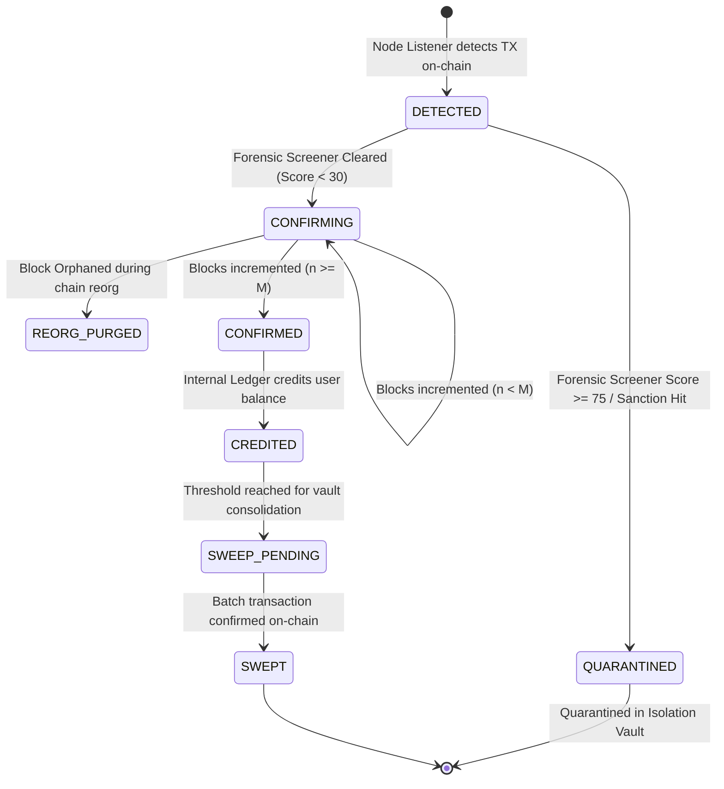

# Multi-Chain Crypto Deposit, Withdrawal & Custody Specification

**Document Version:** 1.0.0-PROD-SPEC  
**Status:** Approved Architecture Standard  
**Owner:** Custody Engineering, Gateway Infrastructure & Blockchain Security Group  
**Classification:** Institutional Standard  
**Review Cadence:** Quarterly  
**Last Review:** September 2026  
**Related Specifications:**
- [Growww Core Blockchain Ledger & Web3 Architecture Specification](./BLOCKCHAIN_LEDGER_CORE_SPECIFICATION.md)
- [Regulatory Risk, Compliance & Cross-Chain Governance Specification](./REGULATORY_RISK_AND_CROSSCHAIN_GOVERNANCE.md)
- [Core Ledger & Multi-Currency Balance Specification](./CORE_LEDGER_AND_MULTI_CURRENCY_SPECIFICATION.md)
- [Event-Driven Architecture Specification](./EVENT_DRIVEN_ARCHITECTURE_SPECIFICATION.md)
- [Distributed Systems & Resilience Specification](./DISTRIBUTED_SYSTEMS_AND_RESILIENCE_SPECIFICATION.md)
- [NBSE Master Architecture & Integration Blueprint](./NBSE_MASTER_ARCHITECTURE_AND_INTEGRATION_BLUEPRINT.md)
- [ADR-0010: Tiered Cross-Chain Finality Governance & Reorg Buffer](../adr/ADR-0010-tiered-crosschain-finality-governance.md)
- [ADR-0012: Pessimistic Locking for Concurrent Withdrawals](../adr/ADR-0012-pessimistic-locking-concurrent-withdrawals.md)
- [ADR-0026: Gasless Meta-Transactions & EIP-2771 Paymaster](../adr/ADR-0026-gasless-meta-transactions-eip2771-paymaster.md)

---

## 1. Executive Architectural Summary & Invariant Principles

The Growww platform operates an institutional-grade, multi-chain digital asset infrastructure uniting external public blockchain liquidity with a high-throughput, permissioned settlement core powered by Hyperledger Besu (QBFT consensus). Operating out of the International Financial Services Centre (GIFT City) under the regulatory oversight of the International Financial Services Centres Authority (IFSCA) and the Financial Intelligence Unit of India (FIU-IND), the platform facilitates programmatic crypto deposits, automated cold/warm/hot custody tiering, dynamic low-latency withdrawals, and stringent Anti-Money Laundering (AML) and FATF Travel Rule compliance.

```
+---------------------------------------------------------------------------------------------------+
|                        GROWWW CRYPTO CUSTODY & GATEWAY TOPOLOGY                                   |
|                                                                                                   |
|    EXTERNAL PUBLIC BLOCKCHAINS (Bitcoin, Ethereum, L2s, Solana, TRON)                             |
|          |                                                                   ^                    |
|   Inbound Deposits                                                   Outbound Withdrawals         |
|          v                                                                   |                    |
|    +------------------------------------+       +------------------------------------+            |
|    | MULTI-CHAIN INGESTION & NODES      |       | WITHDRAWAL SIGNING & BROADCASTER   |            |
|    | - ZeroMQ, WebSockets, gRPC         |       | - 2-of-3 MPC Quorum (Nitro Enclave)|            |
|    | - Reorg Deep Cache & Watchdogs     |       | - Dynamic EIP-1559 / BnB Selection |            |
|    | - Pre-Credit AML Quarantine Engine |       | - Travel Rule Handshake Gateway    |            |
|    +------------------------------------+       +------------------------------------+            |
|          |                                                                   ^                    |
|    Events: DETECTED -> CONFIRMED                                             | State: APPROVED    |
|          v                                                                   |                    |
|    +---------------------------------------------------------------------------------+            |
|    |                 CUSTODY TIERING, SWEEPING & REBALANCING PIPELINE                |            |
|    |                                                                                 |            |
|    |  +--------------------+      +--------------------+      +--------------------+ |            |
|    |  | HOT WALLET (<= 1%) | <--> | WARM VAULT (3-4%)  | <--> | COLD VAULT (95%+)  | |            |
|    |  | Instant Outbound   |      | Auto-Rebalancing   |      | Offline Multi-Sig  | |            |
|    |  | MPC Shares 1 & 2   |      | Enclave-Gated MPC  |      | Air-Gapped HSM     | |            |
|    |  +--------------------+      +--------------------+      +--------------------+ |            |
|    |            ^                            ^                                       |            |
|    |            | Gas Sponsorship Relayer    | Batch Sweeper & UTXO Consolidation    |            |
|    |            +----------------------------+---------------------------------------+ |          |
|    +---------------------------------------------------------------------------------+            |
|                                             |                                                     |
|                                             v Internal Journal & Compliance Freeze                |
|    +---------------------------------------------------------------------------------+            |
|    |         HYPERLEDGER BESU ENTERPRISE CONSORTIUM LEDGER (QBFT CONSENSUS)          |            |
|    |   - 1:1 Custody Asset Backing & Proof-of-Reserve State Trees                    |            |
|    |   - On-Chain Investor Freezes (ComplianceRegistry.sol)                          |            |
|    |   - Zero On-Chain PII (Pseudonymous Hashes & EIP-712 Ownership Records)         |            |
|    +---------------------------------------------------------------------------------+            |
+---------------------------------------------------------------------------------------------------+
```

### 1.1 Fundamental Custody & Gateway Invariants

1. **INV-CUST-1 (Strict Cold Storage Dominance):** At least 95.0% of all aggregated client and platform digital assets under custody (AUM) must reside within mathematically isolated Cold Vaults utilizing air-gapped hardware security modules (HSM) or offline multi-signature configurations. The hot operational wallet must never hold more than 1.0% of total platform assets.
2. **INV-CUST-2 (Zero Single Point of Compromise):** No individual server, cloud provider, human administrator, operational key share, or microservice instance possesses sufficient cryptographic material to authorize or broadcast a transaction independently. Outbound operations strictly require a 2-of-3 Multi-Party Computation (MPC) quorum or an M-of-N multi-signature threshold.
3. **INV-CUST-3 (Zero Unfinalized Ledger Credit):** External blockchain deposits are strictly quarantined from internal trading balances until reaching mathematical and economic finality thresholds defined in the Cross-Chain Finality Matrix. Chain reorganizations shallower than the matrix depth are resolved automatically without impacting internal ledger solvency.
4. **INV-CUST-4 (Pre-Execution Forensic Isolation):** Inbound transactions originating from sanctioned entities (OFAC/UN/EU), privacy tumblers/mixers (Tornado Cash, Sinbad), or illicit clusters (composite risk score >= 75) must be automatically quarantined before crediting. Outbound withdrawals to unverified or sanctioned destinations are aborted prior to signature generation.
5. **INV-CUST-5 (Zero Platform Markup on Network Fees):** The platform levies exactly 0.00% surcharge on external blockchain network fees. The user pays only the exact miner/validator gas cost incurred. Internal transfers between Growww platform identifiers settle instantly on the internal double-entry ledger at zero network cost and zero platform fee.

---

## 2. Multi-Chain Deposit Infrastructure

The deposit infrastructure provides deterministic, high-throughput ingestion of digital assets across heterogeneous distributed ledgers. Each client is provisioned unique, deterministic deposit addresses derived from an institutional master seed stored securely within FIPS 140-2 Level 3 hardware security modules.

### 2.1 HD Wallet Address Derivation Architecture

Deterministic address generation enforces the hierarchical deterministic (HD) wallet standards defined in BIP-32, BIP-44, BIP-84, and EIP-2334. Master private keys never exist in plaintext memory on general compute instances; all public child keys are derived either via hardened master extended public keys (`xpub`/`zpub`) or through isolated Hardware Security Module (HSM) transit engines.

```
+---------------------------------------------------------------------------------------------------+
|                        HD WALLET ADDRESS DERIVATION ENGINE                                        |
|                                                                                                   |
|    +-----------------------------------------------------------------------------------------+    |
|    | FIPS 140-2 LEVEL 3 HSM (AWS CloudHSM / HashiCorp Vault Transit Engine)                  |    |
|    | - Master Root Seed (512-bit HMAC-SHA512 entropy generated via Hardware TRNG)            |    |
|    | - Master Extended Private Key (m) quarantined inside HSM boundary                      |    |
|    +-----------------------------------------------------------------------------------------+    |
|                                             |                                                     |
|                                             v Derives Hardened Account Extended Keys              |
|    +-----------------------------------------------------------------------------------------+    |
|    | HARDENED DERIVATION PATHS (Account Level: m / purpose' / coin_type' / account')         |    |
|    |                                                                                         |    |
|    | - Bitcoin (Native SegWit Bech32): m / 84' / 0' / 0'    -> Account Extended Key (zpub)   |    |
|    | - EVM Chains (ETH, L2s, Polygon): m / 44' / 60' / 0'   -> Account Extended Key (xpub)   |    |
|    | - Solana (Ed25519 SLIP-0010):     m / 44' / 501' / i'  -> Hardened Derived Public Keys  |    |
|    | - TRON (TRC-20 Base58Check):      m / 44' / 195' / 0'  -> Account Extended Key (xpub)   |    |
|    +-----------------------------------------------------------------------------------------+    |
|                                             |                                                     |
|                                             v Non-Hardened External Chain Derivation (0 / i)      |
|    +-----------------------------------------------------------------------------------------+    |
|    | KERNEL DEPOSIT WORKER (services/deposit-address-generator)                              |    |
|    |                                                                                         |    |
|    | - Reads user index (i) from PostgreSQL atomic sequence                                  |    |
|    | - Derives child public key K_i = point_add(K_account, hash(chaincode || K || i) * G)   |    |
|    | - Enforces network-specific hashing, checksums, and encoding                            |    |
|    +-----------------------------------------------------------------------------------------+    |
|          |                                |                       |                    |          |
|          v                                v                       v                    v          |
|    Bitcoin Native SegWit            Ethereum & L2s             Solana (Ed25519)     TRON (Base58) |
|    bc1q[20-byte-hash][chk]          0x[20-byte-address]        [32-byte Base58]     T[20-byte][chk|
+---------------------------------------------------------------------------------------------------+
```

#### Derivation Path Specifications

1. **Bitcoin (BTC) - Native SegWit (BIP-84):**
   - Base Path: `m / 84' / 0' / 0' / 0 / i`
   - Scheme: Pay-to-Witness-Public-Key-Hash (P2WPKH).
   - Address Derivation Logic:
     $$\text{PubKeyHash} = \text{RIPEMD160}(\text{SHA256}(K_i))$$
     $$\text{ScriptPubKey} = \text{OP\_0} \mathbin{\Vert} 0x14 \mathbin{\Vert} \text{PubKeyHash}$$
   - Bech32 Encoding: Human-Readable Part (HRP) `bc1q` concatenated with 5-bit grouped witness program and polynomial checksum.
2. **Ethereum Mainnet & L2 Rollups (Arbitrum, Optimism, Base, Polygon PoS) - BIP-44 / EIP-2334:**
   - Base Path: `m / 44' / 60' / 0' / 0 / i`
   - Scheme: ECDSA `secp256k1` uncompressed public key ($64$ bytes).
   - Address Derivation Logic:
     $$\text{Address} = \text{Keccak256}(K_{i,\text{uncompressed}})[12:31]$$
   - EIP-55 Mixed-Case Checksum: Applied deterministically by hashing the lowercase hexadecimal representation with Keccak-256 and uppercasing characters where the corresponding hash nibble is $\ge 8$.
   - Multi-Chain Unified Invariant: Identical 20-byte address format across Ethereum, Arbitrum One, OP Mainnet, Base, and Polygon PoS.
3. **Solana (SOL & SPL Tokens) - BIP-44 / SLIP-0010:**
   - Base Path: `m / 44' / 501' / i' / 0'` (Ed25519 requires hardened derivation at each level).
   - Scheme: Edwards-curve Digital Signature Algorithm (`Ed25519`).
   - Address Format: 32-byte raw public key encoded in Base58 (Bitcoin alphabet without `0`, `O`, `I`, `l`).
   - Associated Token Account (ATA) Derivation: Deterministic Program Derived Address (PDA) calculated off-curve:
     $$\text{ATA} = \text{PDA}(\text{OwnerAddress}, \text{TokenProgramId}, \text{MintAddress})$$
     $$\text{ATA} = \text{SHA256}(\text{OwnerAddress} \mathbin{\Vert} \text{TokenProgramId} \mathbin{\Vert} \text{MintAddress} \mathbin{\Vert} \text{ProgramDerivedAddressProgramId} \mathbin{\Vert} \text{nonce})$$
4. **TRON (TRC-20 USDT) - BIP-44:**
   - Base Path: `m / 44' / 195' / 0' / 0 / i`
   - Scheme: ECDSA `secp256k1`.
   - Address Derivation Logic:
     $$\text{RawBytes} = 0x41 \mathbin{\Vert} \text{Keccak256}(K_{i,\text{uncompressed}})[12:31]$$
     $$\text{Checksum} = \text{DoubleSHA256}(\text{RawBytes})[0:3]$$
     $$\text{TronAddress} = \text{Base58}(\text{RawBytes} \mathbin{\Vert} \text{Checksum})$$
   - Resulting string starts strictly with the prefix `T`.

### 2.2 HSM Master Seed Generation & Transit Derivation Engine

Master seeds are initialized during a multi-custodian key generation ceremony directly inside FIPS 140-2 Level 3 hardware security modules (AWS CloudHSM or HashiCorp Vault with HSM Storage Engine).

```go
// Package derivation implements deterministic child address derivation.
package derivation

import (
	"crypto/sha256"
	"fmt"
	"github.com/btcsuite/btcd/btcec/v2"
	"github.com/btcsuite/btcd/btcutil"
	"github.com/btcsuite/btcd/btcutil/bech32"
	"github.com/btcsuite/btcd/chaincfg"
	"golang.org/x/crypto/ripemd160"
	"golang.org/x/crypto/sha3"
)

// DeriveBtcNativeSegWit derives a Bech32 Native SegWit (P2WPKH) address from an extended public key.
func DeriveBtcNativeSegWit(accountPubKey *btcutil.AddressPubKey, childIndex uint32) (string, error) {
	pubKeyBytes := accountPubKey.ScriptAddress()
	sha := sha256.Sum256(pubKeyBytes)
	
	hasher := ripemd160.New()
	if _, err := hasher.Write(sha[:]); err != nil {
		return "", fmt.Errorf("ripemd160 write failed: %w", err)
	}
	pubKeyHash := hasher.Sum(nil)

	// Convert 8-bit data into 5-bit groups for Bech32 encoding
	conv, err := bech32.ConvertBits(pubKeyHash, 8, 5, true)
	if err != nil {
		return "", fmt.Errorf("bech32 bit conversion failed: %w", err)
	}

	// Witness version 0 prepended
	witnessProgram := append([]byte{0x00}, conv...)
	encoded, err := bech32.Encode("bc", witnessProgram)
	if err != nil {
		return "", fmt.Errorf("bech32 encode failed: %w", err)
	}
	return encoded, nil
}

// DeriveEvmAddress computes the EIP-55 checksummed 0x address from a 65-byte uncompressed secp256k1 public key.
func DeriveEvmAddress(uncompressedPubKey []byte) (string, error) {
	if len(uncompressedPubKey) != 65 || uncompressedPubKey[0] != 0x04 {
		return "", fmt.Errorf("invalid uncompressed secp256k1 public key length")
	}

	hasher := sha3.NewLegacyKeccak256()
	hasher.Write(uncompressedPubKey[1:])
	digest := hasher.Sum(nil)
	rawAddress := digest[12:32] // Last 20 bytes

	// Format lowercase hex
	hexAddress := fmt.Sprintf("%x", rawAddress)

	// Calculate EIP-55 checksum hash
	checksumHasher := sha3.NewLegacyKeccak256()
	checksumHasher.Write([]byte(hexAddress))
	checksumDigest := checksumHasher.Sum(nil)

	checksummed := make([]byte, 40)
	for i := 0; i < 40; i++ {
		hashNibble := (checksumDigest[i/2] >> (4 * (1 - (i % 2)))) & 0x0f
		char := hexAddress[i]
		if char >= 'a' && char <= 'f' && hashNibble >= 8 {
			checksummed[i] = char - 32 // Convert to uppercase
		} else {
			checksummed[i] = char
		}
	}
	return "0x" + string(checksummed), nil
}
```

### 2.3 Supported Networks & Asset Specifications

| Network | Native Asset | Supported Deposit Tokens | Address Scheme | Decimals | Script / Token Standard |
|---|---|---|---|---|---|
| **Bitcoin Mainnet** | BTC | BTC | BIP-84 P2WPKH (`bc1q...`) | 8 | Native SegWit Witness v0 |
| **Ethereum Mainnet** | ETH | ETH, USDT, USDC, DAI | EIP-55 Hex (`0x...`) | ETH/DAI: 18, USDT/USDC: 6 | ERC-20 / Native |
| **Arbitrum One** | ETH | ETH, USDC.e, USDC, USDT | EIP-55 Hex (`0x...`) | ETH: 18, USDC/USDT: 6 | Arbitrum Nitro Rollup |
| **Optimism (OP)** | ETH | ETH, USDC, USDT | EIP-55 Hex (`0x...`) | ETH: 18, USDC/USDT: 6 | OP Stack Bedrock |
| **Base** | ETH | ETH, USDC, cbBTC | EIP-55 Hex (`0x...`) | ETH: 18, USDC: 6, cbBTC: 8 | OP Stack Bedrock |
| **Polygon PoS** | POL | POL, USDT, USDC | EIP-55 Hex (`0x...`) | POL: 18, USDT/USDC: 6 | Heimdall / Bor EVM |
| **Solana** | SOL | SOL, USDC, USDT | Base58 PubKey & ATAs | SOL: 9, USDC/USDT: 6 | SPL Token Program 2022 |
| **TRON** | TRX | USDT | Base58Check (`T...`) | USDT: 6 | TRC-20 (Smart Contract) |

### 2.4 Distributed Node Listener & Ingestion Engine

To insulate against external node failures, provider rate limits, and network latency anomalies, the Ingestion Engine operates a resilient dual-tier topology:

```
+---------------------------------------------------------------------------------------------------+
|                        MULTI-CHAIN INGESTION ENGINE TOPOLOGY                                      |
|                                                                                                   |
|    LAYER 1: DEDICATED ARCHIVE & FULL NODES                                                        |
|    +----------------------+  +----------------------+  +---------------------+                    |
|    | Bitcoin Core 27.0    |  | Erigon 3.0 (EVM)     |  | Solana RPC Server   |                    |
|    | (ZeroMQ rawblock/tx) |  | (IPC / WebSocket)    |  | (Geyser gRPC plugin)|                    |
|    +----------------------+  +----------------------+  +---------------------+                    |
|               |                         |                         |                               |
|               v                         v                         v                               |
|    +-------------------------------------------------------------------------+                    |
|    | ACTIVE POLLING & FALLBACK ROUTER (Load-Balanced Across Providers)       |                    |
|    | - Primary: Dedicated Bare-Metal Bare Nodes (Equinix NY4 / FR2)          |                    |
|    | - Secondary: Enterprise Fallbacks (Alchemy, QuickNode, Triton One RPC)   |                    |
|    | - Failover Threshold: 3 consecutive heartbeat timeouts (500ms SLA)      |                    |
|    +-------------------------------------------------------------------------+                    |
|                                        |                                                          |
|                                        v Raw Streams                                              |
|    +-------------------------------------------------------------------------+                    |
|    | INGESTION NORMALIZATION KERNEL (Go 1.22+ Microservice Workers)          |                    |
|    |                                                                         |                    |
|    |  [Worker: BTC Parser]   [Worker: EVM Log Filter]  [Worker: SPL Stream]  |                    |
|    |         |                        |                        |             |                    |
|    |         v                        v                        v             |                    |
|    |  - Extract TXID, Output Index, Destination Address, Value, Block Hash   |                    |
|    |  - Cross-reference with In-Memory Redis Bloom Filter of Active Accounts |                    |
|    |  - Match against Deposit Address Database (PostgreSQL 16)               |                    |
|    +-------------------------------------------------------------------------+                    |
|                                        |                                                          |
|                                        v Verified Events                                          |
|    +-------------------------------------------------------------------------+                    |
|    | APACHE KAFKA CLUSTER (Topic: crypto.deposit.detected.v1)                |                    |
|    +-------------------------------------------------------------------------+                    |
+---------------------------------------------------------------------------------------------------+
```

#### Ingestion Protocols & Parsing Mechanisms

1. **EVM Chains (Ethereum & L2s):**
   - Ingestion Pipe: WebSocket connection pool running `eth_subscribe("logs")` filtered by ERC-20 `Transfer(address,address,uint256)` event signature:
     $$\text{Topic0} = \text{Keccak256}("Transfer(address,address,uint256)") = \text{0xddf252ad1be2c89b69c2b068fc378daa952ba7f163c4a11628f55a4df523b3ef}$$
   - Native ETH: Parsed from block body traces (`eth_getBlockByNumber` with full transaction objects) by screening `tx.to` and internal EVM call traces.
2. **Bitcoin Mainnet:**
   - Ingestion Pipe: ZeroMQ socket subscription to `zmqpubrawtx` and `zmqpubrawblock`.
   - Parsing Kernel: Deserializes raw wire transactions. Iterates through all `vout` outputs; maps `scriptPubKey` against the registered Native SegWit database.
3. **Solana Mainnet:**
   - Ingestion Pipe: High-speed Geyser gRPC streaming plugin connected directly to validator memory pipeline.
   - Parsing Kernel: Filters transactions involving SPL Token Program ID (`TokenkegQfeZyiNwAJbNbGKPFXCWuBvf9Ss623VQ5DA`) and Token-2022 Program ID. Evaluates post-token balances against pre-token balances to extract net transfers.

### 2.5 Block Header Reorganization Handling & Finality Depth Matrices

External blockchains feature heterogeneous consensus finality mechanics. Crediting deposits prematurely exposes the platform to double-spend loss during deep chain reorganizations. To eliminate this risk, the gateway enforces a strict multi-stage depth matrix.

#### Confirmation & Finality Depth Matrix

| Blockchain Network | Consensus Algorithm | Block Time (Nominal) | Detection Threshold | Soft Confirmation | Finalized Threshold (Ledger Credit) |
|---|---|---|---|---|---|
| **Bitcoin (BTC)** | Nakamoto PoW | 600.0s | 1 block | 3 blocks | 6 blocks (~60 min) |
| **Ethereum Mainnet** | PoS (Gasper / Casper FFG)| 12.0s | 1 block | 12 blocks | 64 blocks (2 Epochs, ~12.8 min) |
| **Arbitrum One** | Nitro Optimistic Rollup | 0.25s | 1 block | 64 L2 blocks | 64 L2 blocks + L1 Sequence Batch |
| **Optimism (OP)** | Bedrock Optimistic Rollup| 2.0s | 1 block | 32 L2 blocks | 32 L2 blocks + L1 Batch Anchor |
| **Base** | Bedrock Optimistic Rollup| 2.0s | 1 block | 32 L2 blocks | 32 L2 blocks + L1 Batch Anchor |
| **Polygon PoS** | Heimdall / Bor PoS | 2.1s | 1 block | 64 blocks | 256 blocks (Heimdall Checkpoint) |
| **Solana** | PoH + Tower BFT | 0.4s | Processed | Confirmed (1 vote) | Finalized (31+ Confirmed Slots, Root) |
| **TRON** | DPoS | 3.0s | 1 block | 19 blocks | 27 blocks (Super-Representative Finality) |

#### Reorganization Detection & Rollback Algorithm

The ingestion service maintains a sliding window of the last $W$ block headers in Redis and PostgreSQL ($W = 128$ for EVM, $W = 12$ for BTC).

```
State Evolution on New Ingested Block (B_k):

1. Check Parent Hash:
   IF B_k.parent_hash == WindowCache[k - 1].block_hash THEN
       Append B_k to WindowCache
       Increment confirmation count for all tracked deposits in [k - Depth, k]
   ELSE
       // Reorganization Detected!
       Execute Reorg Walkback:
           Set pointer p = k - 1
           WHILE WindowCache[p].block_hash != NodeRPC.getBlock(p).block_hash:
               Mark WindowCache[p] as ORPHANED
               p = p - 1
           Common Ancestor = p
           
           FOR each block b FROM p + 1 TO k - 1:
               Fetch all deposits associated with block b
               FOR each deposit D in deposits:
                   IF D.status == 'CONFIRMING':
                       Reset D.confirmations to (NodeHeight - NewBlockOf(D))
                       IF D does not exist in canonical branch THEN
                           Set D.status = 'REORG_ORPHANED'
                           Publish Alert: crypto.deposit.orphaned.v1
                   ELSE IF D.status == 'CREDITED':
                       // CRITICAL: Reorganization deeper than finality threshold!
                       Trigger EMERGENCY CLAWBACK SAGA (ADR-0010 & Runbook 07)
                       Place immediate freeze on user trading account
```

### 2.6 Ingestion State Machine

The lifecycle of an inbound digital asset deposit transitions through an immutable deterministic state machine:



#### State Transition Definitions

1. `DETECTED`: Transaction identified on-chain via node listener or mempool monitoring. Emits `crypto.deposit.detected.v1`. Immediately invokes `services/crypto-forensics-screener` for AML taint scoring.
2. `CONFIRMING (n/M)`: AML screening returned `CLEARED`. Transaction has $n$ confirmations out of $M$ required finality blocks. Emits periodic progress updates to client UI via WebSockets.
3. `CONFIRMED`: Transaction has achieved required confirmation threshold $M$. Cryptographic proof verified against header Merkle trie. Emits `crypto.deposit.confirmed.v1`.
4. `CREDITED`: Wallet Service updates the user's available purchasing balance in PostgreSQL using a double-entry journal entry. Asset backing is simultaneously acknowledged in the Hyperledger Besu consortium state tree. Emits `crypto.deposit.credited.v1`.
5. `SWEPT`: Deposit balance consolidated from user deposit address into Warm or Cold Vault. Emits `crypto.deposit.swept.v1`.
6. `QUARANTINED`: Automated hold. Inbound funds flagged for sanctions, darknet exposure, or mixer contamination. Transaction is segregated into an isolated quarantine vault without crediting trading balance.

---

## 3. Hot / Warm / Cold Custody Tiering & Sweeping Pipeline

Growww implements a defense-in-depth, three-tier cryptographic vault architecture to reconcile instant operational withdrawal liquidity with ironclad offline asset protection.

```
+---------------------------------------------------------------------------------------------------+
|                        THREE-TIER CUSTODY VAULT ARCHITECTURE                                      |
|                                                                                                   |
|  +---------------------------------------------------------------------------------------------+  |
|  | COLD VAULT (95.0%+ of Platform AUM)                                                         |  |
|  | - Complete physical and electrical network isolation (Air-Gapped)                           |  |
|  | - FIPS 140-2 Level 3 / Level 4 Hardware Security Modules                                    |  |
|  | - Multi-Sig Threshold Scheme (3-of-5 or 4-of-7 Quorum across 3 global regions)                |  |
|  | - Ceremony Signing: BIP-174 PSBT / EIP-712 QR Code optical data diodes                      |  |
|  | - 48-Hour On-Chain Timelock Delay on all outbound vault transfers                           |  |
|  +---------------------------------------------------------------------------------------------+  |
|                                    ^                         |                                    |
|              High-Water Sweeps (> 5%) |                         | Manual Replenishment               |
|                                    |                         v (Scheduled Quorum Ceremony)        |
|  +---------------------------------------------------------------------------------------------+  |
|  | WARM VAULT (3.0% - 4.0% of Platform AUM)                                                    |  |
|  | - Semi-Automated Institutional MPC (2-of-3 Threshold Signing)                               |  |
|  | - Hardware Enclave-Gated Policy Engine (AWS Nitro Enclaves / GCP Confidential VM)            |  |
|  | - Dynamic Rebalancing Buffer between Cold Storage and Hot Wallet Liquidity                  |  |
|  | - Automated Whitelist-Only Destination Enforcing (Transfers only to Hot or Cold)            |  |
|  +---------------------------------------------------------------------------------------------+  |
|                                    ^                         |                                    |
|            Surplus Sweeps (> 1.5%) |                         | Automated Top-Up (< 0.5%)          |
|                                    |                         v (Velocity & Risk Checked)          |
|  +---------------------------------------------------------------------------------------------+  |
|  | HOT WALLET (<= 1.0% of Platform AUM)                                                        |  |
|  | - Real-time programmatic withdrawal fulfillment (< 2.0s signing latency)                     |  |
|  | - 2-of-3 MPC: Share 1 (Application Worker) + Share 2 (Platform Nitro Enclave)              |  |
|  | - Bounded 24-Hour Rolling Outflow Velocity Limits (V_max per asset)                         |  |
|  | - Automatic Circuit Breaker: Outflow spike > 300% 1h average halts signer                   |  |
|  +---------------------------------------------------------------------------------------------+  |
+---------------------------------------------------------------------------------------------------+
```

### 3.1 Three-Tier Vault Mechanics & Allocation Governance

1. **Cold Vault Tier (95%+ Target Allocation):**
   - Structural Design: Offline cold storage. Private keys or multi-signature master key shares are generated and permanently retained inside hardware cryptographic boundary devices located within high-security biometric vault facilities across three distinct jurisdictions (Mumbai GIFT City, Zurich, and Singapore).
   - Ingress: Deposit sweeps from Warm Vault or direct aggregation from large institutional deposits.
   - Egress: Permitted exclusively through scheduled, multi-custodian physical ceremonies requiring biometric authentication, dual video verification, and optical QR data exchange. Subject to a mandatory 48-hour timelock smart contract rule on Hyperledger Besu.
2. **Warm Vault Tier (3-4% Target Allocation):**
   - Structural Design: Semi-automated buffer holding sufficient working capital to absorb standard daily retail and institutional withdrawal fluctuations.
   - Security Model: Operates an institutional MPC architecture with rigorous automated policy governance. The MPC policy engine permits transfers strictly to pre-registered, cryptographic destination whitelists (specifically, the platform Hot Wallet or the platform Cold Vault).
3. **Hot Wallet Tier (<= 1% Target Allocation):**
   - Structural Design: Fully automated, low-latency transaction signer provisioned to fulfill user withdrawal requests in real time.
   - Reserve Discipline: Balances are strictly monitored against algorithmic ceiling and floor boundaries:
     - **Low-Water Mark ($0.5\%$):** When Hot Wallet balance drops below $0.5\%$ of total currency AUM, an automated top-up request is dispatched to the Warm Vault MPC orchestrator.
     - **High-Water Mark ($1.5\%$):** When Hot Wallet balance exceeds $1.5\%$ of total currency AUM (due to inbound user sweeps or low withdrawal volume), an automated surplus sweep is triggered to transfer excess liquidity into the Warm Vault.

### 3.2 MPC (Multi-Party Computation) 2-of-3 Threshold Signature Scheme

To ensure zero single points of failure while enabling instant automated signing for the Hot and Warm tiers, the platform deploys a threshold signature scheme based on Gennaro-Goldfeder 2020 (GG20) for ECDSA (`secp256k1`) and FROST (Flexible Round-Optimized Schnorr Threshold) for EdDSA (`Ed25519`).

```
+---------------------------------------------------------------------------------------------------+
|                        MPC 2-OF-3 THRESHOLD SIGNING TOPOLOGY                                      |
|                                                                                                   |
|    +------------------------+  +------------------------+  +---------------------------------+    |
|    | SHARE 1: APPLICATION   |  | SHARE 2: PLATFORM      |  | SHARE 3: BACKUP CUSTODIAN       |    |
|    | SESSION SHARE          |  | ENCLAVE SHARE          |  | DISASTER RECOVERY SHARE         |    |
|    +------------------------+  +------------------------+  +---------------------------------+    |
|    | Location: Ephemeral    |  | Location: AWS Nitro    |  | Location: Institutional Escrow  |    |
|    | App Worker RAM         |  | Enclave Isolation      |  | (Fireblocks / BitGo Custody)    |    |
|    | Storage: Encrypted KMS |  | Storage: CloudHSM      |  | Storage: Offline FIPS 140-2 HSM |    |
|    | Trigger: User Auth +   |  | Trigger: Policy Engine |  | Trigger: Catastrophic Disaster  |    |
|    | Risk Engine Approval   |  | & Velocity Check OK    |  | Quorum Activation Only          |    |
|    +------------------------+  +------------------------+  +---------------------------------+    |
|                 \                         /                                                       |
|                  \                       /                                                        |
|                   v                     v                                                         |
|    +-----------------------------------------------------------------------------------------+    |
|    | 2-OF-3 THRESHOLD PROTOCOL COMPUTATION (GG20 / FROST)                                    |    |
|    | - Parties engage in interactive zero-knowledge commitment rounds (Rounds 1 - 4)        |    |
|    | - Ephemeral secret shares compute signature (R, S) over Transaction Hash                |    |
|    | - Master Private Key is NEVER assembled or reconstituted in plaintext memory            |    |
|    +-----------------------------------------------------------------------------------------+    |
|                                             |                                                     |
|                                             v Valid On-Chain Signature (R, S, V)                  |
|    +-----------------------------------------------------------------------------------------+    |
|    | BROADCASTER RELAYER -> External Blockchain Mempool                                      |    |
|    +-----------------------------------------------------------------------------------------+    |
+---------------------------------------------------------------------------------------------------+
```

#### Cryptographic Threshold Guarantees

1. **Distributed Key Generation (DKG):** Key shares are generated cooperatively via a verifiable secret sharing (Feldman VSS) protocol. At no moment during the ceremony is the master secret $x$ known to any single participant.
2. **Interactive Signature Generation:**
   - Round 1: Exchange of cryptographic commitments to ephemeral nonce shares $k_i$ and masking polynomial points.
   - Round 2: Zero-knowledge proofs of discrete logarithm equality verifying that participants adhered to protocol invariants.
   - Round 3: Homomorphic Paillier encryption calculations to derive scalar additive shares of the signature.
   - Output: Canonical signature $(r, s)$ compliant with consensus verification rules of the target blockchain.
3. **Proactive Secret Sharing (PSS):** Every 30 days, or immediately following an authorized infrastructure mutation, an automated share refresh ceremony executes. The protocol updates all individual shares $s_1, s_2, s_3$ such that old shares become mathematically invalid, while the master public key and derived blockchain addresses remain strictly unchanged.

### 3.3 Automated Batch Sweeping & UTXO Consolidation Pipeline

Deposits arrive fragmented across hundreds of thousands of distinct user addresses. To optimize fee economics, maintain operational liquidity, and prevent UTXO bloating, the Custody Sweeper runs automated batching pipelines.

```
+---------------------------------------------------------------------------------------------------+
|                        UTXO CONSOLIDATION & MEMPOOL FEE OPTIMIZER                                 |
|                                                                                                   |
|    1. Continuous Mempool Oracle checks Bitcoin base fee rate (sat/vB)                             |
|    2. IF Current Fee <= 12 sat/vB AND Time == Off-Peak (Weekend / 01:00-04:00 UTC) THEN:          |
|                                                                                                   |
|       Input Query: Select all unspent UTXOs in user deposit addresses where:                      |
|                    UTXO_Value >= 3 * Cost_To_Spend(UTXO)                                          |
|                                                                                                   |
|       +-------------------+  +-------------------+  +-------------------+                         |
|       | Deposit UTXO #1   |  | Deposit UTXO #2   |  | Deposit UTXO #n   | (Up to 150 inputs)      |
|       | 0.045 BTC         |  | 0.012 BTC         |  | 0.088 BTC         |                         |
|       +-------------------+  +-------------------+  +-------------------+                         |
|                 \                      |                      /                                   |
|                  \                     |                     /                                    |
|                   v                    v                    v                                     |
|       +-----------------------------------------------------------------+                         |
|       | BATCH CONSOLIDATION TRANSACTION (BIP-174 PSBT Multi-Input)      |                         |
|       | - Signed via Deposit Derivation Keys / Transit Relayer          |                         |
|       | - Exactly 1 Output: Platform Warm Vault Address                 |                         |
|       | - 0 Change Outputs (Zero change overhead, zero dust generation) |                         |
|       +-----------------------------------------------------------------+                         |
|                                        |                                                          |
|                                        v Broadcast to Bitcoin Mempool                             |
|       +-----------------------------------------------------------------+                         |
|       | Single Large Warm Vault UTXO (Consolidated Capital)             |                         |
|       +-----------------------------------------------------------------+                         |
+---------------------------------------------------------------------------------------------------+
```

#### Economic Consolidation Threshold Formula

An individual UTXO $u$ is eligible for batch consolidation only if its value satisfies the economic viability inequality:

$$\text{Value}(u) > \lambda \cdot (\text{Size}_{\text{vBytes}}(u) \cdot \text{FeeRate}_{\text{current}})$$

Where:
- $\text{Size}_{\text{vBytes}}(u) \approx 68 \text{ vBytes}$ for a Native SegWit P2WPKH input.
- $\text{FeeRate}_{\text{current}}$ is the real-time mempool fee rate in satoshis per vByte.
- $\lambda$ represents the Economic Hurdle Multiplier ($\lambda = 3.0$). Inputs failing this hurdle are retained until mempool fee rates decline or aggregated with larger neighbor inputs.

### 3.4 Gas Sponsorship Relayer for ERC-20, SPL & TRC-20 Token Sweeps

A fundamental architectural challenge of multi-chain deposit systems is that user deposit addresses receive tokenized assets (e.g., USDT, USDC) but contain zero native base currency (ETH, SOL, TRX) to fund the sweeping transaction gas fee.

```
+---------------------------------------------------------------------------------------------------+
|                        GAS SPONSORSHIP & TOKEN SWEEP RELAYER                                      |
|                                                                                                   |
|    SCENARIO: User deposit address holds 10,000 USDT (ERC-20), but 0.0000 ETH.                      |
|                                                                                                   |
|    APPROACH A: EIP-1559 PRE-FUNDING PIPELINE (Legacy Standard)                                    |
|    1. Master Gas Station broadcasts Tx 1: Sends exact 0.0015 ETH to Deposit Address.              |
|    2. Wait 1 confirmation on-chain.                                                               |
|    3. Transit Engine broadcasts Tx 2: Sweeps 10,000 USDT to Warm Vault, spending 0.0015 ETH.     |
|    Drawback: Two transactions required, 2x block confirmation delay, potential dust leakage.      |
|                                                                                                   |
|    APPROACH B: EIP-2771 META-TRANSACTIONS & ACCOUNT ABSTRACTION (ERC-4337) (Preferred)            |
|    1. Deposit address is a counterfactual smart contract wallet (CREATE2).                        |
|    2. User deposit address executes `transfer(WarmVault, 10000)`.                                 |
|    3. Growww Paymaster contract sponsors and pays the gas directly on Ethereum / L2.              |
|    Advantage: Single atomic transaction, zero ETH pre-funding required.                            |
|                                                                                                   |
|    APPROACH C: SOLANA FEE-PAYER SPONSORSHIP                                                       |
|    1. Transaction contains instruction: `TokenProgram.transfer(UserATA, WarmVaultATA, 10000)`.   |
|    2. Signer 1: Deposit address private key (authorizing token movement).                        |
|    3. Signer 2: Growww Treasury Relayer (designated as `fee_payer`).                             |
|    Advantage: Zero SOL required in user deposit address. Fee deducted directly from relayer.      |
|                                                                                                   |
|    APPROACH D: TRON ENERGY LEASING POOL                                                           |
|    1. Master Custody Account stakes TRX to secure 65,000 Energy units.                            |
|    2. Master Account delegates Energy to the target user deposit address.                         |
|    3. TRC-20 `transfer` executes consuming delegated energy; zero TRX burned.                     |
+---------------------------------------------------------------------------------------------------+
```

---

## 4. Crypto Withdrawal Pipeline

The crypto withdrawal pipeline provides secure, real-time capital egress while enforcing multi-layered authentication, dynamic fee pricing, intelligent UTXO coin selection, and statutory compliance gating.

### 4.1 Multi-Layer Defense-in-Depth Security Controls

To prevent account takeover (ATO), session hijacking, API key compromise, and unauthorized asset extraction, every withdrawal must satisfy four concentric security perimeters:

```
+---------------------------------------------------------------------------------------------------+
|                        WITHDRAWAL SECURITY DEFENSE PIPELINE                                       |
|                                                                                                   |
|    [TRIGGER] User Initiates Crypto Withdrawal Request (Amount, Asset, Destination)                |
|       |                                                                                           |
|       v                                                                                           |
|    [LAYER 1: HARDWARE-BOUND MULTI-FACTOR AUTHENTICATION]                                         |
|    - Passkey / FIDO2 WebAuthn Cryptographic Challenge-Response (Apple Secure Enclave / YubiKey)  |
|    - RFC 6238 TOTP (HMAC-SHA256, 30s window, drift +/- 1)                                        |
|       | Passes MFA                                                                                |
|       v                                                                                           |
|    [LAYER 2: 24-HOUR SECURITY MUTATION LOCKOUT ENGINE]                                            |
|    - Checks database for security modifications in past 24 hours:                                 |
|      * Password reset / change                                                                    |
|      * 2FA device addition / replacement                                                          |
|      * Email / Phone number update                                                                |
|      * New device / unrecognized IP login                                                         |
|    - IF any mutation within 24h: REJECT WITHDRAWAL IMMEDIATELY & LOCK OUTFLOW                     |
|       | No Mutations in 24h                                                                       |
|       v                                                                                           |
|    [LAYER 3: DESTINATION ADDRESS WHITELIST & 12-HOUR COOLING PERIOD]                              |
|    - Is destination address in user's pre-approved whitelist?                                     |
|      * NO: Reject. Address must be registered and confirmed via WebAuthn first.                   |
|      * YES: Has 12-hour cooling period elapsed since registration?                                |
|        - Cooling period active (< 12h): Reject withdrawal until timestamp expires.                |
|        - Dual notifications (SMS + Email) dispatched with one-click emergency account killswitch. |
|       | Whitelist & Cooling Period Verified                                                       |
|       v                                                                                           |
|    [LAYER 4: FORENSIC AML SCREENING & TRAVEL RULE HANDSHAKE]                                      |
|    - Pre-withdrawal risk scoring via Chainalysis / TRM Labs (< 30 required)                       |
|    - If Transfer >= $1,000: Execute IVMS 101 Travel Rule handshake with Counterparty VASP         |
|       | Forensic & Travel Rule Cleared                                                            |
|       v                                                                                           |
|    [LAYER 5: MPC SIGNING & BLOCKCHAIN BROADCAST]                                                  |
|    - 2-of-3 MPC threshold signature generated inside Nitro Enclave                                |
|    - Broadcasted to external chain mempool; Pessimistic balance locked in PostgreSQL              |
+---------------------------------------------------------------------------------------------------+
```

### 4.2 Dynamic Gas Fee Pricing Engine

To ensure prompt inclusion into the next mined block without overpaying miners or validators, the platform implements real-time dynamic fee calculation.

#### EVM Dynamic EIP-1559 Pricing Algorithm

Every EVM withdrawal transaction specifies `maxFeePerGas` and `maxPriorityFeePerGas`:

$$\text{maxPriorityFeePerGas} = \max\left(\text{Floor}_{\text{priority}}, \text{Percentile}_{95}(\text{MempoolPendingPriorityFees})\right)$$

$$\text{maxFeePerGas} = (2 \times \text{BaseFee}_{\text{current\_block}}) + \text{maxPriorityFeePerGas}$$

```go
// CalculateEip1559Fees computes dynamic fee parameters for EVM transactions.
func CalculateEip1559Fees(currentBaseFee *big.Int, p95PriorityFee *big.Int) (*big.Int, *big.Int) {
	// Priority fee floor: 1.5 Gwei to guarantee validator priority
	minPriorityFee := big.NewInt(1500000000)
	priorityFee := new(big.Int).Set(p95PriorityFee)
	if priorityFee.Cmp(minPriorityFee) < 0 {
		priorityFee.Set(minPriorityFee)
	}

	// Base fee multiplier: 2x ensures transaction remains valid across 6 consecutive 12.5% max base fee increases
	two := big.NewInt(2)
	baseFeeComponent := new(big.Int).Mul(currentBaseFee, two)
	maxFee := new(big.Int).Add(baseFeeComponent, priorityFee)

	return maxFee, priorityFee
}
```

#### Replace-By-Fee (RBF) Escalation Policy

If an EVM or Bitcoin transaction remains unmined after $N$ blocks ($N = 3$ for Ethereum, $N = 2$ for Bitcoin):
1. The Watchdog monitor flags the transaction as `STALLED_IN_MEMPOOL`.
2. The Broadcaster issues a replacement transaction with an identical nonce (`nonce` on EVM, identical input UTXOs on BTC).
3. The replacement transaction increases `maxPriorityFeePerGas` and `maxFeePerGas` by at least $+15.0\%$ (exceeding geth's standard $+10\%$ replacement hurdle) or increases sat/vB by $+20.0\%$ to enforce immediate mining.

### 4.3 Bitcoin UTXO Coin Selection Engine

For Bitcoin withdrawals, selecting which UTXOs to spend from the Hot Wallet balance is critical to minimizing transaction size and preventing wallet fragmentation. The platform deploys an optimized implementation combining the **Branch and Bound (BnB)** exact match algorithm with a **Knapsack** fallback.

```
+---------------------------------------------------------------------------------------------------+
|                        BITCOIN UTXO COIN SELECTION ENGINE                                         |
|                                                                                                   |
|    Target Amount: T = Withdrawal_Amount + Effective_Fee(Empty_Tx)                                 |
|                                                                                                   |
|    STEP 1: BRANCH AND BOUND (BnB) SEARCH (Exact Match without Change)                             |
|    - Traverses binary decision tree of available Hot Wallet UTXOs                                 |
|    - Goal: Find subset S such that: T <= sum(S) <= T + Cost_Of_Creating_Change                    |
|                                                                                                   |
|         [Found Exact Subset?]                                                                     |
|            /            \                                                                         |
|          YES             NO                                                                       |
|          /                \                                                                       |
|         v                  v                                                                      |
|    Generate Tx        STEP 2: KNAPSACK RANDOM DRAW ALGORITHM                                      |
|    with 1 Output      - Iteratively samples UTXO subsets to minimize waste metric:                |
|    (0 Change Output)    Waste = sum(Input_Fees - Long_Term_Fees) + Cost_Of_Change                   |
|    Save ~34 vBytes    - Selects smallest subset yielding valid change output                      |
|    Fee Efficiency++   - Ensures Change >= Dust_Threshold (546 satoshis)                           |
+---------------------------------------------------------------------------------------------------+
```

#### Coin Selection Waste Metric Formulation

$$\text{Waste} = \sum_{i \in \text{Inputs}} (\text{Fee}_{\text{current}}(i) - \text{Fee}_{\text{long\_term}}(i)) + \begin{cases} 0 & \text{if zero change} \\ \text{Fee}_{\text{create\_change}} + \text{Fee}_{\text{spend\_change}} & \text{if change created} \end{cases}$$

Where:
- $\text{Fee}_{\text{long\_term}}$ is the estimated historical floor fee rate (e.g. 8 sat/vB). Spending inputs when current fee is lower than long term fee yields a negative waste (favorable consolidation).

### 4.4 Zero Platform Fee Policy & Internal Growww ID Off-Chain Settlement

Growww operates under a transparent, customer-aligned fee charter:

1. **Zero Platform Surcharge on External Withdrawals:**
   The fee charged to the user on external blockchain withdrawals is defined strictly by the network cost formula:
   $$\text{UserFee} = \text{EstimatedNetworkGasCost}$$
   $$\text{PlatformFeeMarkup} = 0.00$$
   No arbitrary spreads, fixed withdrawal fees, or operational skimming are levied.
2. **Instant Off-Chain Transfers via "Growww ID":**
   If a client requests a withdrawal specifying another Growww user identifier (Growww ID, registered email, or verified internal wallet tag) as the recipient:
   - The transaction bypasses the external blockchain mempool entirely.
   - The transfer executes atomically inside the double-entry accounting engine (`services/wallet-service`) within a single PostgreSQL serializable transaction.
   - Latency: Sub-50 milliseconds.
   - Fees: **0.00 INR / 0.00 USD Network Gas Fee** and **0.00% Platform Fee**.
   - Economic Result: Instant, zero-cost internal settlement with absolute finality.

---

## 5. FATF Travel Rule & AML Screening Architecture

Operating in strict compliance with the **Financial Action Task Force (FATF) Recommendations 15 and 16**, **IFSCA Anti-Money Laundering and Counter-Financing of Terrorism (AML/CFT) Guidelines**, and **FIU-IND mandates**, the platform embeds cryptographic compliance checks directly into the transactional path.

### 5.1 Real-Time Forensics Engine & Multi-Vendor Screening Consensus

Every deposit and withdrawal is screened concurrently against multiple blockchain intelligence providers: Chainalysis (KYT/Reactor) and TRM Labs.

```
+---------------------------------------------------------------------------------------------------+
|                        AML FORENSICS MULTI-VENDOR CONSENSUS ENGINE                                |
|                                                                                                   |
|    [Inbound Deposit / Outbound Withdrawal Request]                                                |
|          |                                                                                        |
|          v                                                                                        |
|    services/crypto-forensics-screener (Go 1.22+ Goroutine Orchestrator)                           |
|          |                                                                                        |
|          +-----------------------------------+------------------------------------+               |
|          | Concurrently query API (1,200ms)  | Concurrently query API (1,200ms)   |               |
|          v                                   v                                    v               |
|    +--------------------+              +--------------------+              +--------------------+ |
|    | CHAINALYSIS KYT    |              | TRM LABS ENGINE    |              | INTERNAL CACHE     | |
|    | - Direct/Indirect  |              | - Cross-Chain Graph|              | - Redis 7 Cluster  | |
|    | - Cluster Exposure |              | - Sanctions Engine |              | - Local Taint Hits | |
|    +--------------------+              +--------------------+              +--------------------+ |
|          \                                   /                                    /               |
|           \                                 /                                    /                |
|            v                               v                                    v                 |
|    +-----------------------------------------------------------------------------------------+    |
|    | CONSERVATIVE WEIGHTED CONSENSUS CALCULATOR                                              |    |
|    |                                                                                         |    |
|    | Score = max(Sanctions_Score, Mixer_Score, (0.6 * Chainalysis + 0.4 * TRMLabs))          |    |
|    +-----------------------------------------------------------------------------------------+    |
|          |                                                                                        |
|          +----------------------------+-----------------------------+                             |
|          | Score < 30                 | 30 <= Score < 75            | Score >= 75 or Sanctions    |
|          v                            v                             v                             |
|    [CLEARED]                    [COMPLIANCE REVIEW]           [AUTOMATED QUARANTINE]              |
|    Proceed to balance credit    Deposit held in escrow        Isolate to Quarantine Vault         |
|    or withdrawal broadcast      Manual officer escalation     Besu On-Chain Freeze Triggered      |
+---------------------------------------------------------------------------------------------------+
```

#### Risk Scoring Categories & Action Thresholds

1. **Critical Risk (Score $\ge 75$ or Direct Sanctions/Mixer Exposure):**
   - Triggers: OFAC SDN list, UN Sanctions, EU Sanctions, Terrorist Financing entities, Ransomware syndicates, Stolen Funds/Exploits, Privacy Mixers (Tornado Cash, Sinbad, Blender.io, Wasabi CoinJoin).
   - Automated Action: Immediate quarantine. Execution of on-chain freeze on Hyperledger Besu. Zero balance credited. SAR/STR alert generated.
2. **Medium Risk ($30 \le \text{Score} < 75$):**
   - Triggers: Unlicensed P2P exchanges, high-risk gambling platforms, indirect taint (2 to 4 hops removed from illicit cluster).
   - Automated Action: Balance held in pending escrow. High-priority case assigned to Compliance Officer workbench with a 30-minute review SLA.
3. **Low Risk (Score $< 30$):**
   - Triggers: Regulated VASPs, verified mining pools, clean personal addresses.
   - Automated Action: Automatically cleared for immediate ledger crediting or withdrawal broadcast.

### 5.2 Automated Quarantine Engine & On-Chain Besu Freezes

When incoming funds are flagged under Critical Risk, the Automated Quarantine Engine executes an immediate, irreversible multi-layer isolation protocol:

```solidity
// SPDX-License-Identifier: Apache-2.0
pragma solidity 0.8.24;

/**
 * @title ComplianceRegistry
 * @notice Enforces on-chain freezing of tainted investor accounts on Hyperledger Besu.
 */
contract ComplianceRegistry {
    event InvestorFrozen(address indexed investor, bytes32 indexed reasonHash, uint256 timestamp);
    event InvestorUnfrozen(address indexed investor, bytes32 indexed reasonHash, uint256 timestamp);

    mapping(address => bool) public isFrozen;
    mapping(address => bytes32) public freezeReasonHashes;

    address public complianceRelayer;
    address public complianceAdmin;

    modifier onlyCompliance() {
        require(msg.sender == complianceRelayer || msg.sender == complianceAdmin, "Unauthorized: Caller is not compliance");
        _;
    }

    constructor(address _complianceRelayer, address _complianceAdmin) {
        complianceRelayer = _complianceRelayer;
        complianceAdmin = _complianceAdmin;
    }

    /**
     * @notice Instantly freezes an investor account from trading, minting, or transferring tokens.
     * @param investor The pseudonymous 20-byte address of the investor.
     * @param reasonHash Deterministic SHA-256 hash of the forensic case file.
     */
    function freezeInvestor(address investor, bytes32 reasonHash) external onlyCompliance {
        require(!isFrozen[investor], "Investor already frozen");
        isFrozen[investor] = true;
        freezeReasonHashes[investor] = reasonHash;
        emit InvestorFrozen(investor, reasonHash, block.timestamp);
    }
}
```

### 5.3 Travel Rule Protocol (TRISA / Notabene / Sygna) for Transfers > $1,000

In accordance with FATF Recommendation 16, transactions equal to or exceeding **\$1,000 USD** (or local statutory equivalent) require the bilateral exchange of verified Personally Identifiable Information (PII) between the Originator VASP and Beneficiary VASP prior to the transaction broadcast.

```
+---------------------------------------------------------------------------------------------------+
|                        FATF TRAVEL RULE PROTOCOL EXCHANGE (IVMS 101)                              |
|                                                                                                   |
|    GROWWW GATEWAY (Originator VASP)                BENEFICIARY VASP (e.g., Coinbase, Binance)     |
|          |                                                                   |                    |
|          |--- 1. Query VASP Directory (Notabene / TRISA GDS) --------------->|                    |
|          |    Resolve counterparty destination address to Beneficiary VASP   |                    |
|          |                                                                   |                    |
|          |--- 2. Establish Secure Bilateral mTLS Channel ------------------->|                    |
|          |    Mutual X.509 Certificate Verification                          |                    |
|          |                                                                   |                    |
|          |--- 3. Send Encrypted IVMS 101 Travel Rule Payload --------------->|                    |
|          |    (Originator PII + Beneficiary PII, ECIES Encrypted)            |                    |
|          |                                                                   |                    |
|          |<-- 4. Permission Decision Response (ACK_ACCEPT / REJECT) ---------|                    |
|          |    Beneficiary verifies user KYC status & compliance policy       |                    |
|          |                                                                   |                    |
|    [Decision == ACK_ACCEPT]                                                  |                    |
|          |                                                                   |                    |
|          |--- 5. Broadcast On-Chain Transaction ---------------------------->| (Public Mempool)   |
|          |    Tx includes optional cryptographic commitment hash             |                    |
+---------------------------------------------------------------------------------------------------+
```

#### IVMS 101 Standardized Data Payload Schema

The interVASP Messaging Standard (IVMS 101) payload contains structured cryptographic identity records:

```json
{
  "originator": {
    "originatorPersons": [
      {
        "naturalPerson": {
          "name": {
            "nameIdentifier": [
              {
                "primaryIdentifier": "Sharma",
                "secondaryIdentifier": "Aarav",
                "nameIdentifierType": "LEGL"
              }
            ]
          },
          "geographicAddress": [
            {
              "addressType": "HOME",
              "streetName": "GIFT City Road",
              "buildingNumber": "Tower 1",
              "townName": "Gandhinagar",
              "country": "IN"
            }
          ],
          "nationalIdentification": {
            "nationalIdentifier": "ABCDE1234F",
            "nationalIdentifierType": "RAID",
            "countryOfIssue": "IN"
          },
          "dateAndPlaceOfBirth": {
            "dateOfBirth": "1988-06-15",
            "countryOfBirth": "IN"
          }
        }
      }
    ],
    "accountNumber": ["GROWWW-ACC-8839210"]
  },
  "beneficiary": {
    "beneficiaryPersons": [
      {
        "naturalPerson": {
          "name": {
            "nameIdentifier": [
              {
                "primaryIdentifier": "Smith",
                "secondaryIdentifier": "John",
                "nameIdentifierType": "LEGL"
              }
            ]
          }
        }
      }
    ],
    "accountNumber": ["0x71C84517C37417A71830C9727df792397017460B"]
  }
}
```

### 5.4 Proof of Ownership for Unhosted (Self-Custody) Private Wallets

When transferring assets to or from an unhosted (non-custodial) wallet (such as MetaMask, Ledger, Trezor, or Phantom), where no counterparty VASP exists to execute a Travel Rule handshake, regulatory frameworks mandate cryptographic proof of ownership.

#### Verification Method A: Satoshi Test (Micro-Transaction Proof)

1. The platform generates a deterministic micro-amount challenge:
   $$\text{ChallengeAmount} = \text{BaseSatoshis} + \text{Hash}(\text{UserId} \mathbin{\Vert} \text{Address}) \pmod{1000}$$
   Example: Exactly $0.00042183 \text{ BTC}$.
2. The user is instructed to transmit this exact amount from their external self-custody wallet within a 15-minute time window.
3. The platform verifies receipt of the exact satoshi value from the designated address, confirms proof of control, and refunds the deposit amount minus standard network gas fees.

#### Verification Method B: Cryptographic Signature Proof of Ownership

For EVM and Solana chains, the user can verify address ownership instantaneously without spending network fees by signing a cryptographic challenge using EIP-712 or Ed25519.

```json
{
  "types": {
    "EIP712Domain": [
      {"name": "name", "type": "string"},
      {"name": "version", "type": "string"},
      {"name": "chainId", "type": "uint256"},
      {"name": "verifyingContract", "type": "address"}
    ],
    "WalletOwnershipProof": [
      {"name": "growwwUserId", "type": "string"},
      {"name": "walletAddress", "type": "address"},
      {"name": "nonce", "type": "string"},
      {"name": "timestamp", "type": "uint256"},
      {"name": "statement", "type": "string"}
    ]
  },
  "primaryType": "WalletOwnershipProof",
  "domain": {
    "name": "Growww Custody Gateway",
    "version": "1.0.0",
    "chainId": 1,
    "verifyingContract": "0x0000000000000000000000000000000000000000"
  },
  "message": {
    "growwwUserId": "USR-8839210",
    "walletAddress": "0x71C84517C37417A71830C9727df792397017460B",
    "nonce": "d8f3a1e9b2c44f0a91e8273645bcde21",
    "timestamp": 1789728000,
    "statement": "I hereby declare and cryptographically verify that I Aarav Sharma am the sole beneficial owner of this unhosted self-custody wallet address."
  }
}
```

The gateway invokes `ecrecover` on the signed EIP-712 payload. If the recovered address matches the registered destination address, the address is certified as unhosted verified and stored in `unhosted_wallet_verifications`.

---

## 6. Database Schemas, Data Contracts & API Interfaces

### 6.1 Relational Database DDL (PostgreSQL 16)

```sql
-- Schema for Multi-Chain Custody, Deposits & Withdrawals
CREATE SCHEMA IF NOT EXISTS custody;

-- Master table tracking derived deposit addresses for users
CREATE TABLE custody.deposit_addresses (
    id UUID PRIMARY KEY DEFAULT gen_random_uuid(),
    user_id UUID NOT NULL,
    chain_id VARCHAR(32) NOT NULL, -- 'BITCOIN', 'ETHEREUM', 'ARBITRUM', 'SOLANA', 'TRON'
    asset_symbol VARCHAR(16) NOT NULL, -- 'BTC', 'ETH', 'USDT', 'USDC', 'SOL'
    address VARCHAR(128) NOT NULL,
    derivation_path VARCHAR(64) NOT NULL,
    account_index INTEGER NOT NULL,
    address_index INTEGER NOT NULL,
    status VARCHAR(32) NOT NULL DEFAULT 'ACTIVE', -- 'ACTIVE', 'DEPRECATED', 'QUARANTINED'
    created_at TIMESTAMPTZ NOT NULL DEFAULT NOW(),
    CONSTRAINT uq_chain_address UNIQUE (chain_id, address),
    CONSTRAINT uq_user_chain_asset UNIQUE (user_id, chain_id, asset_symbol)
);

-- Inbound deposit transactions state machine persistence
CREATE TABLE custody.crypto_deposits (
    id UUID PRIMARY KEY DEFAULT gen_random_uuid(),
    user_id UUID NOT NULL,
    deposit_address_id UUID NOT NULL REFERENCES custody.deposit_addresses(id),
    chain_id VARCHAR(32) NOT NULL,
    tx_hash VARCHAR(128) NOT NULL,
    output_index INTEGER NOT NULL DEFAULT 0, -- vout for BTC, log_index for EVM
    asset_symbol VARCHAR(16) NOT NULL,
    raw_amount NUMERIC(38, 18) NOT NULL,
    block_height BIGINT NOT NULL,
    block_hash VARCHAR(128) NOT NULL,
    confirmations_observed INTEGER NOT NULL DEFAULT 0,
    confirmations_required INTEGER NOT NULL,
    state VARCHAR(32) NOT NULL DEFAULT 'DETECTED', 
    -- 'DETECTED', 'CONFIRMING', 'CONFIRMED', 'CREDITED', 'SWEPT', 'QUARANTINED', 'REORG_ORPHANED'
    aml_score NUMERIC(5, 2),
    aml_status VARCHAR(32) NOT NULL DEFAULT 'PENDING', -- 'PENDING', 'CLEARED', 'MANUAL_REVIEW', 'QUARANTINED'
    aml_case_id VARCHAR(64),
    credited_at TIMESTAMPTZ,
    swept_at TIMESTAMPTZ,
    created_at TIMESTAMPTZ NOT NULL DEFAULT NOW(),
    updated_at TIMESTAMPTZ NOT NULL DEFAULT NOW(),
    CONSTRAINT uq_deposit_tx_out UNIQUE (chain_id, tx_hash, output_index)
);

-- Whitelisted withdrawal destinations
CREATE TABLE custody.withdrawal_whitelisted_addresses (
    id UUID PRIMARY KEY DEFAULT gen_random_uuid(),
    user_id UUID NOT NULL,
    chain_id VARCHAR(32) NOT NULL,
    asset_symbol VARCHAR(16) NOT NULL,
    destination_address VARCHAR(128) NOT NULL,
    label VARCHAR(64) NOT NULL,
    is_unhosted BOOLEAN NOT NULL DEFAULT FALSE,
    ownership_proof_type VARCHAR(32), -- 'SATOSHI_TEST', 'EIP712_SIGNATURE', 'VASP_TRAVEL_RULE'
    ownership_proof_ref VARCHAR(256),
    status VARCHAR(32) NOT NULL DEFAULT 'COOLING_PERIOD', -- 'COOLING_PERIOD', 'ACTIVE', 'REVOKED'
    cooling_period_expires_at TIMESTAMPTZ NOT NULL,
    created_at TIMESTAMPTZ NOT NULL DEFAULT NOW(),
    revoked_at TIMESTAMPTZ,
    CONSTRAINT uq_user_dest_active UNIQUE (user_id, chain_id, destination_address)
);

-- Outbound withdrawal requests pipeline
CREATE TABLE custody.crypto_withdrawals (
    id UUID PRIMARY KEY DEFAULT gen_random_uuid(),
    user_id UUID NOT NULL,
    whitelist_id UUID NOT NULL REFERENCES custody.withdrawal_whitelisted_addresses(id),
    chain_id VARCHAR(32) NOT NULL,
    asset_symbol VARCHAR(16) NOT NULL,
    destination_address VARCHAR(128) NOT NULL,
    amount NUMERIC(38, 18) NOT NULL,
    network_fee_estimated NUMERIC(38, 18) NOT NULL,
    network_fee_actual NUMERIC(38, 18),
    platform_fee NUMERIC(38, 18) NOT NULL DEFAULT 0.00, -- Strict 0.00 platform fee invariant
    is_internal_transfer BOOLEAN NOT NULL DEFAULT FALSE,
    internal_recipient_user_id UUID,
    tx_hash VARCHAR(128),
    nonce BIGINT,
    mpc_session_id VARCHAR(64),
    travel_rule_status VARCHAR(32) NOT NULL DEFAULT 'NOT_APPLICABLE', 
    -- 'NOT_APPLICABLE', 'PENDING', 'APPROVED', 'REJECTED'
    travel_rule_vasp_did VARCHAR(128),
    state VARCHAR(32) NOT NULL DEFAULT 'PENDING_AUTH',
    -- 'PENDING_AUTH', 'GATED_LOCKOUT', 'SCREENING_AML', 'TRAVEL_RULE_HOLD', 
    -- 'QUEUED_FOR_SIGNING', 'SIGNED', 'BROADCASTED', 'CONFIRMED', 'FAILED', 'REJECTED'
    rejection_reason VARCHAR(256),
    created_at TIMESTAMPTZ NOT NULL DEFAULT NOW(),
    signed_at TIMESTAMPTZ,
    broadcasted_at TIMESTAMPTZ,
    finalized_at TIMESTAMPTZ
);

CREATE INDEX idx_deposits_state ON custody.crypto_deposits(state);
CREATE INDEX idx_deposits_user ON custody.crypto_deposits(user_id);
CREATE INDEX idx_withdrawals_state ON custody.crypto_withdrawals(state);
CREATE INDEX idx_withdrawals_user ON custody.crypto_withdrawals(user_id);
```

### 6.2 Protobuf Service Contracts (`crypto_custody.proto`)

```protobuf
syntax = "proto3";

package growww.crypto_custody.v1;

option go_package = "github.com/growww/services/custody-gateway/gen/v1;custodyv1";

service CryptoCustodyService {
  // Deposit Operations
  rpc GetDepositAddress(GetDepositAddressRequest) returns (GetDepositAddressResponse);
  rpc StreamDepositStatus(StreamDepositStatusRequest) returns (stream DepositStatusUpdate);
  
  // Withdrawal Operations
  rpc RegisterWhitelistAddress(RegisterWhitelistRequest) returns (RegisterWhitelistResponse);
  rpc VerifyUnhostedAddressProof(VerifyUnhostedProofRequest) returns (VerifyUnhostedProofResponse);
  rpc InitiateWithdrawal(InitiateWithdrawalRequest) returns (InitiateWithdrawalResponse);
  rpc GetWithdrawalStatus(GetWithdrawalStatusRequest) returns (GetWithdrawalStatusResponse);
}

message GetDepositAddressRequest {
  string user_id = 1;
  string chain_id = 2; // "BITCOIN", "ETHEREUM", "SOLANA", etc.
  string asset_symbol = 3;
}

message GetDepositAddressResponse {
  string address = 1;
  string chain_id = 2;
  string asset_symbol = 3;
  string memo_or_tag = 4; // Populated if destination tag required
  string qr_code_uri = 5;
}

message StreamDepositStatusRequest {
  string user_id = 1;
  string deposit_id = 2;
}

message DepositStatusUpdate {
  string deposit_id = 1;
  string tx_hash = 2;
  string state = 3; // "DETECTED", "CONFIRMING", "CONFIRMED", "CREDITED", "QUARANTINED"
  uint32 confirmations_observed = 4;
  uint32 confirmations_required = 5;
  string raw_amount = 6;
  string asset_symbol = 7;
}

message RegisterWhitelistRequest {
  string user_id = 1;
  string chain_id = 2;
  string asset_symbol = 3;
  string destination_address = 4;
  string label = 5;
  bool is_unhosted = 6;
}

message RegisterWhitelistResponse {
  string whitelist_id = 1;
  string status = 2; // "COOLING_PERIOD"
  int64 cooling_period_expires_at = 3; // Unix timestamp
}

message VerifyUnhostedProofRequest {
  string whitelist_id = 1;
  string user_id = 2;
  string proof_type = 3; // "EIP712_SIGNATURE", "SATOSHI_TEST"
  string signature_or_txid = 4;
  string challenge_payload = 5;
}

message VerifyUnhostedProofResponse {
  bool verified = 1;
  string message = 2;
}

message InitiateWithdrawalRequest {
  string user_id = 1;
  string whitelist_id = 2;
  string amount = 3;
  string totp_code = 4;
  string webauthn_assertion = 5;
}

message InitiateWithdrawalResponse {
  string withdrawal_id = 1;
  string state = 2; // "QUEUED_FOR_SIGNING", "TRAVEL_RULE_HOLD"
  string estimated_fee = 3;
  string platform_fee = 4; // Always "0.00"
}

message GetWithdrawalStatusRequest {
  string withdrawal_id = 1;
}

message GetWithdrawalStatusResponse {
  string withdrawal_id = 1;
  string state = 2;
  string tx_hash = 3;
  string actual_network_fee = 4;
}
```

---

## 7. Failure Modes, Disaster Recovery & Cryptographic Invariants

### 7.1 Failure Modes & Automated Recovery Procedures

| Failure Scenario | Root Cause | Impact | Automated Recovery Mechanism |
|---|---|---|---|
| **Deep External Reorg (> Finality Threshold)** | Consensus failure or 51% attack on public PoW/PoS chain. | Credited deposit disappears from canonical external chain. | Ingestion engine flags orphan. Automated trigger of **Runbook 07 (Clawback Saga)**. Immediate freeze on target user account. Reverse pending Besu credits. |
| **Hot Wallet Balance Depletion** | High withdrawal velocity exceeds automated replenishment SLA. | Pending withdrawals queue up in `QUEUED_FOR_SIGNING`. | Low-water mark tripwire ($0.5\%$) auto-requests emergency Warm-to-Hot MPC replenishment. Alert dispatched to Treasury desk. |
| **MPC Enclave Crash (Share 2 Offline)** | AWS Nitro Enclave kernel panic or platform instance crash. | Outbound signing suspended. | Auto-restart enclave via systemd watchdog. If hardware corrupted, spin up backup Enclave in alternate AZ, perform remote attestation, and re-sync state. |
| **Travel Rule Counterparty VASP Timeout** | Destination VASP API unresponsive or returns HTTP 504. | Outbound transfer >= $1,000 stalled in `TRAVEL_RULE_HOLD`. | Exponential backoff retry (1m, 5m, 15m, 1h). If unconfirmed after 4 hours, transaction auto-aborts, unlocking user balance with detailed notification. |
| **ERC-20 Sweeper Gas Starvation** | L1 base fee spikes ($> 250$ Gwei) exceeding relayer maximum cap. | Sweeping transactions stall; deposits remain in deposit addresses. | Batch Sweeper pauses sweep execution until base fee normalizes. Does NOT impact user balance crediting (credits execute upon on-chain deposit confirmation). |

### 7.2 Cryptographic Invariant Verification Matrix

To ensure absolute system solvency and auditability, an automated reconciliation daemon (`services/custody-reconciler`) executes a continuous mathematical invariant verification loop every 60 seconds:

```
+---------------------------------------------------------------------------------------------------+
|                        CONTINUOUS CUSTODY RECONCILIATION LOOP                                     |
|                                                                                                   |
|    FOR each tracked asset A in [BTC, ETH, USDT, USDC, SOL]:                                       |
|                                                                                                   |
|    1. External Blockchain Physical Balances:                                                      |
|       R_external = Sum(Balance(Cold_Vault)) + Sum(Balance(Warm_Vault)) + Sum(Balance(Hot_Wallet)) |
|                  + Sum(Balance(Unswept_User_Deposit_Addresses))                                   |
|                                                                                                   |
|    2. Internal Ledger Client Liabilities:                                                         |
|       L_client = Sum(User_Available_Balance(A)) + Sum(User_Locked_Balance(A))                     |
|                                                                                                   |
|    3. Platform Equity / Buffer:                                                                   |
|       E_platform = Treasury_Reserve_Balance(A)                                                    |
|                                                                                                   |
|    MATHEMATICAL INVARIANT ENFORCED:                                                               |
|                                                                                                   |
|                 R_external  >=  L_client + E_platform                                             |
|                                                                                                   |
|    IF Delta = R_external - (L_client + E_platform) < 0 THEN:                                      |
|        CRITICAL SOLVENCY ALERT TRIGGERED!                                                         |
|        - Dispatch High-Priority PagerDuty to CRO, Head of Custody, and Chief Architect             |
|        - Immediately freeze automated outbound Hot Wallet MPC signing                             |
|        - Snapshot state trees and lock reconciliation ledger for forensic audit                   |
+---------------------------------------------------------------------------------------------------+
```

---

## 8. Summary of Architectural Compliance

This specification enforces zero compromises on asset security, cryptographic integrity, and statutory regulatory compliance:
- **Hierarchical Deterministic Address Derivation:** Conforms strictly to BIP-32, BIP-44, BIP-84, and EIP-2334 with root seeds isolated in FIPS 140-2 Level 3 HSMs.
- **Three-Tier Vault Architecture:** Cold Vaults guarantee 95%+ offline isolation, Warm Vaults manage algorithmic rebalancing, and Hot Wallets provide sub-second withdrawal automation within strict 1% AUM bounds.
- **Multi-Party Computation (MPC):** 2-of-3 threshold signing scheme (GG20 / FROST) eliminates private key reconstitution vulnerabilities.
- **Multi-Chain Node Architecture:** Deep block cache reorganization handling insulates platform solvency against external chain forks.
- **Defense-in-Depth Withdrawal Security:** Passkeys/FIDO2, 24-hour security locks, and 12-hour address cooling periods protect client accounts.
- **Statutory Compliance & Travel Rule:** Real-time Chainalysis/TRM Labs screening, automated on-chain Besu freezes, IVMS 101 Travel Rule exchange, and unhosted wallet ownership proofs guarantee compliance with FATF, IFSCA, and FIU-IND mandates.
