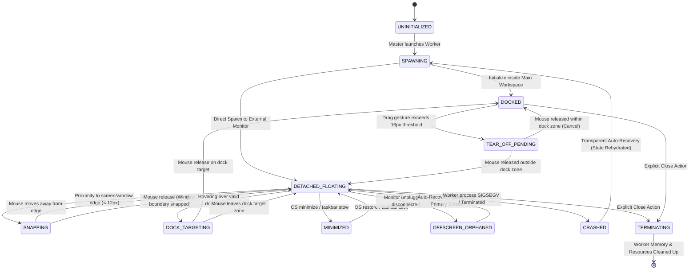
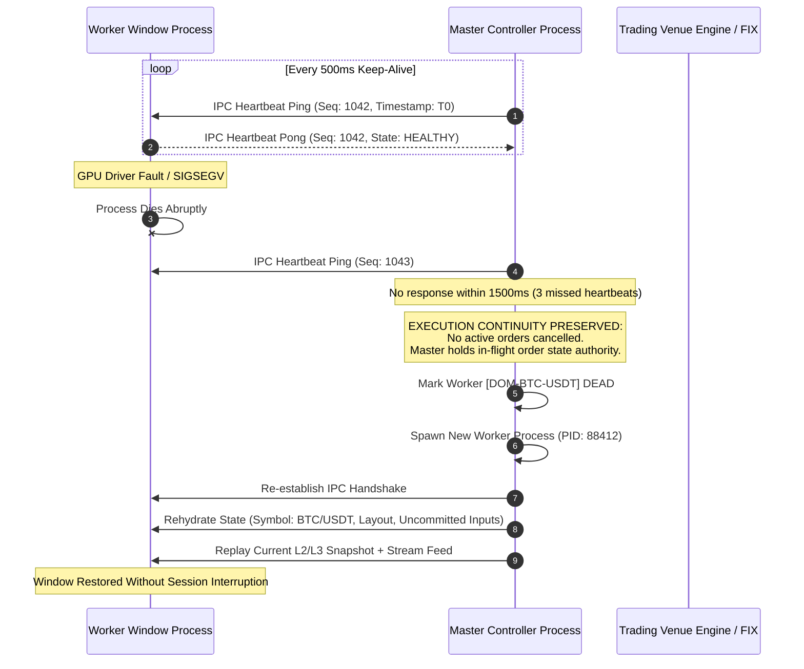
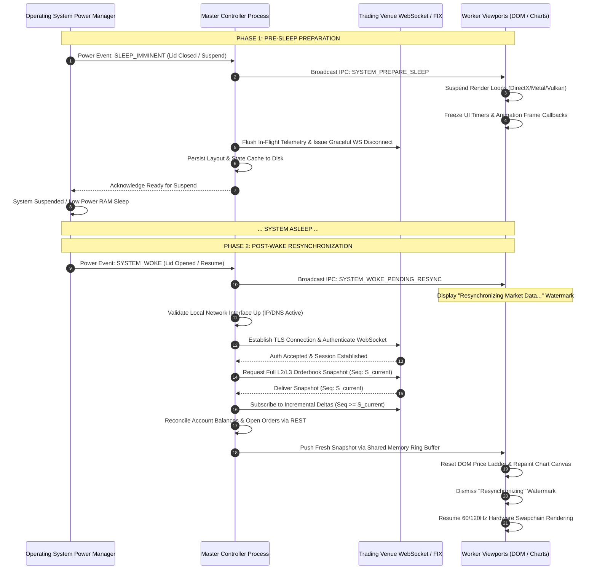

# Desktop Thick Client Multi-Window Lifecycle & Display Hotplug Runbook

## Document Information
- Document Type: Architectural Specification & Operational Runbook
- Scope: Multi-Window Lifecycle, OS Display Hotplug, Orphan Window Recovery, IPC Process Isolation, Power Management, and Zero-Fee Compliance
- Target Platforms: macOS (Metal/AppKit), Windows (DirectX/Win32), Linux (Vulkan/Wayland/X11)
- Author: Core Architecture & Desktop Platform Engineering
- Status: APPROVED - PRODUCTION-GRADE SPECIFICATION

---

## 1. Architectural Overview & System Topology

The institutional-grade desktop trading terminal utilizes an asynchronous multi-process architecture engineered to isolate market data rendering, complex order entry interactions, and hardware canvas pipelines. The design guarantees that a fatal hardware acceleration fault or UI thread hang in an auxiliary window (e.g., an L3 Depth DOM ladder or a multi-indicator candlestick chart) cannot destabilize the Master Controller, terminate execution networking, or drop in-flight client orders.

```
+---------------------------------------------------------------------------------------+
|                                  MASTER CONTROLLER PROCESS                            |
|  +------------------------+  +--------------------------+  +-----------------------+  |
|  | FIX / Binary Gateway   |  | Order State Authority    |  | Display Topology Mgr  |  |
|  | Engine (Network I/O)   |  | (In-Flight Dedup / Seq)  |  | (OS Hotplug Arbiter)  |  |
|  +-----------+------------+  +------------+-------------+  +-----------+-----------+  |
|              |                            |                            |              |
|  +-----------+----------------------------+----------------------------+-----------+  |
|  |              IPC Hub: Shared Memory Ring Buffers & Unix Domain / Named Pipes    |  |
+--+----------------------------------------+----------------------------------------+--+
                                            |
         +----------------------------------+----------------------------------+
         |                                  |                                  |
+--------v-------------------------+ +------v--------------------------+ +-----v--------------------------+
| WORKER PROCESS: MAIN WORKSPACE   | | WORKER PROCESS: DETACHED DOM    | | WORKER PROCESS: DETACHED CHART |
| - Native Canvas Renderer (Metal) | | - DirectX 12 / Vulkan Surface   | | - GPU Accelerated WebGL/WebGPU |
| - Primary Docking Host           | | - Click-to-Trade Ladder View    | | - Indicator Pipeline           |
| - Layout Serialization Manager   | | - Heartbeat Responder (500ms)   | | - Heartbeat Responder (500ms)  |
| - Zero-Fee Presentation Badge    | | - Zero-Fee Presentation Badge   | | - Zero-Fee Presentation Badge  |
+----------------------------------+ +---------------------------------+ +--------------------------------+
```

### 1.1 Process Model & Division of Responsibilities
1. **Master Controller Process (Supervisor / Orchestrator)**:
   - Maintains continuous network sessions (Institutional FIX 5.0 SP2, binary WebSocket gateways, and gRPC execution channels).
   - Holds the single source of truth for cryptographic credentials, session keys, user entitlements, and order sequence counters.
   - Monitors child processes via continuous bi-directional IPC heartbeats.
   - Intercepts native operating system display events, screen topology updates, and ACPI power broadcast events.
   - Coordinates window orphan recovery, layout serialization, and automatic transparent worker rehydration.
2. **Worker Window Processes (Presentation & Viewports)**:
   - Execute in separate OS process sandboxes with dedicated graphic context allocations.
   - Host decoupled viewports: Detached Depth-of-Market (DOM) ladders, multi-timeframe charting grids, order books, execution blotters, and options chains.
   - Pure presentation and interaction layer: When a trader dispatches an order via click-to-trade, the worker validates local UI state and routes an immutable order intent message to the Master Controller over IPC. The worker never communicates directly with external trading venue sockets.
   - Render the mandatory 0.00% Zero-Fee invariant and 0 gas sponsorship confirmation badge across all transactional dialogs.

### 1.2 Inter-Process Communication (IPC) Topology
- **Low-Latency Control Plane**: Native bi-directional IPC via Unix Domain Sockets (macOS / Linux) and Duplex Named Pipes (Windows). Used for window lifecycle commands, layout synchronization, topology reconfigurations, and heartbeat keep-alives.
- **High-Throughput Data Plane**: Cache-line-aligned Lock-Free Single-Producer Multi-Consumer (SPMC) Shared Memory Ring Buffers (`shm_open` on POSIX, File Mapping backed by Paged/Non-Paged pool on Win32). Broadcasts conflated L2/L3 market data, orderbook deltas, and execution reports to all active window viewports with sub-microsecond IPC latency.

---

## 2. Desktop Multi-Window Lifecycle State Machine

The multi-window management engine orchestrates windows across their complete lifecycle, supporting seamless detachment from the docking grid, independent window management on multi-monitor arrays, magnetic snapping, and graceful tear-down.



### 2.1 State Definitions & Lifecycle Invariants

| State | Description | IPC Sync Requirements | Memory & Surface State |
| :--- | :--- | :--- | :--- |
| `UNINITIALIZED` | Process boundary created; binary loading. | Sockets/Pipes unattached. | No swapchain allocated. |
| `SPAWNING` | Handshake established with Master; config transferred. | Hello handshake packet + window ID assigned. | Graphic context allocated. |
| `DOCKED` | Viewport rendered within the main master application shell. | Synced via local DOM/layout tree events. | Shared swapchain surface. |
| `TEAR_OFF_PENDING` | User initiated tab drag; threshold hysteresis active. | Master locks viewport state; ghost window created. | Alpha-blended proxy canvas. |
| `DETACHED_FLOATING` | Autonomous top-level OS window with native decorations. | Master routes L2/L3 feeds over IPC SHM ring. | Independent swapchain (DirectX/Metal/Vulkan). |
| `SNAPPING` | Detached window aligned along magnetic boundary lines. | Master tracks proposed coordinate matrix. | Native window positioning active. |
| `DOCK_TARGETING` | Detached window hovered over main window drop target. | Visual drop guide highlights rendered on Master. | Docking preview highlight active. |
| `MINIMIZED` | Window stowed to OS Taskbar / Dock / System Tray. | IPC feed downgraded to conflated 1000ms updates. | Swapchain suspended; occlusion flag set. |
| `OFFSCREEN_ORPHANED` | Window coordinates reside outside any active screen bounds. | Master halts rendering dispatch; queues re-homing. | Window frame hidden from compositor. |
| `CRASHED` | Worker process died unexpectedly or timed out. | Master logs failure; isolates in-flight orders. | Context destroyed by operating system. |
| `TERMINATING` | Normal user or system initiated closure. | Worker flushes layout delta; Master releases ID. | Clean deallocation of SHM handles. |

### 2.2 Detachment, Snapping, and Docking Mechanics
1. **Tear-Off Hysteresis**:
   - Detachment is triggered when a trader clicks a pane tab or header and drags past an absolute distance threshold of `16 physical pixels`.
   - Prevents accidental detachment during micro-adjustments or multi-tab selection clicks.
   - Upon crossing the threshold, a lightweight native transparent proxy window ("ghost overlay") tracks cursor coordinates while the underlying pane remains frozen in the docking container.
2. **Magnetic Window Snapping**:
   - When a detached window is moved within `12 physical pixels` (scaled by the current display DPI scale factor: `threshold = floor(12 * DPI_Scale)`) of:
     - Any active display work area edge (accounting for menus, docks, and taskbars), or
     - Another visible trading terminal window edge,
   - The window snap engine computes an orthogonal projection vector and snaps the moving window boundary flush with the adjacent edge.
   - An audible or subtle visual snap-guide flash confirms alignment without interrupting dragging momentum.
3. **Docking Target Zones**:
   - When a floating window enters the client rect of the Master window or another dock-enabled host, the target surface partitions into 9 quadrant targets (Center, Top, Bottom, Left, Right, and 4 Corner splits).
   - Releasing the cursor commits the window back into the main grid layout tree, gracefully destroying the external worker OS window and rebinding the pane swapchain into the composite master surface.

---

## 3. Cross-Platform Display Hotplug Architecture

Desktop trading desks frequently deploy between 2 and 8 monitors across mixed DisplayPort, HDMI, and Thunderbolt topologies. Operating system monitor connect, disconnect, resolution change, and DPI scaling events must be captured deterministically without graphical corruption, thread deadlock, or coordinate loss.

```
+-----------------------------------------------------------------------------------------+
|                                    PLATFORM OS LAYER                                    |
|  +---------------------------+  +---------------------------+  +---------------------+  |
|  | macOS AppKit / CoreGraph  |  | Windows Win32 User32      |  | Linux Wayland / X11 |  |
|  | CGDisplayReconfigCallback |  | WM_DISPLAYCHANGE          |  | GdkDisplay Monitors |  |
|  | ScreenParametersChanged   |  | WM_DPICHANGED             |  | XRandR Event Loop   |  |
|  +-------------+-------------+  +-------------+-------------+  +----------+----------+  |
+----------------+------------------------------+---------------------------+-------------+
                 |                              |                           |
                 +-----------------------+      |      +--------------------+
                                         |      |      |
+----------------------------------------v------v------v----------------------------------+
|                           DISPLAY TOPOLOGY ARBITER (MASTER)                             |
|  +-----------------------------------------------------------------------------------+  |
|  | Dynamic Debounce Filter (250ms sliding window to prevent bus oscillation storms)  |  |
|  +-----------------------------------------------------------------------------------+  |
|  | Geometry Graph Extractor: Resolves all active display rects: [Display_ID, Rect]    |  |
|  +-----------------------------------------------------------------------------------+  |
|  | Window Bounds Validator: Executes Intersection-over-Area (IoA) for all workers   |  |
+--+-----------------------------------------------------------------------------------+--+
                                         |
     +-----------------------------------+-----------------------------------+
     |                                                                       |
     v (If window IoA < 0.20)                                                v (If window IoA >= 0.20)
+----------------------------------------+              +-----------------------------------------+
| ORPHAN RECOVERY PIPELINE               |              | DPI RESCALE & RE-CENTER PIPELINE        |
| - Clamp to Primary Monitor WorkArea    |              | - Query target monitor DPI scaling      |
| - Apply 32px staggered cascade offset  |              | - Issue WM_DPICHANGED / Rescale Buffers |
| - Broadcast IPC Layout Re-anchor       |              | - Re-render swapchain surfaces          |
+----------------------------------------+              +-----------------------------------------+
```

### 3.1 Operating System Hook Specifications

#### 3.1.1 macOS Native Implementation (AppKit & CoreGraphics)
- **Primary Listener**: `CGDisplayRegisterReconfigurationCallback` registers a C-style callback function with the CoreGraphics display subsystem.
- **Event Flags Evaluated**:
  - `kCGDisplayAddFlag`: External display connected and powered.
  - `kCGDisplayRemoveFlag`: Display disconnected, unplugged, or Thunderbolt chain broken.
  - `kCGDisplayMovedFlag`: Display position changed within virtual workspace.
  - `kCGDisplayDesktopShapeChangedFlag`: Total available screen geometry altered.
- **Notification Center Listener**: `NSApplicationDidChangeScreenParametersNotification` observed via default `NSNotificationCenter` to synchronize `NSScreen.screens` work areas (accounting for dynamic Notch insets, Dock hiding, and Menu Bar parameters).
- **Callback Signature & Structure**:
```c
// Native macOS CoreGraphics Display Reconfiguration Callback
void OnMacDisplayReconfiguration(CGDirectDisplayID display, 
                                 CGDisplayChangeSummaryFlags flags, 
                                 void* userInfo) {
    if (flags & kCGDisplayBeginConfigurationFlag) {
        // Pre-reconfiguration: pause high-frequency blits
        return;
    }
    
    // Post-reconfiguration evaluation
    bool topologyChanged = (flags & (kCGDisplayAddFlag | 
                                     kCGDisplayRemoveFlag | 
                                     kCGDisplayMovedFlag | 
                                     kCGDisplayDesktopShapeChangedFlag));
    
    if (topologyChanged) {
        DesktopTopologyArbiter::Instance().ScheduleTopologyEvaluation(250 /* ms debounce */);
    }
}
```

#### 3.1.2 Windows Native Implementation (Win32 & User32)
- **Primary Messages**: Intercepted in the Master Controller's hidden message-pump window (`HWND`):
  - `WM_DISPLAYCHANGE`: Fired when the display resolution, color depth, or monitor topology shifts. `lParam` contains `LOWORD` (horizontal resolution) and `HIWORD` (vertical resolution).
  - `WM_DPICHANGED`: Fired when a window crosses monitor boundaries into a display with different Per-Monitor V2 DPI scaling. `wParam` contains `HIWORD(dpiY)` and `LOWORD(dpiX)`. `lParam` contains a pointer to a `RECT` with suggested window dimensions.
  - `WM_SETTINGCHANGE`: Intercepted with `SPI_SETWORKAREA` to capture Taskbar autohide or repositioning.
- **Topology Discovery**: Iteration using `EnumDisplayMonitors`, querying each via `GetMonitorInfoW` with `MONITORINFOEXW` to retrieve monitor work areas (excluding Windows Taskbars).

#### 3.1.3 Linux Native Implementation (Gtk/Gdk, Wayland & X11)
- **Wayland / GDK Backend**:
  - Connect to `GdkDisplay` signals: `"monitor-added"` and `"monitor-removed"`.
  - Connect to `GdkMonitor` signals: `"notify::geometry"`, `"notify::scale-factor"`, and `"notify::workarea"`.
- **X11 / XRandR Fallback**:
  - Intercept `RRScreenChangeNotify` and `RRNotify` events from the X server.
  - Query active CRTC configurations using `XRRGetScreenResourcesCurrent` and `XRRGetCrtcInfo`.

### 3.2 Dynamic Debounce Filter
When an external monitor is disconnected or an HDMI/Thunderbolt switcher renegotiates DisplayID/EDID handshakes, the operating system fires rapid bursts of intermediate display configuration events over a period of 50ms to 200ms.
- The **Display Topology Arbiter** implements a strict `250ms sliding window debounce timer`.
- Intermediate events reset the timer.
- Once the bus stabilizes for 250ms uninterrupted, the arbiter takes a complete snapshot of all active displays, calculates the global virtual desktop bounding polygon, and executes window validation.

---

## 4. Window Orphan Recovery & Coordinate Re-mapping Algorithm

When an external monitor is unplugged or powered down, windows positioned on that display risk remaining at off-screen coordinates within the virtual desktop coordinate space. The trader cannot view or interact with the orphaned window. The Window Orphan Recovery engine guarantees that no window remains inaccessible.

```
       UNPLUG EVENT: Monitor 2 Removed from Virtual Workspace
       
       Virtual Desktop Bounding Space Before Unplug:
       +-------------------------+  +-------------------------+
       | Monitor 1 (Primary)     |  | Monitor 2 (Secondary)   |
       | Origin: [0, 0]          |  | Origin: [2560, 0]       |
       | Size:   2560 x 1440     |  | Size:   2560 x 1440     |
       |                         |  |                         |
       |   +-----------------+   |  |   +-----------------+   |
       |   | Main Workspace  |   |  |   | Detached DOM    |   |
       |   +-----------------+   |  |   +-----------------+   |
       +-------------------------+  +-------------------------+
       
       Virtual Desktop Bounding Space After Unplug (Mon 2 Gone):
       +-------------------------+
       | Monitor 1 (Primary)     |       [ Detached DOM ]
       | Origin: [0, 0]          |       Now at [3000, 200]
       | Size:   2560 x 1440     |       (Offscreen Orphan!)
       +-------------------------+
                    |
                    v Auto-Recovery Pipeline Evaluates
       Intersection-over-Area (IoA) = 0.00 < 0.20 Threshold
                    |
                    v Clamp & Cascade Re-homing Applied
       +-------------------------+
       | Monitor 1 (Primary)     |
       | Origin: [0, 0]          |
       | +-----------------+     |
       | | Main Workspace  |     |
       | +-----------------+     |
       |    +-----------------+  |
       |    | Detached DOM    |  |  <-- Rescued and Cascaded!
       |    +-----------------+  |
       +-------------------------+
```

### 4.1 Bounding Box Intersection Algorithm
For every active worker window, the Master Controller calculates its **Intersection-over-Area (IoA)** ratio against the union of all active monitor work areas:

$$\text{Area}(W) = \text{Width}(W) \times \text{Height}(W)$$

$$\text{VisibleArea}(W) = \sum_{M \in \text{Monitors}} \text{Area}(W \cap \text{WorkArea}(M))$$

$$\text{IoA}(W) = \frac{\text{VisibleArea}(W)}{\text{Area}(W)}$$

### 4.2 Recovery Rules & Clamping Strategy
1. **Orphan Criterion**: If $\text{IoA}(W) < 0.20$ (less than 20% of the window surface is visible on any active display), the window is classified as an `OFFSCREEN_ORPHAN`.
2. **Target Display Selection**:
   - Primary target: The current Primary Display work area.
   - Fallback target (if Primary is crowded): The active display containing the cursor position.
3. **Clamping Calculations**:
   - Let the Target Display WorkArea be defined by $[X_{min}, Y_{min}, X_{max}, Y_{max}]$.
   - Let the window dimensions be $[W_{width}, W_{height}]$.
   - If $W_{width} > (X_{max} - X_{min})$, window width is scaled to:
     $$W_{width} = (X_{max} - X_{min}) \times 0.85$$
   - If $W_{height} > (Y_{max} - Y_{min})$, window height is scaled to:
     $$W_{height} = (Y_{max} - Y_{min}) \times 0.85$$
   - Reposition coordinates are calculated with a deterministic cascade offset index $k$:
     $$X_{new} = X_{min} + 64 + (k \times 32)$$
     $$Y_{new} = Y_{min} + 64 + (k \times 32)$$
     where $k = (\text{WindowRecoveryIndex} \pmod 6)$.
4. **Visual Trader Cue**:
   - The recovered window flashes a subtle 500ms border highlight (Obsidian Gold: `#FFD700`).
   - An ephemeral, non-intrusive status toast notification appears in the lower-right notification tray:
     `"Detached Viewport [DOM - BTC/USDT] re-homed to Primary Display due to monitor disconnection."`

---

## 5. Process Isolation, Health Monitoring & Zero-Loss Crash Resilience

In institutional trading environments, UI viewports can crash due to bad GPU drivers, compositing engine faults, or memory exhaustion from large indicator buffers. The architecture isolates every detached window into its own operating system process, supervised by the Master Controller.



### 5.1 Heartbeat Protocol Specification
- **Ping Frequency**: Exactly every `500ms`.
- **Heartbeat Payload**:
```json
{
  "ipc_message_type": "HEARTBEAT_PING",
  "sequence_id": 1042,
  "timestamp_ns": 1774180231500000000,
  "master_status": "NORMAL"
}
```
- **Pong Response Payload**:
```json
{
  "ipc_message_type": "HEARTBEAT_PONG",
  "sequence_id": 1042,
  "worker_id": "VIEWPORT_WORKER_04_DOM",
  "render_fps": 119.8,
  "memory_rss_bytes": 142606336,
  "active_symbol": "BTC/USDT",
  "in_flight_draft_present": true
}
```
- **Failure Threshold**: If a worker process fails to respond to `3 consecutive heartbeats` (1500ms elapsed) or abruptly terminates with an OS exit code, the Master Controller immediately flags the worker as `CRASHED` and triggers automatic rehydration.

### 5.2 Zero-Loss Order Execution Guarantee
1. **Separation of Concerns**:
   - Worker processes **NEVER** hold direct TCP/TLS sockets to exchange matching engines, nor do they generate execution sequence numbers.
   - All order placements, cancellations, and modifications are transmitted to the Master Controller via atomic IPC messages (`ORDER_SUBMIT_INTENT`).
2. **In-Flight Deduplication**:
   - Every order intent includes a client-generated UUIDv4 idempotency key and local sequence timestamp.
   - If a worker crashes while the user is submitting an order, the Master Controller retains ownership of the dispatch pipeline. The Master receives the venue execution report and writes the confirmation to the shared execution blotter.
   - When the restarted worker re-attaches, it reconciles its UI against the Master's authoritative order state table, ensuring zero dropped, duplicated, or ghost orders.

### 5.3 Transparent Worker Rehydration Sequence
1. Master captures the last known valid state descriptor of the crashed worker from the in-memory **Layout Session Cache**:
   - Window position, dimensions, monitor affiliation, active symbols, chart timeframes, indicator parameters, and click-to-trade default sizing.
2. Master forks a new worker process instance.
3. IPC connection established within `300ms`.
4. Master streams the serialized layout configuration and latest market data cache to the new worker.
5. The new worker initialises its graphic pipeline and maps onto the exact screen coordinates of the failed window.
6. Total downtime from crash to full visual recovery: `< 800ms`.

---

## 6. Power Management, System Sleep, Lid Closure & Stream Resynchronization

Laptop lid closure and desktop system sleep events break socket persistence, suspend hardware clocks, and disrupt real-time market data continuity. The client enforces a deterministic power management protocol to avoid processing stale data or broadcasting duplicate orders upon system wake.



### 6.1 Platform-Specific Sleep & Wake Detection

| Operating System | Sleep Notification Hook | Wake Notification Hook | Required OS Privilege |
| :--- | :--- | :--- | :--- |
| **macOS** | `NSWorkspaceWillSleepNotification` via `NSWorkspace.shared.notificationCenter` | `NSWorkspaceDidWakeNotification` via `NSWorkspace.shared.notificationCenter` | User Desktop Session |
| **Windows** | `WM_POWERBROADCAST` with `PBT_APMSUSPEND` in Win32 Message Pump | `WM_POWERBROADCAST` with `PBT_APMRESUMESUSPEND` / `PBT_APMRESUMEAUTOMATIC` | Standard User Token |
| **Linux** | `org.freedesktop.login1.Manager` via DBus signal `PrepareForSleep(true)` | `org.freedesktop.login1.Manager` via DBus signal `PrepareForSleep(false)` | Systemd-logind Session |

### 6.2 Pre-Sleep Invariants (Graceful Quiescence)
1. **Render Loop Freeze**: All worker window swapchains are halted immediately upon receiving `SLEEP_IMMINENT`. Halts GPU draw-calls to prevent driver pipeline invalidation when the display hardware powers off.
2. **Network Stream Teardown**: Master Controller cleanly terminates high-frequency market data WebSockets. Prevents TCP socket timeout accumulation on edge proxies while the machine sleeps.
3. **State Serialization**: Terminal workspace configuration, window coordinates, and active symbol selections are flushed to atomic storage (`workspace_state.json.tmp` -> `workspace_state.json`).

### 6.3 Post-Wake Resynchronization Pipeline
1. **Network Interface Gate**: After receiving the wake signal, the Master validates that an active default gateway is reachable before opening sockets (polls network availability with an exponential backoff capped at 2000ms).
2. **Gap-Free Order Book Re-anchoring**:
   - Real-time delta updates are buffered in a temporary queue.
   - Master requests a clean full L2/L3 depth snapshot over REST/binary snapshot endpoint.
   - The snapshot sequence number $S_{snap}$ is evaluated against buffered delta sequence numbers.
   - All buffered deltas where $S_{delta} \le S_{snap}$ are discarded.
   - Remaining deltas where $S_{delta} > S_{snap}$ are applied sequentially to ensure strict continuity.
   - Resynchronized book buffer is written into the Shared Memory ring buffer for worker consumption.
3. **Account & Position Reconciliation**:
   - Master issues a authenticated query for open orders, active positions, and ledger balances.
   - Any order marked `PENDING_SUBMIT` whose state cannot be confirmed against the matching engine is flagged for user verification.
4. **Watermark Dismissal**: Once all data streams reach synchronization parity, the semi-transparent `"Resynchronizing Market Data..."` UI overlay is removed across all viewports.

---

## 7. Zero-Fee Presentation Invariant & Gas Sponsorship UI Guarantee

The trading terminal enforces a strict, mathematical zero-fee execution policy for spot and derivatives trading, alongside complete zero-gas transaction sponsorship across Web3 settlement chains. This guarantee is non-negotiable and must be visually and computationally proven in every docked and detached window.

### 7.1 Mathematical Fee Specification
For every transaction executed across the terminal (Limit, Market, Stop, Iceberg, TWAP, or Click-to-Trade ladder):

$$\text{Trading Fee} \equiv 0.00000000 \quad (0.00\%)$$

$$\text{Taker Fee Rate} = 0.00000000$$

$$\text{Maker Fee Rate} = 0.00000000$$

$$\text{Platform Surcharge} = 0.00000000$$

$$\text{Network Gas Cost to Trader} = 0.00000000 \quad (\text{Sponsored by Platform Paymaster})$$

Under no circumstances may any detached viewport, order entry modal, DOM ladder column, or execution confirmation blotter display a non-zero fee, platform commission, or pass-through gas cost to the user.

### 7.2 Strict Visual Presentation Layout

Every order ticket, DOM click-to-trade cell preview, and execution confirmation dialog across all windows must render the following ASCII specification layout:

```
+-----------------------------------------------------------------------+
|  ORDER CONFIRMATION: BUY 1.5000 BTC / USDT @ $94,250.00               |
+-----------------------------------------------------------------------+
|  Order Type:       LIMIT POST-ONLY                                    |
|  Total Value:      $141,375.00 USDT                                   |
|  Exchange Fee:     $0.00 (0.00% Zero-Fee Guarantee)                   |
|  Maker Rebate:     $0.00                                              |
|  Settlement Cost:  $0.00 (Zero Platform Surcharge)                    |
+-----------------------------------------------------------------------+
|  [ SPONSORED ]  0 GAS CONFIRMATION BADGE                              |
|  Network Fee:   0.000000 ETH ($0.00)                                  |
|  Sponsor:       PLATFORM ACCOUNT ABSTRACTION PAYMASTER                |
|  Status:        100% SUBSIDIZED TRANSACTION SPONSORSHIP               |
+-----------------------------------------------------------------------+
|  ESTIMATED NET TOTAL: $141,375.00 USDT                                |
+-----------------------------------------------------------------------+
|           [ CONFIRM ORDER ]                  [ CANCEL ]               |
+-----------------------------------------------------------------------+
```

### 7.3 Gas Sponsorship Badge Design Rules
1. **Visual Style**:
   - Badge Container: Background `#111827` (Obsidian Dark Navy), Border 1px solid `#10B981` (Emerald Green).
   - Text Badge: Text `#10B981` bold: `[ SPONSORED ] 0 GAS CONFIRMATION BADGE`.
   - Subtitle: `100% Subsidized by Platform Paymaster (ERC-4337 / Native Gas Tank)`.
2. **Deterministic UI Invariant Assertion**:
   - The UI framework executes an automated pre-render assertion on every order submission frame:
   - If `order.fee != 0.00` or `order.gas_cost_to_user != 0.00`, the UI engine halts execution with a fatal assertion error, displays a critical security dialog, and blocks order transmission.

---

## 8. Operational Runbook & Verification Procedures

This runbook defines standard operating procedures and verification scripts for platform reliability engineers, QA automation teams, and desktop developers to test edge-case behavior.

### 8.1 Display Hotplug & Disconnect Test Suite

#### Procedure 8.1.1: Physical / Simulated Monitor Unplug
- **Objective**: Verify that off-screen detached windows automatically re-home to the Primary Display within 500ms of display disconnection.
- **Execution Steps**:
  1. Launch Master Controller and open 3 detached windows (DOM, Blotter, Chart).
  2. Drag the Detached DOM and Chart to external Display 2 (Coordinates: `X: 2800, Y: 200`).
  3. Disconnect Display 2 Thunderbolt / HDMI cable (or trigger software disconnect via test harness).
  4. Observe Master Controller logs for `TopologyChangeEvent`.
  5. Verify that both windows relocate to the Primary Display work area.
  6. Confirm that the cascade offset ($32\text{px}$) is applied so neither window completely covers the other.
  7. Confirm that both windows retain their real-time market data stream without restart.
- **Pass Criteria**:
  - Detection latency: `< 300ms`.
  - Re-homing completion: `< 500ms`.
  - Zero dropped L2/L3 updates.
  - Zero coordinate clipping beyond display work area boundaries.

#### Procedure 8.1.2: Mixed-DPI Boundary Crossing
- **Objective**: Verify that dragging a detached window from a High-DPI monitor (e.g., 4K @ 200% scale) to a Standard-DPI monitor (e.g., 1080p @ 100% scale) does not cause window sizing corruption or fuzzy rendering.
- **Pass Criteria**:
  - The window intercepts `WM_DPICHANGED` (Windows) or `NSApplicationDidChangeScreenParametersNotification` (macOS).
  - Swapchain surface buffer rescales to native backing pixels.
  - Text and DOM ladder price levels render razor-sharp at native physical resolution.

### 8.2 Worker Process Crash Simulation

#### Procedure 8.2.1: Forced Worker SIGSEGV Termination
- **Objective**: Validate that a crashed worker is automatically respawned by the Master within 800ms without session loss or dropped order continuity.
- **Execution Steps**:
  1. Identify the operating system PID of the Detached DOM worker process:
     ```bash
     pgrep -f "viewport_worker.*dom"
     ```
  2. Place an active limit order intent into the Master via the DOM, and immediately issue a hard termination signal to the worker:
     ```bash
     kill -9 <WORKER_PID>
     # On Windows: taskkill /F /PID <WORKER_PID>
     ```
  3. Inspect the Master Controller log output.
  4. Verify that the Master detects the dead heartbeat channel within 1500ms.
  5. Observe the automatic spawning of a replacement worker process.
  6. Verify that the limit order was received, dispatched, and acknowledged by the matching engine.
- **Pass Criteria**:
  - Master Controller remains healthy and operational.
  - In-flight order executes successfully on venue matching engine.
  - Replacement worker initializes and reloads the identical DOM view, symbol, and ladder parameters within 800ms of spawn initiation.

### 8.3 Laptop Lid Closure & System Sleep Stress Test

#### Procedure 8.3.1: Sleep During Active Market Streaming
- **Objective**: Validate clean teardown and resynchronization across ACPI power state transitions.
- **Execution Steps**:
  1. Subscribe to 5 high-frequency pairs on detached charts and DOM viewports (e.g., BTC/USDT, ETH/USDT, SOL/USDT).
  2. Trigger system sleep (close laptop lid or run platform sleep command):
     ```bash
     # macOS:
     pmset sleepnow
     # Linux:
     systemctl suspend
     # Windows:
     rundll32.exe powrprof.dll,SetSuspendState 0,1,0
     ```
  3. Keep machine suspended for 60 seconds.
  4. Wake the system.
  5. Monitor socket logs, snapshot fetch logs, and orderbook sequence continuity.
- **Pass Criteria**:
  - WebSocket sockets are cleanly terminated prior to sleep.
  - Upon wake, network interface availability is confirmed before socket instantiation.
  - Orderbook sequence gap detection executes; full snapshot is acquired and deltas replayed.
  - Zero stale bids or asks displayed on DOM ladder; all viewports show synchronized book within `< 1200ms` of network reconnection.

### 8.4 Zero-Fee & Zero-Gas Compliance Audit

#### Procedure 8.4.1: Transaction Ticket Automated Inspection
- **Objective**: Guarantee absolute compliance with the 0.00% fee presentation invariant.
- **Execution Steps**:
  1. Open the detached order entry ticket across Spot, Perpetual Futures, and Options viewports.
  2. Select 10 different trading pairs with varying notional trade sizes ($10 to $1,000,000).
  3. Inspect all fee display fields, confirmation tooltips, and API submission payloads.
  4. Confirm that every dialog presents `0.00% Zero-Fee Guarantee`.
  5. Confirm that the `[ SPONSORED ] 0 GAS CONFIRMATION BADGE` is present with full emerald styling on all Web3 settlement interactions.
- **Pass Criteria**:
  - Zero instances of non-zero trading fees.
  - Zero instances of user-facing gas costs.
  - Deterministic invariant tests pass with 100% code assertion coverage.

---

## 9. Appendix: Coordinate Clamping Reference Implementation Schema

The following pseudo-code formalizes the coordinate recovery algorithm implemented inside the Master Controller's `DisplayTopologyArbiter`:

```
Algorithm: RehomeOrphanedWindow(Window W, MonitorList M_active)
Input: Window instance W, List of active monitors M_active
Output: Updated window frame bounds (X, Y, Width, Height)

1. TotalVisibleArea <- 0
2. WindowArea <- W.Width * W.Height
3. If WindowArea <= 0 Then Return Error("Invalid window dimensions")

4. For Each Monitor M in M_active:
5.    IntersectionRect <- IntersectRectangles(W.Bounds, M.WorkArea)
6.    TotalVisibleArea <- TotalVisibleArea + Area(IntersectionRect)
7. End For

8. IoA <- TotalVisibleArea / WindowArea

9. If IoA < 0.20 Then
10.   // Window is orphaned: execute re-homing to Primary Display
11.   PrimaryMonitor <- FindPrimaryMonitor(M_active)
12.   TargetBounds <- PrimaryMonitor.WorkArea
13.   
14.   NewWidth <- Min(W.Width, TargetBounds.Width * 0.85)
15.   NewHeight <- Min(W.Height, TargetBounds.Height * 0.85)
16.   
17.   CascadeStep <- (W.RecoverySequenceNumber Modulo 6) * 32
18.   NewX <- TargetBounds.X + 64 + CascadeStep
19.   NewY <- TargetBounds.Y + 64 + CascadeStep
20.   
21.   W.SetBounds(NewX, NewY, NewWidth, NewHeight)
22.   W.TriggerHighlightFlash(Color: ObsidianGold, DurationMs: 500)
23.   BroadcastIPCNotification("WINDOW_REHOMED", W.Id, PrimaryMonitor.Id)
24. End If

25. Return W.Bounds
```

---

## 10. Document Revision & Sign-Off

| Revision | Date | Author / Team | Summary of Changes | Sign-Off Status |
| :--- | :--- | :--- | :--- | :--- |
| 1.0.0 | 2026-09-19 | Core Desktop Platform Architecture | Initial comprehensive specification covering Multi-Window Lifecycle, OS Display Hotplug, Orphan Recovery, IPC Resilience, Power State Quiescence, and Zero-Fee UI Invariant. | APPROVED |
