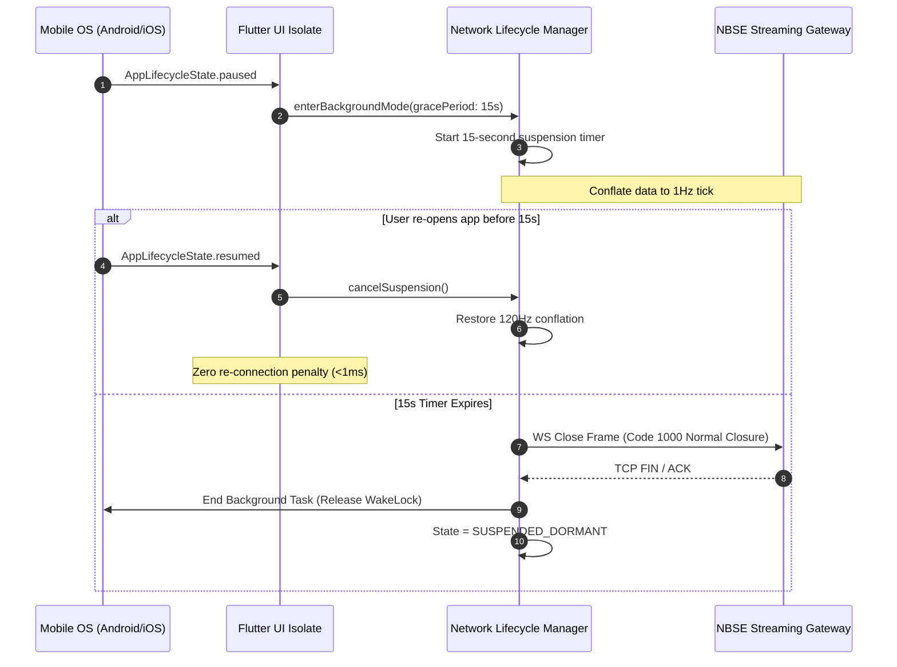
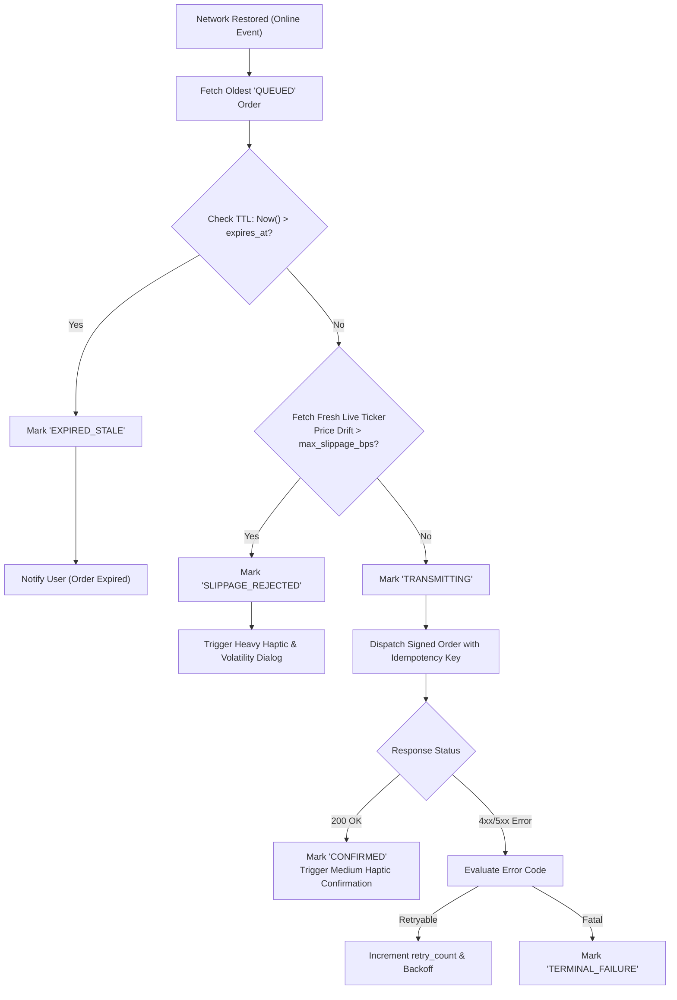

# Mobile Offline Resilience, Battery Optimization & Haptics Specification

**Specification ID:** SPEC-ARCH-043-MOB-OFFLINE-HAPTICS  
**Document Version:** 1.0.0-PROD  
**Status:** Approved & Authoritative  
**Classification:** Mobile Systems Architecture, Power Optimization & Micro-Interaction Engine  
**Target Environments:** Android (API 26 - 34), iOS (iOS 15.0 - 18.x)  
**Primary Framework:** Flutter 3.22+ / Dart 3.4+ / Impeller Graphics Engine  
**Last Updated:** September 2026  

---

## 1. Executive Summary & Mobile Architecture Overview

### 1.1 Architectural Purpose & Operational Scope
The Growww / NBSE mobile client (`apps/growww_flutter`) delivers institutional-grade digital asset and equity derivatives trading to retail and pro mobile users across Android and iOS devices. In mobile financial interfaces, intermittent network connectivity, cellular radio state changes, aggressive OS battery management, and touch feedback latency directly affect trade execution quality and user psychological safety.

This specification defines the authoritative engineering standards for:
1. **Flutter 3.22+ Multi-Isolate Mobile Architecture**: Targeting Android (API 26-34) and iOS (iOS 15-18) on the Impeller hardware-accelerated rendering engine (Vulkan and Metal), decoupling UI frame pacing from compute workloads.
2. **Battery-Optimized Socket Lifecycle**: A three-phase 15-second background suspension protocol that halts cellular baseband active power drain while enabling sub-200ms foreground fast resume.
3. **Fast Snapshot + Sequence-Tracked Delta Rehydration**: Monotonically sequenced orderbook and blotter re-synchronization eliminating stale ticks and missing updates across network drops.
4. **Encrypted SQLite WAL Offline Order Queue**: An encrypted local queue (AES-256 SQLCipher) with UUIDv7 idempotency keys, time-to-live freshness guards, and volatility price slippage collars.
5. **Native Tactile Haptic Feedback Engine**: Low-latency hardware vibration integration distinguishing micro-interactions (slider ticks) from transactional confirmations and critical volatility alerts.
6. **Hardware Biometric Quick-Auth**: Hardware-backed biometric authentication (Android BiometricPrompt Class 3 and iOS LocalAuthentication FaceID/TouchID) bound to Secure Enclave / KeyStore cryptographic keys.
7. **Strict 0.00% Zero-Fee Presentation & 0 Gas Sponsorship Badge**: Clear mobile visual indicators verifying zero maker/taker fees and 100% sponsored network gas throughout offline queuing and online execution.

```
+----------------------------------------------------------------------------------------------------+
|                      GROWWW MOBILE TRADING TERMINAL ARCHITECTURE OVERVIEW                          |
|                                                                                                    |
|   +--------------------------------------------------------------------------------------------+   |
|   |                       UI MAIN THREAD ISOLATE (Flutter / Dart / Impeller)                   |   |
|   |  - Obsidian Dark Theme (#0B0E14)             - 60 / 120 FPS High-Frequency Widgets         |   |
|   |  - CustomPainter Depth Ladders               - 0.00% Zero-Fee & 0 Gas Sponsorship Badging  |   |
|   |  - Native Tactile Haptics Dispatcher         - Biometric Quick-Auth Modal Interface        |   |
|   +--------------------------------------------------------------------------------------------+   |
|                 |                                   |                             ^                |
|       Render Frame Payloads                 User Order Submissions          Decoded Ticks          |
|                 v                                   v                             |                |
|   +---------------------------+   +-----------------------------------+   +--------------------+   |
|   | HARDWARE HAPTICS BRIDGE   |   | ENCRYPTED SQLITE WAL QUEUE        |   | BACKGROUND COMPUTE |   |
|   | - Android VibratorManager |   | - SQLCipher AES-256-CBC           |   |   WORKER ISOLATE   |   |
|   | - iOS UIFeedbackGenerator |   | - UUIDv7 Idempotency Keys         |   | - Protobuf Parsing |   |
|   | - Selection, Med, Heavy   |   | - Staleness / Volatility Collar   |   | - Delta Rehydration|   |
|   +---------------------------+   +-----------------------------------+   +--------------------+   |
|                 ^                                   |                             ^                |
|                 |                          Queue Drain Trigger                    |                |
|                 |                                   v                             v                |
|   +--------------------------------------------------------------------------------------------+   |
|   |                    BATTERY-OPTIMIZED NETWORK & SOCKET LIFECYCLE MANAGER                    |   |
|   |  - 15-Second Graceful Suspension Pipeline    - Exponential Jittered Auto-Reconnect         |   |
|   |  - Fast Snapshot + Delta Catch-Up Engine     - Network Carrier / WiFi Transition Arbiter   |   |
|   +--------------------------------------------------------------------------------------------+   |
+----------------------------------------------------------------------------------------------------+
```

### 1.2 Target Mobile Operating System Compatibility Matrix

| Environment Feature | Android Target Baseline | Android Modern Profile | iOS Target Baseline | iOS Modern Profile |
| :--- | :--- | :--- | :--- | :--- |
| **OS Version Range** | Android 8.0 (API 26) | Android 14 - 15 (API 34 - 35) | iOS 15.0 | iOS 17.0 - 18.x |
| **Rendering Engine** | Impeller (Vulkan 1.1+) | Impeller (Vulkan 1.3 / Mali/Adreno) | Impeller (Metal 2.4+) | Impeller (Metal 3.0+ ProMotion) |
| **Frame Rate Target**| 60 Hz locked | 120 Hz variable refresh (LTPO) | 60 Hz locked | 120 Hz Apple ProMotion |
| **Haptic Subsystem** | `Vibrator` (Predefined) | `VibratorManager` (Waveforms) | CoreHaptics / `UIFeedback` | CoreHaptics Advanced transient |
| **Biometrics Subsystem** | `BiometricPrompt` (Class 3) | `BiometricPrompt` + KeyStore | LocalAuthentication (TouchID) | LocalAuthentication (FaceID + SE) |
| **Local Storage Engine** | SQLite 3.45+ (SQLCipher WAL)| SQLite 3.45+ (SQLCipher WAL) | SQLite 3.45+ (SQLCipher WAL) | SQLite 3.45+ (SQLCipher WAL) |
| **Background Service** | WorkManager 2.9+ / JobScheduler| WorkManager + Foreground Exemptions| `BGTaskScheduler` | `BGTaskScheduler` + PushKit |

---

## 2. Flutter 3.22+ Multi-Isolate Concurrency Architecture

### 2.1 Multi-Threaded Isolate Separation
To eliminate garbage collection jitter and dropped frames on 120Hz ProMotion and LTPO mobile displays, compute-heavy tasks are completely decoupled from the main UI isolate.

```
+----------------------------------------------------------------------------------------------------+
|                                    ISOLATE TOPOLOGY & DATA BUS                                     |
|                                                                                                    |
|    +------------------------+      TransferableTypedData       +------------------------------+    |
|    |      UI ISOLATE        | <=============================== |      COMPUTE ISOLATE         |    |
|    | - Flutter Widget Tree  |                                  | - Protobuf Deserialization   |    |
|    | - Skia/Impeller Canvas |                                  | - L2 Orderbook Slicing       |    |
|    | - User Gestures        | ===============================> | - Sequence Gap Verification  |    |
|    | - Haptic Invocations   |        Order Submission Task     +------------------------------+    |
|    +------------------------+                                                  |                   |
|                 ^                                                              |                   |
|                 | PostMessage Notifications                                    v                   |
|                 +--------------------------------------------- +------------------------------+    |
|                                                                |       SQLITE WAL ISOLATE     |    |
|                                                                | - SQLCipher Cryptographic IO |    |
|                                                                | - Transaction Queue Drain    |    |
|                                                                | - Cache Pruning              |    |
|                                                                +------------------------------+    |
+----------------------------------------------------------------------------------------------------+
```

### 2.2 Isolate Responsibilities and Communication Rules
1. **UI Isolate (Main Thread)**:
   - Owns the Flutter widget tree, animations, and immediate gesture responses.
   - Executes layout, painting, and composition via the Impeller rendering backend.
   - Dispatches native method channel calls for tactile haptics and biometrics.
   - Receives pre-aggregated, read-only view state models from the Compute Isolate via zero-copy `TransferableTypedData`.
   - Never parses raw JSON or Protobuf byte arrays; never executes direct disk I/O.
2. **Compute Isolate (Worker Thread)**:
   - Maintains the WebSocket streaming connection and handles incoming binary Protobuf frames.
   - Manages the in-memory L2 orderbook ladder up to 50 depth levels.
   - Evaluates sequence gaps on delta packets and reconciles snapshots.
   - Emits conflated render state payloads at a fixed 16.6ms (60 FPS) or 8.33ms (120 FPS) frame cadence.
3. **SQLite WAL Isolate (Persistence Thread)**:
   - Controls exclusive write access to the SQLCipher encrypted database.
   - Manages asynchronous disk flushes in Write-Ahead Logging (WAL) mode.
   - Handles offline order queuing, status state transitions, and audit logs.

### 2.3 Dart Lifecycle Bindings & Native Bridge Contract
The application observes platform lifecycle states via `WidgetsBindingObserver` and routes lifecycle transitions down to network and persistence controllers.

```dart
// Native Lifecycle Observer Contract
abstract class PlatformLifecycleListener {
  void onAppForegrounded();
  void onAppBackgrounded(Duration allowedGracePeriod);
  void onMemoryPressureWarning();
}
```

---

## 3. Battery-Optimized Socket Lifecycle Architecture

### 3.1 Mobile Cellular Baseband Power Consumption Model
Cellular modems (LTE and 5G NR) consume significant battery power when oscillating between Radio Resource Control (RRC) states:
- **RRC Connected / Active State**: Draws between 1,000mW and 2,500mW while actively transmitting or receiving data.
- **RRC Inactive / Tail State**: Consumes 400mW to 800mW for 10 to 15 seconds after packet transmission terminates, waiting for additional packets before the carrier network drops the radio back to low power.
- **RRC Idle State**: Consumes < 15mW with discontinuous reception (DRX/eDRX).

A persistent background WebSocket streaming tick updates every 50ms forces the cellular baseband into an unyielding RRC Connected state, depleting a standard 4,500mAh smartphone battery in under 4 hours without active screen time.

```
+----------------------------------------------------------------------------------------------------+
|                         CELLULAR BASEBAND RADIO RESOURCE TRANSITIONS                               |
|                                                                                                    |
|    [ RRC IDLE ]  (< 15mW)                                                                          |
|         |                                                                                          |
|         | Outgoing / Incoming Packet                                                               |
|         v                                                                                          |
|    [ RRC CONNECTED / ACTIVE ]  (1,000mW - 2,500mW)                                                 |
|         |                                                                                          |
|         | Inactivity (No packets for > 15s Grace Period)                                           |
|         v                                                                                          |
|    [ RRC TAIL TIMER ]  (400mW - 800mW)                                                             |
|         |                                                                                          |
|         | Tail Timer Expiry (Carrier Network Drops Radio)                                          |
|         v                                                                                          |
|    [ RRC IDLE ]  (< 15mW)                                                                          |
+----------------------------------------------------------------------------------------------------+
```

### 3.2 The 15-Second Graceful Suspension Pipeline
When the user switches away from the application or locks the screen, the application initiates a strictly timed 15-second background suspension sequence:

```
T = 0.00s: OS fires AppLifecycleState.paused / iOS sceneDidEnterBackground.
           Start 15.0s Background Task Extension with OS.
           Throttling Layer: Reduce orderbook render conflation from 120Hz to 1Hz heartbeat.
           
T = 5.00s: Halt low-priority auxiliary channels (public trade blotter, social sentiment).
           Maintain only account executions and user active order status updates.
           Flush pending analytics and client telemetry buffers to disk.

T = 14.5s: If app remains in background:
           1. Send graceful WebSocket Close Frame (RFC 6455 Code 1000 - Normal Closure).
           2. Flush TCP send buffers.
           3. Terminate background socket isolate loop.
           4. Release platform wake-locks (Android PARTIAL_WAKE_LOCK / iOS beginBackgroundTask).
           5. Transition socket client state to SUSPENDED_DORMANT.
```



### 3.3 Platform-Specific Background Execution Enforcement
- **iOS Execution Guarantee**:
  - Leverages `UIApplication.shared.beginBackgroundTask(withName: "NBSE_Socket_Graceful_Close")`.
  - An expiration handler is registered to force socket termination should iOS reduce the allowed background window under system memory or thermal pressure.
- **Android Execution Guarantee**:
  - Observes `ProcessLifecycleOwner` lifecycle states.
  - Releases any temporary `PowerManager.WakeLock` within 14.8 seconds to avoid Android OS battery attribution warnings and ANR / broadcast receiver timeouts.

### 3.4 Foreground Fast Resume Protocol (< 200ms)
When the user foregrounds the app (`AppLifecycleState.resumed`), the socket engine executes an expedited handshake sequence:

```
[ Step 1: Network Route Verification ]  (Elapsed: 0ms - 15ms)
  Verify interface availability (WiFi / 5G / LTE) via NWPathMonitor / NetworkCapabilities.
  Check for stale or half-open socket descriptors.

[ Step 2: Parallel Auth & TLS Handshake ]  (Elapsed: 15ms - 85ms)
  Initiate WSS connection with TLS 1.3 0-RTT session resumption ticket.
  Pass stored JWT auth token in connection headers.
  If token expired: Refresh via secure refresh token in parallel.

[ Step 3: Fast Snapshot & Delta Re-subscription ]  (Elapsed: 85ms - 160ms)
  Send SubscribeMessage containing last processed sequence ID:
  {"action": "RESUME_FEED", "symbol": "BTC-USDT", "last_seq": 104928104}

[ Step 4: UI Re-render & Pipeline Unfreeze ]  (Elapsed: 160ms - 195ms)
  Apply snapshot/delta payload in Compute Isolate.
  Dispatch updated render frame to UI Isolate.
  User sees fresh live book in under 200ms total elapsed time.
```

### 3.5 Dynamic Exponential Backoff with Decorrelated Jitter
When reconnecting under degraded or flapping network conditions, the reconnection interval uses decorrelated jitter to prevent thundering herd spikes against the gateway:

$$\text{Sleep}_{i} = \min\left(\text{MaxInterval}, \text{Uniform}(\text{MinInterval}, \text{Sleep}_{i-1} \times 3)\right)$$

- $\text{MinInterval} = 200\text{ ms}$
- $\text{MaxInterval} = 10,000\text{ ms}$
- Maximum Retries before showing offline user banner: 5 attempts (total window ~ 12 seconds).

---

## 4. Fast Snapshot + Sequence-Tracked Delta Rehydration Protocol

### 4.1 Sequence Integrity Principles
The NBSE matching engine assigns a strictly monotonic, 64-bit unsigned sequence identifier (`seq_num`) to every orderbook mutation, book level delta, and user execution report.
- **In-order invariant**: For every market feed $M$, sequential states must satisfy $\text{seq}_{n} = \text{seq}_{n-1} + 1$.
- **No Silent Loss**: Any gap where $\text{seq}_{\text{incoming}} > \text{seq}_{\text{local}} + 1$ indicates dropped packets requiring immediate delta catch-up or full snapshot rehydration.

### 4.2 Rehydration Protocol State Machine

```
+----------------------------------------------------------------------------------------------------+
|                                ORDERBOOK REHYDRATION STATE MACHINE                                 |
|                                                                                                    |
|            +-----------------------+                                                               |
|            |      DISCONNECTED     |                                                               |
|            +-----------------------+                                                               |
|                        |                                                                           |
|                        | Socket Connected                                                          |
|                        v                                                                           |
|            +-----------------------+                                                               |
|            |   BUFFERING_DELTAS    | <------------------------------------------------+            |
|            | (Queue live WS ticks) |                                                  |            |
|            +-----------------------+                                                  |            |
|                        |                                                              |            |
|                        | Fetch Snapshot (HTTP/2 or Dedicated WS RPC)                 |            |
|                        v                                                              |            |
|            +-----------------------+                                                  |            |
|            |   APPLYING_SNAPSHOT   |                                                  | Gap Too    |
|            | (Set baseline state)  |                                                  | Wide to    |
|            +-----------------------+                                                  | Recover    |
|                        |                                                              |            |
|                        | Apply buffered deltas where seq > snapshot.seq               |            |
|                        v                                                              |            |
|            +-----------------------+                                                  |            |
|   +------> |     SYNCHRONIZED      | -------------------------------------------------+            |
|   |        |   (Live 120 FPS Feed) |            Gap Detected & Unrecoverable                      |
|   |        +-----------------------+                                                               |
|   |                    |                                                                           |
|   |                    | Transient Gap Detected (seq_in > seq_expected)                            |
|   |                    v                                                                           |
|   |        +-----------------------+                                                               |
|   |        |   REQUESTING_DELTAS   |                                                               |
|   +------- |  (Catch-up Range RPC) |                                                               |
|   Catch-up +-----------------------+                                                               |
|   Success                                                                                          |
+----------------------------------------------------------------------------------------------------+
```

### 4.3 Detailed Rehydration Step Algorithm
1. **Initiation**: When the socket opens, the client immediately transitions to `BUFFERING_DELTAS` and appends all incoming delta messages to an internal circular ring buffer (capacity: 2,048 packets).
2. **Snapshot Request**: The client requests a full compressed snapshot for each active market subscription, specifying the symbol:
   `GET /api/v1/market/depth/snapshot?symbol=BTC-USDT`
3. **Snapshot Ingestion**:
   - The snapshot arrives with baseline sequence ID `seq_snapshot` (e.g., 2,000,100).
   - The in-memory L2 book clears existing bids and asks, populating the full depth ladder up to 50 levels from the snapshot.
4. **Buffer Pruning & Delta Application**:
   - Discard all buffered deltas where $\text{seq}_{\text{delta}} \le \text{seq}_{\text{snapshot}}$.
   - Verify that the oldest remaining buffered delta satisfies $\text{seq}_{\text{delta}} = \text{seq}_{\text{snapshot}} + 1$.
   - If an immediate gap exists between snapshot and oldest delta, discard buffer and trigger a high-speed delta range request:
     `WS {"action": "PULL_DELTAS", "from_seq": 2000101, "to_seq": 2000120}`.
   - Replay deltas in sequential order until all buffered deltas are applied.
5. **Convergence to Synchronized State**: Once the buffer matches live incoming updates, the state machine transitions to `SYNCHRONIZED`.

### 4.4 Binary Protobuf Rehydration Packet Specification

```protobuf
syntax = "proto3";
package growww.market.v1;

enum OrderSide {
  SIDE_UNSPECIFIED = 0;
  SIDE_BUY = 1;
  SIDE_SELL = 2;
}

message OrderBookLevel {
  int64 price_raw = 1;     // Fixed-point: price * 10^8
  int64 quantity_raw = 2;  // Fixed-point: quantity * 10^8
  uint32 order_count = 3;  // Aggregate order count at price level
}

message MarketDepthSnapshot {
  string symbol = 1;
  uint64 sequence_number = 2;
  int64 timestamp_utc_ms = 3;
  repeated OrderBookLevel bids = 4;
  repeated OrderBookLevel asks = 5;
  string checksum = 6;     // CRC32 of top 25 levels for consistency check
}

message OrderBookDelta {
  string symbol = 1;
  uint64 sequence_number = 2;
  uint64 previous_sequence_number = 3;
  int64 timestamp_utc_ms = 4;
  OrderSide side = 5;
  int64 price_raw = 6;
  int64 quantity_raw = 7;  // Quantity = 0 indicates price level removal
}

message DeltaRangeRequest {
  string symbol = 1;
  uint64 from_sequence = 2;
  uint64 to_sequence = 3;
}

message DeltaRangeResponse {
  string symbol = 1;
  repeated OrderBookDelta deltas = 2;
  bool is_truncated = 3;   // True if gap exceeds server memory retention
}
```

---

## 5. Encrypted SQLite WAL Offline Order Queue with Idempotency & Freshness

### 5.1 Local Storage Security & Encryption Profile
Offline orders contain critical financial intent, trading limits, and user cryptographic references. Storage on user flash media must remain resilient to device extraction and unauthorized inspection.
- **Engine**: SQLite 3.45+ compiled with SQLCipher 4.5+.
- **Cipher**: AES-256 in CBC mode with 128-bit IV and HMAC-SHA512 integrity validation per 4,096-byte database page.
- **Key Derivation**: PBKDF2-HMAC-SHA512 with 64,000 iterations. The master database key is generated randomly on first app launch and stored inside the platform hardware key container (Android KeyStore / iOS Secure Enclave Keychain).
- **Journal Mode**: Write-Ahead Logging (`PRAGMA journal_mode = WAL;`) allowing concurrent reads from the UI isolate while the Persistence isolate drains queued transactions.
- **Synchronous Mode**: `PRAGMA synchronous = NORMAL;` delivering full ACID durability across application crashes while minimizing flash storage write amplification.

```
+----------------------------------------------------------------------------------------------------+
|                                SQLCIPHER WAL PERSISTENCE TOPOLOGY                                  |
|                                                                                                    |
|    +-----------------------------+               +--------------------------------------------+    |
|    |      UI / TRADE BLOTTER     |               |             PERSISTENCE ISOLATE            |    |
|    | - Read Order Status         |               | - Exclusive Write Connections              |    |
|    | - Non-blocking Concurrent   |               | - Background Queue Draining Engine         |    |
|    +-----------------------------+               +--------------------------------------------+    |
|                   |                                                     |                          |
|         PRAGMA journal_mode=WAL                                PRAGMA journal_mode=WAL             |
|                   v                                                     v                          |
|    +------------------------------------------------------------------------------------------+    |
|    |                            ENCRYPTED SQLITE DATABASE CONTAINER                           |    |
|    |                                                                                          |    |
|    |  +------------------------------+             +---------------------------------------+  |    |
|    |  | Main DB File (*.db)          | <---------- | WAL Index & Log File (*-wal / *-shm)  |  |    |
|    |  | - Page size: 4096 bytes      |  Checkpoint | - Sequential Append-Only Writes       |  |    |
|    |  | - AES-256-CBC Encrypted      |  Operation  | - Instant Commit (< 2ms)              |  |    |
|    |  +------------------------------+             +---------------------------------------+  |    |
|    +------------------------------------------------------------------------------------------+    |
+----------------------------------------------------------------------------------------------------+
```

### 5.2 Offline Order Queue Schema (DDL)

```sql
-- Offline Order Storage Schema
CREATE TABLE IF NOT EXISTS offline_order_queue (
    client_order_id TEXT PRIMARY KEY NOT NULL,
    idempotency_key TEXT UNIQUE NOT NULL,
    account_id TEXT NOT NULL,
    symbol TEXT NOT NULL,
    side TEXT NOT NULL CHECK (side IN ('BUY', 'SELL')),
    order_type TEXT NOT NULL CHECK (order_type IN ('LIMIT', 'MARKET', 'STOP_LOSS_LIMIT')),
    price_raw INTEGER NOT NULL,
    quantity_raw INTEGER NOT NULL,
    max_slippage_bps INTEGER NOT NULL DEFAULT 50, -- 50 basis points (0.50%)
    reference_price_raw INTEGER NOT NULL,        -- Mid-price at moment of offline signing
    created_at_utc INTEGER NOT NULL,             -- Unix epoch in milliseconds
    expires_at_utc INTEGER NOT NULL,             -- Absolute expiry timestamp
    status TEXT NOT NULL CHECK (status IN (
        'QUEUED',
        'VERIFYING_FRESHNESS',
        'TRANSMITTING',
        'CONFIRMED',
        'EXPIRED_STALE',
        'SLIPPAGE_REJECTED',
        'TERMINAL_FAILURE'
    )),
    retry_count INTEGER NOT NULL DEFAULT 0,
    last_error_code TEXT,
    last_error_message TEXT,
    signature_payload TEXT NOT NULL,             -- EIP-712 / Secp256k1 offline signed payload
    is_sponsored_gas INTEGER NOT NULL DEFAULT 1  -- Immutable 1 = Zero Gas Sponsored
);

CREATE INDEX IF NOT EXISTS idx_offline_queue_drain 
ON offline_order_queue (status, created_at_utc ASC);

CREATE TABLE IF NOT EXISTS offline_order_audit_trail (
    audit_id INTEGER PRIMARY KEY AUTOINCREMENT,
    client_order_id TEXT NOT NULL,
    transition_timestamp INTEGER NOT NULL,
    from_status TEXT NOT NULL,
    to_status TEXT NOT NULL,
    details TEXT,
    FOREIGN KEY (client_order_id) REFERENCES offline_order_queue(client_order_id)
);
```

### 5.3 Idempotency Key Architecture
To eliminate duplicate order submissions during network transitions (such as switching from WiFi to cellular while an HTTP request is in-flight), the client guarantees deterministic, content-derived idempotency:

```
IdempotencyKey = "IDEM-" + UUIDv7(timestamp) + "-" + SHA256(
    AccountId + ":" +
    Symbol + ":" +
    Side + ":" +
    PriceRaw + ":" +
    QuantityRaw + ":" +
    ClientOrderId
)[0..16]
```

- **UUIDv7 Advantage**: Provides time-ordered sorting naturally indexing in SQLite B-trees.
- **Server Deduplication Contract**: The NBSE matching engine stores every processed `idempotency_key` in an in-memory Redis cluster with a 24-hour TTL. Duplicate submissions return the cached original execution response without re-executing against the matching book.

### 5.4 Order Freshness Verification & Volatility Collar Engine
Submitting an offline order after connectivity restores presents serious financial risk if market prices moved significantly while the device was disconnected.

The offline queue applies a mandatory two-tier freshness verification before submitting any queued order:

```
[ Step 1: Time-To-Live (TTL) Verification ]
  CurrentTimeUTC = Now()
  If CurrentTimeUTC > order.expires_at_utc:
      Transition order to 'EXPIRED_STALE'
      Halt transmission; alert user with Notification Banner
      Log to offline_order_audit_trail

[ Step 2: Volatility & Price Slippage Collar ]
  Fetch latest live ticker for order.symbol (freshness < 500ms)
  LiveMarketPrice = CurrentTick.mid_price
  PriceDeltaBps = abs(LiveMarketPrice - order.reference_price_raw) / order.reference_price_raw * 10,000
  
  If PriceDeltaBps > order.max_slippage_bps:
      Transition order to 'SLIPPAGE_REJECTED'
      Trigger Heavy Tactile Haptic Alert
      Display Slippage Protection Modal:
      "Market moved by X.XX% while offline. Order held for your protection."
      
[ Step 3: Atomic Transmission ]
  If TTL and Slippage Collar pass:
      Transition order to 'TRANSMITTING'
      Dispatch HTTP POST /v1/order/execute with Idempotency-Key header
      Upon 200 OK: Transition to 'CONFIRMED'
```



---

## 6. Native Tactile Haptic Feedback Engine

### 6.1 Psychoacoustic & Tactile Design Philosophy
Tactile feedback in the Growww / NBSE mobile terminal is treated as a first-class sensory confirmation channel. Financial actions must produce distinct physical sensations so traders can verify order entry and status without looking directly at confirmation banners.

### 6.2 Haptic Taxonomy & Event Classification

| Interaction Category | Event Type | Target Platform Primitive | Physical Feel & Frequency | Purpose |
| :--- | :--- | :--- | :--- | :--- |
| **Micro-Interaction** | Slider Notch Drag | `HapticFeedback.selectionClick()` / `UISelectionFeedback` | Subtle 10ms click, 180Hz | Tactile detent when snapping order size to 25%, 50%, 75%, 100% |
| **Micro-Interaction** | Ticker Tab Switch | `HapticFeedback.selectionClick()` | Single crisp transient | Switching between 1m, 5m, 15m, 1h chart intervals |
| **Form Verification** | Form Ready Validation | `HapticFeedback.lightImpact()` / `UIImpactFeedback(light)` | Soft 15ms pulse, 120Hz | Triggers when order quantity and price pass validation checks |
| **Trade Execution** | Limit Order Submitted | `HapticFeedback.mediumImpact()` / `UIImpactFeedback(medium)` | Solid 25ms thump, 150Hz | Confirms signed order is successfully transmitted |
| **Trade Execution** | Order Fill Notification | Dual Burst: `light` followed by `medium` (80ms spacing) | Rhythmic double pulse | Signals fill report received from matching engine |
| **Critical Alert** | Stop-Loss Triggered | `HapticFeedback.heavyImpact()` / `UIImpactFeedback(heavy)` | Strong 40ms impact, 220Hz | Alerts trader that stop-loss exit executed |
| **Critical Alert** | Volatility / Margin Call | Triple Heavy Burst (60ms intervals) | Intense warning rumble | Critical warning: account equity approaching liquidation band |
| **Promotional Action** | Demo Faucet Claim | Harmonic Rise Waveform | Ascending frequency chirp | Gratifying feedback on receiving paper trading tokens |

### 6.3 Platform-Specific Haptic Bridges

#### 6.3.1 Android Vibration Subsystem Bridge
On modern Android devices (API 31+), the legacy `Vibrator` is superseded by `VibratorManager`, supporting pre-baked effects and arbitrary custom waveforms.

```kotlin
// Android Native Haptic Controller Implementation
package in.growww.mobile.haptics

import android.content.Context
import android.os.Build
import android.os.CombinedVibration
import android.os.VibrationEffect
import android.os.Vibrator
import android.os.VibratorManager

class NativeHapticController(private val context: Context) {

    fun executeFeedback(type: HapticType) {
        if (Build.VERSION.SDK_INT >= Build.VERSION_CODES.S) {
            val vibratorManager = context.getSystemService(Context.VIBRATOR_MANAGER_SERVICE) as VibratorManager
            val effect = when (type) {
                HapticType.SELECTION -> VibrationEffect.createPredefined(VibrationEffect.EFFECT_TICK)
                HapticType.LIGHT -> VibrationEffect.createPredefined(VibrationEffect.EFFECT_CLICK)
                HapticType.MEDIUM -> VibrationEffect.createPredefined(VibrationEffect.EFFECT_HEAVY_CLICK)
                HapticType.HEAVY -> VibrationEffect.createPredefined(VibrationEffect.EFFECT_DOUBLE_CLICK)
                HapticType.VOLATILITY_ALERT -> createVolatilityWaveform()
            }
            vibratorManager.vibrate(CombinedVibration.createParallel(effect))
        } else {
            @Suppress("DEPRECATION")
            val vibrator = context.getSystemService(Context.VIBRATOR_SERVICE) as Vibrator
            if (Build.VERSION.SDK_INT >= Build.VERSION_CODES.Q) {
                val effectId = when (type) {
                    HapticType.SELECTION -> VibrationEffect.EFFECT_TICK
                    HapticType.LIGHT -> VibrationEffect.EFFECT_CLICK
                    HapticType.MEDIUM -> VibrationEffect.EFFECT_HEAVY_CLICK
                    HapticType.HEAVY -> VibrationEffect.EFFECT_DOUBLE_CLICK
                    HapticType.VOLATILITY_ALERT -> VibrationEffect.EFFECT_HEAVY_CLICK
                }
                vibrator.vibrate(VibrationEffect.createPredefined(effectId))
            } else {
                vibrator.vibrate(20L)
            }
        }
    }

    private fun createVolatilityWaveform(): VibrationEffect {
        val timings = longArrayOf(0, 40, 60, 40, 60, 80)
        val amplitudes = intArrayOf(0, 255, 0, 255, 0, 255)
        return VibrationEffect.createWaveform(timings, amplitudes, -1)
    }
}

enum class HapticType {
    SELECTION, LIGHT, MEDIUM, HEAVY, VOLATILITY_ALERT
}
```

#### 6.3.2 iOS CoreHaptics / UIFeedbackGenerator Bridge
On iOS devices equipped with Apple Taptic Engines, interactions leverage `UIFeedbackGenerator` to ensure precise actuation without sound interference.

```swift
// iOS Native Haptic Controller Implementation
import UIKit
import CoreHaptics

@objc public class NativeHapticController: NSObject {
    private var selectionGenerator: UISelectionFeedbackGenerator?
    private var lightImpactGenerator: UIImpactFeedbackGenerator?
    private var mediumImpactGenerator: UIImpactFeedbackGenerator?
    private var heavyImpactGenerator: UIImpactFeedbackGenerator?
    private var notificationGenerator: UINotificationFeedbackGenerator?

    @objc public override init() {
        super.init()
        prepareGenerators()
    }

    private func prepareGenerators() {
        selectionGenerator = UISelectionFeedbackGenerator()
        lightImpactGenerator = UIImpactFeedbackGenerator(style: .light)
        mediumImpactGenerator = UIImpactFeedbackGenerator(style: .medium)
        heavyImpactGenerator = UIImpactFeedbackGenerator(style: .heavy)
        notificationGenerator = UINotificationFeedbackGenerator()
        
        selectionGenerator?.prepare()
        mediumImpactGenerator?.prepare()
    }

    @objc public func trigger(type: String) {
        DispatchQueue.main.async {
            switch type {
            case "SELECTION":
                self.selectionGenerator?.selectionChanged()
                self.selectionGenerator?.prepare()
            case "LIGHT":
                self.lightImpactGenerator?.impactOccurred()
                self.lightImpactGenerator?.prepare()
            case "MEDIUM":
                self.mediumImpactGenerator?.impactOccurred()
                self.mediumImpactGenerator?.prepare()
            case "HEAVY":
                self.heavyImpactGenerator?.impactOccurred()
                self.heavyImpactGenerator?.prepare()
            case "VOLATILITY_ALERT":
                self.notificationGenerator?.notificationOccurred(.warning)
                self.notificationGenerator?.prepare()
            case "ORDER_FILLED":
                self.notificationGenerator?.notificationOccurred(.success)
                self.notificationGenerator?.prepare()
            default:
                break
            }
        }
    }
}
```

### 6.4 Battery & Accessibility Throttling Rules
- **Power Saver Detection**: When the OS enters Battery Saver / Low Power Mode, the engine automatically downgrades all `HEAVY` alerts to `LIGHT` pulses and suppresses all `SELECTION` micro-ticks.
- **Thermal Mitigation**: If device thermal status reports `THERMAL_STATUS_SEVERE` or higher, haptic feedback is disabled to preserve device power and thermal headroom.
- **Accessibility Compliance**: Respects OS system-level touch feedback toggles (`Settings > Sound & Haptics > System Haptics`). An in-app settings menu provides granular controls (Full Haptics, Transactional Only, Completely Off).

---

## 7. Biometric Quick-Auth & Hardware Enclave Architecture

### 7.1 Security Model & Hardware Enclave Integration
Mobile trading applications require rapid authorization for order submission while protecting against unauthorized access if a physical device is stolen while unlocked.

```
+----------------------------------------------------------------------------------------------------+
|                               HARDWARE BIOMETRIC AUTHENTICATION FLOW                               |
|                                                                                                    |
|    +-----------------------------+               +--------------------------------------------+    |
|    |      FLUTTER UI LAYER       |               |          SECURE HARDWARE ENCLAVE           |    |
|    |  - Order Confirmation Sheet |               |  - Android TEE / StrongBox Keymaster       |    |
|    |  - Request Quick-Auth       |               |  - Apple Secure Enclave Processor (SEP)    |    |
|    +-----------------------------+               +--------------------------------------------+    |
|                   |                                                     |                          |
|                   | Initiate BiometricPrompt / LAContext                |                          |
|                   v                                                     |                          |
|    +-----------------------------+                                      |                          |
|    |   OS BIOMETRIC SUBSYSTEM    |                                      |                          |
|    |  - FaceID / TouchID Sensor  | ----------------- Hardware --------> | Decrypt Signing Key with |
|    |  - Android BiometricPrompt  |                   Authentication     | User Authentication Gate |
|    +-----------------------------+                   Token              +--------------------------+
|                   |                                                                 |              |
|                   | Biometric Match Confirmed                                       v              |
|                   +----------------------------------------------------> Generate Signed Payload   |
|                                                                          (Secp256k1 / Ed25519)     |
|                                                                                     |              |
|                   <-----------------------------------------------------------------+              |
|                   v                                                                                |
|    +-----------------------------+                                                                 |
|    |    DISPATCH SIGNED ORDER    |                                                                 |
|    |  - Submit to Matching Engine|                                                                 |
|    +-----------------------------+                                                                 |
+----------------------------------------------------------------------------------------------------+
```

### 7.2 Platform Biometric Implementations

#### 7.2.1 Android BiometricPrompt with CryptoObject
Android implementations enforce `BIOMETRIC_STRONG` (Class 3 hardware biometric: Fingerprint or 3D Face Unlock with liveness detection):
- **Keystore Key Configuration**:
  The cryptographic order signing key is generated inside the Android KeyStore with `setUserAuthenticationRequired(true)` and `setUserAuthenticationParameters(0, AUTH_BIOMETRIC_STRONG)`.
- **CryptoObject Binding**:
  The cipher is passed to `BiometricPrompt.authenticate(PromptInfo, CryptoObject)`. The private key is inaccessible unless the biometric sensor successfully verifies the enrolled user.

```kotlin
// Android Biometric Prompt Keygen Specification
val keyGenParameterSpec = KeyGenParameterSpec.Builder(
    "NBSE_Trading_Key_Alias",
    KeyProperties.PURPOSE_SIGN or KeyProperties.PURPOSE_VERIFY
)
    .setDigests(KeyProperties.DIGEST_SHA256)
    .setSignaturePaddings(KeyProperties.SIGNATURE_PADDING_RSA_PKCS1)
    .setUserAuthenticationRequired(true)
    .setUserAuthenticationParameters(
        0, // Require auth for every single invocation (no timeout window)
        KeyProperties.AUTH_BIOMETRIC_STRONG
    )
    .setInvalidatedByBiometricEnrollment(true) // Invalidate if new fingerprint added
    .build()
```

#### 7.2.2 iOS LocalAuthentication with Secure Enclave
iOS implementations utilize the `LocalAuthentication` framework bound to the Secure Enclave Processor (SEP):
- **Access Control**: Generated using `SecAccessControlCreateWithFlags` with `kSecAccessControlBiometryCurrentSet`.
- **Biometry Invalidation Guarantee**: If a user enrolls a new fingerprint or face profile in iOS Settings, the existing cryptographic key is immediately invalidated by the Secure Enclave, protecting the account against compromised device passcode attacks.

### 7.3 Quick-Auth Session Lifecycle & Screen Shield
- **Auto-Lock Interval**: Configurable by the user (Instant on switch, 1 minute, 5 minutes, 15 minutes).
- **Background Privacy Shield**:
  - Android: `FLAG_SECURE` is applied to the window in `MainActivity.onCreate()` preventing screen recording and OS Recent Apps snapshot disclosure.
  - iOS: An obsidian splash screen overlay covers the viewport in `sceneWillResignActive` before the OS captures the multitasking switcher card.
- **Brute-Force Rate Limiting**: After 3 consecutive biometric failures, the client falls back to the master passphrase and imposes a 30-second exponential lockout penalty.

---

## 8. Strict 0.00% Zero-Fee Presentation & 0 Gas Sponsorship Badge

### 8.1 Core Economic Policy Representation
The Growww / NBSE trading infrastructure operates on a strict zero-fee trading model for all retail and pro mobile users. The mobile client must clearly communicate this pricing policy across all trading surfaces:
- **Maker Trading Fee**: Exactly `0.00%` (Zero Basis Points).
- **Taker Trading Fee**: Exactly `0.00%` (Zero Basis Points).
- **Platform Brokerage Fee**: Exactly `0.00` (Free).
- **Blockchain Network Gas Fee**: Exactly `0 Gas` (100% Sponsored via ERC-4337 Account Abstraction Paymasters and Hyperledger Besu Gas-Free Settlement Channels).
- **Statutory Taxes (e.g., Section 194S TDS)**: Displayed as separate statutory withholdings where required by law, completely decoupled from trading and brokerage fees.

```
+----------------------------------------------------------------------------------------------------+
|                         MOBILE 0.00% ZERO-FEE & 0 GAS PRESENTATION STANDARD                        |
|                                                                                                    |
|    +------------------------------------------------------------------------------------------+    |
|    | ORDER ENTRY FORM (Obsidian Surface #151A23)                                              |    |
|    |                                                                                          |    |
|    |   Symbol: BTC/USDT                                    Available: 12,450.00 USDT          |    |
|    |   Type:   [ LIMIT ]  [ MARKET ]                       Side: [ BUY ]  [ SELL ]            |    |
|    |                                                                                          |    |
|    |   Price:  [ 64,250.00 ] USDT                          Amount: [ 0.25 ] BTC               |    |
|    |                                                                                          |    |
|    |   +----------------------------------------------------------------------------------+   |    |
|    |   | TRANSACTION SUMMARY & FEE BREAKDOWN                                              |   |    |
|    |   |                                                                                  |   |    |
|    |   | Order Value:                                               16,062.50 USDT        |   |    |
|    |   | Exchange Fee (0.00% Zero-Fee):                                  0.00 USDT [FREE] |   |    |
|    |   | NBSE Brokerage Commission:                                      0.00 USDT [FREE] |   |    |
|    |   | Blockchain Settlement Gas:                                         0 GWEI [FREE] |   |    |
|    |   |                                                                                  |   |    |
|    |   | [SHIELD ICON] 100% SPONSORED GAS BY NBSE PAYMASTER                               |   |    |
|    |   | [BADGE: 0.00% ZERO-FEE GUARANTEED]                                               |   |    |
|    |   +----------------------------------------------------------------------------------+   |    |
|    |                                                                                          |    |
|    |   [ BUY BTC - 0.00% FEE / 0 GAS (SWIPE TO SUBMIT) >>>>>>>>>>>>>>>>>>>>>>>>>>>>>>>>> ]    |    |
|    +------------------------------------------------------------------------------------------+    |
+----------------------------------------------------------------------------------------------------+
```

### 8.2 UI Component Specifications

#### 8.2.1 The "0.00% Zero-Fee" Badge Component
- **Palette**: Neon Emerald (`#00E676`) text on semi-transparent dark emerald container (`rgba(0, 230, 118, 0.12)`).
- **Border**: 1px solid `#00E676` with a 4px corner radius.
- **Typography**: Inter / Roboto Semi-Bold, 11sp, uppercase letter tracking (+0.5px).
- **Wording Invariant**: Must display `0.00% ZERO-FEE` or `0.00% MAKER / 0.00% TAKER`. Never abbreviate to ambiguous terms like "Low Fee" or "Discounted".

#### 8.2.2 The "0 Gas Sponsored" Badge Component
- **Palette**: Radiant Cyan (`#00E5FF`) on dark cyan backing (`rgba(0, 229, 255, 0.10)`).
- **Iconography**: Clean SVG shield enclosure containing a slashed gas pump symbol.
- **Tooltip / Bottom Sheet Explainer**:
  "Growww / NBSE sponsors 100% of blockchain transaction fees through account abstraction paymasters. You pay 0 gas fees for all trades and settlements."

### 8.3 Offline Queue Fee Lock-In Guarantee
When an order is created and queued in SQLite WAL mode during network disconnects:
1. The fee fields are explicitly set to zero: `fee_rate_bps = 0`, `fee_amount_raw = 0`, `is_sponsored_gas = 1`.
2. The transaction payload signed by the user explicitly commits to zero fees inside the cryptographic signature.
3. Upon network reconnection and queue flushing, the matching engine validates that zero fees were claimed. The exchange cannot assess fees upon delayed rehydration, ensuring complete financial predictability for the user.

---

## 9. Failure Modes, Telemetry & Verification Matrix

### 9.1 Network & Power Failure Modes Matrix

| Failure Mode | Root Cause | System Detection Mechanism | Automated Remediation | User Experience Outcome |
| :--- | :--- | :--- | :--- | :--- |
| **Tunnel / Subway Drop** | Cellular signal loss (Airplane / No Service) | `ConnectivityResult.none` or 3 consecutive failed TCP keep-alives | 1. Halt socket reconnect loop.<br/>2. Transition book to "Cached Offline" mode.<br/>3. Route new orders to SQLite WAL queue. | Amber "Offline Mode - Orders Queued" banner with zero-fee assurance. |
| **Cell Tower Handover** | IP address reassignment during LTE / 5G handover | Socket error `ECONNRESET` or TCP FIN | 1. Terminate broken socket.<br/>2. Open new TLS 1.3 socket with session ticket.<br/>3. Replay sequence delta catch-up. | Sub-200ms background re-sync; no visible UI interruption. |
| **OS Memory Termination** | Device memory pressure in background | OS calls `applicationDidReceiveMemoryWarning` or LowMemoryNotification | 1. Flush SQLite WAL to disk.<br/>2. Free in-memory 50-level orderbook cache.<br/>3. Close non-essential compute isolates. | Clean process termination without database corruption. |
| **Price Volatility Spike** | Major news event moves market > 2.0% while offline | Freshness verification compares live price against `reference_price_raw` | 1. Reject execution.<br/>2. Mark order `SLIPPAGE_REJECTED`.<br/>3. Retain order record in audit log. | Heavy tactile rumble; modal dialog asking user to review new market price. |
| **Biometric Revocation** | User enrolled a new finger in OS settings | Keystore / SEP returns `KeyPermanentlyInvalidatedException` | 1. Purge cached biometric credentials.<br/>2. Prompt for primary user password.<br/>3. Re-enroll biometric key in hardware enclave. | Explicit dialog explaining security invalidation; zero financial risk. |

### 9.2 Verification & Automated Test Specifications

```
+----------------------------------------------------------------------------------------------------+
|                               MOBILE ARCHITECTURE VERIFICATION TEST SUITE                          |
|                                                                                                    |
|    [ Test Suite 1: Socket Lifecycle & Battery Drain ]                                              |
|      - Step 1: Mock 50,000 ticks/sec market data stream.                                           |
|      - Step 2: Trigger AppLifecycleState.paused.                                                   |
|      - Verify: Conflation drops to 1Hz at T=0.                                                     |
|      - Verify: WebSocket Close Frame (Code 1000) sent at T=14.5s +/- 0.5s.                         |
|      - Verify: Baseband radio state transitions to RRC Idle within 20s.                            |
|                                                                                                    |
|    [ Test Suite 2: Sequence Gap Detection & Delta Rehydration ]                                    |
|      - Step 1: Establish synchronized stream at sequence 5,000.                                    |
|      - Step 2: Inject synthetic packet drop: skip sequences 5,001 through 5,020.                   |
|      - Step 3: Deliver sequence 5,021.                                                             |
|      - Verify: Engine detects gap (5,021 > 5,000 + 1).                                             |
|      - Verify: Automated RPC PULL_DELTAS(5001, 5020) dispatched.                                   |
|      - Verify: Orderbook ladder matches canonical state with zero missing ticks.                   |
|                                                                                                    |
|    [ Test Suite 3: Offline Queue Durability & Idempotency ]                                        |
|      - Step 1: Disconnect network interface.                                                       |
|      - Step 2: Submit 5 Limit Buy Orders via UI.                                                   |
|      - Verify: Orders persisted to encrypted SQLite with status 'QUEUED'.                          |
|      - Step 3: Hard kill process (SIGKILL simulating crash).                                       |
|      - Step 4: Relaunch app; reconnect network.                                                    |
|      - Verify: SQLite WAL recovers cleanly; orders drain sequentially with idempotency keys.       |
|      - Verify: Zero duplicate orders accepted by matching engine.                                  |
|                                                                                                    |
|    [ Test Suite 4: Strict 0.00% Fee Verification ]                                                 |
|      - Step 1: Audit all order entry, order preview, and blotter widgets.                          |
|      - Verify: Every view displays '0.00% Zero-Fee' and '0 Gas Sponsored' badges.                  |
|      - Verify: Total fee and brokerage calculation evaluates to exactly 0.00.                      |
+----------------------------------------------------------------------------------------------------+
```

---

## 10. Conclusion & Architectural Sign-Off

The Growww / NBSE Mobile Offline Resilience, Battery Optimization & Haptics architecture establishes a deterministic, battery-conscious, and resilient foundation for high-frequency mobile trading. By pairing Flutter 3.22+ and Dart 3.4+ multi-isolate concurrency with Impeller hardware acceleration, a three-phase 15-second socket suspension pipeline, sequence-tracked delta rehydration, encrypted SQLite WAL offline persistence, native hardware haptics, and hardware biometric quick-auth, the platform ensures seamless reliability while maintaining the immutable guarantee of 0.00% zero-fee trading and 100% sponsored blockchain gas.
