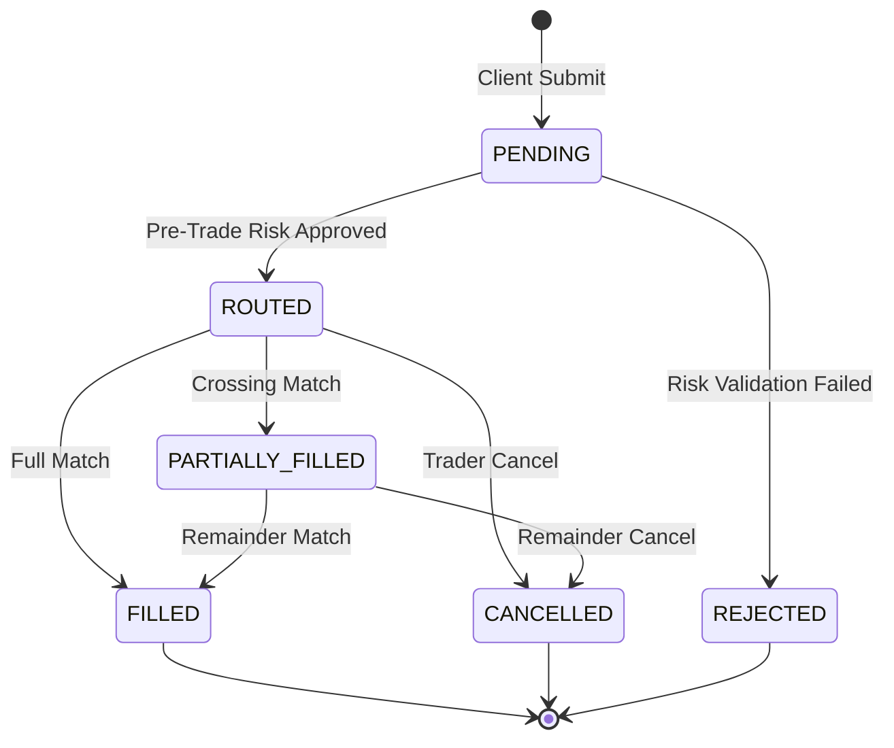
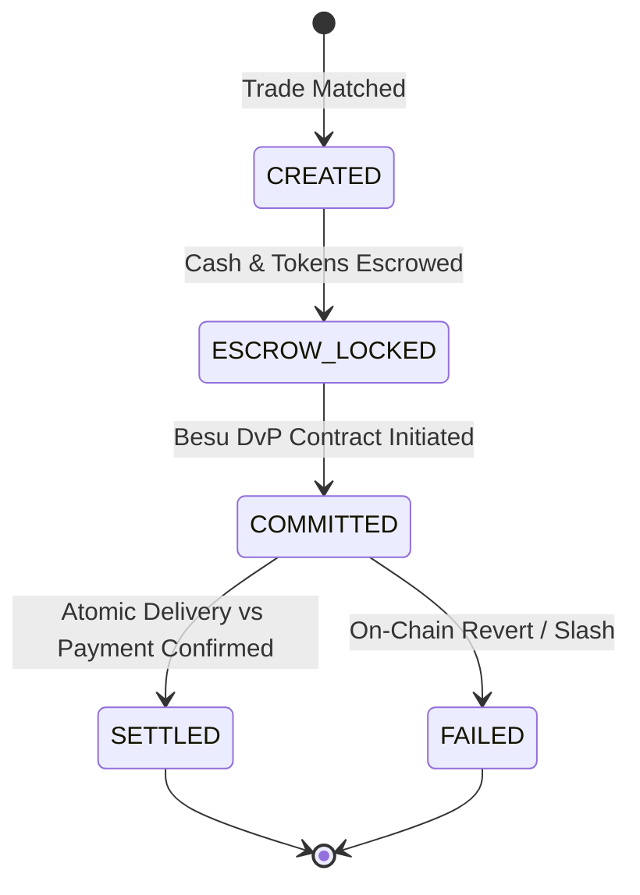

# Growww Platform Canonical Domain Model & Core Entity Specifications

## 1. Domain Purpose & Ubiquitous Language
The Growww / NBSE platform canonical domain model unifies financial trading, custodial holdings, clearing and settlement, and smart contract state representations across Go, Rust, and Python services.

---

## 2. Core Value Objects

### 2.1 Money
Exact integer representation preventing IEEE 754 floating point imprecision:
- `Currency`: ISO-4217 code (`"INR"`, `"USD"`, `"USDT"`).
- `Units`: Whole currency units (int64).
- `Nanos`: Fractional fractional currency units ($10^{-9}$, int32).

### 2.2 FractionalShare
Fixed-point equity representation supporting fractional Indian stock ownership up to 6 decimal places:
- Precision: 6 decimals ($10^{-6}$, micro-shares).
- `1.500000` shares = `1,500,000` micro-shares.

### 2.3 ISIN (International Securities Identification Number)
- 12-character alphanumeric code: 2-character country code (e.g. `IN`), 9-character national security identifier, 1 check digit.
- Validated via Modulo 10 double-add-double algorithm.

---

## 3. Trade Lifecycle State Machines

### 3.1 Order Lifecycle

### 3.2 DvP Settlement Lifecycle

---

## 4. Blockchain to Off-Chain Mapping
| Off-Chain Domain Entity | Hyperledger Besu Smart Contract Struct | Contract Reference |
| :--- | :--- | :--- |
| `Holding` | `balanceOf(address)` / `IdentityClaim` | `DigitalSecurityToken.sol` / `ERC-3643` |
| `Trade` & `Settlement` | `DvPEscrow` | `SettlementDvP.sol` |
| `CustodyPool` | `ProofOfReserveSnapshot` | `SolvencyRegistry.sol` |
| `FeeAssessment` | `depositAndDistributeFees` | `FeeCollector.sol` |
