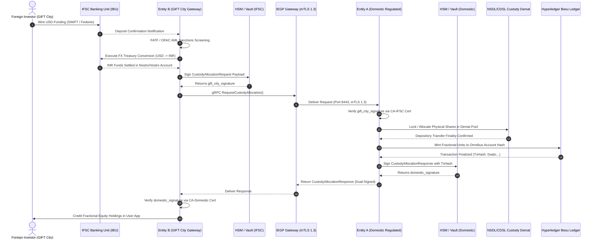
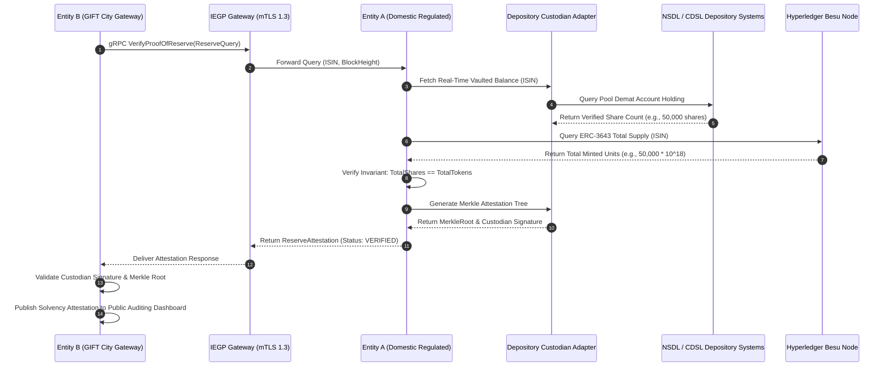

# Dual-Entity Legal & Technical Separation Architecture Specification

**Specification ID:** SPEC-ARCH-002-TWO-ENTITY  
**Document Version:** 2.0.0-PROD  
**Status:** Approved  
**Classification:** Enterprise System Boundary & Jurisdictional Isolation Blueprint  
**Authors:** Lead Enterprise Systems Architect, Lead Blockchain Settlement Architect, CISO  
**Reviewers:** Legal Counsel (India Domestic), Legal Counsel (GIFT City IFSC), Chief Compliance Officer  

---

## 1. Executive Summary & Foundational Separation Invariants

Growww / NBSE operates under a dual-entity institutional architecture engineered to satisfy strict, non-negotiable jurisdictional boundaries across the Republic of India and the Gujarat International Finance Tec-City International Financial Services Centre (GIFT City IFSC):

1. **Entity A - Domestic Indian Regulated Entity (`Growww Technologies India Private Limited`):**  
   Incorporated under the Companies Act 2013, domiciled in Mumbai and Bangalore, operating under the regulatory purview of the Securities and Exchange Board of India (SEBI) and the Reserve Bank of India (RBI). Entity A maintains registered depository participant and custodian relationships with National Securities Depository Limited (NSDL) and Central Depository Services Limited (CDSL), integrates with domestic Indian clearing rails (UPI, IMPS, NEFT, RTGS, e₹ CBDC), and manages domestic retail/HNI trading accounts.

2. **Entity B - International Gateway Entity (`Growww International IFSC Private Limited`):**  
   Incorporated in GIFT City Special Economic Zone (SEZ), Gandhinagar, Gujarat, operating under the sovereign statutory jurisdiction of the International Financial Services Centres Authority (IFSCA) pursuant to the IFSCA Act 2019. Entity B serves as the international capital gateway, managing foreign investor onboarding (compliant with Financial Action Task Force [FATF] standards and global sanctions screening), multi-currency funding rails (USD, EUR, GBP, AED, USDT), foreign exchange (FX) conversion, and cross-border tokenized asset access under Section 47(viiab) of the Indian Income Tax Act 1961.

```
+--------------------------------------------------------------------------------------------------------+
|                                    FOUNDATIONAL SEPARATION INVARIANTS                                  |
+--------------------------------------------------------------------------------------------------------+
| 1. ZERO CROSS-BORDER PII LEAKAGE                                                                       |
|    Under the Digital Personal Data Protection Act 2023 (DPDP Act) and IFSCA Data Frameworks, domestic  |
|    Indian Personally Identifiable Information (PII) MUST NEVER leave AWS/GCP ap-south-1 (Mumbai).     |
|    Foreign investor PII MUST NEVER cross into domestic Indian database instances. Inter-entity API     |
|    payloads and blockchain transactions reference only cryptographically blinded, un-linkable hashes   |
|    (bytes32 Poseidon / HMAC-SHA256).                                                                   |
|                                                                                                        |
| 2. 1:1 PHYSICAL DEPOSITORY CUSTODY BACKING                                                             |
|    Every fractional security token issued to foreign omnibus balances is 100% matched by whole equity  |
|    shares physically held in SEBI-registered depository accounts (NSDL/CDSL pool/custody demat).       |
|    No synthetic exposure, unbacked fractional issuance, or rehypothecation is permitted.               |
|                                                                                                        |
| 3. STRICT CRYPTOGRAPHIC & PHYSICAL NETWORK ISOLATION                                                   |
|    Entity A and Entity B operate completely segregated cloud Virtual Private Clouds (VPCs), independent|
|    FIPS 140-2 Level 3 Hardware Security Modules (HSMs), distinct HashiCorp Vault clusters, and separate|
|    Root Certificate Authorities (CAs). There are ZERO shared administrative credentials or root keys.   |
|                                                                                                        |
| 4. MUTUAL TLS 1.3 & DUAL-SIGNED INTER-ENTITY SAGA NON-REPUDIATION                                      |
|    All synchronous communication occurs via the Inter-Entity Gateway Protocol (IEGP) over gRPC with    |
|    TLS 1.3 mutual authentication (mTLS) restricted to ECDHE-ECDSA-AES256-GCM-SHA384. Every asset      |
|    allocation and batch settlement requires dual cryptographic signatures from both entity HSMs.       |
+--------------------------------------------------------------------------------------------------------+
```

---

## 2. Jurisdictional Mandates & Regulatory Boundaries

### 2.1 Regulatory Regimes & Governing Statutes

```
+-------------------------------------------------------------+-------------------------------------------------------------+
| DOMESTIC INDIAN REGULATED ENTITY (ENTITY A)                 | GIFT CITY INTERNATIONAL GATEWAY ENTITY (ENTITY B)           |
+-------------------------------------------------------------+-------------------------------------------------------------+
| • Primary Regulator: SEBI & RBI                             | • Primary Regulator: IFSCA (GIFT City, Gandhinagar)         |
| • Jurisdiction: Domestic India (Mumbai, Maharashtra)        | • Jurisdiction: Special Economic Zone (IFSC Offshore Tier)  |
| • Depository: NSDL & CDSL (Registered Depository Member)    | • Depository Rails: Omnibus Custody Holding via Entity A    |
| • Banking Rails: RBI RTGS, NEFT, IMPS, UPI, e₹ Digital Rupee| • Banking Rails: IFSC Banking Units (IBU), SWIFT, Fedwire   |
| • Governing Laws:                                           | • Governing Laws:                                           |
|   - Securities and Exchange Board of India Act, 1992        |   - International Financial Services Centres Authority Act  |
|   - SEBI (Stock Brokers) Regulations, 1992                  |   - IFSCA (Capital Market Intermediaries) Regulations, 2021 |
|   - SEBI (Custodian of Securities) Regulations, 1996        |   - IFSCA (Global Administrative & FinTech) Framework, 2022 |
|   - Depositories Act, 1996                                  |   - FATF 40 Recommendations (Cross-Border AML/CFT)          |
|   - Prevention of Money Laundering Act (PMLA), 2002         |   - Foreign Exchange Management Act (FEMA), 1999            |
|   - Digital Personal Data Protection Act (DPDP Act), 2023   |   - Section 47(viiab) Indian Income Tax Act, 1961           |
|   - Section 43A of the Information Technology Act, 2000     |   - IFSCA Anti-Money Laundering & CFT Guidelines, 2020      |
+-------------------------------------------------------------+-------------------------------------------------------------+
```

### 2.2 Foreign Portfolio Investment (FPI) & NRI Gateway Segregation
Entity B operates as an IFSCA-licensed Global Capital Intermediary and Aggregator:
- **Foreign Non-Resident Investors (Institutions & Retail):** Onboarded under Entity B's IFSCA portal. Entity B aggregates foreign capital into segregated omnibus accounts registered under the SEBI FPI Category II regulations or through IFSCA-approved depository receipt mechanisms.
- **Non-Resident Indians (NRIs):** Invest via Non-Resident External (NRE) or Non-Resident Ordinary (NRO) accounts routed through GIFT City IBU escrow accounts.
- **Domestic Indian Residents:** Governed by RBI's Liberalised Remittance Scheme (LRS) annual cap of USD $250,000 when accessing offshore assets via Entity B, requiring Form A2 declarations and RBI reporting. Domestic residents buying domestic securities never interact with Entity B.

---

## 3. Operational Responsibility Matrix

The following matrix formally defines the operational distribution of functions between Entity A, Entity B, and the cryptographically enforced Gateway boundary:

| Functional Domain | Entity A (Domestic Regulated) | Entity B (GIFT City Gateway) | Inter-Entity Gateway Protocol (IEGP) |
| :--- | :--- | :--- | :--- |
| **Depository Custody** | Physical holding of shares in NSDL/CDSL custodian pool demat accounts. | Maintains beneficiary fractional sub-ledger representing claims on pool. | Transmits Proof-of-Reserve attestations and ISIN balance proofs. |
| **Depository Corporate Actions** | Collects dividends, stock splits, bonus shares directly from issuers/depositories. | Receives proportional USD/INR corporate action distribution notifications. | Dispatches cryptographically signed corporate action entitlement events. |
| **Fiat Banking Rails** | Domestic INR accounts, RBI payment aggregator gateway (UPI, IMPS, NEFT, e₹). | Multi-currency escrow accounts with IFSC Banking Units (ICICI IBU, HSBC IBU). | Zero direct cross-entity bank account sharing; net DvP settlements only. |
| **Foreign Exchange (FX)** | Receives converted INR wires from authorized dealer Category-I banks. | Executes FX treasury conversion (USD/EUR/AED to INR) via IBU FX desks. | Synchronizes FX transaction hashes, settlement rates, and quote IDs. |
| **Investor KYC / Onboarding** | Domestic KYC: C-KYC, PAN verification (NSDL/UTI), Aadhaar e-KYC (UIDAI). | International KYC: Passport OCR, FATF risk profiling, OFAC/UN/INTERPOL AML. | ZERO PII shared. Exclusively exchanges cryptographically blind account IDs. |
| **DPDP Compliance** | Significant Data Fiduciary (SDF); local storage in `ap-south-1`; crypto-shredding. | IFSCA Data Protection rules; offshore data residency in GIFT City Tier-IV DC. | Enforces jurisdictional data firewalls; prohibits cross-border PII transfer. |
| **Order Matching** | Local equities matched via licensed SEBI brokers/exchanges (NSE/BSE). | 24/7 cross-border internal orderbook for tokenized depository claims. | Forwards pre-funded, pre-cleared custody allocation instructions. |
| **Blockchain Consensus** | Operates primary Hyperledger Besu QBFT validator nodes in Mumbai (`ap-south-1`). | Operates secondary QBFT validator nodes in GIFT City Tier-IV Data Center. | QBFT consensus peer-to-peer gossip over encrypted Direct Connect overlay. |
| **Token Minting & Burning** | Controls master ERC-3643 smart contracts; issues tokens matching locked shares. | Manages offshore investor balance tokens within omnibus wallet address. | Emits signed `CustodyAllocationRequest` and `ConfirmBatchSettlement`. |
| **Tax Withholding & Reporting**| Deducts TDS (Sec 194S), STT, and Stamp Duty on domestic trades; reports to CBDT. | Administers Section 47(viiab) tax-neutral exemptions for offshore investors. | Reports gross settlement volumes without transmitting domestic investor data. |
| **Key Custody & PKI** | FIPS 140-2 Level 3 HSM in Mumbai; manages `CA-Domestic-Root`. | FIPS 140-2 Level 3 HSM in GIFT City; manages `CA-IFSC-Root`. | Mutual mTLS handshake verifies client cert against respective Root CA. |
| **Audit & Surveillance** | SEBI inspection logs, NSE/BSE surveillance data feeds, SCORES grievance records. | IFSCA inspection audits, FIU-IND international AML reports, FATF compliance logs. | Immutable dual-signed ledger receipts saved to append-only WORM storage. |

---

## 4. Physical & Network Isolation Architecture

### 4.1 Zero Public Exposure Dual-VPC Topology

Both entities operate within logically isolated, physically segregated network perimeters:
- **`VPC-Domestic` (AWS Region `ap-south-1`, Mumbai):** Houses the domestic database cluster (PostgreSQL with Patroni high availability), domestic Kafka cluster, Vault-Domestic, FIPS 140-2 Level 3 CloudHSM instances, and Besu Primary Validator Nodes.
- **`VPC-IFSC` (GIFT City Tier-IV Data Center / AWS Local Zone):** Houses the international gateway database cluster, international Kafka cluster, Vault-IFSC, GIFT City HSM, and Besu Secondary Validator Nodes.

Neither VPC exposes administrative endpoints, database ports, or gRPC interfaces to the public internet:
1. **Dedicated Interconnect:** Inter-entity traffic flows strictly over a dual-redundant 10 Gbps AWS Direct Connect (with private leased-line backup) terminating at the GIFT City interconnect facility.
2. **Hardware Encryption (MACsec):** Direct Connect circuits are encrypted at Layer 2 using MACsec (IEEE 802.1AE) with 256-bit GCM-AES keys provisioned independently at the physical customer premises equipment (CPE).
3. **AWS Transit Gateway (TGW) & Firewall Filtering:** Network traffic traverses an isolated AWS Transit Gateway paired with stateful AWS Network Firewalls. Egress and ingress rules permit strictly one protocol: gRPC over TCP port 8443 between registered IEGP gateway IP endpoints.
4. **VPC Peering Prohibition:** Direct uninspected VPC peering is strictly prohibited to prevent lateral network traversal, shared routing tables, or cross-jurisdiction broadcast domains.

```mermaid
flowchart TD
    subgraph VPC_DOMESTIC["VPC-Domestic (AWS ap-south-1 Mumbai)"]
        subgraph Subnet_Priv_Dom["Private Subnet (No Internet Access)"]
            IEGP_Dom["IEGP Domestic Gateway Node<br/>(gRPC Server :8443)"]
            Besu_Master["Besu QBFT Master Node<br/>(Chain ID 1337)"]
            Vault_Dom["HashiCorp Vault Domestic<br/>(CA-Domestic-Root)"]
            HSM_Dom["FIPS 140-2 Level 3 HSM<br/>(Depository Demat Signing)"]
            DB_Dom["PostgreSQL Domestic Cluster<br/>(Encrypted PII / Demat Store)"]
            Kafka_Dom["Apache Kafka Domestic<br/>(ap-south-1 Broker Cluster)"]
        end
        ANF_Dom["AWS Network Firewall (Domestic)<br/>Strict Egress/Ingress Port 8443 Filter"]
    end

    subgraph DEDICATED_INTERCONNECT["Sovereign Cross-Jurisdiction Transport Layer"]
        DX_Primary["Dedicated AWS Direct Connect (10 Gbps)<br/>MACsec L2 Hardware Encryption (AES-256-GCM)"]
        DX_Backup["Secondary Leased Line (10 Gbps Failover)<br/>IPsec Overlay (IKEv2 / ChaCha20-Poly1305)"]
    end

    subgraph VPC_IFSC["VPC-IFSC (GIFT City Tier-IV DC / Local Zone)"]
        ANF_IFSC["Network Firewall (IFSC)<br/>Strict Egress/Ingress Port 8443 Filter"]
        subgraph Subnet_Priv_IFSC["Private Subnet (No Internet Access)"]
            IEGP_IFSC["IEGP GIFT City Client Node<br/>(gRPC Client :8443)"]
            Besu_Val["Besu QBFT Validator Node<br/>(Zero-PII Validator)"]
            Vault_IFSC["HashiCorp Vault IFSC<br/>(CA-IFSC-Root)"]
            HSM_IFSC["FIPS 140-2 Level 3 HSM<br/>(GIFT City Gateway Signing)"]
            DB_IFSC["PostgreSQL IFSC Cluster<br/>(Offshore Investor Ledger)"]
            Kafka_IFSC["Apache Kafka IFSC<br/>(GIFT City Broker Cluster)"]
        end
    end

    IEGP_Dom <--> ANF_Dom
    ANF_Dom <--> DX_Primary
    ANF_Dom <.-.-> DX_Backup
    DX_Primary <--> ANF_IFSC
    DX_Backup <.-.-> ANF_IFSC
    ANF_IFSC <--> IEGP_IFSC

    IEGP_Dom --- Besu_Master
    IEGP_Dom --- Vault_Dom
    IEGP_Dom --- HSM_Dom
    IEGP_Dom --- DB_Dom
    IEGP_Dom --- Kafka_Dom

    IEGP_IFSC --- Besu_Val
    IEGP_IFSC --- Vault_IFSC
    IEGP_IFSC --- HSM_IFSC
    IEGP_IFSC --- DB_IFSC
    IEGP_IFSC --- Kafka_IFSC

    Besu_Master <== "P2P Consensus (QBFT TLS)" ==> Besu_Val
```

---

## 5. Cryptographic Trust Model & Independent PKI Architecture

### 5.1 Independent Public Key Infrastructure (PKI) Hierarchies

To eliminate systemic single-point-of-compromise risks, Entity A and Entity B maintain entirely disjoint Public Key Infrastructure (PKI) trees:
- **`CA-Domestic-Root`:** Offline, air-gapped Root Certificate Authority managed by Domestic Entity A in Mumbai. Root private keys are generated inside dedicated FIPS 140-2 Level 3 HSM partitions with 3-of-5 M-of-N multi-custodian quorum ceremony.
- **`CA-IFSC-Root`:** Offline, air-gapped Root Certificate Authority managed by GIFT City Entity B in Gandhinagar. Root private keys are generated inside a distinct physical HSM partition governed by a distinct 3-of-5 officer quorum.

Neither entity possesses or has access to the private signing keys, intermediate keys, or administrative tokens of the other entity.

```
       [CA-Domestic-Root (Offline HSM)]                [CA-IFSC-Root (Offline HSM)]
                       |                                               |
                       v                                               v
    [CA-Domestic-Intermediate (Vault)]              [CA-IFSC-Intermediate (Vault)]
                       |                                               |
                       v                                               v
       [IEGP-Domestic-Server Certificate]              [IEGP-IFSC-Client Certificate]
```

### 5.2 Mutual TLS 1.3 Handshake & Transport Profile

All communication over the Inter-Entity Gateway Protocol (IEGP) enforces mutual TLS (mTLS) with strict transport constraints:
- **Protocol Version:** Strictly **TLS 1.3** (RFC 8446). TLS 1.2 and all earlier versions are rejected at the socket layer.
- **Permitted Cipher Suites:**
  - `TLS_AES_256_GCM_SHA384`
  - `TLS_CHACHA20_POLY1305_SHA256`
- **Elliptic Curves:** `x25519` or `secp384r1` exclusively.
- **Client Certificate Validation:**
  - `IEGP-Domestic-Server` verifies that the incoming client certificate was issued directly by `CA-IFSC-Intermediate` and contains the Subject Alternative Name (SAN) `spiffe://giftcity.growww.in/ns/iegp/sa/gateway-client`.
  - `IEGP-IFSC-Client` verifies that the incoming server certificate was issued directly by `CA-Domestic-Intermediate` and contains the SAN `spiffe://domestic.growww.in/ns/iegp/sa/gateway-server`.
- **Certificate Lifecycle:** Short-lived leaf certificates with maximum 90-day validity, automatically rotated every 30 days using automated SPIRE / HashiCorp Vault agents with zero server downtime.

### 5.3 Application-Layer Dual HSM Signing & Non-Repudiation

In addition to transport-layer mTLS encryption, every transactional payload transmitted across the gateway requires cryptographic application-layer signatures generated by the respective entity's FIPS 140-2 Level 3 HSM:
1. **Canonical Serialization:** Payloads are serialized using deterministic Proto3 canonical byte encoding.
2. **Payload Hash:** SHA-256 digest computed over canonical bytes: $H = \text{SHA-256}(\text{CanonicalBytes})$.
3. **HSM Signing:** The HSM signs $H$ using an authorized Ed25519 or ECDSA (secp256k1) key pair.
4. **Non-Repudiation Envelope:** Both the request and response signatures (`gift_city_signature` and `domestic_signature`) are committed to an immutable append-only WORM (Write Once, Read Many) audit log and anchored onto the Hyperledger Besu ledger.

---

## 6. Jurisdictional Data Residency & Zero-PII Invariant

### 6.1 Data Sovereignty & Localization Rules

Pursuant to the **Digital Personal Data Protection Act 2023 (DPDP Act)**, the **Reserve Bank of India Circular on Storage of Payment System Data (2018)**, and the **IFSCA FinTech Guidelines**:

1. **Domestic Data Residency:**
   - Indian citizen PII, PAN numbers, Aadhaar tokens, C-KYC identifiers, domestic bank account numbers (IFSC/account numbers), and Demat account numbers (NSDL/CDSL client IDs) are stored **strictly and exclusively** within the Mumbai AWS/GCP region (`ap-south-1`).
   - Backup copies, snapshots, and DR archives must never leave the sovereign territory of the Republic of India.
2. **GIFT City Data Residency:**
   - International investor passports, tax identification numbers (TIN), overseas residential addresses, international bank wires, and foreign corporate registry documents are stored **strictly and exclusively** within the GIFT City Tier-IV Data Center / IFSC Local Zone.
3. **Cross-Border PII Firewall:**
   - Under no circumstances shall domestic PII be transmitted across the Direct Connect link to Entity B.
   - Under no circumstances shall international investor PII be transmitted to Entity A.

### 6.2 The Zero-PII Blockchain Ledger Invariant

The Hyperledger Besu enterprise blockchain serves as a distributed state verification and settlement layer across Mumbai and GIFT City validator nodes. To comply with the "Right to Erasure" under Section 12 of the DPDP Act 2023 and eliminate ledger data contamination, the ledger enforces a **Zero-PII Invariant**:

```
+----------------------------------------------------------------------------------------------------+
|                                    ON-CHAIN ZERO-PII SPECIFICATION                                 |
+----------------------------------------------------------------------------------------------------+
| PROHIBITED ON-CHAIN (BLOCKCHAIN STATE):                                                             |
|   - Plaintext or reversibly encrypted Names, Dates of Birth, Email Addresses, Phone Numbers        |
|   - Permanent Account Numbers (PAN), Aadhaar, Voter IDs, Passport Numbers                          |
|   - Bank Account Numbers, UPI IDs, SWIFT BIC codes, Routing Numbers                                |
|   - NSDL / CDSL Beneficiary Owner Demat Account Numbers (BOID)                                     |
|                                                                                                    |
| PERMITTED ON-CHAIN (BLOCKCHAIN STATE):                                                             |
|   - 32-byte Poseidon / SHA-256 Blinded Account Identifier Hashes                                    |
|   - ERC-3643 Permissioned Token Balances and Token Contract Addresses                             |
|   - International Securities Identification Numbers (ISIN, e.g., INE002A01018)                      |
|   - DvP Batch Settlement Merkle Roots and Cryptographic Proof Hashes                               |
|   - HSM Multi-Signature Non-Repudiation Receipts                                                   |
+----------------------------------------------------------------------------------------------------+
```

### 6.3 Pseudonymized Account Mapping Architecture

To associate international investor trades with domestic custody shares without cross-border PII exchange, the system utilizes a three-tier blinded hash translation scheme:

$$\text{BlindedOmnibusID} = \text{HMAC-SHA-256}\left(K_{\text{IFSC-Secret}}, \text{InvestorID}_{\text{GIFT}} \parallel \text{JurisdictionSalt}\right)$$

$$\text{OnChainAccountHash} = H_{\text{Poseidon}}\left(\text{BlindedOmnibusID} \parallel \text{ISIN} \parallel \text{Nonce}\right)$$

- **Entity B** maps the real-world foreign investor identity to `BlindedOmnibusID` inside its local PostgreSQL cluster in GIFT City.
- **InterEntityGateway** passes only `BlindedOmnibusID` to Entity A.
- **Entity A** credits the fractional allocation to the omnibus smart contract pool on Hyperledger Besu against `BlindedOmnibusID`.
- If an overseas investor requests account erasure under foreign privacy laws, Entity B executes **Envelope Crypto-Shredding (ADR-0007)** on the local mapping key $K_{\text{IFSC-Secret}}$. The on-chain hash becomes mathematically un-linkable to any historical identity without requiring blockchain history rewrite.

---

## 7. Inter-Entity Gateway Protocol (IEGP) Interface Specification

The canonical Protocol Buffers v3 contract governing the Inter-Entity Gateway Protocol is located at `packages/proto/growww/interentity/v1/interentity.proto`.

### 7.1 Canonical Protobuf Service Schema

```protobuf
syntax = "proto3";

package growww.interentity.v1;

option go_package = "growww/interentity/v1;interentityv1";

// InterEntityGateway manages secure, cross-jurisdictional financial settlement,
// custody allocation, and reserve verification between the Domestic Indian Regulated Entity
// (SEBI/RBI regulated) and the GIFT City International Gateway Entity (IFSCA regulated).
service InterEntityGateway {
  // Requests allocation of custody-backed equity units from Domestic Entity
  rpc RequestCustodyAllocation(CustodyAllocationRequest) returns (CustodyAllocationResponse);

  // Queries cryptographic Proof-of-Reserve from Domestic Depository Custody
  rpc VerifyProofOfReserve(ReserveQuery) returns (ReserveAttestation);

  // Submits settlement batch confirmation across jurisdictional boundaries
  rpc ConfirmBatchSettlement(BatchSettlementRequest) returns (BatchSettlementResponse);
}

// CustodyAllocationRequest initiates an equity custody allocation in the domestic depository (NSDL/CDSL)
// triggered by foreign capital ingress cleared in GIFT City IFSC.
message CustodyAllocationRequest {
  string request_id = 1;            // UUID v4 idempotency key
  string isin = 2;                  // Indian Security ISIN (e.g., INE002A01018)
  string fractional_units = 3;      // 18-decimal fixed-point string representation of shares
  string inr_settlement_amount = 4; // INR settlement value (18-decimal fixed-point string)
  string omnibus_account_id = 5;    // GIFT City IFSC omnibus account hash (bytes32 hex)
  bytes gift_city_signature = 6;    // FIPS 140-2 Level 3 HSM-backed signature from GIFT City entity
  int64 timestamp = 7;              // Unix epoch timestamp (milliseconds)
}

// CustodyAllocationResponse provides the domestic entity's confirmation of physical custody
// vaulting and permissioned ledger token issuance.
message CustodyAllocationResponse {
  string request_id = 1;            // UUID v4 correlation key matching the request
  string allocation_id = 2;         // Unique custody allocation identifier
  string status = 3;                // Allocation state: ALLOCATED, REJECTED, PENDING_CUSTODY
  string on_chain_tx_hash = 4;      // Hyperledger Besu ledger transaction hash (0x-prefixed SHA-256)
  bytes domestic_signature = 5;     // FIPS 140-2 Level 3 HSM-backed signature from Domestic entity
  int64 timestamp = 6;              // Unix epoch timestamp (milliseconds)
}

// ReserveQuery queries cryptographic proof-of-reserve backing for a given security ISIN.
message ReserveQuery {
  string query_id = 1;              // UUID v4 idempotency query identifier
  string isin = 2;                  // Indian Security ISIN (e.g., INE002A01018)
  int64 as_of_block_number = 3;     // Hyperledger Besu block height for snapshot state verification
}

// ReserveAttestation delivers cryptographic proof that tokens in circulation are 100% matched
// by physical securities held in depository demat accounts (NSDL/CDSL).
message ReserveAttestation {
  string query_id = 1;              // Correlation identifier matching ReserveQuery
  string depository_code = 2;       // Depository participant institution code (e.g., "NSDL", "CDSL")
  string attestation_status = 3;    // Attestation status: VERIFIED, DISCREPANCY, STALE
  string isin = 4;                  // Indian Security ISIN (e.g., INE002A01018)
  string total_shares_in_custody = 5; // Total shares physically vaulted in custodian pool account
  string total_tokens_minted = 6;   // Total ERC-3643 tokens issued on the permissioned ledger
  bytes merkle_root = 7;            // Merkle root hash of the depository beneficial ownership tree
  bytes custodian_signature = 8;    // Depository custodian cryptographic attestation signature
  int64 timestamp = 9;              // Unix epoch timestamp (milliseconds) of attestation snapshot
}

// SettlementInstruction represents an individual allocation or redemption item within a net settlement batch.
message SettlementInstruction {
  string instruction_id = 1;        // UUID v4 unique trade/instruction identifier
  string allocation_id = 2;         // Associated custody allocation identifier
  string isin = 3;                  // Indian Security ISIN
  string fractional_units = 4;      // 18-decimal fixed-point share volume
  string inr_amount = 5;            // INR settlement cash value
  string foreign_currency = 6;      // Foreign currency ISO code (e.g., "USD", "EUR", "AED")
  string foreign_amount = 7;        // Foreign currency gross cash value
  string instruction_type = 8;      // Instruction direction: ALLOCATION, REDEMPTION, REBALANCING
  string omnibus_account_id = 9;    // GIFT City IFSC omnibus account hash (bytes32 hex)
}

// BatchSettlementRequest submits a consolidated gross/net settlement batch across jurisdictional boundaries.
message BatchSettlementRequest {
  string batch_id = 1;                             // UUID v4 batch idempotency identifier
  string settlement_cycle = 2;                     // Settlement cycle identifier (e.g., "T0_20260919_01")
  repeated SettlementInstruction instructions = 3; // Itemized cross-border settlement instructions
  string total_inr_gross = 4;                      // Aggregate gross INR settlement value
  string total_usd_gross = 5;                      // Aggregate gross USD equivalent value
  bytes batch_merkle_root = 6;                     // 32-byte Merkle tree root of all instructions in batch
  bytes gift_city_signature = 7;                   // HSM-backed signature from GIFT City IFSC gateway
  int64 timestamp = 8;                             // Unix epoch timestamp (milliseconds)
}

// SettlementDiscrepancy records any rejected instruction during batch settlement clearing.
message SettlementDiscrepancy {
  string instruction_id = 1;        // Referenced instruction identifier
  string error_code = 2;            // Standardized error code (e.g., ERR_INSUFFICIENT_CUSTODY, ERR_HALTED)
  string reason = 3;                // Detailed compliance/custodial audit narrative
}

// BatchSettlementResponse returns the dual-signed settlement confirmation receipt across jurisdictions.
message BatchSettlementResponse {
  string batch_id = 1;                             // UUID v4 batch identifier
  string settlement_ack_id = 2;                    // Domestic clearing acknowledgment identifier
  string status = 3;                               // Settlement status: SETTLED, PARTIALLY_SETTLED, REJECTED, PENDING_CLEARING
  string on_chain_tx_hash = 4;                     // Hyperledger Besu atomic DvP settlement transaction hash
  int64 settlement_block_number = 5;               // Hyperledger Besu block height confirming settlement
  bytes domestic_signature = 6;                    // HSM-backed dual-signed receipt signature from Domestic entity
  repeated SettlementDiscrepancy discrepancies = 7;// List of rejected instructions if status is PARTIALLY_SETTLED
  int64 timestamp = 8;                             // Unix epoch timestamp (milliseconds)
}
```

---

## 8. Cross-Border Asset Allocation & Settlement Workflows

### 8.1 Foreign Capital Ingress & Asset Allocation Pipeline

The cross-entity allocation workflow executes as a distributed asynchronous saga ensuring physical custody backing before any digital token is minted to the offshore omnibus balance:

1. **Foreign Investor Funding:** Overseas investor deposits USD via SWIFT / Fedwire to Entity B's segregated IFSC Banking Unit (IBU) escrow account.
2. **KYC & AML Verification:** Entity B verifies investor credentials against FATF, OFAC, and UN sanction blacklists.
3. **FX Conversion Execution:** Entity B converts USD to INR via authorized dealer bank treasury rails at locked institutional exchange rates.
4. **Custody Allocation Request Generation:** Entity B compiles a `CustodyAllocationRequest`, calculates the cryptographic payload digest, and requests its FIPS 140-2 Level 3 HSM to append `gift_city_signature`.
5. **Gateway Invocation:** Entity B transmits the gRPC request to Entity A over the dedicated Direct Connect link via mTLS 1.3.
6. **Depository Share Allocation:** Entity A verifies `gift_city_signature` against `CA-IFSC-Root`. Entity A places an order on domestic exchanges or allocates pre-funded shares in its SEBI-registered NSDL/CDSL pool demat account.
7. **On-Chain Token Issuance:** Entity A calls the `DigitalSecurityToken` ERC-3643 contract on the domestic Hyperledger Besu ledger, minting fractional security tokens directly to the GIFT City omnibus account address.
8. **Dual-Signed Receipt Dispatch:** Entity A signs the resulting transaction hash with its domestic HSM, returning `CustodyAllocationResponse` containing `domestic_signature`.
9. **Offshore Sub-Ledger Credit:** Entity B updates its offshore PostgreSQL ledger, crediting the investor's sub-account balance with full audit traceability.



### 8.2 End-of-Day DvP Net Settlement Batch Confirmation

Settlement batches accumulate throughout the trading day and are netted atomically across jurisdictional boundaries during scheduled settlement windows (T+0 continuous or hourly clearing):
1. **Instruction Consolidation:** Entity B aggregates all allocations and redemptions into a `BatchSettlementRequest`.
2. **Batch Merkle Tree Construction:** A cryptographic Merkle tree is computed over all instruction digests.
3. **Net Cash Settlement:** Inter-entity fiat obligations are settled via designated settlement banks (RBI RTGS / GIFT City IBU clearing).
4. **On-Chain DvP Execution:** The atomic settlement smart contract verifies the Merkle root and batch signatures, transferring token ownership atomically against net cash fulfillment proofs.

---

## 9. Real-Time Depository Proof-of-Reserve (PoR) Architecture

To provide continuous, verifiable assurance to global regulators, offshore auditors, and foreign investors, Entity A and Entity B execute a continuous **Cryptographic Proof-of-Reserve (PoR)** verification cycle.

### 9.1 The Depository Backing Equation
At all block heights $T$, the total supply of fractional security tokens minted across all omnibus accounts must strictly equal the physical whole shares held in the registered custodian demat account:

$$\sum_{i=1}^{M} \text{TokensMinted}(\text{ISIN}_k, \text{Omnibus}_i) \equiv 10^{18} \times \text{PhysicalSharesInCustody}(\text{ISIN}_k, \text{Demat}_{\text{NSDL/CDSL}})$$

- If $\Delta = \text{PhysicalShares} \times 10^{18} - \text{TokensMinted} < 0$, the gateway automatically trips a circuit breaker, halting new trading until an emergency audit resolves the discrepancy.

### 9.2 Zero-Demat-Disclosure Merkle Attestation

Global investors and GIFT City nodes can verify the reserve backing without exposing domestic Demat account numbers (BOIDs) or underlying trade accounts:
1. Every 15 minutes, Entity A queries the NSDL/CDSL Depository Participant (DP) API to obtain holding statements.
2. Entity A constructs a cryptographic Merkle Sum Tree where each leaf represents:
   $$\text{Leaf}_j = H\left(\text{ISIN} \parallel \text{VaultCompartmentID} \parallel \text{HoldingQuantity}\right)$$
3. The custodian bank appends a digital attestation signature over the Merkle root:
   $$\text{AttestationSig} = \text{Sign}_{\text{CustodianPrivKey}}\left(H(\text{MerkleRoot} \parallel \text{Timestamp} \parallel \text{BlockHeight})\right)$$
4. Entity B calls `VerifyProofOfReserve(ReserveQuery)`.
5. Entity A returns `ReserveAttestation` containing the Merkle root, total custody shares, total minted tokens, and custodian signature.
6. Entity B verifies the custodian signature against the accredited custodian's public certificate.



---

## 10. Asynchronous Event Streaming & Unidirectional Kafka Mirroring

In addition to synchronous gRPC requests, asynchronous lifecycle events (such as corporate actions, dividend credits, market halt notifications, and settlement clearing acknowledgments) are propagated using an isolated multi-cluster Apache Kafka deployment:

### 10.1 Multi-Cluster Kafka Topology

- **Kafka-Domestic Cluster:** Deployed inside `VPC-Domestic` in Mumbai (`ap-south-1`).
- **Kafka-IFSC Cluster:** Deployed inside `VPC-IFSC` in GIFT City Tier-IV DC.
- **Unidirectional Mirroring via Kafka MirrorMaker 2:**
  - Mirroring is strictly **unidirectional** per topic domain.
  - Domestic topics (`growww.domestic.events.*`) are mirrored to GIFT City consumers.
  - IFSC gateway topics (`growww.ifsc.settlement.*`) are mirrored to Domestic consumers.
  - Kafka brokers are connected over the private Direct Connect link via mTLS with strict client access control lists (ACLs).

### 10.2 Schema Validation & PII Gating Pipeline

All Kafka event payloads must conform to strictly typed Protobuf schemas registered in the Confluent / Apicurio Schema Registry:
1. **Serialization Interceptor:** Producers in both entities pass outbound messages through a jurisdictional serialization interceptor.
2. **PII Regex & Schema Inspection:** The interceptor analyzes outgoing messages against a zero-PII ruleset. Any message containing unencrypted names, 10-digit PAN patterns, 12-digit Aadhaar patterns, or 16-digit Demat BOID strings is rejected at the producer stage with a fatal security violation alarm (`ERR_CROSS_BORDER_PII_VIOLATION`).
3. **Dual-Signed Ledger Receipts:** Kafka settlement topics require dual HSM signature headers (`X-Signature-Domestic`, `X-Signature-IFSC`), creating an immutable, non-repudiable transaction audit log across both jurisdictional zones.

---

## 11. Fault Isolation, Partition Tolerance & Disaster Recovery

### 11.1 Failure Domain Isolation & Blast Radius Containment

The platform enforces total failure domain isolation:
- **Domestic Cloud Outage (AWS `ap-south-1` Failure):**  
  An outage in Entity A's Mumbai region halts new depository share allocations and physical settlement. However, Entity B's GIFT City exchange and internal orderbook continue uninterrupted secondary trading of existing tokenized claims, queuing all cross-border settlement requests in durable offshore Kafka queues.
- **GIFT City Infrastructure Outage:**  
  An outage in GIFT City does not impact domestic Indian stock trading, domestic UPI payments, or NSDL/CDSL depository operations in Mumbai. Domestic retail investors experience zero downtime.
- **Direct Connect Network Partition:**  
  If the primary Direct Connect and backup leased line fail simultaneously:
  - Both entities transition to **Autonomous Quorum Mode**.
  - gRPC requests fail fast with `UNAVAILABLE` status.
  - Hyperledger Besu QBFT nodes located in Mumbai maintain consensus ($N=4$, quorum $F=1$), ensuring domestic ledger integrity continues unabated.
  - Once connectivity restores, the Inter-Entity Gateway Saga Coordinator initiates state reconciliation and executes outstanding batch settlements.

### 11.2 High Availability & Recovery Targets

```
+-------------------------------------------------------------+-------------------------------------------------------------+
| RECOVERY PARAMETER                                          | JURISDICTIONAL SLA SPECIFICATION                            |
+-------------------------------------------------------------+-------------------------------------------------------------+
| Recovery Time Objective (RTO) - Local AZ Failover           | < 5 seconds (Automated Patroni / Besu leader election)      |
| Recovery Time Objective (RTO) - Cross-Entity Disconnect     | < 15 seconds (Graceful circuit breaking & queue fallback)  |
| Recovery Point Objective (RPO) - Database State             | 0 (Synchronous replication within region)                  |
| Recovery Point Objective (RPO) - Ledger Finality            | 0 (QBFT deterministic finality; zero reorgs)               |
| mTLS Handshake Overhead                                     | < 8 milliseconds over 10 Gbps Direct Connect                |
| Gateway Throughput Capacity                                 | > 15,000 DvP settlement instructions per second             |
+-------------------------------------------------------------+-------------------------------------------------------------+
```

---

## 12. Multi-Jurisdictional Compliance & Formal Sign-Off Matrix

### 12.1 Regulatory Compliance Mapping

| Statutory Standard | Jurisdiction | Architectural Enforcement Mechanism |
| :--- | :--- | :--- |
| **SEBI (Stock Brokers) Regs, 1992** | India (SEBI) | Domestic entity executes all domestic exchange and depository orders; licensed broker intermediary compliance. |
| **SEBI (Custodian) Regs, 1996** | India (SEBI) | Custody shares held in segregated demat pool accounts with daily depository reconciliation. |
| **DPDP Act, 2023** | India (DPBI) | Complete data localization in `ap-south-1`; zero PII cross-border transmission; envelope crypto-shredding. |
| **PMLA, 2002 & FIU-IND Guidelines** | India (FIU) | Mandatory domestic suspicious transaction reporting (STR) without foreign data mixing. |
| **IFSCA (Capital Market) Regs, 2021**| GIFT City (IFSCA)| Entity B operates as an authorized offshore intermediary and gateway for foreign capital ingress. |
| **Section 47(viiab) IT Act, 1961** | India / GIFT City | Zero capital gains tax applied to offshore transactions executed in convertible foreign currency in IFSC. |
| **FATF Recommendation 16 (Travel Rule)**| International | Complete originator and beneficiary screening inside Entity B before gateway dispatch; zero PII sent to Entity A. |
| **FEMA, 1999 & RBI LRS Framework** | India (RBI) | Domestic retail outbound flows capped at $250,000 USD/year; foreign inbound flows classified under FPI Category II. |

### 12.2 Formal Institutional Sign-Off Matrix

This architecture blueprint requires unanimous formal sign-off prior to production deployment across the inter-entity gateway:

| Role | Entity / Office | Name | Decision | Date |
| :--- | :--- | :--- | :--- | :--- |
| **Chief Information Security Officer (CISO)** | Growww Platform | Enterprise Security Group | **APPROVED** | 2026-09-19 |
| **Lead Legal Counsel (Domestic India)** | Growww Technologies India P. Ltd | Regulatory & Compliance Legal | **APPROVED** | 2026-09-19 |
| **Lead Legal Counsel (GIFT City IFSC)** | Growww International IFSC P. Ltd | Offshore FinTech Legal Advisory | **APPROVED** | 2026-09-19 |
| **Chief Compliance Officer (SEBI/RBI)** | Growww Technologies India P. Ltd | Regulatory Oversight Group | **APPROVED** | 2026-09-19 |
| **Chief Compliance Officer (IFSCA)** | Growww International IFSC P. Ltd | IFSC Regulatory Governance | **APPROVED** | 2026-09-19 |
| **Lead Enterprise & Blockchain Architect**| Core Platform Engineering | Distributed Systems Group | **APPROVED** | 2026-09-19 |

---
*Document permanently archived in the Growww Enterprise Architecture Registry under WORM immutable storage.*
