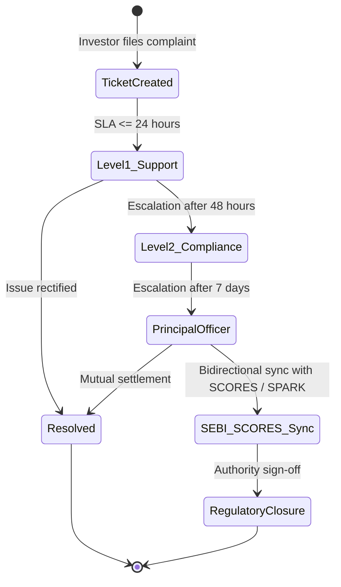

# Growww / NBSE Risk Disclosure & Investor Protection Framework

## 1. Statutory Mandate & Governance
Growww / NBSE operates under rigorous investor protection standards established by:
- **SEBI (Stock Brokers) Regulations, 1992** and SEBI Master Circulars on Investor Protection.
- **SEBI SCORES 2.0:** Direct digital integration for investor grievance resolution.
- **IFSCA (Capital Market Intermediaries) Regulations, 2021:** Conduct of Business and Fair Dealing rules.
- **Core Principle:** Empowering retail and institutional participants with complete transparency, deterministic suitability evaluation, and prompt dispute resolution.

---

## 2. Risk Disclosure Taxonomy

### 2.1 Primary Risk Categories
1. **Market Risk:** Equities and digital assets are subject to volatility, macroeconomic shifts, corporate earnings variance, and global systemic risks. Past performance is no guarantee of future returns.
2. **Fractional Ownership & Liquidity Risk:** Fractional units represent fractional beneficial interest in physical depository shares held by an authorized custodian. While internal continuous orderbooks provide liquidity, extreme market stress may necessitate lot consolidation prior to external depository settlement.
3. **Custodial & Segregation Invariant:** 100% of underlying equity securities are held in bankruptcy-remote demat accounts with NSDL/CDSL in the name of the Custodian for the exclusive benefit of platform participants. No proprietary commingling is permitted.
4. **Blockchain Technology Nuances:** Permissioned Hyperledger Besu QBFT ledger execution provides sub-second atomic settlement, deterministic finality, and zero reorg vulnerability. All transactions are digitally signed via non-custodial or managed keys.
5. **Tax Withholding (Section 194S & 115BBH / 111A / 112A):** Trades are subjected to statutory tax regimes depending on asset class (STT and capital gains for equities; 1% TDS and 30% flat tax for VDA assets).

---

## 3. Investor Suitability Scoring Engine

### 3.1 Quantitative Suitability Model
Before activating spot trading, each investor completes a standardized suitability assessment:
$$S_{\text{composite}} = 0.35 \cdot S_{\text{experience}} + 0.30 \cdot S_{\text{risk\_capacity}} + 0.20 \cdot S_{\text{horizon}} + 0.15 \cdot S_{\text{literacy}}$$

### 3.2 Suitability Tiers
| Tier Score | Investor Profile | Max Order Size | Allowed Products |
| :--- | :--- | :--- | :--- |
| **0 - 39** | Conservative / Novice | ₹25,000 / trade | Liquid Blue-Chip Equities, G-Secs |
| **40 - 69** | Moderate / Balanced | ₹2,50,000 / trade | Equities, Broad Indices, Paper Demo |
| **70 - 100** | Aggressive / Advanced | Unlimited (Margin bound) | Full Spot Market, Large Block Orders |

---

## 4. Grievance Redressal Mechanism & Tiered Escalation

- **Level 1 (Support Desk):** First-line resolution within 24-48 hours.
- **Level 2 (Compliance Officer):** Formal investigation and redressal within 7 working days.
- **Level 3 (Regulatory Ombudsman / SEBI SCORES):** Automated API push/pull synchronization with SEBI SCORES 2.0 portal for external dispute escalation.

---

## 5. Circuit Breakers & Systemic Halts
- **Exchange Halts:** Platform automated hooks listen to NSE/BSE circuit breaker alerts ($10\%$, $15\%$, $20\%$ market movements) and instantaneously halt affected orderbooks.
- **Internal Volatility Dampeners:** Dynamic LULD (Limit-Up / Limit-Down) price bands prevent aberrant trades exceeding $\pm 10\%$ of rolling 5-minute volume-weighted average price (VWAP).
- **Graceful Order Resumption:** Pre-opening 5-minute call auction phase upon market resumption to re-establish fair equilibrium prices.
