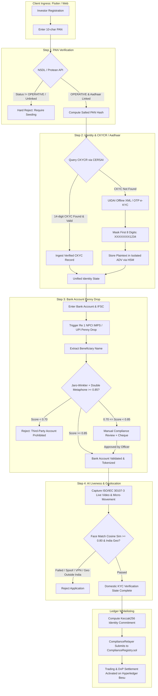

# Domestic KYC/AML, CFT & Prevention of Money Laundering Policy

**Document Reference:** `NBSE-COMP-DOM-004-v3.2`  
**Governing Authorities:** Securities and Exchange Board of India (SEBI) | Financial Intelligence Unit - India (FIU-IND) | Reserve Bank of India (RBI) | Unique Identification Authority of India (UIDAI) | Income Tax Department (CBDT)  
**Applicable Entity:** Growww Technologies India Private Limited (SEBI Registered Stock Broker / Clearing Member) & NBSE Limited (Consortium Stock Exchange Entity)  
**Jurisdiction:** Republic of India (Domestic Territory)  
**Classification:** RESTRICTED — STATUTORY COMPLIANCE & TECHNICAL SPECIFICATION  
**Current Branch:** `Arun`  

---

## 1. Executive Summary & Statutory Mandate

### 1.1 Purpose & Institutional Context
Operating as a regulated fintech intermediary and sovereign financial market infrastructure in India requires rigorous, automated, and mathematically verifiable customer due diligence (CDD). Under the **Prevention of Money Laundering Act (PMLA), 2002**, the **Prevention of Money-Laundering (Maintenance of Records) Rules, 2005**, and the **SEBI Master Circular on Know Your Client (KYC) Norms for the Securities Market**, Growww Technologies India Private Limited (acting as a registered stock broker and depository participant) and NBSE Limited (operating the consortium exchange infrastructure) must ensure that only thoroughly vetted domestic Indian citizens and resident corporate entities can deposit INR, acquire fractional equity security tokens, and participate in secondary market trading.

This document establishes the domestic identity verification policy, tiered anti-money laundering (AML) risk-scoring framework, Politically Exposed Persons (PEP) screening engine, automated Suspicious Transaction Reporting (STR) pipeline, and bank account ownership validation protocols for domestic Indian investors. It translates statutory mandates into concrete algorithmic rules, cryptographic standards, database vault architectures, and JSON schema definitions for the engineering and compliance organizations.

### 1.2 Statutory & Regulatory Framework
This policy is codified in strict alignment with the following primary statutes and circulars:
1. **Prevention of Money Laundering Act, 2002 (PMLA)** and **PMLA (Maintenance of Records) Rules, 2005** (Rule 3, Rule 7, Rule 8, and Rule 9).
2. **SEBI Master Circular on KYC Norms:** Circular `SEBI/HO/MIRSD/SECFATF/P/CIR/2023/169` (and preceding master circulars `SEBI/HO/MIRSD/DOP/CIR/P/2019/111`).
3. **UIDAI Aadhaar Act, 2016** and **Aadhaar and Other Laws (Amendment) Act, 2019**, including UIDAI Circular No. 1 of 2017 regarding mandatory Aadhaar Data Vault (ADV) implementation and the 8-digit masking rule.
4. **Reserve Bank of India (RBI) Master Direction - Know Your Customer (KYC) Direction, 2016** (Updated 2023).
5. **Income Tax Act, 1961 (Section 139AA):** Mandatory linking and seeding of Aadhaar with Permanent Account Number (PAN) and verification of operative status.
6. **Digital Personal Data Protection Act, 2023 (DPDP Act 2023):** Enforcement of purpose limitation, data minimization, cryptographic shredding, and zero PII exposure on distributed ledgers.

### 1.3 The Core Compliance Invariants
All engineering subsystems, API gateways, database schemas, and smart contracts across the platform must enforce the following non-negotiable invariants:

```
+---------------------------------------------------------------------------------------------------+
|                                DOMESTIC COMPLIANCE INVARIANTS                                     |
+---------------------------------------------------------------------------------------------------+
| 1. ZERO-PII ON-CHAIN INVARIANT:                                                                   |
|    Under NO circumstances shall any full name, PAN, Aadhaar number, phone number, email,         |
|    physical address, or plaintext bank account number ever be emitted in a ledger transaction,    |
|    event log, or smart contract storage on Hyperledger Besu. Only salted cryptographic identity    |
|    commitment hashes (bytes32) exist on-chain.                                                    |
|                                                                                                   |
| 2. STRICT 8-DIGIT AADHAAR MASKING:                                                                |
|    Aadhaar numbers must undergo automated cryptographic redaction of the first 8 digits across all|
|    image stores, OCR pipelines, PDF caches, UI screens, API responses, and application logs.      |
|    Format: strictly "XXXXXXXX1234". Zero plaintext exceptions.                                    |
|                                                                                                   |
| 3. ISOLATED AADHAAR DATA VAULT (ADV):                                                             |
|    Plaintext Aadhaar numbers and biometric tokens are stored exclusively inside a dedicated,      |
|    network-isolated, HSM-encrypted PostgreSQL vault using AES-256-GCM. Reference tokenization     |
|    is enforced across all operational services.                                                    |
|                                                                                                   |
| 4. OPERATIVE PAN & SEEDING VALIDATION:                                                            |
|    Only users with an "OPERATIVE" PAN linked to Aadhaar (verified via NSDL/Protean or UTIITSL)    |
|    can be onboarded. Accounts with "INOPERATIVE" or unseeded PANs are blocked at Step 1.          |
|                                                                                                   |
| 5. 100% BANK ACCOUNT MATCH & ZERO THIRD-PARTY FUNDING:                                            |
|    Bank accounts must be verified via ₹1.00 IMPS/UPI Penny Drop. Beneficiary name returned by    |
|    NPCI must match the KYC name with a combined Jaro-Winkler + Double Metaphone score >= 0.85.    |
|    Third-party deposits and non-matched accounts are rejected unconditionally.                    |
|                                                                                                   |
| 6. UNIVERSAL 0.00% FEE PLATFORM MODEL & SGF ALLOCATION:                                          |
|    Growww charges a 0.00% platform fee on trade turnover at launch (100% net proceeds credited;   |
|    future fee adjustments governed by FeeController.sol). Zero holding fees and zero AUM fees are |
|    levied, while 25% of any platform fees is routed to the Core Settlement Guarantee Fund (SGF).   |
+---------------------------------------------------------------------------------------------------+
```

---

## 2. The 4-Step Mandatory Domestic Onboarding Pipeline

The domestic onboarding architecture is designed as a fail-fast, 4-stage sequential state machine. An applicant cannot advance to stage $N+1$ until stage $N$ has successfully resolved and produced an immutable, cryptographically signed verification receipt.



### 2.1 Step 1: PAN Verification & Operative Seeding Gate
The Permanent Account Number (PAN) serves as the primary unique tax identifier for all domestic financial activity in India under Section 139A of the Income Tax Act, 1961.

#### 2.1.1 Structural Syntax Validation
The PAN input string must strictly conform to the 10-character alphanumeric structure governed by the Directorate of Income Tax (Systems):
$$\text{PAN Regex: } \wedge[A-Z]{5}[0-9]{4}[A-Z]{1}\$$

| Character Position | Statutory Meaning | Valid Values | Enforcement Rule |
| :--- | :--- | :--- | :--- |
| **Characters 1–3** | Alphabetic series | `AAA` to `ZZZ` | Running alphabetic sequence |
| **Character 4** | Entity Status Code | `P` (Individual), `C` (Company), `H` (HUF), `F` (Firm), `A` (AOP), `T` (Trust), `B` (BOI), `L` (Local Authority), `J` (Artificial Juridical Person), `G` (Govt) | For retail domestic onboarding, **must equal `P`**. For domestic corporate onboarding, must equal `C`, `H`, `F`, or `T`. |
| **Character 5** | Surname / Last Name Initial | `A` to `Z` | Must match the first character of the applicant's legal surname entered during onboarding. |
| **Characters 6–9** | Sequential numeric digits | `0001` to `9999` | Sequential system digits |
| **Character 10** | Alphabetic Check Digit | `A` to `Z` | Validated against the Income Tax Department checksum formula |

#### 2.1.2 NSDL / Protean API Integration & Status Verification
The platform queries the Income Tax Department database via authorized NSDL/Protean or UTIITSL B2B mTLS endpoints:
1. **Status Code Validation:** The returned field `pan_status` must strictly equal `OPERATIVE`.
   - If `pan_status == "INOPERATIVE"`, onboarding is immediately suspended. The user is prompted with statutory instructions to link Aadhaar via the Income Tax e-Filing portal under Section 139AA.
   - If `pan_status == "DELETION"` or `"SUSPENDED"`, onboarding is terminated and flagged for AML review.
2. **Aadhaar Seeding Status:** The returned boolean `aadhaar_seeding_status` must strictly equal `true`.
3. **Internal Identity Hashing:** Plaintext PAN is never used as a database primary key. The service immediately computes a salted hash:
   $$\text{pan\_sha256} = \text{SHA256}(\text{PAN}_{\text{UPPERCASE}} \parallel \text{SYSTEM\_PAN\_PEPPER})$$
   where `SYSTEM_PAN_PEPPER` is a 256-bit secret stored in CloudHSM. This hash is indexed in PostgreSQL to enforce one-account-per-PAN platform deduplication.

### 2.2 Step 2: Aadhaar Verification & Central KYC Registry (CKYCR) Ingestion

#### 2.2.1 Central KYC Registry (CKYCR / CERSAI) Integration Protocol
In accordance with Rule 9(1A) of the PMLA Rules, 2005, Growww interfaces with the Central Registry of Securitisation Asset Reconstruction and Security Interest of India (CERSAI):
1. **Search & Fetch Workflow:** The KYC microservice queries CERSAI via mTLS using the investor's verified PAN.
2. **Record Evaluation:**
   - If a 14-digit CKYC Identifier exists and the KYC record status is `CURRENT`, the system downloads the CKYC XML/JSON template containing verified photograph, identity proof, and address proof.
   - If the downloaded record satisfies SEBI Master Circular guidelines and is dated within allowable refresh limits, the investor's identity is auto-populated without requiring re-upload of demographic documents.
3. **Registration / Update Workflow:** For new investors who do not possess a CKYC number, or whose details have changed, Growww compiles a CERSAI-compliant XML payload and uploads the record within **10 calendar days** of account creation.

#### 2.2.2 Aadhaar Paperless Offline e-KYC (Aadhaar XML / QR)
If CKYC data is unavailable or outdated, the investor completes Aadhaar Paperless Offline e-KYC:
1. The investor downloads a password-protected `.zip` archive from the UIDAI Resident Portal and defines a 4-character Share Code.
2. The client uploads the ZIP and Share Code to the KYC gateway.
3. The KYC service extracts the inner `offlineaadhaar.xml` and validates:
   - **Digital Signature:** UIDAI's 2048-bit RSA public key certificate chain is verified to guarantee that the document is authentic and unmodified.
   - **Timestamp Check:** The XML generation timestamp must be within 72 hours of upload.
   - **Demographic Extraction:** Name, Date of Birth (DOB), Gender, Residential Address (Care Of, House, Street, Locality, District, State, PIN code), and the 100x120 JPEG photograph are extracted.

#### 2.2.3 UIDAI OTP-Based e-KYC (KUA / ASA Gateway)
Alternatively, investors may authenticate via UIDAI OTP-based e-KYC:
1. The investor enters their 12-digit Aadhaar number into a secure, sandboxed client frame.
2. The request is routed via an authorized Authentication Service Agency (ASA) / KYC User Agency (KUA) to UIDAI Central Identities Data Repository (CIDR).
3. A 6-digit one-time password (OTP) is dispatched to the user's mobile number seeded in Aadhaar.
4. Upon OTP verification, UIDAI returns an encrypted, digitally signed XML packet containing demographic details and photograph.

#### 2.2.4 Mandatory 8-Digit Aadhaar Masking Policy
Under Section 29 of the Aadhaar Act, 2016, and UIDAI Circular No. 1 of 2017:
- **Zero-Plaintext Invariant:** The first 8 digits of the 12-digit Aadhaar number must be redacted everywhere outside the isolated Aadhaar Data Vault.
- **Redaction Format:** In text, logs, and database tables, Aadhaar must strictly appear as `XXXXXXXX1234` or `XXXX-XXXX-1234`.
- **Image Redaction:** For any physical document scan or camera capture containing an Aadhaar card, the platform's automated computer vision pipeline applies an irreversible black masking rectangle over the first 8 digits and the QR code prior to writing the file to object storage (MinIO / AWS S3).
- **Log Sanitation:** All application log shippers (Fluentbit / Vector) enforce a regular expression filter that redacts any sequence of 12 contiguous digits satisfying the Verhoeff algorithm.

### 2.3 Step 3: Bank Account Verification via Penny Drop & Name-Matching Engine

To comply with SEBI regulations and PMLA Rule 9, domestic investors must fund trades exclusively from their own bank accounts. Third-party deposits, transfers from unverified accounts, or joint accounts where the investor is not a primary holder are strictly forbidden.

#### 2.3.1 Penny Drop Execution (IMPS / UPI)
1. The investor enters their bank account number and 11-character Indian Financial System Code (IFSC).
2. Format validation on IFSC: `^[A-Z]{4}0[A-Z0-9]{6}$` (validating bank code, reserved 5th zero, and branch identifier).
3. The KYC banking gateway dispatches a **₹1.00 Penny Drop** via NPCI IMPS rails (or a UPI Reverse Penny Drop).
4. The beneficiary bank processes the credit and returns an NPCI response payload containing:
   - `transaction_status`: `SUCCESS` / `FAILURE`
   - `beneficiary_name`: The raw legal name of the account holder as recorded in the core banking system (CBS).
   - `account_active`: `true` / `false`

#### 2.3.2 Beneficiary Name Pre-Processing & Normalization
The raw string returned by CBS often contains irregular spacing, honorifics, or abbreviation artifacts. The string normalization pipeline applies:
```python
def normalize_name(raw_name: str) -> str:
    # 1. Uppercase & strip whitespace
    s = raw_name.upper().strip()
    # 2. Remove punctuation and special characters
    s = re.sub(r'[^A-Z0-9\s]', '', s)
    # 3. Strip legal and honorific titles
    titles = [
        'SHRI', 'SMT', 'KUMAR', 'KUMARI', 'MR', 'MRS', 'MS', 'DR', 
        'PROF', 'ADV', 'CA', 'COL', 'MAJOR', 'CAPT', 'PVT', 'LTD'
    ]
    words = [w for w in s.split() if w not in titles]
    return ' '.join(words)
```

#### 2.3.3 Dual-Algorithm Name Matching Engine
The normalized name from the bank ($s_{\text{bank}}$) is compared against the verified legal name from PAN / Aadhaar ($s_{\text{kyc}}$) using a hybrid combination of **Jaro-Winkler distance** and **Double Metaphone phonetic similarity**:

1. **Jaro Distance & Jaro-Winkler Metric ($S_{JW}$):**
   $$S_J(s_1, s_2) = \frac{1}{3}\left(\frac{m}{|s_1|} + \frac{m}{|s_2|} + \frac{m - t}{m}\right)$$
   where $m$ is the number of matching characters within distance $\lfloor \frac{\max(|s_1|, |s_2|)}{2} \rfloor - 1$, and $t$ is half the number of character transpositions.
   The Jaro-Winkler score adds a prefix bonus for common prefixes up to length $\ell \le 4$ with scaling factor $p = 0.1$:
   $$S_{JW}(s_1, s_2) = S_J(s_1, s_2) + \ell \cdot p \cdot (1 - S_J(s_1, s_2))$$

2. **Double Metaphone Phonetic Distance ($S_{DM}$):**
   Double Metaphone encodes names into primary and secondary phonetic representations, resolving common Indian dialectal transliterations (e.g., "Vikas" vs "Bikas", "Choudhury" vs "Chowdhury", "Agarwal" vs "Aggarwal", "Lakshmi" vs "Laxmi", or single-letter initial expansions such as "A. Sharma" vs "Anil Sharma").
   If both primary phonetic codes match, $S_{DM} = 1.0$. If secondary codes match, $S_{DM} = 0.85$. Otherwise, Levenshtein distance is evaluated across the phonetic keys.

3. **Composite Name Match Score:**
   $$\text{NameMatchScore} = \max\left(S_{JW}(s_{\text{kyc}}, s_{\text{bank}}), \; 0.70 \cdot S_{JW}(s_{\text{kyc}}, s_{\text{bank}}) + 0.30 \cdot S_{DM}(s_{\text{kyc}}, s_{\text{bank}})\right)$$

#### 2.3.4 Penny Drop Threshold Decision Logic

| Composite Score | Status | Operational Action |
| :--- | :--- | :--- |
| **$\text{Score} \ge 0.85$ (85%)** | `SUCCESS` | **Automated Clearance:** Bank account is permanently bound to the investor UUID. Tokenized account number stored in vault. |
| **$0.70 \le \text{Score} < 0.85$** | `PENDING_MANUAL_REVIEW` | **Edge-Case Escalation:** Account is held in quarantine. The investor must upload a PDF bank statement (last 3 months with verified IFSC) or a personalized cancelled cheque showing the printed name. Reviewed by Compliance Officer within 4 business hours. |
| **$\text{Score} < 0.70$ (70%)** | `FAILED` | **Hard Rejection:** Zero third-party funding invariant enforced. Account registration is rejected immediately. |

### 2.4 Step 4: AI Facial Liveness, Biometric Matching & Geolocation Verification

To satisfy SEBI circular requirements regarding in-person verification (IPV) via digital means (V-CIP guidelines), the investor must complete an automated biometric liveness and geolocation attestation.

#### 2.4.1 Active & Passive Facial Liveness (ISO/IEC 30107-3 PAD)
1. **Passive Liveness:** High-resolution video stream analysis checking for presentation attacks (printed photographs, 4K screen replays, silicone 3D masks, and generative AI deepfakes) via texture diffusion, specular reflection, and micro-movement analysis.
2. **Active Challenge-Response:** The client renders a dynamic, randomized challenge prompt (e.g., "Turn head 25 degrees left, blink twice, then smile") within a 10-second window.
3. The video frames are evaluated using an on-premise neural inference model with a target False Acceptance Rate (FAR) $< 0.001\%$.

#### 2.4.2 1:1 Biometric Facial Comparison
The facial feature vector extracted from the live video feed ($\vec{v}_{\text{live}} \in \mathbb{R}^{512}$) is compared against the reference facial feature vector extracted from the UIDAI Aadhaar XML or CKYC photograph ($\vec{v}_{\text{ref}} \in \mathbb{R}^{512}$):
$$\text{Cosine Similarity} = \frac{\vec{v}_{\text{live}} \cdot \vec{v}_{\text{ref}}}{\|\vec{v}_{\text{live}}\|_2 \|\vec{v}_{\text{ref}}\|_2}$$
- **Threshold:** $\text{Cosine Similarity} \ge 0.80$ is required for automated approval.
- Scores between $0.70$ and $0.79$ are routed to the Principal Officer for secondary review. Scores below $0.70$ trigger biometric rejection.

#### 2.4.3 Sovereign Geofencing & IP Egress Verification
Under the domestic onboarding mandate, the applicant must be physically located within the sovereign territory of the Republic of India at the time of verification:
1. **GNSS Geolocation:** High-accuracy GPS coordinates $(\text{lat}, \text{lon})$ are captured by the client device with hardware tamper verification.
2. **Geofencing Verification:** Coordinates are validated against the official Survey of India boundary polygon including territorial waters.
3. **Network Telemetry & Anti-Proxy Engine:** The client's egress IP address is cross-referenced against commercial threat intelligence databases. Any detection of:
   - Commercial VPN egress nodes,
   - Tor network relays or exit nodes,
   - Datacenter IP hosting ranges (AWS, DigitalOcean, GCP),
   - Location mocking frameworks or Android developer mock location flags,  
   results in an immediate abort of the onboarding session with security event logging.

---

## 3. Aadhaar Data Vault (ADV) Architecture & Strict Masking Standards

### 3.1 Statutory Basis & UIDAI Regulations
Pursuant to Section 29 of the Aadhaar Act, 2016, and UIDAI Circular No. 1 of 2017 (Compulsory Implementation of Aadhaar Data Vault), any entity storing Aadhaar numbers for business purposes must store them in a secure, encrypted, and isolated data vault. Failure to implement ADV constitutes a cognizable offense punishable by imprisonment and monetary penalties under Section 42 of the Act.

### 3.2 ADV Security Architecture & Network Isolation

```
+---------------------------------------------------------------------------------------------------+
|                                 AADHAAR DATA VAULT (ADV) SUBNET                                   |
|                                                                                                   |
|   +--------------------------+       mTLS (TLS 1.3)       +-----------------------------------+   |
|   |   Internal KYC Service   | -------------------------> |    ADV Microservice Daemon        |   |
|   | (Application VPC Subnet) | <------------------------- |   (Isolated VPC / Zero Egress)    |   |
|   +--------------------------+    Returns Reference Token +-----------------------------------+   |
|                                                                     |              ^              |
|                                                     Envelope Encrypt|              | Wrapping Key |
|                                                                     v              v              |
|                                                           +-------------------+ +-------------+   |
|                                                           | PostgreSQL Vault  | | CloudHSM    |   |
|                                                           | (AES-256-GCM      | | FIPS 140-2  |   |
|                                                           |  Ciphertext Only) | | Level 3 MEK |   |
|                                                           +-------------------+ +-------------+   |
+---------------------------------------------------------------------------------------------------+
```

#### 3.2.1 Network & Access Controls
1. **Network Segmentation:** The ADV PostgreSQL database and ADV microservice reside in a dedicated VPC subnet with strict security groups. No internet gateway (IGW) or NAT gateway route exists for this subnet.
2. **mTLS Authorization:** Only the internal `kyc-service` possesses client certificates authorized to communicate with the ADV daemon over mutual TLS 1.3.
3. **Reference Tokenization:** For every stored Aadhaar number, the ADV generates a cryptographically random, non-reversible 128-bit UUIDv4 (`aadhaar_reference_token`).
4. **Zero Exposure:** Downstream business databases (accounts, orders, matching engine, settlement relayer) store and transmit **only** the `aadhaar_reference_token`. Plaintext Aadhaar is never retrieved during regular trading or portfolio operations.

#### 3.2.2 Cryptographic Key Hierarchy & HSM Storage
- **Master Encryption Key (MEK):** Maintained exclusively inside a dedicated FIPS 140-2 Level 3 Hardware Security Module (AWS CloudHSM / on-premise HSM). The MEK never leaves the physical boundary of the HSM.
- **Key Encryption Key (KEK):** Wrapped by the MEK inside the HSM.
- **Data Encryption Key (DEK):** Unique 256-bit symmetric keys generated per partition to encrypt individual database rows.
- **Cipher Algorithm:** AES-256 in Galois/Counter Mode (AES-256-GCM) providing authenticated encryption. Each encryption operation generates a unique 96-bit initialization vector (IV) and a 128-bit authentication tag (`auth_tag`).

#### 3.2.3 ADV Database Schema Specification
```sql
CREATE TABLE aadhaar_data_vault (
    vault_token UUID PRIMARY KEY DEFAULT gen_random_uuid(),
    encrypted_aadhaar_number BYTEA NOT NULL,
    aadhaar_iv BYTEA NOT NULL,             -- 12 bytes
    aadhaar_tag BYTEA NOT NULL,            -- 16 bytes
    masked_aadhaar VARCHAR(12) NOT NULL,    -- Strictly 'XXXXXXXX1234'
    sha256_salted_hash VARCHAR(64) NOT NULL UNIQUE, -- For zero-plaintext lookup
    key_version INTEGER NOT NULL DEFAULT 1,
    created_at TIMESTAMP WITH TIME ZONE DEFAULT CURRENT_TIMESTAMP,
    updated_at TIMESTAMP WITH TIME ZONE DEFAULT CURRENT_TIMESTAMP
);

CREATE INDEX idx_adv_sha256 ON aadhaar_data_vault(sha256_salted_hash);
```

#### 3.2.4 Automated Key Rotation & Crypto-Re-Encryption
- **Rotation Periodicity:** KEK and DEKs are automatically rotated every 365 calendar days.
- **Rolling Re-Encryption:** A background daemon decrypts stored records using `key_version = N` and re-encrypts using `key_version = N + 1` with newly generated IVs and tags without system downtime.

---

## 4. AML Risk Scoring Matrix & Investor Categorization Framework

Under Rule 9 of the PMLA Rules, 2005, and SEBI circular guidelines, Growww implements an automated risk categorization engine classifying every domestic investor into **Low Risk**, **Medium Risk**, or **High Risk**.

### 4.1 Algorithmic Risk Scoring Formulation
The investor's aggregate risk score ($R_{\text{composite}} \in [0, 100]$) is computed using a weighted multi-factor linear equation:
$$R_{\text{composite}} = \left( W_{\text{inc}} \cdot S_{\text{inc}} \right) + \left( W_{\text{occ}} \cdot S_{\text{occ}} \right) + \left( W_{\text{geo}} \cdot S_{\text{geo}} \right) + \left( W_{\text{tx}} \cdot S_{\text{tx}} \right)$$

Where weights are statically assigned as:
$$W_{\text{inc}} = 0.20, \quad W_{\text{occ}} = 0.35, \quad W_{\text{geo}} = 0.20, \quad W_{\text{tx}} = 0.25 \quad \left(\sum W = 1.00\right)$$

### 4.2 Scoring Factor Tables

#### 4.2.1 Factor 1: Declared Annual Income Slab ($S_{\text{inc}}$)
| Annual Income Bracket (INR) | Risk Score ($S_{\text{inc}}$) | Regulatory Rationale |
| :--- | :--- | :--- |
| **Below ₹5,00,000** | 10 | Mass retail retail base; low money laundering exposure |
| **₹5,00,000 – ₹25,00,000** | 20 | Middle-income retail; standard trading volumes |
| **₹25,00,000 – ₹1,00,00,000** | 35 | Affluent / Mass affluent; moderate portfolio size |
| **Above ₹1,00,00,000 (High Net Worth)** | 50 | High capital velocity; potential high-volume structuring risks |

#### 4.2.2 Factor 2: Occupation & Beneficial Ownership Profile ($S_{\text{occ}}$)
| Occupation Category | Risk Score ($S_{\text{occ}}$) | Regulatory Rationale |
| :--- | :--- | :--- |
| **Salaried (Central / State Government, PSU)** | 5 | Fully vetted public servants; transparent taxable income |
| **Salaried (Reputed Listed Corporate / MNC)** | 10 | Verified corporate payroll; Form 16 / TDS verifiable |
| **Salaried (Private SME / Unlisted Entity)** | 15 | Standard private employment |
| **Self-Employed Professional (Doctor, CA, Advocate)** | 15 | Regulated professional councils; traceable fees |
| **Agriculture / Farming** | 20 | Tax-exempt agricultural income; cash-flow variances |
| **Self-Employed Business / Retail Trader** | 25 | Variable revenues; cash transaction potential |
| **Student / Homemaker / Retired** | 25 | Dependent income; monitoring for third-party account mules |
| **Cash-Intensive Industries** (Bullion, Gems, Real Estate, Scrap Metal) | 45 | High vulnerability to money laundering and cash layering |
| **Politically Exposed Person (PEP)** or Immediate Relative / Close Associate | 80 | Statutory high-risk classification requiring mandatory EDD |

#### 4.2.3 Factor 3: Geographic Jurisdictional Risk ($S_{\text{geo}}$)
| Geographic Jurisdiction | Risk Score ($S_{\text{geo}}$) | Regulatory Rationale |
| :--- | :--- | :--- |
| **Tier 1 Metro Cities & State Capitals** | 5 | High financial inclusion; extensive banking footprint |
| **Tier 2 / Tier 3 Urban Municipalities** | 10 | Standard domestic urban areas |
| **Rural / Semi-Urban Districts** | 15 | Standard domestic rural |
| **Designated Border Districts / Sensitive Areas** | 35 | MHA-notified border jurisdictions vulnerable to cross-border Hawala |

#### 4.2.4 Factor 4: Behavioral & Transaction Velocity Profile ($S_{\text{tx}}$)
| Observed Platform Behavior | Risk Score ($S_{\text{tx}}$) | Surveillance Logic |
| :--- | :--- | :--- |
| **Systematic SIP / Buy-and-Hold Long Term** | 5 | Normal wealth accumulation behavior |
| **Standard Secondary Market Day Trading** | 15 | Routine active market participation |
| **Frequent High-Value INR Turnover ($\ge 3\times$ income)** | 40 | High velocity relative to declared earnings slab |
| **Rapid Deposit-Withdrawal Churning** ($>80\%$ churn in 24h) | 60 | Layering indicator; potential mule account behavior |

### 4.3 Risk Tier Classification & Governance Regimes

```mermaid
graph LR
    Score[Composite Risk Score: 0 to 100] --> Check{Score Range}
    Check -- "0 to 39" --> Low[LOW RISK TIER]
    Check -- "40 to 69" --> Med[MEDIUM RISK TIER]
    Check -- "70 to 100" --> High[HIGH RISK TIER]

    Low --> Low_Pol[Standard CDD | Re-KYC: 10 Years | Monthly Anomaly Scan]
    Med --> Med_Pol[Enhanced CDD | Re-KYC: 8 Years | Bi-Weekly Re-Screen]
    High --> High_Pol[Mandatory EDD | Re-KYC: 2 Years | Real-Time AML Alerts | Principal Officer Sign-Off]
```

| Risk Tier | Score Range | Customer Due Diligence Regime | Re-KYC Cycle | Surveillance Intensity |
| :--- | :--- | :--- | :--- | :--- |
| **LOW RISK** | 0 – 39 | **Simplified / Standard CDD:** Automated verification of PAN, Aadhaar, and Bank Account. | **Every 10 Years** (with annual in-app self-declaration) | Automated monthly batch anomaly sweep |
| **MEDIUM RISK** | 40 – 69 | **Standard CDD + Source of Wealth:** Declarations required for annual income and net worth. | **Every 8 Years** | Bi-weekly transaction reconciliation and delta sanctions scan |
| **HIGH RISK** | 70 – 100 | **Enhanced Due Diligence (EDD):** Mandatory proof of income (ITR), live V-CIP, Principal Officer approval. | **Every 2 Years** | Real-time continuous transaction monitoring; automated STR triggers |

---

## 5. Enhanced Due Diligence (EDD) Triggers & Escalation Runbook

### 5.1 Automated EDD Triggers
The platform surveillance engine continuously monitors investor accounts. An investor is automatically moved to `EDD_REQUIRED` status when any of the following triggers fire:
1. **Sudden Deposit Spikes:** Any single fiat deposit exceeding ₹25,00,000, or cumulative 30-day deposits exceeding **$5\times$ the investor's declared monthly income**.
2. **Rapid Fund Velocity (Layering Detection):** Ingress of fiat funds followed by immediate equity liquidation or withdrawal request of $>80\%$ of the balance within **24 hours** without substantive holding period.
3. **Structuring / Smurfing Threshold:** Multiple deposits just beneath statutory reporting thresholds (e.g., three separate deposits of ₹9,50,000 within 14 calendar days).
4. **PEP Identification:** Positive identification of the investor or beneficial owner as a Politically Exposed Person (PEP) or immediate family member.
5. **Geographical Inconsistency:** Discrepancy greater than 500 km between the device IP location, bank account branch location, and Aadhaar registered address without reasonable professional justification.
6. **Adverse Media & Law Enforcement Flags:** Automated alerts from negative news aggregators, CBI, ED, or SFIO public notifications.

### 5.2 Mandatory EDD Verification Dossier
When an account enters `EDD_REQUIRED`, secondary market buying and fiat withdrawals are immediately paused. The investor must submit the following documentary proof within 15 calendar days:
- **Income Tax Returns (ITR-V):** Complete ITR acknowledgement and Computation of Income for the preceding **two assessment years**.
- **Bank Statements:** Certified 6-month bank statements of the linked bank account showing regular cash flows and origin of deposited funds.
- **Corporate Entity Accounts:**
  - Audited balance sheets and profit & loss statements for the last two financial years.
  - Certificate of Incorporation, Memorandum & Articles of Association (MOA/AOA).
  - Board Resolution authorizing investment on Growww/NBSE and designating authorized signatories.
  - Beneficial Ownership Declaration: Identification of any natural person holding $>10\%$ controlling ownership interest or voting rights (Rule 9 of PMLA Rules, 2005).
- **Mandatory Live V-CIP:** Scheduled live video customer identification process conducted by a certified compliance officer.

### 5.3 Principal Officer Approval Protocol
- All EDD files are compiled into an encrypted compliance dossier and assigned to the **Principal Officer (PMLA)**.
- The Principal Officer must execute a digital approval using their PKI hardware token to:
  1. Approve the source of funds and restore active trading status.
  2. Maintain the account under High Risk monitoring with restricted deposit limits.
  3. Reject the account, initiate contract liquidation, return funds to the originating bank, and file an automated Suspicious Transaction Report (STR) with FIU-IND.

---

## 6. Politically Exposed Persons (PEP) & Sanctions Screening Engine

### 6.1 Domestic & Foreign PEP Definition
In accordance with the RBI Master Direction on KYC and SEBI regulations:
- **Politically Exposed Persons (PEPs)** are individuals who are or have been entrusted with prominent public functions.
- **Domestic PEP Scope:**
  1. Heads of State, Prime Minister, Union Cabinet Ministers, Chief Ministers, and State Cabinet Ministers.
  2. Members of Parliament (Lok Sabha & Rajya Sabha) and Members of State Legislative Assemblies/Councils (MLAs/MLCs).
  3. Senior government officials (Joint Secretary and above in Central Ministries, State Chief Secretaries).
  4. Senior judicial officers (Judges of the Supreme Court of India and High Courts).
  5. Senior military officers (Lieutenant General, Vice Admiral, Air Marshal, and above).
  6. Senior executives of state-owned corporations and Public Sector Undertakings (CMDs, Executive Directors).
  7. High-ranking functionaries of recognized national and state political parties.
- **Close Associates & Family:** First-degree relatives (parents, spouse, children, siblings) and business associates holding joint accounts or corporate directorships with PEPs are classified under identical PEP guidelines.

### 6.2 Domestic Sanctions & Law Enforcement Watchlists
The screening daemon connects to automated, daily-updated feeds covering:
1. **MHA UAPA Schedule 1 & 4:** Banned terrorist organizations and notified individuals under the Unlawful Activities (Prevention) Act, 1967.
2. **UNSC Consolidated Sanctions List:** United Nations Security Council Resolutions 1267 (ISIL/Al-Qaida), 1988 (Taliban), and 1718 (DPRK).
3. **FIU-IND Deficient & Terrorist Financing Lists.**
4. **CBI, NIA, and Enforcement Directorate (ED)** Most Wanted and Fugitive Economic Offenders lists.
5. **FATF High-Risk & Monitored Jurisdictions** (Black and Grey Lists).

### 6.3 Screening Mechanics & Positive Match Action Plan
- **Pre-Onboarding Synchronous Gate:** Screening executes prior to completing Step 2. Any exact match immediately blocks onboarding.
- **Automated Nightly Delta Sweep:** The entire active domestic investor database is re-screened every 24 hours against newly published sanctions updates.
- **Positive Sanctions Match Protocol:**
  1. **Immediate Account Freezing:** All open orders on the matching engine are cancelled within $<50\text{ ms}$. Fiat withdrawals and token transfers are locked.
  2. **On-Chain Freeze:** The Compliance Relayer submits `ComplianceRegistry.freezeTradingAccount(walletAddress, reasonCode, proofHash)` to Hyperledger Besu.
  3. **Section 51A UAPA Order Compliance:** An emergency freeze notification is submitted to the Central Nodal Officer (MHA) and FIU-IND within **24 hours** of identification.

---

## 7. Statutory FIU-IND Reporting Architecture (FINnet 2.0 XML Engine)

Growww Technologies India Pvt. Ltd. and NBSE Ltd. operate as registered Reporting Entities (RE) with the Financial Intelligence Unit - India (FIU-IND) under PMLA Section 12.

### 7.1 Statutory Reporting Categories & Timelines

```
+---------------------------------------------------------------------------------------------------+
|                                  FIU-IND REPORTING SUITE                                          |
+---------------------------------------------------------------------------------------------------+
| 1. SUSPICIOUS TRANSACTION REPORT (STR):                                                           |
|    Triggered when transactions give rise to reasonable suspicion of proceeds of crime, financing   |
|    of terrorism, economic irrationality, or structuring under statutory thresholds.               |
|    Statutory Deadline: Must be filed within 7 WORKING DAYS of the Principal Officer arriving      |
|    at a conclusion of suspicion.                                                                  |
|                                                                                                   |
| 2. CASH TRANSACTION REPORT (CTR):                                                                 |
|    All cash transactions exceeding ₹10,00,000 (Ten Lakhs) or an integrally connected series of   |
|    cash transactions exceeding ₹10,00,000 within a single calendar month.                         |
|    Statutory Deadline: Must be filed by the 15TH DAY of the succeeding calendar month.            |
|                                                                                                   |
| 3. NON-PROFIT ORGANIZATION TRANSACTION REPORT (NTR):                                              |
|    All transactions involving receipts by non-profit organizations exceeding ₹10,00,000.          |
|    Statutory Deadline: Must be filed by the 15TH DAY of the succeeding calendar month.            |
|                                                                                                   |
| 4. CROSS-BORDER WIRE TRANSFER REPORT (CBWTR):                                                     |
|    All cross-border wire transfers exceeding ₹5,00,000 equivalent.                                |
|    Statutory Deadline: Must be filed by the 15TH DAY of the succeeding calendar month.            |
+---------------------------------------------------------------------------------------------------+
```

### 7.2 FINnet 2.0 XML Generation Pipeline
All statutory filings are automatically generated by the compliance surveillance daemon into the standardized **FIU-IND FINnet 2.0 XML** schema format:

```xml
<?xml version="1.0" encoding="UTF-8"?>
<BatchDetails xmlns="http://fiuindia.gov.in/finnet2.0">
  <BatchHeader>
    <DataStructureVersion>2.0</DataStructureVersion>
    <GenerationDateTime>2026-09-19T23:30:00Z</GenerationDateTime>
    <ReportingEntityName>GROWWW TECHNOLOGIES INDIA PRIVATE LIMITED</ReportingEntityName>
    <ReportingEntityCategory>STKBRK</ReportingEntityCategory>
    <ReportingEntityID>INZ000301838</ReportingEntityID>
    <BatchID>GROWWW-STR-20260919-00142</BatchID>
    <ReportType>STR</ReportType>
  </BatchHeader>
  <ReportData>
    <ReportSummary>
      <SuspicionCategory>STRUCTURING_AND_INCOME_INCONSISTENCY</SuspicionCategory>
      <Priority>HIGH</Priority>
    </ReportSummary>
    <IndividualDetails>
      <InvestorUUID>a4f3b7c2-9e81-4d32-8a15-f6289b431e07</InvestorUUID>
      <PANHash>e3b0c44298fc1c149afbf4c8996fb92427ae41e4649b934ca495991b7852b855</PANHash>
      <CKYCIdentifier>30048192847192</CKYCIdentifier>
      <MaskedAadhaar>XXXXXXXX1234</MaskedAadhaar>
    </IndividualDetails>
    <TransactionSummary>
      <CumulativeAmountINR>2850000.00</CumulativeAmountINR>
      <TransactionCount>3</TransactionCount>
      <TransactionPeriodStart>2026-09-10T10:00:00Z</TransactionPeriodStart>
      <TransactionPeriodEnd>2026-09-17T16:30:00Z</TransactionPeriodEnd>
    </TransactionSummary>
  </ReportData>
</BatchDetails>
```

#### 7.2.1 Secure Electronic Submission
1. The FINnet 2.0 XML batch file is signed with the Principal Officer’s Class 3 PKI Digital Signature Certificate.
2. The payload is encrypted using the public RSA key of FIU-IND FinGate.
3. The encrypted archive is dispatched via mutual TLS SFTP to the secure FIU-IND FinGate gateway.
4. The system logs the transmission timestamp, acknowledgement receipt number (ARN), and stores the record in immutable WORM storage.

---

## 8. Re-KYC Periodicity & Lifecycle State Machine

In accordance with SEBI Master Circular mandates and Rule 9(1) of PMLA Rules, 2005, customer due diligence is an ongoing obligation. Verification records expire periodically based on the investor's designated risk tier.

### 8.1 Statutory Periodicity Schedule
- **Low Risk Investors:** Mandatory Re-KYC every **10 years**. In interim years, the investor completes an annual automated in-app confirmation declaring zero change in contact details, residential address, or tax status.
- **Medium Risk Investors:** Mandatory Re-KYC every **8 years**.
- **High Risk Investors (including PEPs):** Mandatory comprehensive Re-KYC every **2 years**, requiring updated ITRs, recent bank statements, and V-CIP re-verification.

### 8.2 In-App Multi-Channel Notification Cadence
Automated background schedulers monitor expiry timestamps (`whitelist_expiry`) and dispatch alerts across push notifications, SMS, and registered email:
- **T-90 Days:** Initial in-app banner and email notification inviting seamless digital re-KYC.
- **T-60 Days:** Bi-weekly reminder notifications.
- **T-30 Days:** Weekly high-priority alerts detailing upcoming account trading restrictions.
- **T-15 Days:** Daily push notifications and SMS warnings.
- **T-7 Days:** P1 critical alert banner pinned to mobile workstation HUD.

### 8.3 Overdue Grace Period & Escalation States

```mermaid
stateDiagram-v2
    [*] --> Active : KYC Approved
    Active --> ReKYC_Due : Whitelist Expiry Reached (T-0)
    
    state "Restricted Trading (Grace Period)" as Restricted {
        ReKYC_Due --> BuyBlocked : Day 1 to 30 Post-Expiry
        BuyBlocked --> WithdrawAllowed : Sell Resting / Withdraw to Registered Bank Permitted
    }
    
    Restricted --> Active : Re-KYC Completed Successfully
    Restricted --> Frozen : Day 31+ Post-Expiry
    
    state "Frozen Re-KYC Overdue" as Frozen {
        Frozen --> LedgerRevocation : ComplianceRegistry.revokeInvestorCommitment()
        LedgerRevocation --> TradingHalted : All Orders & Transfers Blocked
    }
    
    Frozen --> Active : Full Remediation & Principal Officer Approval
```

1. **Grace Period (Day 1 to 30 Post-Expiry) — `RESTRICTED_TRADING`:**
   - Buying new fractional equity tokens is blocked.
   - Depositing new INR funds is blocked.
   - Selling existing holdings to INR and withdrawing to the verified bank account remains active.
2. **Hard Suspension (Day 31+ Post-Expiry) — `FROZEN_RE_KYC_OVERDUE`:**
   - All account operations are suspended.
   - The compliance relayer submits a revocation transaction to `ComplianceRegistry.sol` on Hyperledger Besu, blocking all on-chain DvP settlements and token transfers.
   - Account can only be unlocked through a complete re-onboarding cycle approved by compliance officers.

---

## 9. Hyperledger Besu On-Chain Identity Commitment & `ComplianceRegistry.sol`

A foundational architectural requirement of the Growww / NBSE enterprise blockchain is the absolute separation of sensitive real-world identities from the distributed ledger.

### 9.1 The Zero-PII Ledger Invariant
Hyperledger Besu serves strictly as an immutable clearing, DvP settlement, and ownership ledger.
- **Prohibited On-Chain:** Names, PAN strings, Aadhaar numbers, mobile numbers, email addresses, residential addresses, and plaintext bank account numbers.
- **Permitted On-Chain:** Pseudonymous cryptographic Ethereum addresses (`0x...`), fractional security token balances, batch settlement hashes, and 32-byte cryptographic identity commitments.

### 9.2 Cryptographic Identity Commitment Formulation
Upon successful domestic KYC verification, the KYC service generates an irreversible, blinded 32-byte identity commitment hash using Ethereum’s native Keccak-256 primitive:

$$\text{IdentityCommitment} = \text{keccak256}\left( \text{abi.encodePacked}(\text{pan\_hash}, \; \text{investor\_uuid}, \; \text{salt}) \right)$$

Where:
1. `pan_hash` (`bytes32`): $\text{SHA256}(\text{PAN}_{\text{UPPERCASE}} \parallel \text{SYSTEM\_PAN\_PEPPER})$.
2. `investor_uuid` (`bytes16`): The canonical 128-bit internal UUID of the investor.
3. `salt` (`bytes32`): A cryptographically secure random 256-bit salt generated per investor by CloudHSM and stored exclusively inside the isolated credentials vault.

```solidity
// Mathematical Equivalent in Solidity / Go / Rust
bytes32 commitment = keccak256(
    abi.encodePacked(
        bytes32(panSha256),
        bytes16(investorUUID),
        bytes32(userSecretSalt)
    )
);
```

### 9.3 `ComplianceRegistry.sol` Interface & Mechanics

The `ComplianceRegistry.sol` contract deployed on Hyperledger Besu QBFT permissioned ledger maintains the on-chain whitelisting state for all trading wallets:

```solidity
// SPDX-License-Identifier: Apache-2.0
pragma solidity 0.8.24;

interface IComplianceRegistry {
    enum RiskTier { NONE, LOW, MEDIUM, HIGH }

    struct InvestorRecord {
        bytes32 commitmentHash;
        uint64 whitelistExpiry;
        RiskTier riskTier;
        bool isFrozen;
    }

    event InvestorWhitelisted(
        address indexed investorWallet, 
        bytes32 indexed commitmentHash, 
        uint64 whitelistExpiry, 
        RiskTier riskTier
    );
    event InvestorFrozen(address indexed investorWallet, bytes32 indexed reasonCode, bytes32 proofHash);
    event InvestorUnfrozen(address indexed investorWallet, bytes32 indexed authorizationHash);
    event CommitmentRevoked(address indexed investorWallet);

    function registerInvestor(
        address investorWallet,
        bytes32 commitmentHash,
        uint64 whitelistExpiry,
        RiskTier riskTier
    ) external;

    function isInvestorCompliant(address investorWallet) external view returns (bool);
    function verifyCommitment(address investorWallet, bytes32 commitmentHash) external view returns (bool);
    function freezeTradingAccount(address investorWallet, bytes32 reasonCode, bytes32 proofHash) external;
    function unfreezeTradingAccount(address investorWallet, bytes32 authorizationHash) external;
    function revokeInvestorCommitment(address investorWallet) external;
}
```

### 9.4 Transfer Gating in `DigitalSecurityToken.sol` & `SettlementDvP.sol`
During every secondary market execution, fractional token transfer, or atomic DvP settlement:
1. The smart contracts invoke `complianceRegistry.isInvestorCompliant(from)` and `complianceRegistry.isInvestorCompliant(to)`.
2. The verification requires:
   $$\text{isInvestorCompliant}(A) \iff \left( \text{whitelistExpiry}_A > \text{block.timestamp} \right) \land \left( \neg \text{isFrozen}_A \right) \land \left( \text{commitmentHash}_A \neq 0x0 \right)$$
3. If either buyer or seller fails compliance verification, the transaction immediately reverts with `ComplianceGatingError()`, preventing non-compliant, expired, or frozen entities from executing transactions.

---

## 10. Data Structures & JSON Schema Specification

### 10.1 Canonical JSON Schema: `DomesticKYCVerificationState`
The following JSON schema defines the authoritative data contract produced upon completion of domestic onboarding. It is enforced across microservice boundaries, event streams (Kafka topics `compliance.kyc.domestic.verified.v1`), and data storage layers:

```json
{
  "$schema": "http://json-schema.org/draft-07/schema#",
  "title": "DomesticKYCVerificationState",
  "type": "object",
  "properties": {
    "investor_uuid": { 
      "type": "string", 
      "format": "uuid",
      "description": "Unique canonical identifier for the investor."
    },
    "pan_verification": {
      "type": "object",
      "properties": {
        "pan_sha256": { 
          "type": "string", 
          "pattern": "^[a-f0-9]{64}$",
          "description": "Salted SHA-256 hash of the 10-character PAN string."
        },
        "pan_status": { 
          "type": "string", 
          "enum": ["OPERATIVE", "INOPERATIVE", "DELETION"],
          "description": "Active status verified directly against NSDL/Protean database."
        },
        "aadhaar_linked": { 
          "type": "boolean",
          "description": "Explicit confirmation of PAN-Aadhaar linkage under Section 139AA."
        },
        "nsdl_verified_at": { 
          "type": "string", 
          "format": "date-time",
          "description": "ISO 8601 UTC timestamp of successful NSDL query."
        }
      },
      "required": ["pan_sha256", "pan_status", "aadhaar_linked", "nsdl_verified_at"]
    },
    "bank_verification": {
      "type": "object",
      "properties": {
        "account_number_vault_token": { 
          "type": "string",
          "description": "Opaque reference token generated by the isolated banking vault."
        },
        "ifsc": { 
          "type": "string", 
          "pattern": "^[A-Z]{4}0[A-Z0-9]{6}$",
          "description": "Valid 11-character Indian Financial System Code."
        },
        "penny_drop_status": { 
          "type": "string", 
          "enum": ["SUCCESS", "FAILED"],
          "description": "Execution status of the Re 1 IMPS/UPI penny drop."
        },
        "name_match_score": { 
          "type": "number", 
          "minimum": 0.0, 
          "maximum": 1.0,
          "description": "Composite Jaro-Winkler + Double Metaphone phonetic similarity score."
        }
      },
      "required": ["account_number_vault_token", "ifsc", "penny_drop_status", "name_match_score"]
    },
    "aml_risk_profile": {
      "type": "object",
      "properties": {
        "risk_tier": { 
          "type": "string", 
          "enum": ["LOW", "MEDIUM", "HIGH"],
          "description": "Composite AML risk categorization tier."
        },
        "pep_status": { 
          "type": "boolean",
          "description": "Politically Exposed Person flag."
        },
        "sanctions_clear": { 
          "type": "boolean",
          "description": "Confirmation of zero matches across MHA/UAPA/UNSC sanctions watchlists."
        },
        "fiu_str_flagged": { 
          "type": "boolean",
          "description": "Internal flag indicating if an STR alert is active for FIU-IND."
        }
      },
      "required": ["risk_tier", "pep_status", "sanctions_clear", "fiu_str_flagged"]
    },
    "on_chain_commitment": {
      "type": "object",
      "properties": {
        "identity_commitment_hash": { 
          "type": "string", 
          "pattern": "^0x[a-fA-F0-9]{64}$",
          "description": "Keccak-256 identity commitment hash submitted to ComplianceRegistry.sol."
        },
        "whitelist_expiry": { 
          "type": "integer",
          "description": "Unix epoch timestamp in seconds marking validity expiration."
        }
      },
      "required": ["identity_commitment_hash", "whitelist_expiry"]
    }
  },
  "required": [
    "investor_uuid", 
    "pan_verification", 
    "bank_verification", 
    "aml_risk_profile", 
    "on_chain_commitment"
  ]
}
```

### 10.2 Production JSON Instance Example
```json
{
  "investor_uuid": "a4f3b7c2-9e81-4d32-8a15-f6289b431e07",
  "pan_verification": {
    "pan_sha256": "e3b0c44298fc1c149afbf4c8996fb92427ae41e4649b934ca495991b7852b855",
    "pan_status": "OPERATIVE",
    "aadhaar_linked": true,
    "nsdl_verified_at": "2026-09-19T18:30:00Z"
  },
  "bank_verification": {
    "account_number_vault_token": "vlt_tok_9b83f12a83e742e9",
    "ifsc": "HDFC0001234",
    "penny_drop_status": "SUCCESS",
    "name_match_score": 0.94
  },
  "aml_risk_profile": {
    "risk_tier": "LOW",
    "pep_status": false,
    "sanctions_clear": true,
    "fiu_str_flagged": false
  },
  "on_chain_commitment": {
    "identity_commitment_hash": "0x8a92f0174e92a834b67e0182c49b294e01928475a8930218bca48291048291a4",
    "whitelist_expiry": 1884489600
  }
}
```

---

## 11. Statutory Record Retention, DPDP Act 2023 & Crypto-Shredding

### 11.1 PMLA Statutory Retention Rule (Rule 3)
Under Rule 3 of the PMLA (Maintenance of Records) Rules, 2005:
- **Mandatory 5-Year Retention:** Every reporting entity must maintain all customer identity records, account opening documentation, KYC verification receipts, and transaction records for a **minimum statutory period of five (5) years** following:
  1. The termination of the business relationship between the client and Growww / NBSE, or
  2. The formal closure of the investor's trading and demat account, whichever is later.
- **Immutable WORM Storage:** Retention records are archived in Write-Once-Read-Many (WORM) compliant S3 object storage with Object Lock (Compliance Mode) preventing deletion or modification by any administrator or compromised key.

### 11.2 DPDP Act 2023 Harmonization & Crypto-Shredding Protocol (ADR-0007)
Under Section 12 of the Digital Personal Data Protection Act, 2023 (DPDP Act), data principals have the right to correction and erasure of their personal data. However, this right is bounded by statutory data retention requirements under Section 8(7) of the DPDP Act and Section 12 of the PMLA.

#### 11.2.1 Two-Stage Data Lifecycle
1. **Stage 1: Statutory Lock Period (Years 0 to 5 Post-Account Closure):**
   - Personal data is removed from operational databases and active search indices.
   - The encrypted records remain preserved in immutable WORM storage to satisfy statutory inspection demands by SEBI, ED, or FIU-IND.
   - Erasure requests submitted during this window are formally acknowledged and scheduled for automatic execution at the exact expiry of the 5-year statutory clock.
2. **Stage 2: Crypto-Shredding Erasure (Post Year 5):**
   - All off-chain personal data records are stored using envelope encryption with a user-specific Data Encryption Key (DEK).
   - Upon the passage of the 5-year statutory mandate, the erasure daemon executes **Crypto-Shredding**:
     1. The user's individual DEK is permanently deleted from CloudHSM.
     2. Without the DEK, historical encrypted backups, cold archives, and replica logs become mathematically unrecoverable ($2^{256}$ computational complexity).
     3. On-chain, the user's identity commitment remains permanently anonymous and un-linkable, preserving the cryptographic integrity of historical Hyperledger Besu blocks without violating the user's statutory privacy rights.

---

## 12. Corporate Governance, Supervisory Roles & Formal Sign-Off

### 12.1 Governance Roles & Statutory Responsibilities

| Role | Appointed Authority | Primary Statutory Responsibility |
| :--- | :--- | :--- |
| **Principal Officer (PMLA)** | Board of Directors (Section 13 of PMLA) | Executive oversight of AML/CFT framework; direct liaison with FIU-IND; sole statutory authority to approve and submit STRs, CTRs, and NTRs via FINnet 2.0. |
| **Designated Director** | Board of Directors (Section 13(2) of PMLA) | Overall compliance governance; ensuring adequacy of operational infrastructure and reporting systems; liable for statutory reporting compliance. |
| **Chief Information Security Officer (CISO)** | Executive Leadership | Architectural integrity of Aadhaar Data Vault, CloudHSM key lifecycle, zero-PII ledger enforcement, and ISO 27001 / SOC 2 compliance. |
| **Lead Blockchain Settlement Architect** | Technology Leadership | Smart contract transfer gating (`ComplianceRegistry.sol`, `DigitalSecurityToken.sol`), identity commitment generation, and consensus security. |
| **Compliance Surveillance Team** | Compliance Operations | First-line alert triage, penny drop manual reviews, adverse media screening, and V-CIP video interview verification. |

### 12.2 Regulatory Audit & Inspection Readiness
- **Independent Annual AML Audit:** An independent audit of Growww's KYC/AML systems, Aadhaar Data Vault, and FIU reporting pipelines is conducted annually by an empaneled Chartered Accountant firm and CERT-In certified security auditors.
- **Audit Trails:** Every state machine transition, external API query (NSDL, CERSAI, NPCI), and compliance override produces a cryptographically signed audit log containing:
  - Timestamp (UTC microsecond accuracy)
  - Operator / Service ID
  - Investor UUID
  - Action performed & cryptographic proof hash
  - Input/Output digests (SHA-256)

### 12.3 Formal Sign-Off

This Domestic KYC/AML & Prevention of Money Laundering Policy document has been thoroughly reviewed and formally approved by the competent authorities:

```
+---------------------------------------------------------------------------------------------------+
|                                 FORMAL STATUTORY APPROVAL & SIGN-OFF                              |
+---------------------------------------------------------------------------------------------------+
| Principal Officer (PMLA):                                                                         |
| Name: R. Sundararajan, FCS                                                                        |
| Designation: Vice President & Principal Officer — Regulatory Compliance                           |
| Status: APPROVED & RATIFIED                                                                       |
| Date: 2026-09-19                                                                                  |
|                                                                                                   |
| Designated Director (PMLA):                                                                       |
| Name: Vikram Malhotra                                                                             |
| Designation: Whole-Time Director, Growww Technologies India Pvt. Ltd.                            |
| Status: APPROVED & RATIFIED                                                                       |
| Date: 2026-09-19                                                                                  |
|                                                                                                   |
| Chief Information Security Officer (CISO):                                                        |
| Name: Dr. Ananya Sengupta, CISSP, CISA                                                            |
| Designation: Head of Information Security & Cryptographic Systems                                 |
| Status: APPROVED & RATIFIED                                                                       |
| Date: 2026-09-19                                                                                  |
|                                                                                                   |
| Lead Blockchain Settlement Architect:                                                             |
| Name: Arun K. (Lead Systems & Settlement Engineer)                                                |
| Branch: Arun                                                                                      |
| Status: ARCHITECTURALLY VERIFIED & AUDITED                                                        |
| Date: 2026-09-19                                                                                  |
+---------------------------------------------------------------------------------------------------+
```
