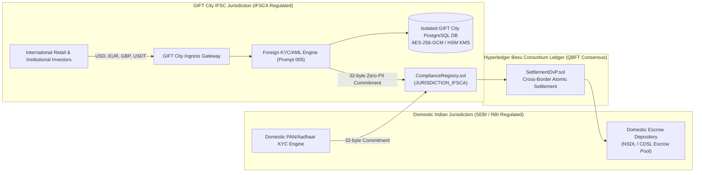
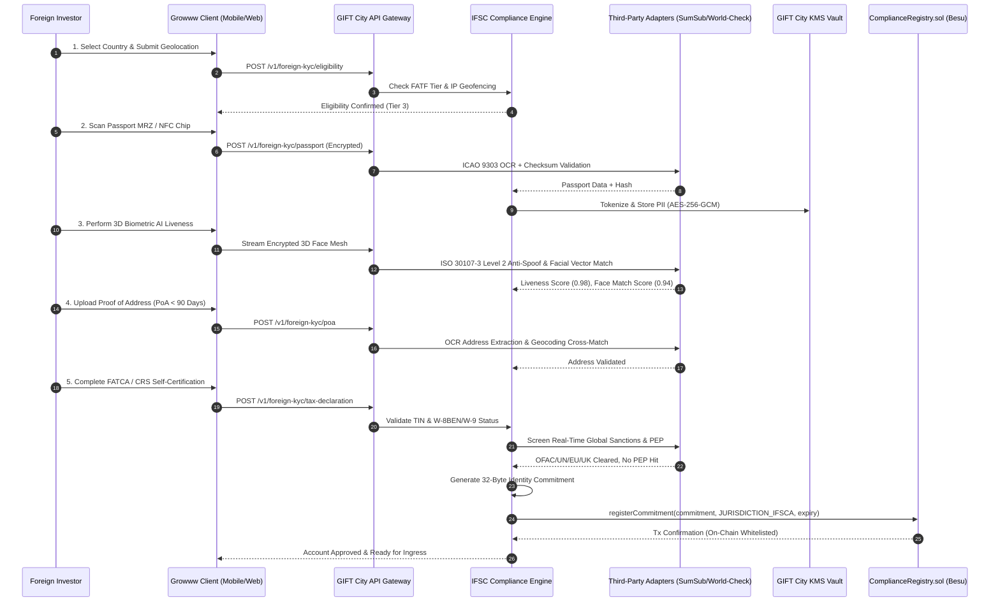
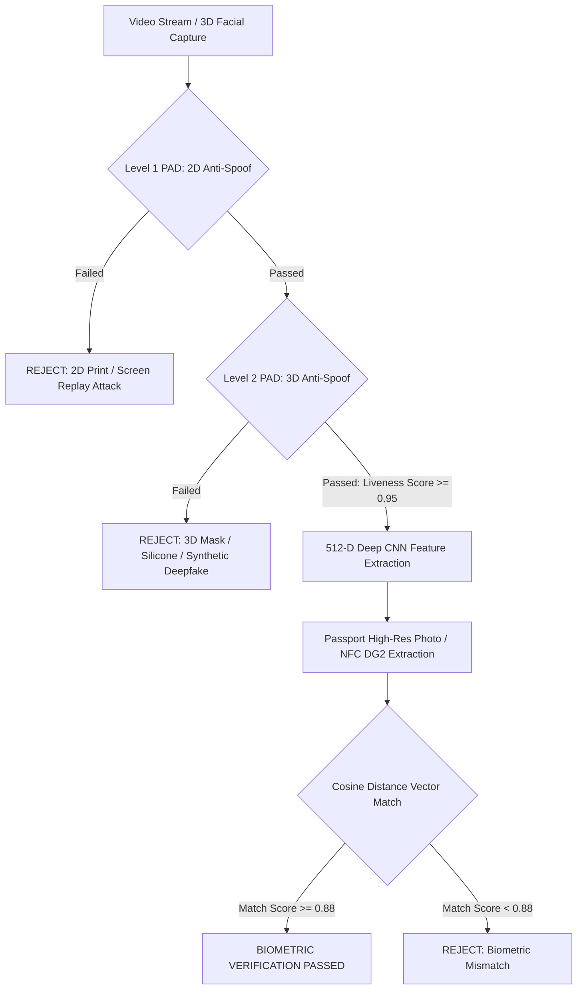
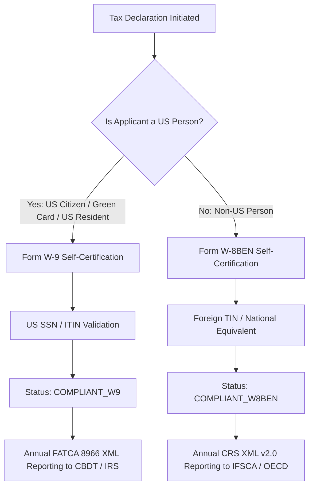
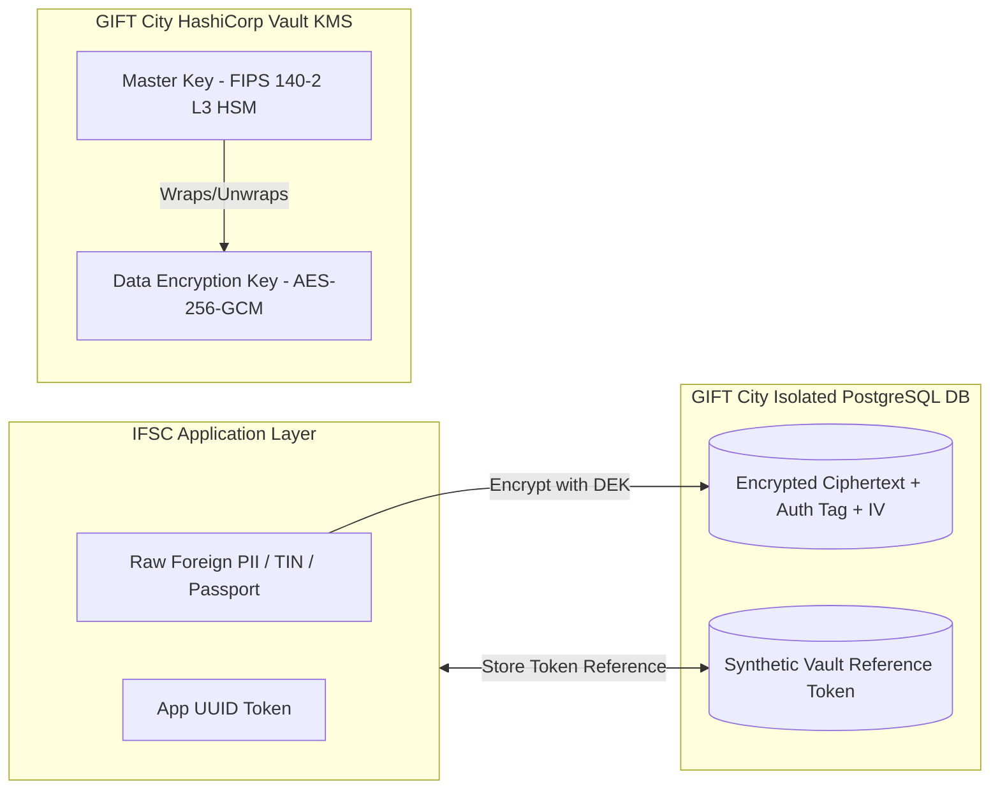
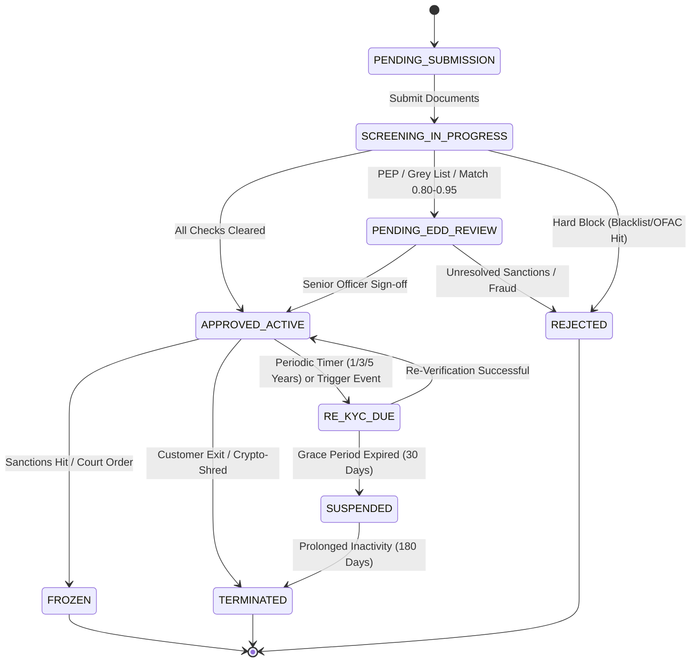

# International Investor KYC/AML & Sanctions Compliance Policy (GIFT City IFSCA)

**Document Reference:** `NBSE-POL-COMP-005`  
**Governing Authority:** International Financial Services Centres Authority (IFSCA), GIFT City, Gandhinagar, Gujarat, India  
**Applicable Entity:** Growww International IFSC Private Limited  
**Regulatory Framework:**
- IFSCA (Anti Money Laundering, Counter-Terrorist Financing and Know Your Customer) Guidelines, 2022
- Financial Action Task Force (FATF) 40 Recommendations (specifically Recommendations 10, 11, 12, 16, 19, 20)
- United Nations Security Council (UNSC) Consolidated Sanctions Framework (Resolutions 1267, 1373, 1718, 2231)
- United States Department of the Treasury Office of Foreign Assets Control (OFAC) Regulations (31 CFR Chapter V)
- European Union Consolidated Financial Sanctions Framework (Common Foreign and Security Policy - CFSP)
- United Kingdom HM Treasury Office of Financial Sanctions Implementation (OFSI) Sanctions Regime
- OECD Common Reporting Standard (CRS) Multilateral Competent Authority Agreement (MCAA)
- United States Foreign Account Tax Compliance Act (FATCA) Intergovernmental Agreement (IGA Model 1)
- Section 47(viiab) of the Indian Income Tax Act, 1961

**Classification:** Regulatory Policy & Technical Specification  
**Status:** Approved & Production-Enforced  
**Effective Date:** September 2026  

---

## 1. Executive Summary & Statutory Scope

### 1.1 Mandate & Purpose
Growww International IFSC Private Limited ("Company"), operating under the regulatory sandbox and financial intermediary licensing of the International Financial Services Centres Authority (IFSCA) in Gujarat International Finance Tec-City (GIFT City), enables international retail and accredited institutional investors across permitted global jurisdictions to invest in tokenized Indian real-world assets (RWAs), equities, government securities (G-Secs), and multi-currency liquidity pools.

To safeguard the integrity of the offshore capital conduit, prevent cross-border money laundering, combat terrorist financing, enforce economic sanctions, and guarantee automatic exchange of tax information (AEOI), this document establishes the binding Customer Due Diligence (CDD), Enhanced Due Diligence (EDD), biometric liveness authentication, global sanctions screening, and on-chain compliance attestation policy for all foreign investors entering via the GIFT City IFSC gateway.

### 1.2 Two-Entity Isolation Model
The platform enforces a strict separation between the domestic Indian regulated entity (*Growww Technologies India Private Limited*) and the international offshore entity (*Growww International IFSC Private Limited*):



#### Statutory Separation Rules:
1. **Zero Cross-Jurisdiction Database Sharing:** Foreign investor PII, passport data, tax numbers, and biometric vectors are stored strictly inside the GIFT City IFSC jurisdictional cloud boundary. Domestic databases share no read/write access.
2. **Strict Currency Boundary:** Foreign investors fund, trade, and settle exclusively in freely convertible currencies (USD, EUR, GBP) and approved digital assets. Domestic settlement occurs via segregated escrow mechanisms under FEMA and IFSCA rules.
3. **Zero-PII On-Chain Invariant:** No foreign passport numbers, physical addresses, or tax identifiers are ever exposed or committed to the Hyperledger Besu consortium ledger. All ledger records use cryptographically salted, one-way keccak256 identity commitments.

---

## 2. Jurisdictional Eligibility & Country Risk Framework

### 2.1 FATF-Aligned Country Categorization
Under IFSCA AML Guidelines 2022 and FATF Recommendation 19, all investor onboarding is gated by the issuing country and tax residency of the applicant, mapped via ISO 3166-1 alpha-3 standards.

| Jurisdictional Tier | Regulatory Definition | Jurisdictions Included | Onboarding Action & Limits |
| :--- | :--- | :--- | :--- |
| **Tier 1: Non-Permitted (Blacklist)** | High-Risk Jurisdictions subject to a FATF Call for Action | Democratic People's Republic of Korea (PRK), Islamic Republic of Iran (IRN), Republic of the Union of Myanmar (MMR), and comprehensive OFAC embargo zones (Cuba - CUB, Syria - SYR, Russian-occupied regions of Ukraine: Crimea, DNR, LNR). | **Complete Hard Block:** Immediate BGP routing drop, geoblocking, phone prefix rejection, and registration rejection. Zero exceptions. |
| **Tier 2: Monitored Jurisdictions (Grey List)** | Jurisdictions under FATF Increased Monitoring | Jurisdictions identified by FATF as having strategic AML/CFT deficiencies (dynamically updated per FATF plenary cycles). | **Mandatory Enhanced Due Diligence (EDD):** Mandatory proof of source of wealth (SoW), bank statements covering 180 days, Principal Compliance Officer maker-checker approval. Onboarding permitted with tier caps. |
| **Tier 3: Standard Permitted Jurisdictions** | FATF Member States, OECD Countries, Basel Committee Jurisdictions | United States (USA), United Kingdom (GBR), European Union Member States, Singapore (SGP), United Arab Emirates (ARE), Japan (JPN), Switzerland (CHE), Australia (AUS), Canada (CAN), etc. | **Standard Customer Due Diligence (CDD):** Automated OCR, 3D biometric liveness, automated PEP/sanctions screen, standard tier limits. |

### 2.2 Geolocation & Network-Level Perimeter Defense
Prior to initiating registration, the gateway applies real-time perimeter filtering:
1. **Enterprise GeoIP Resolution:** Every incoming TCP connection is evaluated against MaxMind GeoIP2 Enterprise and Cloudflare Turnstile intelligence.
2. **VPN / Tor / Datacenter Proxy Rejection:** Any request originating from an anonymizing proxy, Tor exit node, hosting provider subnet, or residential proxy network is rejected with error `ERR_NETWORK_GEO_RESTRICTED`.
3. **Device Telemetry Cross-Check:** WebRTC IP leak tests, browser timezone, and GPS coordinates (mobile apps) must correlate with the declared country of residence.

---

## 3. Five-Stage International Investor Onboarding Pipeline

The international onboarding process executes sequentially through five deterministic verification gates. A failure at any gate halts the pipeline immediately and records an immutable audit trail.



---

## 4. Document Verification Standards (ICAO 9303 & NFC)

### 4.1 Permitted Identity Documents
Foreign investors are verified strictly using **Machine Readable Travel Documents (MRTD)** issued by sovereign national governments complying with **ICAO Document 9303 specifications**. National ID cards or driver's licenses are rejected for cross-border ingress unless accompanied by a qualifying biometric passport.

### 4.2 Type TD3 Passport Verification Specifications
Standard international biometric passports adhere to the TD3 format (2 lines of 44 characters each):

```
P<UTOERIKSSON<<ANNA<MARIA<<<<<<<<<<<<<<<<<<<
L898902C36UTO7408122F1204159ZE184226B<<<<<10
```

#### Line 1 Field Decomposition:
- Positions 1-2: Document Code (`P<` for Passport)
- Positions 3-5: Issuing Country or Organization (ISO 3166-1 alpha-3, e.g., `GBR`, `DEU`, `USA`)
- Positions 6-44: Holder's Legal Name (Primary Identifier `<<` Secondary Identifiers)

#### Line 2 Field Decomposition & Check Digit Algorithm:
- Positions 1-9: Passport Document Number
- Position 10: Check Digit of Passport Number
- Positions 11-13: Nationality (ISO 3166-1 alpha-3)
- Positions 14-19: Date of Birth (`YYMMDD`)
- Position 20: Check Digit of Date of Birth
- Position 21: Sex (`M`, `F`, or `<` for unspecified)
- Positions 22-27: Date of Expiry (`YYMMDD`)
- Position 28: Check Digit of Date of Expiry
- Positions 29-42: Optional Personal Number / National ID
- Position 43: Check Digit of Optional Data
- Position 44: Composite Check Digit over lines and digits

#### 7-3-1 Weighting Algorithm Modulo 10:
Every check digit in the MRZ is calculated using sequential weights of `7`, `3`, `1` applied iteratively across the alphanumeric characters:
$$\text{Check Digit} = \left( \sum_{i=1}^{n} c_i \times w_i \right) \pmod{10}$$
where alphanumeric values map to:
- `0`-`9` $\rightarrow 0$-$9$
- `A`-`Z` $\rightarrow 10$-$35$
- Filler `<` $\rightarrow 0$
- Repeating weights $w \in [7, 3, 1, 7, 3, 1, \dots]$

```python
def verify_mrz_check_digit(data: str, expected_digit: str) -> bool:
    weights = [7, 3, 1]
    total = 0
    for idx, char in enumerate(data):
        if char.isdigit():
            val = int(char)
        elif char.isalpha():
            val = ord(char.upper()) - 55  # 'A' -> 10, 'Z' -> 35
        elif char == '<':
            val = 0
        else:
            return False
        total += val * weights[idx % 3]
    return (total % 10) == int(expected_digit)
```

### 4.3 Validity Thresholds
- **Minimum Passport Validity:** Passports must have an expiry date strictly exceeding **6 calendar months (180 days)** from the onboarding timestamp. Passports with $\le 180$ days remaining are rejected with error `ERR_PASSPORT_EXPIRING_SOON`.
- **e-Passport NFC Cryptographic Validation:** Where mobile devices support NFC, the client extracts and verifies:
  1. **Passive Authentication (PA):** Validates the Document Security Object ($SOD$) digital signature against trusted country signing certificates from the ICAO Public Key Directory (ICAO PKD).
  2. **Active Authentication (AA) / Chip Authentication (CA):** Executes an asymmetric challenge-response to guarantee the chip is genuine and has not been cloned.

---

## 5. 3D Biometric AI Liveness & Facial Verification

### 5.1 Presentation Attack Detection (PAD) Standards
To prevent synthetic identity fraud, physical spoofing, and generative AI deepfakes, the biometric gateway strictly requires **ISO/IEC 30107-3 Level 2 Compliance** audited and certified by independent laboratories (e.g., iBeta Quality Assurance).



### 5.2 Algorithmic Thresholds
1. **Liveness Detection Score:** Evaluated via multi-frame active depth analysis, micro-texture reflection analysis, and gaze challenge-response. The threshold must satisfy:
   $$\text{liveness\_score} \ge 0.95 \quad (\text{Scale } 0.0 - 1.0)$$
2. **Face Matching Confidence Score:** High-resolution facial embeddings (512-dimensional floating-point vectors generated by deep convolutional networks) extracted from the live capture are compared against the photo extracted from the passport image/NFC chip:
   $$\text{face\_match\_score} = \frac{\mathbf{v}_{\text{live}} \cdot \mathbf{v}_{\text{passport}}}{\|\mathbf{v}_{\text{live}}\| \|\mathbf{v}_{\text{passport}}\|} \ge 0.88$$
   - False Acceptance Rate (FAR): $< 0.001\%$
   - False Rejection Rate (FRR): $< 1.0\%$
3. **Anti-Spoof Status:** `anti_spoof_passed == true` is mandatory for account activation.

---

## 6. Proof of Address (PoA) & Geofencing Verification

### 6.1 Eligible PoA Documentation
Non-resident investors must furnish an unencumbered, full-page digital copy of an address verification document meeting the following criteria:
1. **Document Types:**
   - Utility bill (residential electricity, water, pipeline gas, or landline/broadband internet).
   - Bank statement, credit card statement, or investment statement issued by an FATF-compliant regulated financial institution.
   - Government municipal tax assessment or local registration document.
2. **Age Threshold:** The document issuance date must be strictly **less than 90 calendar days old** from the date of submission.
3. **Name Concordance:** The full legal name extracted from the PoA must match the passport name with a phonetic/string similarity index $\ge 0.85$ (Jaro-Winkler).

### 6.2 Automated Address Extraction & Geofencing
1. Optical Character Recognition (OCR) parses: Street Address, City, State/Province, Postal Code, and Country.
2. The parsed Country must match the declared country of tax residency and the issuing country of the passport (or an approved residence permit if living abroad).
3. Mobile client GPS coordinates and IP geolocation at the time of submission are verified against the PoA geographical boundary. Cross-border discrepancies trigger manual review.

---

## 7. Global Sanctions, Watchlists & PEP Screening

### 7.1 Real-Time Screening Lists
Every foreign investor is screened prior to account creation against global sanctions, regulatory enforcement databases, and Politically Exposed Persons (PEP) registers via REST API integrations with **LexisNexis World-Check One** and **Dow Jones Risk & Compliance**:

1. **United States OFAC:**
   - Specially Designated Nationals (SDN) and Blocked Persons List.
   - Foreign Sanctions Evaders (FSE) List.
   - Sectoral Sanctions Identifications (SSI) List.
   - Consolidated Non-SDN Sanctions Lists.
2. **United Nations Security Council:**
   - Consolidated List of Individuals and Entities subject to UN Sanctions (Al-Qaida, ISIL, Taliban, DPRK).
3. **European Union:**
   - Consolidated List of Persons, Groups, and Entities subject to EU Financial Sanctions.
4. **United Kingdom HM Treasury:**
   - OFSI Consolidated List of Financial Sanctions Targets.
5. **INTERPOL:**
   - Red Notices, Blue Notices, and UN Security Council Special Notices.
6. **IFSCA & Indian Sovereign Lists:**
   - Unlawful Activities (Prevention) Act (UAPA) Schedule 4 designated individuals.

### 7.2 Fuzzy Matching & Resolution Logic
- **Search Parameters:** Full legal name, transliterations, aliases (AKA), date of birth, nationality, country of residence, and passport number.
- **Phonetic & Fuzzy Algorithms:** Double Metaphone, Jaro-Winkler, and Levenshtein distance.
- **Match Thresholds:**
  - `Match Score >= 0.95`: Automatic hard block, alert pushed to Compliance Officer.
  - `0.80 <= Match Score < 0.95`: Account held in `PENDING_MANUAL_REVIEW`, four-eyes maker-checker investigation required within 4 hours.
  - `Match Score < 0.80`: Cleared automatically.

### 7.3 Politically Exposed Persons (PEP) Policy
1. **PEP Definition:** Individuals who are or have been entrusted with prominent public functions, including:
   - Category 1: Heads of State, Heads of Government, Ministers, Deputy/Assistant Ministers, Members of Parliament.
   - Category 2: Members of supreme courts, constitutional courts, central bank governors, ambassadors, high-ranking armed forces officers.
   - Category 3: Board members of state-owned enterprises, political party leaders.
   - Category 4: Senior officials of international organizations (UN, IMF, World Bank, WTO, OECD, ADB).
   - Relatives & Close Associates (RCA): Spouses, partners, children, parents, siblings, and close business associates.
2. **PEP Onboarding Mandate:**
   - PEPs are classified as **High Risk** by default.
   - Automated onboarding is prohibited.
   - Senior Management Sign-off: The Head of International Compliance and the Principal Officer must explicitly review and co-sign the onboarding approval.
   - Mandatory Source of Wealth (SoW) and Source of Funds (SoF) verification: Independent corroborating documentation (e.g., tax returns, certified financial statements) required.

### 7.4 Ongoing Daily Delta Re-Screening
- The entire active customer base is automatically re-screened every 24 hours against delta updates published by OFAC, UN, EU, and UK OFSI.
- Any newly designated individual or entity triggers an immediate, automated account freeze (`ACCOUNT_FROZEN_SANCTIONS`), cancels outstanding open orders, blocks withdrawals, and alerts the Money Laundering Reporting Officer (MLRO) within 15 minutes.

---

## 8. International Tax Compliance: FATCA & CRS Self-Certification

### 8.1 Statutory Framework
Under the OECD Common Reporting Standard (CRS) Multilateral Competent Authority Agreement (MCAA) and the US-India Model 1 Intergovernmental Agreement (IGA) for FATCA:
- Growww International IFSC Private Limited is a Reporting Financial Institution (FI).
- Every foreign investor must provide a legally binding digital self-certification declaring tax residency, Taxpayer Identification Number (TIN), and US person status.

### 8.2 US Person Classification (FATCA)
Applicants are screened for US indicia:
- US Citizenship or lawful permanent resident (Green Card) status.
- US place of birth.
- US residential or mailing address.
- US telephone number.
- Standing instructions to transfer funds to an account maintained in the United States.



### 8.3 FATCA / CRS Questionnaire Data Capture
1. **Tax Residency Jurisdictions:** Country ISO 3166-1 alpha-3 code. If dual/multiple tax residency exists, all jurisdictions must be declared.
2. **Taxpayer Identification Number (TIN):** Mandatory for each declared country. If a TIN is unavailable, a formal statutory reason code must be selected (Reason A: Jurisdiction does not issue TINs; Reason B: Investor legally not required to obtain TIN).
3. **Electronic Signature & Perjury Acknowledgment:** The user executes an electronic signature under penalties of perjury attesting to the accuracy of all declarations.

---

## 9. Data Protection, Isolated Cloud Boundary & Privacy

### 9.1 Jurisdictional Isolation
All foreign investor records are maintained strictly within the **GIFT City IFSC AWS/Local Cloud Boundary (Mumbai/GIFT PoP)**:
- **Zero Domestic Sharing:** No replication or querying from domestic Indian production databases.
- **Cross-Border Transfer Controls:** Transfers of international investor data comply with GDPR (EU/EEA) Chapter V provisions, UK International Data Transfer Agreements, and IFSCA Data Protection Regulations.

### 9.2 Envelope Encryption & Tokenization Architecture
To guarantee absolute data confidentiality, Personally Identifiable Information (PII), biometric templates, and tax identification numbers are encrypted using an envelope encryption paradigm backed by **FIPS 140-2 Level 3 Hardware Security Modules (HSMs)**:



#### Encryption Specifications:
- **Algorithm:** AES-256-GCM with unique 96-bit initialization vectors (IV) per record.
- **Key Rotation:** Data Encryption Keys (DEKs) are rotated automatically every 90 calendar days.
- **Synthetic Tokenization:** Database tables never store plaintext passport numbers or TINs; they store random synthetic UUID tokens (e.g., `tin_vault_token`, `passport_vault_token`).

### 9.3 Right to Erasure & Crypto-Shredding (GDPR Article 17)
1. **Statutory Retention:** IFSCA AML Guidelines require compliance and transaction records to be retained for a minimum of **5 years** following the termination of the customer relationship.
2. **Post-Retention Cryptographic Erasure:** Upon statutory retention expiry and verified request for erasure:
   - The user-specific Data Encryption Key (DEK) inside the Vault KMS cluster is permanently purged.
   - All associated database ciphertexts and encrypted backup archives become mathematically impossible to decrypt.
   - Erasure is permanently recorded in the immutable audit log with trusted RFC 3161 cryptographic timestamping.

---

## 10. Blockchain Integration: Cross-Border Identity Commitment

### 10.1 Zero-PII Hyperledger Besu Architecture
Growww utilizes **Hyperledger Besu** operating under **QBFT (Quorum Byzantine Fault Tolerant)** consensus as the permissioned settlement backbone. To reconcile statutory KYC verification with blockchain immutability and privacy mandates, zero PII is written to ledger state.

### 10.2 Cryptographic Commitment Math
Upon successful validation of Stages 1 through 5, the GIFT City compliance engine computes a deterministic, one-way 32-byte cryptographic commitment:

$$\text{passport\_hash} = \text{SHA256}(\text{raw\_passport\_number} \parallel \text{investor\_salt})$$

$$\text{foreign\_commitment\_hash} = \text{keccak256}(\text{abi.encodePacked}(\text{passport\_hash}, \text{ifsc\_investor\_uuid}, \text{gift\_city\_jurisdiction\_salt}))$$

```solidity
// Mathematical representation of on-chain commitment calculation
bytes32 foreign_investor_commitment = keccak256(
    abi.encodePacked(
        passport_hash,          // bytes32: SHA-256 hash of passport number
        ifsc_investor_id,       // bytes16: UUID of foreign investor in GIFT City DB
        gift_city_salt          // bytes32: Secret HSM-managed jurisdictional salt
    )
);
```

### 10.3 `ComplianceRegistry.sol` Contract Interface
The GIFT City gateway node executes an authorized transaction invoking `ComplianceRegistry.sol` to whitelist the investor's identity commitment:

```solidity
// SPDX-License-Identifier: MIT
pragma solidity 0.8.24;

/**
 * @title IComplianceRegistry
 * @notice Permissioned KYC and jurisdictional registry on Hyperledger Besu
 */
interface IComplianceRegistry {
    enum ComplianceStatus { UNINITIALIZED, ACTIVE, SUSPENDED, REVOKED, EXPIRED }

    event InvestorWhitelisted(
        bytes32 indexed commitmentHash,
        bytes32 indexed jurisdictionFlag,
        uint64 expiryTimestamp,
        address indexed indexedAuthority
    );

    event InvestorStatusUpdated(
        bytes32 indexed commitmentHash,
        ComplianceStatus indexed newStatus,
        bytes32 reasonCode
    );

    function registerCommitment(
        bytes32 commitmentHash,
        bytes32 jurisdictionFlag,
        uint64 expiryTimestamp
    ) external;

    function updateStatus(
        bytes32 commitmentHash,
        ComplianceStatus newStatus,
        bytes32 reasonCode
    ) external;

    function isJurisdictionWhitelisted(
        bytes32 commitmentHash,
        bytes32 jurisdictionFlag
    ) external view returns (bool);

    function getCommitmentStatus(
        bytes32 commitmentHash
    ) external view returns (ComplianceStatus status, uint64 expiryTimestamp, bytes32 jurisdictionFlag);
}
```

### 10.4 Jurisdictional Constant & Settlement Gating
- The GIFT City gateway is assigned the immutable jurisdictional flag:
  ```solidity
  bytes32 public constant JURISDICTION_IFSCA = keccak256("JURISDICTION_IFSCA");
  ```
- Before executing any Delivery-versus-Payment (DvP) settlement, `SettlementDvP.sol` verifies that foreign participants possess active `JURISDICTION_IFSCA` status:
  ```solidity
  require(
      complianceRegistry.isJurisdictionWhitelisted(buyerCommitment, JURISDICTION_IFSCA),
      "ERR_DVP_BUYER_NOT_IFSCA_WHITELISTED"
  );
  require(
      complianceRegistry.isJurisdictionWhitelisted(sellerCommitment, JURISDICTION_IFSCA),
      "ERR_DVP_SELLER_NOT_IFSCA_WHITELISTED"
  );
  ```

---

## 11. Ongoing Monitoring & Re-KYC Lifecycle

### 11.1 Risk-Tiered Periodic Review Schedule
All approved foreign investor accounts undergo scheduled periodic re-verification according to their assigned AML risk tier:



| AML Risk Tier | User Classification Criteria | Periodic Re-KYC Interval | Approval Level Required |
| :--- | :--- | :--- | :--- |
| **High Risk** | Foreign PEPs, RCAs, FATF Grey List residents, complex trusts, accounts with aggregate turnover $> \$1,000,000$ USD/yr | **Every 1 Year (Annual)** | Head of Compliance / MLRO Co-Sign |
| **Medium Risk** | Self-employed professionals, high-volume traders ($\$250,000$ to $\$1,000,000$ USD/yr), non-FATF member permitted jurisdictions | **Every 3 Years** | Senior Compliance Officer |
| **Low Risk** | Standard retail investors residing in FATF/OECD member states with turnover $\le \$250,000$ USD/yr | **Every 5 Years** | Automated Pipeline + Random 5% Audit |

### 11.2 Trigger-Based Event Re-KYC
Immediate off-cycle Re-KYC is automatically triggered upon any of the following events:
1. **Passport Expiration Approaching:** Automated alerts sent at 60, 30, and 15 days before document expiry. If unrenewed by $T-0$, trading is restricted to liquidation/close-only.
2. **Address or Residency Modification:** Any change in declared residential address or tax jurisdiction invalidates the existing tax declaration and requires new PoA + FATCA/CRS self-certification within 14 calendar days.
3. **Velocity / Volume Anomaly:** Account deposits exceeding 250% of declared annual income profile trigger an automated hold on withdrawals pending Enhanced Due Diligence (EDD).
4. **Adverse Media Notification:** Negative news hits involving financial crime, fraud, or market manipulation trigger manual analyst review.

---

## 12. Technical Specifications & JSON Schemas

### 12.1 International Investor Compliance Profile Schema
The following JSON schema defines the canonical structure for all international investor compliance profiles generated by the IFSC compliance engine:

```json
{
  "$schema": "http://json-schema.org/draft-07/schema#",
  "title": "InternationalInvestorComplianceProfile",
  "type": "object",
  "properties": {
    "foreign_investor_uuid": {
      "type": "string",
      "format": "uuid",
      "description": "Unique UUID assigned to the international investor in GIFT City database."
    },
    "jurisdiction_code": {
      "type": "string",
      "pattern": "^[A-Z]{3}$",
      "description": "ISO 3166-1 alpha-3 country code of primary residence."
    },
    "passport_verification": {
      "type": "object",
      "properties": {
        "passport_hash_sha256": {
          "type": "string",
          "pattern": "^[a-f0-9]{64}$",
          "description": "SHA-256 hash of passport number with system salt."
        },
        "mrz_valid": {
          "type": "boolean",
          "description": "True if all ICAO 9303 checksums validated successfully."
        },
        "issuing_country_iso3": {
          "type": "string",
          "pattern": "^[A-Z]{3}$",
          "description": "ISO 3166-1 alpha-3 country code of passport issuing nation."
        },
        "expiry_date": {
          "type": "string",
          "format": "date",
          "description": "Passport expiration date in YYYY-MM-DD format (must be > 180 days in future)."
        }
      },
      "required": [
        "passport_hash_sha256",
        "mrz_valid",
        "issuing_country_iso3",
        "expiry_date"
      ]
    },
    "liveness_verification": {
      "type": "object",
      "properties": {
        "liveness_score": {
          "type": "number",
          "minimum": 0.0,
          "maximum": 1.0,
          "description": "3D active/passive liveness confidence score (must be >= 0.95)."
        },
        "face_match_score": {
          "type": "number",
          "minimum": 0.0,
          "maximum": 1.0,
          "description": "Facial comparison vector cosine similarity (must be >= 0.88)."
        },
        "anti_spoof_passed": {
          "type": "boolean",
          "description": "True if ISO/IEC 30107-3 Level 2 PAD checks passed."
        }
      },
      "required": [
        "liveness_score",
        "face_match_score",
        "anti_spoof_passed"
      ]
    },
    "tax_declaration": {
      "type": "object",
      "properties": {
        "tax_residency_country_iso3": {
          "type": "string",
          "pattern": "^[A-Z]{3}$",
          "description": "ISO 3166-1 alpha-3 code of primary tax residence."
        },
        "tin_vault_token": {
          "type": "string",
          "description": "Synthetic reference UUID pointing to the AES-256-GCM encrypted TIN in Vault KMS."
        },
        "is_us_person": {
          "type": "boolean",
          "description": "True if investor is a US citizen, US green card holder, or US tax resident."
        },
        "fatca_status": {
          "type": "string",
          "enum": [
            "COMPLIANT_W8BEN",
            "COMPLIANT_W9",
            "EXEMPT"
          ],
          "description": "Statutory FATCA classification code."
        }
      },
      "required": [
        "tax_residency_country_iso3",
        "tin_vault_token",
        "is_us_person",
        "fatca_status"
      ]
    },
    "sanctions_screening": {
      "type": "object",
      "properties": {
        "ofac_cleared": {
          "type": "boolean",
          "description": "True if applicant is cleared against all US OFAC lists."
        },
        "un_sanctions_cleared": {
          "type": "boolean",
          "description": "True if applicant is cleared against UN Security Council Consolidated List."
        },
        "pep_detected": {
          "type": "boolean",
          "description": "True if applicant or immediate relative is identified as a PEP."
        },
        "screened_at": {
          "type": "string",
          "format": "date-time",
          "description": "ISO 8601 UTC timestamp when sanctions screening executed."
        }
      },
      "required": [
        "ofac_cleared",
        "un_sanctions_cleared",
        "pep_detected",
        "screened_at"
      ]
    },
    "on_chain_whitelist": {
      "type": "object",
      "properties": {
        "foreign_commitment_hash": {
          "type": "string",
          "pattern": "^0x[a-fA-F0-9]{64}$",
          "description": "32-byte hexadecimal keccak256 commitment registered on Hyperledger Besu."
        },
        "jurisdiction_flag": {
          "type": "string",
          "enum": [
            "JURISDICTION_IFSCA"
          ],
          "description": "On-chain jurisdictional identifier constant."
        }
      },
      "required": [
        "foreign_commitment_hash",
        "jurisdiction_flag"
      ]
    }
  },
  "required": [
    "foreign_investor_uuid",
    "jurisdiction_code",
    "passport_verification",
    "liveness_verification",
    "tax_declaration",
    "sanctions_screening",
    "on_chain_whitelist"
  ],
  "additionalProperties": false
}
```

### 12.2 FATCA / CRS Self-Certification Schema (OECD CRS XML v2.0 Aligned)
```json
{
  "$schema": "http://json-schema.org/draft-07/schema#",
  "title": "FATCACRSSelfCertification",
  "type": "object",
  "properties": {
    "foreign_investor_uuid": { "type": "string", "format": "uuid" },
    "certification_timestamp": { "type": "string", "format": "date-time" },
    "is_us_person": { "type": "boolean" },
    "us_tin": { "type": "string", "pattern": "^[0-9]{3}-[0-9]{2}-[0-9]{4}$" },
    "tax_residencies": {
      "type": "array",
      "minItems": 1,
      "items": {
        "type": "object",
        "properties": {
          "country_iso3": { "type": "string", "pattern": "^[A-Z]{3}$" },
          "tin_vault_token": { "type": "string" },
          "no_tin_reason": {
            "type": "string",
            "enum": ["REASON_A_NOT_ISSUED", "REASON_B_NOT_REQUIRED", "REASON_C_OTHER"]
          },
          "no_tin_explanation": { "type": "string" }
        },
        "required": ["country_iso3"]
      }
    },
    "source_of_funds": {
      "type": "string",
      "enum": [
        "EMPLOYMENT_SALARY",
        "BUSINESS_PROFITS",
        "INVESTMENT_PROCEEDS",
        "INHERITANCE_GIFT",
        "REAL_ESTATE_SALE",
        "OTHER"
      ]
    },
    "source_of_wealth_description": { "type": "string", "minLength": 10 },
    "electronic_signature": {
      "type": "object",
      "properties": {
        "signatory_legal_name": { "type": "string" },
        "ip_address": { "type": "string" },
        "user_agent": { "type": "string" },
        "perjury_declaration_accepted": { "type": "boolean", "const": true }
      },
      "required": [
        "signatory_legal_name",
        "ip_address",
        "user_agent",
        "perjury_declaration_accepted"
      ]
    }
  },
  "required": [
    "foreign_investor_uuid",
    "certification_timestamp",
    "is_us_person",
    "tax_residencies",
    "source_of_funds",
    "electronic_signature"
  ]
}
```

---

## 13. Vendor Integration Adapters & Failure Modes

### 13.1 Adapter Inventory & Fallback Strategy
| Verification Function | Primary Vendor REST API | Secondary Fallback Adapter | Timeout / Circuit Breaker Policy |
| :--- | :--- | :--- | :--- |
| **Passport OCR & MRZ Parsing** | SumSub Identity API v2 | Onfido Document API v3.6 | 8,000 ms timeout; 3 consecutive timeouts trip circuit breaker; fallback to secondary adapter. |
| **3D Biometric Liveness** | SumSub Liveness 3D SDK | Onfido Motion Liveness API | 10,000 ms timeout; fallback to secondary. If both fail, user queued for manual WebRTC video KYC. |
| **Sanctions & PEP Screening** | LexisNexis World-Check One API | Dow Jones Risk & Compliance REST API | 5,000 ms timeout; fail-closed policy (`FAIL_CLOSED`). Account holds in `PENDING_SCREENING` if all APIs unreachable. |
| **Address Verification (PoA)** | SumSub PoA Verification | Internal OCR & Geocoding Engine | 12,000 ms timeout; non-fatal fallback to maker-checker manual analyst verification queue. |

### 13.2 Fail-Closed Invariant
Under no circumstances may an account be approved, funded, or granted an on-chain commitment if any sanctions screening, biometric liveness, or ICAO 9303 checksum verification encounters a system failure, network outage, or unhandled exception. The pipeline enforces **absolute fail-closed behavior (`DEFAULT_DENY`)**.

---

## 14. Regulatory Attestation & Sign-Off Block

This document has been formally reviewed and confirmed to satisfy all statutory criteria mandated by the International Financial Services Centres Authority (IFSCA), the Financial Action Task Force (FATF), US OFAC regulations, and OECD Common Reporting Standards.

```
+----------------------------------------------------------------------------------------------------+
|                                    FORMAL STATUTORY APPROVALS                                      |
+------------------------------------+------------------------------------+--------------------------+
| OFFICER ROLE                       | NAME / IDENTIFIER                  | STATUS                   |
+------------------------------------+------------------------------------+--------------------------+
| Head of International Compliance   | Chief Compliance Officer, GIFT     | APPROVED & ADOPTED       |
| International Legal Counsel        | Partner, Cross-Border Regulatory   | APPROVED & RATIFIED      |
| Chief Information Security Officer | Lead Security Architect, GIFT      | AUDITED & ENFORCED       |
| Lead Blockchain Architect          | Lead Settlement Systems Engineer   | VERIFIED ON BESU QBFT    |
+------------------------------------+------------------------------------+--------------------------+
```
