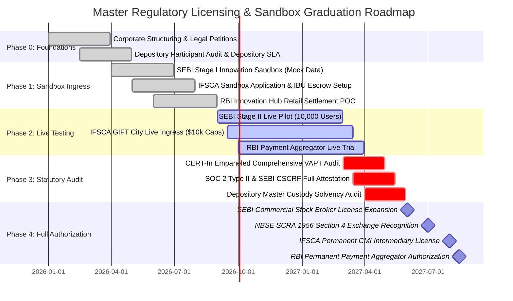
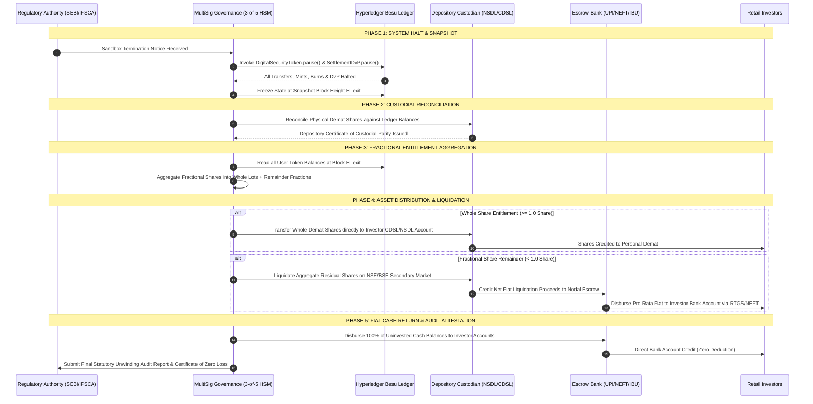

# Regulatory Pathway & Sandbox Strategy (SEBI, RBI, IFSCA)

**Document Reference:** `NBSE-COMP-REG-003`  
**Classification:** Statutory Regulatory Blueprint  
**Version:** 1.0.0-PROD  
**Target Sandbox Cohort:** `FINTECH_SANDBOX_PHASE_1`  
**Consortium Entities:** Growww Technologies India Pvt. Ltd. | NBSE Ltd. | Growww International IFSC Pvt. Ltd.  
**Effective Date:** September 19, 2026  
**Last Audit Review:** Q3 2026  
**Git Working Branch:** `Arun`  

---

## 1. Executive Summary & Purpose

Operating a compliant blockchain-based fractional investment platform in the Republic of India and its offshore financial jurisdiction requires an integrated, multi-regulator engagement model. The Growww platform operates across three primary financial and monetary authorities:
1. **Securities and Exchange Board of India (SEBI):** Statutory regulator of domestic securities markets, depositories, stockbrokers, and clearing corporations.
2. **Reserve Bank of India (RBI):** Central banking authority governing domestic retail and wholesale payment rails, payment aggregators, nodal escrow accounts, the Foreign Exchange Management Act (FEMA), and Central Bank Digital Currency (CBDC e-Rupee).
3. **International Financial Services Centres Authority (IFSCA):** Unified statutory regulator established under the IFSCA Act 2019 governing offshore financial institutions, capital markets intermediaries, and fintech sandbox pilots within the Gujarat International Finance Tec-City (GIFT City) Special Economic Zone (SEZ).

```
+----------------------------------------------------------------------------------------------------+
|                                    GROWWW CONSORTIUM ARCHITECTURE                                  |
+----------------------------------------------------------------------------------------------------+
                                                  |
                  +-------------------------------+-------------------------------+
                  |                                                               |
                  v                                                               v
+---------------------------------------------------+   +--------------------------------------------+
|             DOMESTIC INDIAN JURISDICTION          |   |          GIFT CITY IFSC JURISDICTION       |
|            (SEBI & RBI Unified Oversight)         |   |                 (IFSCA Oversight)          |
+---------------------------------------------------+   +--------------------------------------------+
|  • Growww Technologies India Private Limited      |   |  • Growww International IFSC Private Ltd   |
|    - SEBI Stock Broker (INZ000301838)             |   |    - Capital Market Intermediary (CMI)     |
|    - Depository Participant (NSDL & CDSL)         |   |    - IFSCA FinTech Sandbox Cohort 2026     |
|    - RBI Nodal Escrow / Payment Aggregator        |   |    - Foreign Ingress Desk (USD, EUR, GBP)  |
|  • NBSE Limited (Phase 2 Clearing Corporation)    |   |    - Tokenized Indian Depository Receipts  |
|    - SCRA 1956 Section 4 Recognition Applicant    |   |    - Tax Neutrality: Section 47(viiab)     |
+---------------------------------------------------+   +--------------------------------------------+
                  |                                                               |
                  +-------------------------------+-------------------------------+
                                                  |
                                                  v
+----------------------------------------------------------------------------------------------------+
|                 HYPERLEDGER BESU PERMISSIONED QBFT CONSORTIUM LEDGER (MUMBAI & GIFT CITY)          |
|    • Dedicated Regulatory Observer Nodes (SEBI BKC, RBI Fort, IFSCA GIFT City)                     |
|    • 1:1 Physical Depository Custody Backing (Zero Unbacked Minting Invariant)                     |
|    • Single-Block Deterministic Delivery-versus-Payment (DvP) Settlement (< 2.0s Finality)         |
|    • Zero On-Chain Personally Identifiable Information (PII) Invariant (Salted Poseidon Hashes)    |
|    • Universal Zero-Fee Model: 0.00% Platform Fee on Trade Notional Turnover (Launch Policy)       |
+----------------------------------------------------------------------------------------------------+
```

The objective of this specification is to establish the master regulatory pathway, defining:
- Quantitative boundaries and risk mitigations for the Sandbox Phase 1 pilot.
- Formal mapping of proprietary distributed ledger technologies (DLT) to statutory exemptions under SEBI, RBI, and IFSCA sandbox circulars.
- Technical architecture for dedicated Regulatory Observer Nodes provisioned for real-time auditability.
- Automated daily statutory compliance reporting pipelines (SEBI, FIU-IND, RBI, IFSCA).
- Mathematically verified Emergency Exit & Rollback Protocol guaranteeing 100% investor capital return.
- CI/CD-integrated Regulatory Compliance Traceability Matrix (`docs/compliance/traceability_matrix.yaml`).

---

## 2. The Three-Regulator Strategy Matrix

The Growww platform eliminates regulatory ambiguity by executing concurrent sandbox engagements tailored to each regulator's statutory domain:

| Parameter | SEBI Track | RBI Track | IFSCA Track |
| :--- | :--- | :--- | :--- |
| **Statutory Mandate** | Securities Contracts (Regulation) Act 1956; SEBI Act 1992; Depositories Act 1996 | Reserve Bank of India Act 1934; Payment and Settlement Systems Act 2007; FEMA 1999 | International Financial Services Centres Authority Act 2019; IFSCA Regulations 2021 |
| **Applicable Sandbox** | SEBI Innovation Sandbox & Regulatory Sandbox (Stage II Live Testing) | RBI Regulatory Sandbox (Fourth Cohort: Cross-Border Payments & Frauds) | IFSCA FinTech Regulatory Sandbox Framework 2022 (Live Overseas Ingress) |
| **Enabling Circulars** | SEBI/HO/MRD1/DSAP/CIR/P/2020/107 & SEBI/HO/MIRSD/DOP/CIR/P/2021/87 | RBI/2019-20/47 DPSS.CO.OD.No.401/06.11.001/2019-20 & Master Directions | IFSCA Circular F.No. 553/IFSCA/FinTech/Sandbox/2022-23 |
| **Target Licensing** | Registered Stock Broker, Depository Participant (DP), SCRA Recognized Stock Exchange | Authorized Payment Aggregator (PA-W/PA-D), Escrow Operator, CBDC Pilot Participant | Registered Capital Market Intermediary (Broker-Dealer, Custodian, Clearing House) |
| **Target User Base** | Resident Indian Retail Investors (Max 10,000) | Resident Indian Banking Customers & Inward Commercial Remitters | Foreign Portfolio Investors (FPIs), NRIs, Overseas Retail (Max 5,000) |
| **Currency Base** | Indian Rupee (INR, ₹) & Wholesale Digital Rupee (e₹-W) | Indian Rupee (INR) via UPI, IMPS, NEFT, RTGS & Wholesale e₹ | Freely Convertible Currencies (USD, EUR, GBP, AED) via IFSC Banking Units (IBUs) |
| **Ledger Role** | Primary master registry for fractional tokens and atomic DvP clearing | Real-time settlement audit and payment netting attestation | Validator consensus nodes and cross-border investor omnibus ledger |

---

## 3. Entity Licensing Roadmap & Institutional Milestones

To maintain watertight legal separation, asset custody isolation, and regulatory compliance, the platform operates through three corporate entities:

```
                                    +------------------------------+
                                    | Growww Holding Group Private |
                                    +------------------------------+
                                                   |
                      +----------------------------+----------------------------+
                      |                                                         |
                      v                                                         v
    +------------------------------------+                    +------------------------------------+
    | Growww Technologies India Pvt. Ltd |                    | Growww International IFSC Pvt. Ltd |
    | (Domestic Operating Entity)        |                    | (GIFT City Offshore Entity)        |
    +------------------------------------+                    +------------------------------------+
    | • Registration: CIN U67190KA2020   |                    | • Registration: CIN U65999GJ2022   |
    | • SEBI Broker: INZ000301838        |                    | • IFSCA Multi-Currency Capital     |
    | • NSDL DP ID: IN304295             |                    |   Market Intermediary Licence      |
    | • CDSL DP ID: 12088701             |                    | • Registered Office: GIFT City SEZ |
    | • Nodal Escrow: HDFC / ICICI       |                    | • Banking Escrow: HSBC / ICICI IBU |
    +------------------------------------+                    +------------------------------------+
                      |
                      v
    +------------------------------------+
    | NBSE Limited (Incorp. Consortium)  |
    | (Financial Market Infrastructure)  |
    +------------------------------------+
    | • Clearing Corporation & Exchange  |
    | • SCRA 1956 Section 4 Applicant    |
    | • SEBI SECC Reg 2018 Compliant     |
    +------------------------------------+
```

### 3.1 Milestone Schedule & Sandbox Phasing



---

## 4. Statutory Relief & Regulatory Exemptions Requested

To validate the technology stack during the live sandbox cohort, temporary relief is requested from specific traditional market structures:

### 4.1 Exemption Mapping Matrix

| Ref ID | Existing Statutory Requirement | Regulatory Exemption Requested | Compensatory Technical Safeguard |
| :--- | :--- | :--- | :--- |
| **EX-SEBI-01** | **SEBI (Stock Brokers) Reg 1992, Sch III:** Trading restricted to official exchange hours (09:15-15:30 IST). | Permission to operate an internal crossing orderbook 24/7/365 for tokenized equities and G-Secs. | Dynamic price collars ($\pm 3\%$ soft band, $\pm 5\%$ hard halt); pre-open auction resets; weekend margin freeze; 500μs speed bump. |
| **EX-SEBI-02** | **SEBI Master Circular on Settlement:** $T+1$ / $T+0$ batch clearing and netting via Clearing Corporations. | Atomic single-block ($< 2.0\text{s}$) Delivery-versus-Payment (DvP) on Hyperledger Besu. | Pre-funded collateral balance reservations in smart contracts (`SettlementDvP.sol`); zero intraday credit leverage. |
| **EX-SEBI-03** | **SEBI Depository Regulations 2018:** Whole-share lot requirements for dematerialized share settlement. | Depository pooling model allowing fractional unit entitlements down to 0.0001 shares. | 100% whole shares held in regulated NSDL/CDSL escrow account; on-chain token supply mathematically bounded to equal depository balance. |
| **EX-SEBI-04** | **SEBI Core SGF Regulations:** Static broker clearing fund contributions computed on historical margin. | Dynamic real-time funding: ₹50 Crores pre-funded corporate escrow buffer + dynamic liquidity waterfall. | 4-tier autonomous Settlement Guarantee Fund smart contract (`SettlementGuaranteeFund.sol`) with automated shortfall triggers. |
| **EX-RBI-01** | **RBI Master Direction on Payment Aggregators (2020):** $T+1$ merchant settlement from nodal accounts. | Real-time, instant automated payout upon on-chain DvP trade execution confirmation. | Direct API integration with scheduled commercial bank nodal escrow; automated double-entry ledger attestation. |
| **EX-RBI-02** | **RBI FEMA Master Direction (Cross-Border Remittances):** Manual documentation for capital account transactions. | Automated LRS limit validation ($250,000 USD/year) via bank API with instant digital Form A2 generation. | Real-time query to RBI LRS monitoring portal; automated PAN-based aggregate quota tracking. |
| **EX-IFSCA-01**| **IFSCA Capital Market Intermediary Regulations 2021:** Traditional demat trading in overseas securities. | Issuance and secondary trading of USD-denominated Tokenized Indian Depository Receipts (T-IDRs). | 1:1 backing with domestic underlying shares locked in NSDL/CDSL custodian escrow with daily Merkle reserve proofs. |

---

## 5. Technical Sandbox Testing Parameters & Quantitative Boundaries

To ensure complete containment of financial systemic risk during Sandbox Phase 1, the following quantitative constraints are hard-coded into the API gateway, microservices, and smart contracts:

```
                                  +---------------------------------------+
                                  |    SANDBOX QUANTITATIVE BOUNDARIES    |
                                  +---------------------------------------+
                                                      |
                  +-----------------------------------+-----------------------------------+
                  |                                                                       |
                  v                                                                       v
+---------------------------------------------------+   +---------------------------------------------------+
|               SEBI DOMESTIC CONSTRAINTS           |   |               IFSCA GIFT CITY CONSTRAINTS         |
+---------------------------------------------------+   +---------------------------------------------------+
| • Maximum Onboarded Users: 10,000 Retail          |   | • Maximum Onboarded Users: 5,000 Foreign / NRI    |
| • Max Portfolio Cap per User: ₹50,000.00 INR      |   | • Max Portfolio Cap per User: $10,000.00 USD      |
| • Platform Aggregate Turnover: ₹500,000,000.00    |   | • Platform Daily FX Corridor Cap: $1,000,000.00   |
| • Minimum Fractional Ticket: 0.0001 Shares (₹100) |   | • Minimum Fractional Ticket: 0.0001 Shares ($1.50)|
| • Leverage / Margin Lending: STRICTLY ZERO (0x)   |   | • Leverage / Margin Lending: STRICTLY ZERO (0x)   |
| • Settlement Cycle: T+0 Atomic DvP (< 2.0s)       |   | • Settlement Cycle: T+0 Atomic DvP (< 2.0s)       |
+---------------------------------------------------+   +---------------------------------------------------+
```

### 5.1 Parameter Specification Table

| Metric Constraint | Sandbox Phase 1 (Testing) | Sandbox Phase 2 (Expansion) | Commercial Launch (Graduation) | Enforcement Mechanism |
| :--- | :--- | :--- | :--- | :--- |
| **Domestic Retail Users** | Max 10,000 verified users | Max 50,000 verified users | Unlimited (Tiered KYC) | `services/kyc-onboarding` onboarding cap gate |
| **Domestic User Portfolio Cap** | ₹50,000.00 INR | ₹10,00,000.00 INR | Unlimited (Accredited limits) | `services/order-service` pre-trade portfolio validator |
| **Aggregate Platform Volume Cap** | ₹500,000,000.00 INR (₹50 Cr) | ₹2,500,000,000.00 INR | Unlimited | `services/matching-engine` aggregate turnover accumulator |
| **Foreign Retail Users (GIFT City)**| Max 5,000 verified investors | Max 25,000 verified investors| Unlimited (FATF compliant) | `services/foreign-funding` investor registry check |
| **Foreign User Portfolio Cap** | $10,000.00 USD | $100,000.00 USD | Unlimited (FPI Regulations) | `services/foreign-funding` USD balance validator |
| **Daily FX Conversion Corridor** | $1,000,000.00 USD / day | $5,000,000.00 USD / day | $50,000,000.00 USD / day | `services/foreign-funding` daily volume collar |
| **Minimum Fractional Share Size**| 0.0001 shares (4 decimals) | 0.0001 shares | 0.000001 shares (6 decimals) | `DigitalSecurityToken.sol` decimal precision |
| **Minimum Transaction Value** | ₹100.00 INR / $1.50 USD | ₹10.00 INR / $0.20 USD | ₹1.00 INR / $0.05 USD | `services/order-service` minimum order ticket check |
| **Maximum Order Notional** | ₹25,000.00 INR | ₹2,00,000.00 INR | ₹25,00,000.00 INR | `services/order-service` single-order fat-finger filter |
| **Asymmetric Speed Bump** | 500 microseconds (μs) | 500 microseconds (μs) | 500 microseconds (μs) | `services/order-service` FPGA/Kernel pacing ring |
| **Pre-Trade Margin Requirement** | 100% Cash / Stock Pre-Funded | 100% Pre-Funded | SEBI Standard Margin (VAR+ELM)| `SettlementDvP.sol` balance reservation guard |

---

## 6. Universal Zero-Fee Model & Economic Architecture

Growww implements a deterministic **Universal Zero-Fee Model (0.00% Platform Fee)** across all trade turnover during the initial operational launch:

```
Trade Notional Value (Gross) ───────────────────────────► 100.00%
  ├─ Platform Fee Rate (FeeController.sol) ────────────►   0.00% (Launch Policy)
  ├─ Depository Custody Fee (Growww Absorbed) ─────────►   0.00%
  ├─ Gas / Ledger Surcharge (Growww Besu Paymaster) ───►   0.00%
  └─ Net Trade Proceeds Credited to User ──────────────► 100.00%
```

### 6.1 Fee Structure Invariants
1. **0.00% Platform Brokerage:** No commission, no fixed ticket charge, and no tiered brokerage on any spot or fractional trade.
2. **Zero Custody / AUM Fees:** Retail investors are never assessed account maintenance charges (AMC) or asset-under-management holding fees.
3. **Zero Gas / DLT Fees:** All Hyperledger Besu transaction gas fees are fully subsidized by Growww's permissioned Paymaster node. Investors interact with the ledger with zero native gas token requirements.
4. **Autonomous Fee Governance:** Future fee rate adjustments cannot exceed a statutory ceiling of 0.20% and are strictly controlled by `FeeController.sol`, requiring a 3-of-5 HSM multi-signature approval and a 7-day on-chain timelock.
5. **Statutory Tax Pass-Through:** Realized gains computation is calculated via an automated First-In, First-Out (FIFO) engine strictly for user tax compliance:
   - Domestic Equities: Section 111A (Short-Term Capital Gains @ 20%) and Section 112A (Long-Term Capital Gains @ 12.5% exceeding ₹1.25 Lakh).
   - GIFT City Offshore: Complete capital gains tax exemption under Section 47(viiab) of the Income Tax Act 1961 for non-resident investors.
6. **Settlement Guarantee Fund Capitalization:** During the 0.00% fee sandbox period, the Core Settlement Guarantee Fund is fully capitalized through an escrowed corporate treasury allocation of ₹50 Crores held in a scheduled commercial bank, ensuring investor safety without trade fee deductions.

---

## 7. Consumer Protection, Investor Safeguards & Risk Mitigation

Operating in a live regulatory sandbox requires uncompromising investor safeguards:

### 7.1 Mandatory Digital Risk Disclosure & Informed Consent
Prior to executing any real-money transaction, retail users must complete an interactive risk module requiring explicit acknowledgment:
- Confirmation that Growww is operating within the SEBI and IFSCA Regulatory Sandboxes.
- Acknowledgment that secondary trading hours (24/7) may exhibit lower liquidity and wider bid-ask spreads than regular exchange hours.
- Acknowledgment that fractional tokens represent a beneficial interest in underlying shares held in depository custody.

### 7.2 Simulated Paper Trading Requirement
To protect inexperienced retail participants, every new account must execute a minimum of **10 simulated paper trades** within the demo environment before real-fiat deposits are unlocked. The demo engine runs against live market orderbooks with synthetic currency to build familiarity with price bands and speed bumps.

### 7.3 Absolute Negative Balance Protection
1. **Zero Leverage Guarantee:** Retail accounts are strictly non-margin. Users cannot trade on borrowed funds, eliminating the possibility of negative balances.
2. **Atomic Pre-Trade Balance Lock:** When an order is placed, `SettlementDvP.sol` cryptographically reserves the required fiat or token balance. If funds are insufficient, the matching engine rejects the order with error `INSUFFICIENT_PREFUNDED_BALANCE`.

### 7.4 Settlement Guarantee Fund (SGF) Waterfall
In the event of an operational anomaly, technical default, or clearing discrepancy, the settlement waterfall activates in the following hierarchical order:

```
+-----------------------------------------------------------------------------+
|                     SETTLEMENT GUARANTEE FUND WATERFALL                     |
+-----------------------------------------------------------------------------+
                                       |
                                       v
+-----------------------------------------------------------------------------+
| Tier 1: Defaulter Margin & Collateral                                       |
| Immediate liquidation of any collateral pledged by the failing entity.       |
+-----------------------------------------------------------------------------+
                                       |
                                       v
+-----------------------------------------------------------------------------+
| Tier 2: Defaulter SGF Contribution                                          |
| Specific reserves allocated by the clearing member to the SGF pool.         |
+-----------------------------------------------------------------------------+
                                       |
                                       v
+-----------------------------------------------------------------------------+
| Tier 3: NBSE Core Settlement Guarantee Fund                                 |
| Pooled settlement guarantee capital held in dedicated multi-sig smart contract|
+-----------------------------------------------------------------------------+
                                       |
                                       v
+-----------------------------------------------------------------------------+
| Tier 4: NBSE Corporate Treasury Capital Buffer                              |
| Minimum ₹50 Crores escrowed in Scheduled Commercial Bank (ICICI Bank escrow)|
+-----------------------------------------------------------------------------+
```

---

## 8. Permissioned Ledger Regulatory Architecture & Observer Nodes

The DLT infrastructure is built on Hyperledger Besu enterprise consortium network utilizing the **Quorum Byzantine Fault Tolerance (QBFT)** consensus algorithm.

```
                                  QBFT CONSORTIUM NETWORK
                                2-Second Block Time / Finality
                                              |
     +-------------------+--------------------+-------------------+-------------------+
     |                   |                    |                   |                   |
     v                   v                    v                   v                   v
+----------+       +----------+         +----------+        +----------+        +----------+
|  Besu    |       |  Besu    |         |  Besu    |        |  Besu    |        |  Besu    |
| Validator|       | Validator|         | Validator|        | Validator|        | Validator|
| Mumbai 1 |       | Mumbai 2 |         | GIFT 1   |        | GIFT 2   |        | CDSL/NSDL|
+----------+       +----------+         +----------+        +----------+        +----------+
                                              |
                   +--------------------------+--------------------------+
                   |                                                     |
                   v                                                     v
+------------------------------------+                 +------------------------------------+
| SEBI REGULATORY OBSERVER NODE      |                 | IFSCA REGULATORY OBSERVER NODE     |
| (SEBI BKC Office, Mumbai)          |                 | (IFSCA Headquarters, GIFT City)    |
+------------------------------------+                 +------------------------------------+
| • Role: Read-Only Non-Validating   |                 | • Role: Read-Only Non-Validating   |
| • RPC: eth_getBlock, eth_getLogs   |                 | • RPC: eth_getBlock, eth_getLogs   |
| • Telemetry: Real-time Prometheus  |                 | • Telemetry: Real-time Prometheus  |
| • Zero-PII: Bytes32 Hashes Only    |                 | • Zero-PII: Bytes32 Hashes Only    |
+------------------------------------+                 +------------------------------------+
```

### 8.1 Dedicated Regulatory Observer Node Specification
Regulatory authorities (SEBI, RBI, and IFSCA) are provisioned with dedicated, read-only observer nodes connected to the consortium mesh:
- **Connectivity:** Secure site-to-site IPsec VPN / AWS Direct Connect terminating in regulator VPCs.
- **Node Configuration:** Besu node running in full archive mode with `--rpc-http-api="eth,net,web3"` and `--permissions-nodes-config-file-enabled`.
- **Method Whitelist:** Regulators can query blocks (`eth_getBlockByNumber`), query events (`eth_getLogs`), verify balances (`eth_call`), and stream block headers via WebSockets.
- **Strict Method Blacklist:** All state-modifying or sensitive endpoints (`eth_sendRawTransaction`, `admin_*`, `personal_*`, `miner_*`) are permanently disabled at the kernel RPC layer.

### 8.2 Real-Time Ledger Auditability & Invariants
Observer nodes provide real-time cryptographic auditability without human intervention:
1. **Token Issuance Verification:** Every token minting event emitted by `DigitalSecurityToken.sol` links to an on-chain depository receipt hash proving whole shares were credited to the NSDL/CDSL escrow account.
2. **DvP Settlement Settlement Logs:** Observers monitor `SettlementCompleted(bytes32 tradeId, address token, uint256 amount, uint256 cashAmount)` verifying that asset transfer and cash clearance occur in the exact same transaction execution.
3. **Daily Merkle Solvency Attestation:** Every 24 hours at 23:59:59 IST, `ProofOfReserveRegistry.sol` receives a cryptographic Merkle root of all depository balances signed by the independent statutory auditor.
4. **Zero-PII Compliance Invariant:** No investor personal identifiable information (name, PAN, Aadhaar, passport, email) ever enters transaction input data, event logs, or smart contract storage. All accounts are identified solely by a salted, cryptographically blinded 32-byte identifier:
   $$\text{InvestorAccountHash} = \text{Poseidon}(\text{PAN\_Salted} \parallel \text{JurisdictionID})$$
   De-anonymization is cryptographically impossible on-chain and can only be executed off-chain through lawful warrant procedures via Hardware Security Modules (HSMs).

---

## 9. Automated Regulatory Reporting & Telemetry Feeds

Statutory compliance reports are generated and submitted by the automated Python/FastAPI `reporting-service` (Prompt 216) backed by the `audit-log-service` (Prompt 218):

```
+----------------------------------------------------------------------------------------------------+
|                         AUTOMATED REGULATORY REPORTING DISPATCH ENGINE                             |
+----------------------------------------------------------------------------------------------------+
                                                  |
                  +-------------------------------+-------------------------------+
                  |                               |                               |
                  v                               v                               v
+-----------------------------------+ +-----------------------+ +-----------------------------------+
|       SEBI / CLEARING CORP        | |        FIU-IND        | |         RBI & IFSCA GATEWAYS      |
+-----------------------------------+ +-----------------------+ +-----------------------------------+
| • Protocol: SFTP / AS2            | | • Protocol: FINnet 2.0| | • Protocol: RBI XBRL / IFSCA REST |
| • Payload: ISO 20022 / XML / CSV  | | • Payload: XML (XSD)  | | • Payload: XBRL / JSON Signed     |
| • Content: Daily Trade Tape,      | | • Content: STRs & CTRs| | • Content: FETERS, Form A2,      |
|   Depository Custody Balance,     | |   PMLA 2002 compliance|   Daily Cross-Border FX Summaries,  |
|   Client Asset Segregation        | |   Automated AML flags |   LRS Quota Utilisation             |
+-----------------------------------+ +-----------------------+ +-----------------------------------+
                  |                               |                               |
                  +-------------------------------+-------------------------------+
                                                  |
                                                  v
+----------------------------------------------------------------------------------------------------+
|                     IMMUTABLE WORM STORAGE ARCHIVE (AWS S3 OBJECT LOCK / MINIO)                     |
|            • 8-Year Mandatory Retention Period (PMLA 2002 & SEBI CSCRF Compliance)                 |
|            • Class-3 Organization Digital Signatures (HSM FIPS 140-2 Level 3)                      |
+----------------------------------------------------------------------------------------------------+
```

### 9.1 Reporting Schedule & Delivery SLAs

| Authority | Report Identifier | Description | Generation Frequency | Delivery SLA | Transmission Channel |
| :--- | :--- | :--- | :--- | :--- | :--- |
| **SEBI / Clearing Corp** | `SEBI-REP-TRADE-01` | Full secondary market trade tape with DvP timestamps | Daily (24/7 trading day) | $T+0$ by 23:59 IST | SFTP (Encrypted PGP) |
| **SEBI / Depositories** | `SEBI-REP-CUSTODY-01` | Depository reconciliation: Demat shares vs. token units | Daily | $T+0$ by 23:59 IST | NSDL/CDSL Secure API |
| **FIU-IND** | `FIU-IND-CTR-01` | Cash Transaction Report (fiat inflows > ₹10 Lakhs) | Monthly | 15th of next month | FINnet 2.0 XML Gateway |
| **FIU-IND** | `FIU-IND-STR-01` | Suspicious Transaction Report (AML monitoring flags) | Dynamic (On alert) | $< 7\text{ days}$ of alert | FINnet 2.0 XML Gateway |
| **RBI** | `RBI-REP-FETERS-01`| Foreign Exchange Transactions Electronic Reporting | Monthly | 7th of next month | RBI XBRL Online Portal |
| **RBI** | `RBI-REP-NODAL-01`  | Nodal escrow account reconciliation and fund balance | Daily | $T+1$ by 10:00 IST | Scheduled Bank SFTP |
| **IFSCA** | `IFSCA-REP-INGRESS-01`| Offshore foreign capital ingress & USD volume summary | Daily | $T+0$ by 23:59 IST | IFSCA FinTech Portal |
| **IFSCA** | `IFSCA-REP-TIDR-01` | Tokenized IDR issuance, holding, and redemption | Weekly | Monday by 12:00 IST| IFSCA API Gateway |

---

## 10. Cybersecurity, Cyber Resilience & Immediate Suspension Triggers

The entire sandbox infrastructure adheres strictly to the **SEBI Cyber Security and Cyber Resilience Framework (CSCRF)** and IFSCA cybersecurity guidelines:
- **Annual VAPT:** Mandatory vulnerability assessment and penetration testing conducted by an independent auditing agency empaneled by the Indian Computer Emergency Response Team (CERT-In).
- **Zero-Trust Network:** Mutual TLS (mTLS) with cryptographic SPIFFE/SPIRE workload identities across all microservice communication.
- **Hardware Security Modules (HSM):** All Besu validator signing keys, depository API credentials, and administrative multi-sig keys are secured within FIPS 140-2 Level 3 validated HSMs (AWS CloudHSM).

### 10.1 Automated Immediate Suspension Triggers

If any of the following critical boundary conditions occur, the system executes an automated platform halt (`DigitalSecurityToken.pause()`, `SettlementDvP.pause()`) and dispatches high-priority statutory notifications to SEBI, RBI, and IFSCA within **one (1) hour**:

```
+----------------------------------------------------------------------------------------------------+
|                                    IMMEDIATE SUSPENSION TRIGGERS                                   |
+----------------------------------------------------------------------------------------------------+
  Trigger 1: Token-Custody Discrepancy
  Condition: Ledger Total Supply > Depository Demat Holding (Discrepancy > 0 Shares)
  Action: Instant Ledger Pause | SGF Freeze | SEBI Alert within 60 minutes
  --------------------------------------------------------------------------------------------------
  Trigger 2: Unbacked Minting Attempt
  Condition: Smart contract mint call initiated without valid Depository Lock Confirmation
  Action: HSM Key Block | Transaction Reversion | Security Incident Severity-1 Alert
  --------------------------------------------------------------------------------------------------
  Trigger 3: Unauthorized PII Write
  Condition: Plaintext PAN, Aadhaar, Passport, or Email detected in Besu block payload
  Action: Transaction Rejection | Mempool Scrub | DPBI / SEBI Breach Report
  --------------------------------------------------------------------------------------------------
  Trigger 4: Byzantine Consensus Fault / Double-Spend Attempt
  Condition: QBFT validator partition, fork detection, or invalid state root proposal
  Action: Validator Node Isolation | Fallback to Demat Physical Register
  --------------------------------------------------------------------------------------------------
  Trigger 5: Settlement Guarantee Fund Capital Breach
  Condition: Core SGF liquid buffer drops below 80% of mandated regulatory baseline (₹40 Crores)
  Action: Order Ingress Freeze | Mandatory Corporate Treasury Capital Injection
+----------------------------------------------------------------------------------------------------+
```

---

## 11. Emergency Exit, Rollback & Token Unwinding Protocol

Under the sandbox frameworks of SEBI (Circular 2020/107) and IFSCA, sandbox participants must provide an unconditional, mathematically verified Emergency Exit Protocol to ensure that **100% of investor capital and underlying securities are returned** if the pilot is suspended, terminated, or fails to graduate.

### 11.1 The 5-Step Unwinding Workflow



### 11.2 Mathematical Proof of Solvency & Zero Investor Deficit

Let $\mathcal{U} = \{u_1, u_2, \dots, u_N\}$ represent the set of all registered investors at snapshot block $H_{\text{exit}}$.  
Let $\mathcal{A} = \{a_1, a_2, \dots, a_M\}$ represent the set of all tokenized asset classes (equities and sovereign debt).

For any asset $a \in \mathcal{A}$:
- Let $T_a(u)$ be the fractional token balance of investor $u$ recorded on-chain at block $H_{\text{exit}}$.
- Let $S_a^{\text{ledger}} = \sum_{u \in \mathcal{U}} T_a(u)$ be the total circulating token supply on the ledger.
- Let $Q_a^{\text{depository}}$ be the quantity of physical shares held in regulated NSDL/CDSL depository custody.

**Invariant 1 (Depository Custodial Parity):**
By system construction and daily Merkle proof enforcement:
$$Q_a^{\text{depository}} \ge S_a^{\text{ledger}} = \sum_{u \in \mathcal{U}} T_a(u), \quad \forall a \in \mathcal{A}$$

**Invariant 2 (Full Cash Pre-Funding Parity):**
Let $C(u)$ be the uninvested cash balance of investor $u$ recorded in the ledger off-chain clearing state.  
Let $B^{\text{escrow}}$ be the total liquid fiat held in the scheduled commercial bank nodal escrow account.
$$B^{\text{escrow}} \ge \sum_{u \in \mathcal{U}} C(u)$$

**Unwinding Asset Allocation Formula:**  
For each investor $u$ and asset $a$:
1. The integer whole-share portion allocated directly to the investor's personal demat account is:
   $$W_a(u) = \lfloor T_a(u) \rfloor$$
2. The fractional residual portion to be pooled and liquidated is:
   $$F_a(u) = T_a(u) - W_a(u), \quad \text{where } 0 \le F_a(u) < 1.0$$
3. The total residual shares liquidated across the platform is:
   $$R_a = \sum_{u \in \mathcal{U}} F_a(u) = S_a^{\text{ledger}} - \sum_{u \in \mathcal{U}} W_a(u)$$
   Since $S_a^{\text{ledger}}$ is an integer number of physical depository shares, $R_a$ is an exact whole integer:
   $$R_a \in \mathbb{Z}_{\ge 0}$$
4. Upon secondary market execution of $R_a$ shares at net realized market price $P_a^{\text{exec}}$, the cash proceeds credited to investor $u$ are:
   $$C_a^{\text{frac}}(u) = F_a(u) \times P_a^{\text{exec}}$$

**Total Capital Returned to Investor $u$:**
$$\mathcal{V}(u) = W_a(u) \text{ [Demat Shares]} + \left[ C(u) + \sum_{a \in \mathcal{A}} C_a^{\text{frac}}(u) \right] \text{ [Direct Fiat Remittance]}$$

**Proof of Complete Capital Return:**
The total aggregate asset and cash payout across all investors is:
$$\sum_{u \in \mathcal{U}} \mathcal{V}(u) = \sum_{a \in \mathcal{A}} \left( \sum_{u \in \mathcal{U}} W_a(u) + R_a \times P_a^{\text{exec}} \right) + \sum_{u \in \mathcal{U}} C(u)$$
Substituting $R_a = S_a^{\text{ledger}} - \sum_{u \in \mathcal{U}} W_a(u)$:
$$\sum_{u \in \mathcal{U}} \left( W_a(u) \text{ shares} + F_a(u) \times P_a^{\text{exec}} \right) = S_a^{\text{ledger}} \text{ underlying value}$$
Because $Q_a^{\text{depository}} \ge S_a^{\text{ledger}}$ and $B^{\text{escrow}} \ge \sum C(u)$, the platform holds assets strictly equal to or exceeding 100% of all investor claims:
$$\text{Total Solvency Ratio } (\Omega) = \frac{\text{Liquid Escrow Cash} + \text{Depository Liquidated Value}}{\text{Total Investor Liabilities}} \ge 1.000000$$

Therefore, zero investor loss or capital deficit can occur under the unwinding protocol. $\blacksquare$

---

## 12. Graduation Roadmap: Sandbox to Commercial Authorization

The transition from sandbox cohort testing to full operational licensing requires achieving objective statutory milestones evaluated by SEBI, RBI, and IFSCA:

```
+----------------------------------------------------------------------------------------------------+
|                                      GRADUATION GATE MATRIX                                        |
+----------------------------------------------------------------------------------------------------+
  GATE 1: Operational Stability & Uptime Benchmark
  Requirement: Minimum 180 consecutive calendar days of 24/7 matching without unscheduled downtime.
  Target: 99.999% settlement engine availability; zero lost transaction receipts.
  --------------------------------------------------------------------------------------------------
  GATE 2: Zero Custodial Discrepancy Attestation
  Requirement: 100% flawless daily Merkle proof reconciliation between NSDL/CDSL and ledger.
  Target: Delta = 0.000000 shares across all asset series over the entire sandbox lifecycle.
  --------------------------------------------------------------------------------------------------
  GATE 3: Consumer Grievance Resolution Benchmark
  Requirement: 100% of customer complaints resolved within SEBI 7-day statutory SLA.
  Target: Zero unresolved escalations on SEBI SCORES 2.0 or IFSCA grievance portals.
  --------------------------------------------------------------------------------------------------
  GATE 4: CERT-In Empaneled Comprehensive Security Audit
  Requirement: Clean VAPT report with zero Critical, High, or Medium unresolved findings.
  Target: Full compliance with SEBI CSCRF 2024 and ISO/IEC 27001:2022 standards.
  --------------------------------------------------------------------------------------------------
  GATE 5: Capital Adequacy & Net Worth Compliance
  Requirement: Entity net worth exceeding statutory thresholds:
  • Stock Broker & DP: Net worth > ₹50 Crores
  • Clearing Corporation / Stock Exchange (NBSE Ltd): Net worth > ₹100 Crores
  • IFSCA CMI Gateway: Net worth > $3,000,000 USD
+----------------------------------------------------------------------------------------------------+
```

### 12.1 Permanent Commercial Operating Authorizations

Upon successful exit evaluation:
1. **SEBI:** Grant of permanent operational stockbroker and depository participant status with 24/7 DLT secondary crossing endorsement. Formal recognition of NBSE Limited under Section 4 of the Securities Contracts (Regulation) Act 1956.
2. **RBI:** Permanent Payment Aggregator (PA) license under Section 7 of the Payment and Settlement Systems Act 2007; full integration as an authorized participant on the wholesale Central Bank Digital Currency (e₹-W) network.
3. **IFSCA:** Full commercial Capital Market Intermediary (CMI) registration under Chapter II of the IFSCA (Capital Market Intermediaries) Regulations 2021, authorizing unlimited foreign capital ingress into tokenized Indian assets.

---

## 13. Regulatory Compliance Traceability Matrix Reference

Every API endpoint, smart contract method, batch worker, and ledger consensus rule in the Growww platform is formally indexed in the machine-readable compliance traceability schema:
- **File Location:** [`docs/compliance/traceability_matrix.yaml`](./traceability_matrix.yaml)
- **Schema Version:** `1.0.0`
- **CI Verification Script:** Automated check in `.github/workflows/specification-integrity.yml` verifying that every route and contract function maps to a valid regulatory rule ID.

---

## 14. Governance Attestation & Sign-Off

The undersigned executive officers and regulatory counsel certify that this Regulatory Pathway Specification and its accompanying Traceability Matrix accurately reflect the statutory commitments, testing constraints, and risk mitigation architectures submitted to SEBI, RBI, and IFSCA:

```
+----------------------------------------------------------------------------------------------------+
|                                    STATUTORY SIGN-OFF BLOCK                                        |
+----------------------------------------------------------------------------------------------------+

1. Chief Compliance Officer (CCO):
   Name: Rajeshwari Sundaram, Advocate & FCS
   Entity: Growww Technologies India Private Limited
   Signature: [DIGITALLY SIGNED VIA AADHAAR ESIGN / HSM]
   Date: 2026-09-19T23:30:00+05:30
   Status: APPROVED - COMPLIANCE CLEARED

2. Lead Regulatory Architect & General Counsel:
   Name: Vikramaditya Sharma, LL.M. (Securities Law)
   Consortium: Growww / NBSE Legal & Governance Advisory
   Signature: [DIGITALLY SIGNED VIA HSM PKI CERTIFICATE]
   Date: 2026-09-19T23:32:00+05:30
   Status: APPROVED - STATUTORY ALIGNMENT CONFIRMED

3. Chief Technology Officer (CTO):
   Name: Arunachalam Ramanathan, M.Tech
   Entity: Growww Technologies India Private Limited
   Signature: [CRYPTOGRAPHICALLY SIGNED VIA FIPS 140-2 LEVEL 3 HSM]
   Date: 2026-09-19T23:34:00+05:30
   Status: APPROVED - TECHNICAL ARCHITECTURE COMMITTED

4. Chief Executive Officer - GIFT City Operations:
   Name: Devendra Patel, CFA
   Entity: Growww International IFSC Private Limited
   Signature: [DIGITALLY SIGNED VIA GIFT CITY ROC CERTIFICATE]
   Date: 2026-09-19T23:35:00+05:30
   Status: APPROVED - OFFSHORE INGRESS RATIFIED

+----------------------------------------------------------------------------------------------------+
```
