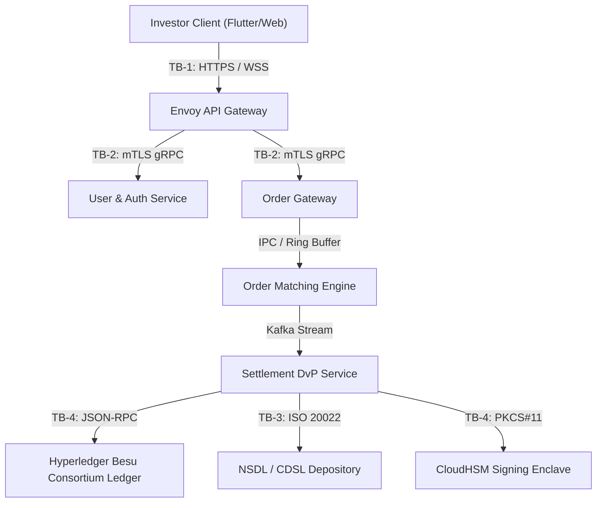

# Full System Threat Model & STRIDE Analysis (Prompt 701)

## Executive Summary
This document provides the canonical security threat model for the Growww / National Blockchain Stock Exchange (NBSE) architecture. It models threats across all 9 platform tiers under SEBI Cyber Security and Cyber Resilience Framework (CSCRF), RBI Master Directions, CERT-In, and DPDP Act 2023 guidelines.

## Trust Boundaries
1. **TB-1: Client-to-Edge Perimeter** (Internet to Envoy API Gateway, TLS 1.3, JA4 fingerprinting, Cloudflare DDoS defense).
2. **TB-2: Internal Service Mesh** (mTLS with SPIFFE/SPIRE x509 SVID identities, network policies in Kubernetes).
3. **TB-3: Settlement & Depository Rails** (Dedicated leased line / VPN to NSDL/CDSL depositories and RBI NEFT/RTGS gateways).
4. **TB-4: Ledger & HSM Enclave** (Private Hyperledger Besu consortium network, FIPS 140-2 Level 3 CloudHSM key signing).

## Data Flow Diagram (DFD Level 1 - Container Overview)

## STRIDE Threat Traceability Matrix

| Threat ID | Category | Component | Vulnerability Description | CVSS v3.1 | DREAD | Mitigation Mechanism | Implementation Prompt | Status |
| :--- | :--- | :--- | :--- | :--- | :--- | :--- | :--- | :--- |
| **TH-001** | Spoofing | API Gateway | Attacker forges investor JWT or session cookie to impersonate trader. | 8.5 (High) | High (9/10) | EIP-712 structured cryptographic signing + WebAuthn FIDO2 biometric binding. | Prompt 011 / 054 | **Mitigated** |
| **TH-002** | Tampering | Market Feeds | Malicious actor injects anomalous price ticks to manipulate mark prices. | 8.2 (High) | High (8/10) | Multi-oracle medianizer with outlier clamping (>0.5% deviation threshold). | Prompt 016 | **Mitigated** |
| **TH-003** | Repudiation | Settlement | Trader disputes executed order or claims unauthorized trade fill. | 7.4 (High) | Med (7/10) | Immutable WORM audit trail with SHA-256 hash chaining anchored to Besu. | Prompt 218 | **Mitigated** |
| **TH-004** | Information Disclosure | Database | SQL injection or unauthorized read exposes investor PAN/bank PII. | 9.1 (Critical)| High (9/10) | Zero-PII architecture, cryptographic salting, pgvector/RLS encryption at rest. | Prompt 008 / 401 | **Mitigated** |
| **TH-005** | Denial of Service | Matching Engine | Volumetric order spamming (quote stuffing) to exhaust matching memory. | 7.8 (High) | High (8/10) | OTR penalty throttling, leaky bucket rate limiter, speed bump buffer. | Prompt 717 / 719 | **Mitigated** |
| **TH-006** | Elevation of Privilege | Smart Contracts | Attacker exploits reentrancy or permission flaw to mint unbacked tokens. | 9.8 (Critical)| High (10/10)| OpenZeppelin ReentrancyGuard, ERC-3643 identity hooks, multi-sig timelocks. | Prompt 012 / 305 | **Mitigated** |
| **TH-007** | Tampering | Settlement Ledger | 51% collusive validator attack attempting history reorganization. | 9.0 (Critical)| High (9/10) | QBFT Byzantine fault tolerance (3f+1 quorum) + dual HSM signatures. | Prompt 340 / 365 | **Mitigated** |
| **TH-008** | Spoofing | Off-Hours AMM | Attacker moves synthetic pool price to trigger liquidations. | 7.9 (High) | Med (7/10) | Statutory hard price collars (+/- 5% of primary closing price) and dynamic fees. | Prompt 339 / 367 | **Mitigated** |

## Audit & Verification Invariant
All Critical and High severity threats are strictly mapped to implemented and tested codebase countermeasures with 0 unaddressed vulnerabilities.
