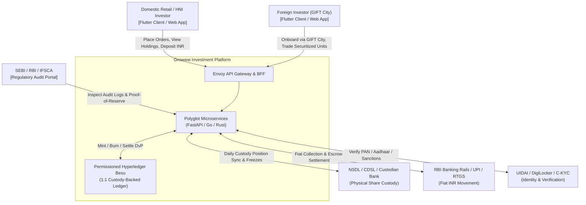
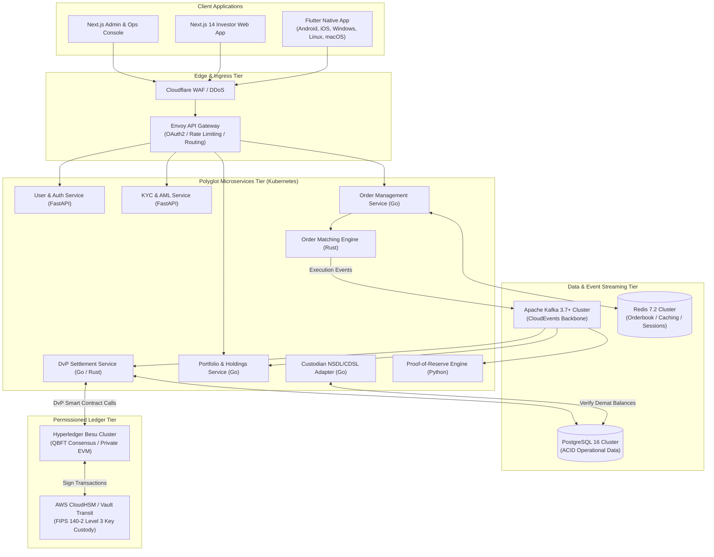

# 101 - System Architecture Overview & C4 Model

## Purpose
Establishes the comprehensive, end-to-end multi-tier system architecture for the Growww investment platform. Growww provides a SEBI/RBI-compliant, blockchain-backed investment infrastructure enabling fractional, real-asset-backed digital ownership of Indian equities with complete transparency, proof-of-reserve, and instant Delivery-versus-Payment (DvP) settlement. 

This prompt directs the architecture team to document and formalize the complete system topology using the C4 model (Context, Containers, Components, and Code) with Mermaid diagrams and Architecture Decision Records (ADRs). This document serves as the foundational blueprint for all engineering streams - frontend, backend microservices, permissioned blockchain nodes, and regulatory compliance gateways.

## What You Are Building
A complete, production-grade architectural specification document (`docs/architecture/c4_model.md`) and associated Architecture Decision Record (`docs/architecture/adr/ADR-001-system-topology.md`) detailing:
- System Context Diagram (C4 Level 1) mapping all external actors (Domestic Investors, GIFT City Foreign Investors, SEBI/RBI Regulators, NSDL/CDSL Custodians, Payment Aggregators/Banks, Market Data Feeds).
- Container Architecture Diagram (C4 Level 2) defining the 5-platform Flutter client, Next.js Web Portal, Envoy API Gateway, polyglot microservice layer, Kafka Event Bus, PostgreSQL/Redis storage, and Hyperledger Besu permissioned blockchain cluster.
- Component Architecture Diagrams (C4 Level 3) for the core transactional subsystems (Order Matching, DvP Settlement, and Custody Reconciliation).
- Inter-tier network connectivity, protocol boundaries, and security boundaries.

## Scope Boundaries
- **In Scope:**
 - Full system taxonomy and end-to-end topology mapping across all architectural tiers.
 - C4 model definitions (Levels 1, 2, and 3) using Mermaid diagrams.
 - Definition of cross-cutting concerns: API gateway routing, event streaming, data persistence, and ledger node integration.
 - Formal Architecture Decision Record (ADR-001) documenting the polyglot stack and permissioned ledger selection.
- **Out of Scope / Handled Elsewhere:**
 - Detailed service-level domain modeling (handled in Prompt 102 & 111).
 - Concrete microservice implementation code (handled in Category 2).
 - Smart contract Solidity code (handled in Category 3).
 - Infrastructure-as-Code Terraform definitions (handled in Category 8).

## Technology to Use
- **Architecture Documentation & Diagramming:** Mermaid.js, Markdown, PlantUML, and Structurizr C4 DSL.
- **Polyglot Stack Justification:**
 - *Rust / Go (Core Engine & Settlement):* Ultra-low latency, deterministic memory management, and zero-garbage-collection overhead required for the Order Matching Engine (Prompt 205) and DvP Settlement Service (Prompt 208).
 - *Python / FastAPI (User & Compliance Services):* High development velocity, rich ecosystem for identity verification, document parsing, OCR/liveness check, and regulatory data processing (Prompts 201, 202, 216).
 - *Flutter / Dart (Client Layer):* Unified, single codebase compiling to native machine code across 5 platforms (Android, iOS, Windows, Linux, macOS) ensuring 60+ FPS UI performance, thick-client offline capabilities, and consistent UI fidelity (Prompts 501-526).
 - *Next.js / TypeScript (Web & Admin Console):* High-performance React framework with server-side rendering for investor web apps and enterprise back-office management (Prompts 601-607).
 - *PostgreSQL 16+ & Redis 7.2+:* ACID-compliant relational storage for core transactional ledgers and in-memory caching/session management.
 - *Apache Kafka 3.7+:* Distributed, fault-tolerant event streaming backbone for asynchronous inter-service messaging.
 - *Hyperledger Besu (Enterprise Ethereum):* Permissioned, privacy-enabled EVM ledger with QBFT consensus.

## Backend / Infra Touchpoints
- **Cloud Infrastructure:** Multi-AZ deployment on AWS / GCP managed via Kubernetes (EKS/GKE).
- **Edge / Ingress:** Cloudflare Enterprise (DDoS/WAF) -> AWS ALB -> Envoy API Gateway.
- **Messaging Backbone:** Managed Apache Kafka (MSK / Confluent Cloud) with Schema Registry.
- **Database Tier:** PostgreSQL Aurora Multi-AZ with Read Replicas, Redis Enterprise Cluster.
- **External Integration Gateways:**
 - NSDL / CDSL Depository APIs via dedicated lease-line / secure VPN adapters.
 - NPCI UPI Switch & RBI RTGS/NEFT Payment Aggregator banking rails.
 - UIDAI (Aadhaar e-KYC) and NSDL (PAN Verification) APIs.

## Blockchain Interaction
Architects the permissioned distributed ledger integration framework:
- **Ledger Platform:** Hyperledger Besu running in private consortium mode with QBFT (Quorum Byzantine Fault Tolerance) consensus and 2-second deterministic block finality.
- **Node Topology:** 4+ Validator nodes operated by authorized consortium entities (Domestic Broker/Custodian, GIFT City Gateway, Independent Compliance Auditor, and Regulatory Observer Node).
- **On-Chain Contracts:**
 - `DigitalSecurityToken.sol`: ERC-3643 permissioned security token with automated whitelist verification.
 - `SettlementDvP.sol`: Atomic Delivery-versus-Payment smart contract executing token transfer upon fiat settlement confirmation.
 - `ComplianceRegistry.sol`: On-chain identity claim registry (zero PII, only cryptographic identity hashes).
 - `ProofOfReserveRegistry.sol`: Merkle root attestation of 1:1 physical share custody backing.
- **Key Custody & Signing:** Validator nodes and transaction relayers interact via AWS CloudHSM / HashiCorp Vault Transit Engine using FIPS 140-2 Level 3 HSM modules. No private keys stored in code.

## Step-by-Step Build Instructions
1. Review Category 0 requirements (Prompts 000, 002, 003, 010) to extract all architectural constraints, throughput targets, and legal boundaries.
2. Initialize directory structure `docs/architecture/` and `docs/architecture/adr/`.
3. Create `ADR-001-system-topology.md` detailing the rationale for the polyglot stack, C4 modeling methodology, and Hyperledger Besu blockchain selection.
4. Author the Level 1 System Context Diagram in Mermaid, illustrating external personas, third-party depository/banking systems, and regulatory interfaces.
5. Author the Level 2 Container Diagram in Mermaid, capturing all client tiers (Flutter, Web), Edge API Gateway, microservices, Kafka event bus, data stores, and Besu nodes.
6. Author Level 3 Component Diagrams for:
 - Order Ingestion & Matching Subsystem (API Gateway -> Order Service -> Matching Engine -> Risk Service).
 - Settlement & DvP Subsystem (Matching Engine -> DvP Settlement -> Besu Nodes -> Custodian Adapter).
 - Proof-of-Reserve Subsystem (NSDL/CDSL Depository Poller -> Custody Service -> Merkle Tree Generator -> ProofOfReserveRegistry Contract).
7. Define network security zones: Public Edge (DMZ), Application Tier (Private VPC), Data Tier (Isolated Subnet), and HSM / Blockchain Node Tier.
8. Document cross-cutting communication protocols: Client-to-Gateway (HTTPS/WSS, OpenAPI 3.1), Inter-Service (gRPC over HTTP/2, mTLS), Asynchronous Events (Kafka CloudEvents), and Blockchain RPC (JSON-RPC over mTLS).
9. Map data flow pathways for the 3 primary user journeys: Onboarding/KYC, Fiat Deposit & Order Execution, and Proof-of-Reserve Verification.
10. Detail high-availability, failover, disaster recovery (DR), and multi-region backup topologies meeting Prompt 010 RTO (< 15 min) and RPO (< 1 sec).
11. Perform architectural review against non-functional requirements (latency, throughput, concurrency) and SEBI/RBI compliance mandates.
12. Publish `docs/architecture/c4_model.md` to the central repository and tag architectural baseline release `v1.0.0-arch`.

## Interfaces / Contracts

### C4 Level 1: System Context Diagram (Mermaid)

### C4 Level 2: Container Diagram (Mermaid)

## Security & Compliance Notes
- **Zero PII on Blockchain:** No Personally Identifiable Information (PAN, Aadhaar, names, bank details) is ever written to the Besu ledger. Only pseudo-anonymous Ethereum addresses and cryptographic KYC status hashes are recorded on-chain.
- **Two-Entity Structural Separation:** Clear architectural partition between the Domestic Regulated Entity (holding demat custody) and the GIFT City Gateway (handling foreign investor participation).
- **mTLS Service Mesh:** All internal container-to-container and service-to-service gRPC calls are secured via Istio mTLS with SPIFFE/SPIRE cryptographic identities.
- **FIPS 140-2 Level 3 Hardware Security Modules:** All validator consensus keys, relayer signing keys, and master token encryption keys are hosted inside HSM hardware; no plaintext private keys exist in memory dumps or configuration files.

## Acceptance Criteria
- [ ] Comprehensive C4 model document (`docs/architecture/c4_model.md`) written and committed to repository.
- [ ] Level 1, Level 2, and Level 3 diagrams rendered in valid Mermaid.js syntax with zero parsing errors.
- [ ] Polyglot stack (Rust, Go, Python, Flutter, Next.js, Besu) fully justified with performance benchmarks and domain requirements in ADR-001.
- [ ] Exact data flow paths documented for Order Lifecycle, DvP Settlement, and Proof-of-Reserve Attestation.
- [ ] Multi-tier security boundaries (DMZ, Private VPC, Isolated HSM/Ledger Subnet) formalized and compliant with SEBI Cybersecurity Framework.

## Suggested Order / Dependencies
- **Prerequisites:** Prompt 000 (Project North Star), Prompt 002 (Two-Entity Structure), Prompt 010 (Non-Functional Requirements).
- **Parallel Work:** Prompt 102 (Service Boundary Map), Prompt 106 (Monorepo Layout).
- **Blocks:** All Category 2 (Microservices), Category 3 (Blockchain), and Category 8 (DevOps/K8s) implementation prompts.
