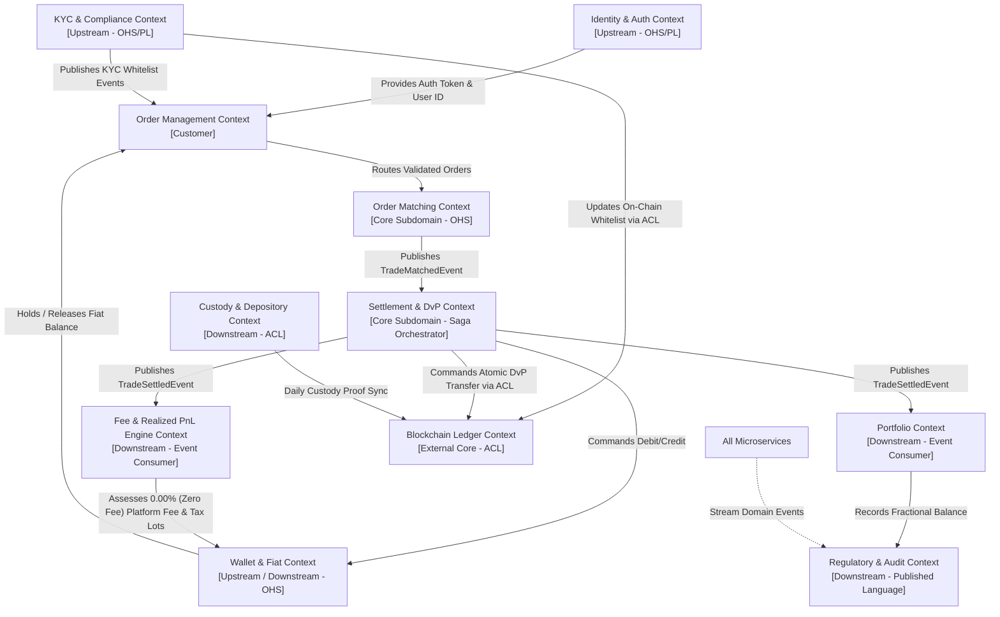

# 102 - Service Boundary Map & Domain-Driven Design (DDD) Bounded Contexts

## Purpose
Establishes the enterprise Domain-Driven Design (DDD) bounded contexts, service boundaries, and strategic context maps for the Growww investment platform. A clean, modular decomposition prevents tight coupling, eliminates circular dependencies, enforces strict data encapsulation, and guarantees high transactional throughput across microservices and permissioned blockchain nodes.

This prompt provides developers and system architects with the definitive service boundary catalog, defining exact aggregate roots, domain events, ubiquitous language, and upstream/downstream integration relationships (Anti-Corruption Layers, Open Host Services, and Customer-Supplier relationships).

## What You Are Building
A comprehensive Domain-Driven Design architecture specification (`docs/architecture/bounded_contexts.md`) and Context Map diagram defining:
- 10 Discrete Bounded Contexts: Identity & Auth, KYC & Investor Compliance, Wallet & Fiat Banking, Order Management, Order Matching, DvP Settlement, Custody & Depository Integration, Portfolio & Fractional Units, Fee & Realized PnL Engine, and Regulatory Reporting & Audit.
- Strategic Context Mapping (Mermaid diagram) showing upstream/downstream dependencies, integration patterns (ACL, OHS/PL, Shared Kernel, Conformist), and data ownership boundaries.
- Ubiquitous Language dictionary standardizing domain terminology across all polyglot microservices.
- Service boundary classification specifying database ownership per bounded context (Database-per-Service pattern).

## Scope Boundaries
- **In Scope:**
 - Formal bounded context definitions, aggregate roots, entities, and value objects.
 - Strategic context mapping and integration relationship taxonomy.
 - Identification of synchronous gRPC boundaries vs asynchronous Kafka event boundaries.
 - Invariant rules governing data ownership (zero shared databases across services).
- **Out of Scope / Handled Elsewhere:**
 - REST/gRPC API serialization standards (handled in Prompt 103).
 - Kafka topic schemas and CloudEvents definitions (handled in Prompt 104).
 - Detailed database schemas and indexing strategies (handled in Category 4).
 - Concrete business logic code inside services (handled in Category 2).

## Technology to Use
- **Modeling & Architecture Documentation:** Domain-Driven Design (DDD) strategic & tactical patterns, EventStorming models, Mermaid.js context diagrams.
- **Inter-Context Communication Stack:**
 - *Synchronous Command Execution:* gRPC over HTTP/2 with Protocol Buffers v3 for high-throughput, low-latency cross-context commands.
 - *Asynchronous Domain Event Distribution:* Apache Kafka 3.7+ with CloudEvents standard for eventual consistency, saga orchestration, and state projection.
 - *Database per Service:* Dedicated PostgreSQL schemas / database instances per bounded context; no direct SQL cross-joins across context boundaries.
 - *Anti-Corruption Layer (ACL):* Dedicated translation modules in Go/Rust isolating external legacy protocols (NSDL/CDSL Depository APIs, UPI Switches) and permissioned blockchain JSON-RPC interfaces from internal domain models.

## Backend / Infra Touchpoints
- **Microservices Deployment:** Isolated Kubernetes pods organized by bounded context namespaces.
- **Storage Isolation:** Dedicated PostgreSQL 16 databases per bounded context (`growww_identity`, `growww_orders`, `growww_settlement`, `growww_custody`, `growww_portfolio`, `growww_audit`).
- **Distributed Event Bus:** Kafka cluster with role-based access control (RBAC) enforcing context-specific topic publish/subscribe permissions.
- **Service Mesh:** Istio service mesh enforcing mTLS and authorization policies between microservices based on context map rules.

## Blockchain Interaction
Defines the Ledger Context as an external, immutable bounded context integrated via an Anti-Corruption Layer (ACL):
- **On-Chain Ledger Bounded Context:** Encapsulates Hyperledger Besu smart contracts (`DigitalSecurityToken.sol`, `SettlementDvP.sol`, `ComplianceRegistry.sol`, `ProofOfReserveRegistry.sol`).
- **Anti-Corruption Layer Bridge:** The `DvP Settlement` and `Custodian Adapter` contexts interact with the Besu ledger strictly via an asynchronous blockchain relayer and indexing ACL.
- **Domain Invariant Mapping:** Internal domain states (e.g., `OrderMatched`, `FiatReserved`, `CustodyLocked`) trigger atomic on-chain smart contract invocations (`executeDvPTransfer`) without leaking EVM/Solidity specific data structures (ABI encoding, gas limits, raw hex nonces) into upstream business services.
- **Zero PII Ledger Invariant:** The Ledger context receives only pseudo-anonymous wallet identifiers and cryptographic commitment hashes, ensuring zero investor PII enters the permissioned blockchain.

## Step-by-Step Build Instructions
1. Review domain invariants from Category 0 (1:1 custody backing, Universal Zero-Fee Model (0.00% fee - No fee at all) model, two-entity separation, instant DvP settlement).
2. Create `docs/architecture/bounded_contexts.md` and define the ubiquitous language glossary for all domain concepts.
3. Define the **Identity & Auth Context**: User registration, session tokens, multi-factor authentication, device fingerprinting, and RBAC.
4. Define the **KYC & Investor Compliance Context**: Document verification (PAN/Aadhaar/Passport), liveness checks, AML/PEP sanctions screening, and investor whitelist status.
5. Define the **Wallet & Fiat Banking Context**: INR virtual accounts, fiat ledger entries, bank account linking, UPI/NEFT deposits/withdrawals, and fund reservation holds.
6. Define the **Order Management Context**: Order intake, input validation, client-side state machine, pre-trade risk checks, and execution status tracking.
7. Define the **Order Matching Context**: In-memory limit order books, price-time priority matching algorithms, and trade execution event generation.
8. Define the **Settlement & DvP Context**: Atomic Delivery-versus-Payment orchestration, fiat transfer confirmation, and smart contract settlement triggers.
9. Define the **Custody & Depository Context**: Demat physical share balance tracking, NSDL/CDSL daily statement parsing, pool account allocations, and custody lock/unlock operations.
10. Define the **Portfolio & Fractional Units Context**: User asset holdings, fractional share bookkeeping (up to 6 decimals), average cost basis, and portfolio valuation.
11. Define the **Fee & Realized PnL Engine Context**: Fixed 0.00% (Zero Fee) (0.00% fee / 0 bps at launch) Transaction Fee calculation on trade notional turnover with 0.00% fees at launch (100% net proceeds credited; future fee adjustments governed by FeeController.sol), and FIFO realized capital gain/loss computation strictly for user tax compliance (Section 111A/112A).
12. Define the **Regulatory & Audit Context**: Immutable append-only event logging, SEBI/RBI automated report generation, and suspicious transaction reporting (STR).
13. Draw the complete Strategic Context Map in Mermaid, explicitly marking upstream (U), downstream (D), Open Host Service (OHS), Published Language (PL), and Anti-Corruption Layer (ACL) designations.
14. Define cross-context event propagation boundaries and validate that no circular dependency paths exist across bounded contexts.
15. Submit `docs/architecture/bounded_contexts.md` for architectural review and freeze the context map baseline.

## Interfaces / Contracts

### Strategic Context Map (Mermaid)

### Context Boundary Specification Matrix
| Bounded Context | Core Aggregate Root | Data Store | Primary Invariant | Integration Pattern |
|---|---|---|---|---|
| **Identity & Auth** | `UserIdentity` | `growww_identity` | Unique mobile/email, secure credentials | OHS / REST & gRPC |
| **KYC & Compliance** | `InvestorKYC` | `growww_kyc` | Verified PAN/Aadhaar before trading | OHS / Kafka Events |
| **Wallet & Fiat** | `FiatAccount` | `growww_wallet` | Non-negative available INR balance | OHS / gRPC & Events |
| **Order Management** | `ClientOrder` | `growww_orders` | Pre-trade risk checks passed before routing | Customer / Supplier |
| **Order Matching** | `OrderBook` | In-Memory (Rust) | Strict price-time FIFO execution | Core / Low-latency IPC |
| **Settlement & DvP** | `DvPSettlement` | `growww_settlement` | Atomic simultaneous fiat & token swap | Saga Orchestrator / ACL |
| **Custody & Depository** | `CustodyPool` | `growww_custody` | 1:1 physical share backing at NSDL/CDSL | ACL / Adapter |
| **Portfolio & Holdings** | `UserHolding` | `growww_portfolio` | Exact 6-decimal fractional balance sum | Event Consumer |
| **Fee & Realized PnL Engine** | `FeeAndTaxAssessment` | `growww_fee` | 0.00% fee (No fee at all) on trade turnover (0.00% fee at launch (future fee parameters governed by FeeController.sol)); FIFO tax compliance | Event Consumer |
| **Ledger (Blockchain)** | `SecurityToken` | Hyperledger Besu | Immutable on-chain token state & DvP lock | External Core / ACL |

## Security & Compliance Notes
- **Zero Cross-Context DB Access:** Direct database queries across bounded context databases are strictly forbidden at the network and credentials level. All data sharing occurs via gRPC or Kafka domain events.
- **Two-Entity Boundary Enforcement:** The GIFT City Foreign Investor Gateway operates as a distinct bounded context communicating with the Domestic Custody context exclusively over an audited Anti-Corruption Layer (Prompt 110).
- **PII Compartmentalization:** Investor identity data (PAN, Aadhaar, bank account numbers) is strictly quarantined within the KYC and Wallet contexts; downstream trading and settlement contexts reference only an immutable, opaque `user_id` UUID.
- **Audit Immutability:** The Regulatory & Audit context receives a cryptographically hashed, append-only stream of all domain events for SEBI compliance.

## Acceptance Criteria
- [ ] Comprehensive Bounded Context catalog (`docs/architecture/bounded_contexts.md`) written and committed.
- [ ] Strategic Context Map diagram rendered in Mermaid with all upstream/downstream and ACL relationships verified.
- [ ] All 10 bounded contexts fully specified with aggregate roots, primary invariants, data store ownership, and ubiquitous language definitions.
- [ ] Zero circular dependencies verified in the context relationship graph.
- [ ] Anti-Corruption Layer (ACL) specifications defined for external banking, NSDL/CDSL depository, and Hyperledger Besu blockchain interactions.

## Suggested Order / Dependencies
- **Prerequisites:** Prompt 000 (Project North Star), Prompt 001 (Glossary), Prompt 101 (System Architecture Overview).
- **Parallel Work:** Prompt 103 (API Standards), Prompt 104 (Event Schema Standards).
- **Blocks:** Prompt 111 (Canonical Domain Model), Category 2 (All Microservices implementation).
