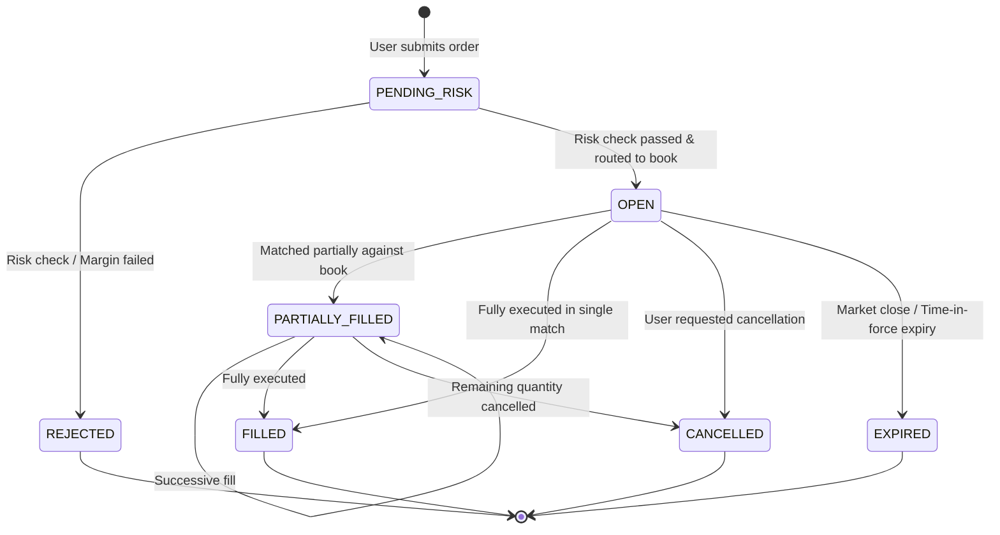

# 111 - Canonical Domain Model & Core Entity Specifications

## Purpose
Establishes the enterprise-wide canonical domain model, core entity schemas, domain invariants, and state transition lifecycles for the Growww investment platform. Growww operates a complex financial ecosystem where users trade fractional digital security units backed 1:1 by physical Indian equities held in SEBI-registered depositories (NSDL/CDSL).

This prompt provides backend engineers, blockchain developers, and database architects with the definitive, unambiguous object models for core entities: `User`, `Account`, `SecurityMaster`, `Holding`, `Order`, `Trade`, `Settlement`, `CustodyPool`, `DigitalToken`, and `FeeAssessment`. It standardizes fixed-point precision for fractional equities (up to 6 decimal places), exact monetary representation (INR in integer paise / cents), and state machines across trade lifecycles.

## What You Are Building
A comprehensive domain modeling specification (`docs/architecture/canonical_domain_model.md`), core Protocol Buffer domain definitions (`proto/domain/v1/`), and state transition lifecycle specifications:
- Canonical Domain Entities: Complete class/struct schemas for User, Account, Security, Holding, Order, Trade, Settlement, Token, and Fee.
- Numerical Precision & Math Standards: Standardized `FractionalShare` (6-decimal fixed-point) and `Money` (integer currency units and nanos) value objects preventing floating-point rounding errors.
- Trade Lifecycle State Machines: Formal Mermaid state diagrams and transition invariants for Orders (`PENDING` -> `ROUTED` -> `MATCHED` -> `SETTLED` / `REJECTED`), Trades, and DvP Settlements.
- On-Chain to Off-Chain Entity Mappings: Cryptographic mapping table binding off-chain relational database entities to Hyperledger Besu smart contract structs.

## Scope Boundaries
- **In Scope:**
 - Entity definitions, value objects, and aggregate root boundaries.
 - Domain invariants, validation constraints, and business rules.
 - State machine lifecycle definitions for orders, trades, and settlements.
 - Protobuf domain message definitions under `proto/domain/v1/`.
 - On-chain smart contract data mapping.
- **Out of Scope / Handled Elsewhere:**
 - Physical PostgreSQL relational table schemas and indexes (handled in Prompt 401).
 - Concrete business logic inside services (handled in Category 2).
 - Smart contract Solidity code (handled in Category 3).

## Technology to Use
- **Domain Modeling & Schema Definition:** Protocol Buffers v3, Mermaid.js (State Machine Diagrams), JSON Schema Draft 2020-12.
- **Fixed-Point Arithmetic:**
 - *Go:* `github.com/shopspring/decimal` for exact 6-decimal financial math.
 - *Rust:* `rust_decimal` with zero-allocation fixed-point arithmetic for the Matching Engine.
 - *Python:* `decimal.Decimal` module for compliance calculations and fee assessments.
- **Identifier Strategy:** UUIDv7 (RFC 9562) providing time-ordered, sortable, 128-bit globally unique identifiers across all entities.

## Backend / Infra Touchpoints
- **Core Microservices:** Shared Protocol Buffer definitions imported across all Go, Rust, and Python services via monorepo packages.
- **Database Repositories:** PostgreSQL entities mapped directly from canonical domain models via ORM/Query builders (sqlc in Go, Diesel/SQLx in Rust, SQLAlchemy in Python).
- **Kafka Event Streaming:** Canonical domain entities serialized into CloudEvents payloads (Prompt 104).

## Blockchain Interaction
Establishes the bidirectional mapping between canonical off-chain domain entities and on-chain Hyperledger Besu smart contracts:
- `Holding` <-> `ERC-3643 balanceOf(walletAddress)` on `DigitalSecurityToken.sol`.
- `Trade` & `Settlement` <-> `DvPEscrow` struct on `SettlementDvP.sol`.
- `CustodyPool` <-> `ProofOfReserveAttestation` Merkle leaf on `ProofOfReserveRegistry.sol`.
- `User` KYC Status <-> `IdentityClaim` on `ComplianceRegistry.sol`.
- **Zero PII Invariant:** Canonical entities mapped to blockchain contracts are stripped of all personal data (PAN, Aadhaar, names); only UUIDs, hashed claim identifiers, and Ethereum addresses are passed to the ledger.

## Step-by-Step Build Instructions
1. Author `docs/architecture/canonical_domain_model.md` defining the ubiquitous language, value objects, and entity hierarchy.
2. Define the core value objects:
 - `Money`: Currency code (e.g., `"INR"`, `"USD"`), integer units, and nanos (`1 INR = 100 paise = 1,000,000,000 nanos`).
 - `FractionalShare`: Fixed-point equity amount with 6 decimal places of precision (`1.500000` shares = `1,500,000` micro-shares).
 - `ISIN`: Validated 12-character International Securities Identification Number (e.g., `INE002A01018`).
3. Define the **User & Account Entities** (`proto/domain/v1/user.proto`, `account.proto`): User profiles, entity classification (`DOMESTIC` / `GIFT_CITY`), KYC verification level, and linked fiat accounts.
4. Define the **SecurityMaster Entity** (`proto/domain/v1/security.proto`): Symbol, ISIN, company name, listing exchange, lot size (fractionalized to 1), tick size, trading status, and associated ERC-3643 token contract address.
5. Define the **Holding Entity** (`proto/domain/v1/holding.proto`): User ID, ISIN, total fractional quantity, locked quantity (in active orders), available quantity, and weighted average acquisition cost.
6. Define the **Order Entity** (`proto/domain/v1/order.proto`): Order ID, User ID, ISIN, side (`BUY` / `SELL`), type (`MARKET` / `LIMIT` / `STOP_LIMIT`), limit price, quantity, filled quantity, time-in-force, order status, and idempotency key.
7. Define the **Trade & Execution Entities** (`proto/domain/v1/trade.proto`): Trade ID, Buy Order ID, Sell Order ID, Buyer User ID, Seller User ID, ISIN, execution price, execution quantity, trade timestamp, and fee amount.
8. Define the **Settlement Entity** (`proto/domain/v1/settlement.proto`): Settlement ID, Trade ID, DvP mode (`INSTANT_ONCHAIN`), fiat settlement status, token transfer status, blockchain transaction hash, and depository custody reference.
9. Define the **FeeAssessment Entity** (`proto/domain/v1/fee.proto`): 0.00% (No fee at all) platform fee calculation on trade notional turnover, multi-vault revenue split (0.00% fee at launch; future fee parameters governed by FeeController.sol), FIFO capital gains calculation for tax compliance (Section 111A/112A), and assessed fee in sub-paise precision.
10. Model the complete Order Lifecycle State Machine in Mermaid with exact transition triggers and terminal states (`FILLED`, `CANCELLED`, `REJECTED`, `EXPIRED`).
11. Model the DvP Settlement State Machine in Mermaid (`INITIATED` -> `FIAT_RESERVED` -> `ONCHAIN_DVP_PENDING` -> `SETTLED` / `FAILED_UNWOUND`).
12. Generate multi-language Protocol Buffer stubs (`task proto:gen`) and verify cross-compilation in Go, Rust, Python, Dart, and TypeScript.

## Interfaces / Contracts

### Order Protocol Buffer Contract (`proto/domain/v1/order.proto`)
```protobuf
syntax = "proto3";

package growww.domain.v1;

import "google/protobuf/timestamp.proto";
import "proto/common/v1/fractional_share.proto";
import "proto/common/v1/money.proto";

option go_package = "github.com/growww/proto/gen/go/domain/v1;domainv1";

enum OrderSide {
  ORDER_SIDE_UNSPECIFIED = 0;
  ORDER_SIDE_BUY = 1;
  ORDER_SIDE_SELL = 2;
}

enum OrderType {
  ORDER_TYPE_UNSPECIFIED = 0;
  ORDER_TYPE_MARKET = 1;
  ORDER_TYPE_LIMIT = 2;
  ORDER_TYPE_STOP_LIMIT = 3;
}

enum OrderStatus {
  ORDER_STATUS_UNSPECIFIED = 0;
  ORDER_STATUS_PENDING_RISK = 1;
  ORDER_STATUS_OPEN = 2;
  ORDER_STATUS_PARTIALLY_FILLED = 3;
  ORDER_STATUS_FILLED = 4;
  ORDER_STATUS_CANCELLED = 5;
  ORDER_STATUS_REJECTED = 6;
  ORDER_STATUS_EXPIRED = 7;
}

message Order {
  string order_id = 1;                       // UUIDv7
  string user_id = 2;                        // UUIDv7
  string isin = 3;                           // e.g. "INE002A01018"
  OrderSide side = 4;
  OrderType type = 5;
  OrderStatus status = 6;
  growww.common.v1.FractionalShare quantity = 7;
  growww.common.v1.FractionalShare filled_quantity = 8;
  growww.common.v1.Money limit_price = 9;    // Required for LIMIT orders
  growww.common.v1.Money stop_price = 10;    // Required for STOP_LIMIT
  string idempotency_key = 11;
  string rejection_reason = 12;
  google.protobuf.Timestamp created_at = 13;
  google.protobuf.Timestamp updated_at = 14;
}
```

### Trade & DvP Settlement Protocol Buffer (`proto/domain/v1/settlement.proto`)
```protobuf
syntax = "proto3";

package growww.domain.v1;

import "google/protobuf/timestamp.proto";
import "proto/common/v1/fractional_share.proto";
import "proto/common/v1/money.proto";

option go_package = "github.com/growww/proto/gen/go/domain/v1;domainv1";

enum SettlementStatus {
  SETTLEMENT_STATUS_UNSPECIFIED = 0;
  SETTLEMENT_STATUS_INITIATED = 1;
  SETTLEMENT_STATUS_FIAT_LOCKED = 2;
  SETTLEMENT_STATUS_ONCHAIN_PENDING = 3;
  SETTLEMENT_STATUS_COMPLETED = 4;
  SETTLEMENT_STATUS_FAILED_ROLLEDBACK = 5;
}

message Settlement {
  string settlement_id = 1;                  // UUIDv7
  string trade_id = 2;                       // UUIDv7
  string buy_order_id = 3;
  string sell_order_id = 4;
  string buyer_user_id = 5;
  string seller_user_id = 6;
  string isin = 7;
  growww.common.v1.FractionalShare quantity = 8;
  growww.common.v1.Money gross_amount = 9;
  growww.common.v1.Money platform_fee = 10;
  SettlementStatus status = 11;
  string onchain_tx_hash = 12;
  int64 onchain_block_number = 13;
  string custody_transfer_reference = 14;
  google.protobuf.Timestamp settled_at = 15;
}
```

### Order Lifecycle State Machine (Mermaid)


## Security & Compliance Notes
- **Financial Precision Safety:** All currency operations strictly forbid floating-point types (`float`, `double`). Integer paise arithmetic and 6-decimal fixed-point math guarantee zero round-off exploitation or accumulated precision loss.
- **Time-Ordered UUIDv7 Identifiers:** All entity IDs use UUIDv7 (RFC 9562) combining a 48-bit millisecond Unix timestamp with 74 bits of cryptographically strong randomness, preventing primary key index fragmentation in PostgreSQL while enabling chronological sorting.
- **Strict Invariant Validation:** State transitions are guarded by strict invariant rules (e.g., an order cannot transition to `FILLED` unless `filled_quantity == quantity`).

## Acceptance Criteria
- [ ] Complete Canonical Domain Model document (`docs/architecture/canonical_domain_model.md`) published.
- [ ] Protobuf domain schemas (`user.proto`, `account.proto`, `security.proto`, `holding.proto`, `order.proto`, `trade.proto`, `settlement.proto`, `fee.proto`) authored and compiling without errors.
- [ ] Fixed-point numerical value objects (`FractionalShare`, `Money`) formalized and implemented across Go, Rust, and Python.
- [ ] Order, Trade, and Settlement state machines documented with valid Mermaid diagrams.
- [ ] On-chain to off-chain entity mapping table fully specified for Hyperledger Besu smart contracts.

## Suggested Order / Dependencies
- **Prerequisites:** Prompt 001 (Glossary), Prompt 101 (System Architecture), Prompt 102 (Bounded Contexts).
- **Parallel Work:** Prompt 103 (API Standards), Prompt 104 (Event Standards), Prompt 112 (Idempotency).
- **Blocks:** Category 2 (All Microservices implementation), Prompt 303-306 (Smart Contracts), Prompt 401 (PostgreSQL Schema).
