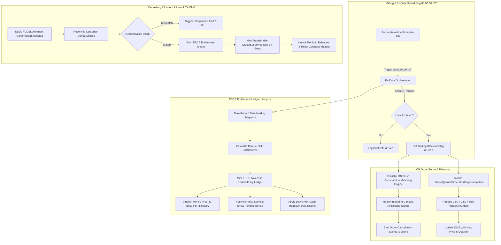

# 249 - Corporate Action Ex-Date Order Purge & EBCE Ledger (Go / Rust)

## Purpose
In Indian equity and capital markets regulated by SEBI, corporate events such as stock splits, bonus share distributions, rights issues, and demergers trigger structural changes in share prices and outstanding unit counts on the Ex-Date (T-0). Under the Indian T+1 rolling settlement regime, the market opens on the Ex-Date with an exchange-mandated adjusted reference price reflecting the dilution or value extraction. If resting Limit Order Book (LOB) orders placed before the Ex-Date remain active, they will execute at stale prices, triggering severe financial losses for liquidity providers, market makers, and retail participants while exposing the exchange to arbitrage exploitation.

Furthermore, a critical operational friction exists between the Ex-Date and the official depository credit date. Depositories (NSDL and CDSL) and Registrars and Transfer Agents (RTAs) require T+1 to T+2 clearing cycles (and occasionally up to several business days for corporate allotment approvals) to credit new bonus or split shares to the custodian Demat pool account. During this depository settlement lag, investors who held shares on the Record Date are entitled to their corporate distribution, but the underlying physical shares have not yet settled into Demat custody. 

The **Corporate Action Ex-Date Order Purge & EBCE Ledger Microservice** (`services/corporate-actions-ledger`) resolves these systemic market challenges. Operating at the boundary of trading and custody, the service executes automated, deterministic, midnight (00:00:00 IST) LOB resting order cancellations, applies mathematical price and quantity transformations to standing conditional orders via `rebaseQueuedOrdersForCorporateAction`, manages the Escrowed Bonus Custody Entitlement (EBCE) ledger to track non-withdrawable bonus rights during depository lag, and orchestrates multi-asset spin-off token factory deployments on Hyperledger Besu.

## What You Are Building
A deterministic, high-availability Go and Rust microservice (`services/corporate-actions-ledger`) backed by PostgreSQL 16, Redis 7.2 Cluster, Apache Kafka 3.7+, and Hyperledger Besu (QBFT). Concrete deliverables include:

- **00:00:00 IST LOB Order Purge Engine:** An automated scheduler and matching engine command dispatcher executing atomic cancellation of all resting limit, market, and stop orders across affected order books in the Central Limit Order Book (CLOB) matching engine (Prompt 205) prior to market pre-open.
- **Queued Order Rebase Transformer (`rebaseQueuedOrdersForCorporateAction`):** A mathematical order transformation pipeline for resting Good-Till-Cancelled (GTC), Good-Till-Date (GTD), bracket, trailing stop, and scheduled conditional orders in the Order Management Service (Prompt 204) and Advanced Order Types Engine (Prompt 226), adjusting limit prices, trigger thresholds, and lot sizes to maintain tick-size conformity.
- **Escrowed Bonus Custody Entitlement (EBCE) Ledger Core:** A high-precision double-entry sub-ledger in Rust (`crates/ebce-ledger`) tracking interim bonus and split entitlements at 18-decimal precision during the T+1/T+2 depository settlement lag, preventing unbacked physical withdrawals or synthetic short selling while supporting non-cash collateral margining.
- **Depository Ingestion & Allotment Reconciliation Module:** An automated settlement listener reconciling NSDL/CDSL RTA allotment confirmation files (Prompt 213) with internal EBCE holdings, executing atomic conversion of EBCE units into fully transferable, custody-backed `DigitalSecurityToken` assets.
- **Multi-Asset Demerger & Spin-Off Token Factory Deployer:** An on-chain orchestrator deploying new `DigitalSecurityToken` ERC-20 smart contracts on Hyperledger Besu for spun-off corporate entities, initializing asset parameters, ISIN mappings, and distributing proportional entitlements to parent token holders.
- **Real-Time Notification & Audit Stream Broadcaster:** A Kafka event pipeline publishing granular audit records and real-time push alerts to affected market participants and administrative compliance dashboards.

## Scope Boundaries
- **In Scope:**
  - Automated 00:00:00 IST order book purging across spot and derivative order books for securities undergoing corporate actions on Ex-Date.
  - Algorithmic price, trigger, and quantity rebasing for queued, GTC, GTD, and bracket orders.
  - EBCE sub-ledger double-entry accounting during depository settlement lag (T+0 Ex-Date to Allotment Credit Date).
  - Risk haircut and collateral restriction enforcement on EBCE balances in coordination with the Risk Engine (Prompt 206, Prompt 241).
  - Depository RTA allotment file processing, electronic reconciliation, and atomic unlocking of EBCE into standard custodial tokens.
  - Demerger and spin-off asset token factory deployment and initial entitlement distribution.
  - High-precision fractional entitlement accounting with 18 decimal places and Banker's Rounding (Round Half to Even).
  - Maker-Checker compliance verification and cryptographic audit logging on PostgreSQL and Hyperledger Besu.
- **Out of Scope / Handled Elsewhere:**
  - Live order matching and trade clearing during normal market hours (handled in Prompt 205).
  - Cash dividend fiat bank transfers and Indian banking gateway rails (handled in Prompt 212).
  - Base SPAN margin and portfolio risk evaluation (handled in Prompt 206 and Prompt 241).
  - Direct depository electronic connectivity protocol adapters for NSDL/CDSL SFTP/MQ (handled in Prompt 213).
  - Annual capital gains tax calculation and TDS statement compilation (handled in Prompt 223).

## Technology to Use
- **Primary Languages & Runtimes:**
  - **Go 1.22+:** Service orchestration, gRPC servers, cron execution harnesses, Kafka consumers/producers, and database access layer (`services/corporate-actions-ledger`).
  - **Rust 1.78+:** Computation math core (`crates/ebce-ledger`) for deterministic fixed-point arithmetic, tick-size rebasing algorithms, and high-performance double-entry state transitions.
- **Database & Persistence:** **PostgreSQL 16+** with `pgx/v5` and `sqlc` for storing corporate action event schedules, purge audit trails, order rebasing records, EBCE accounts, and depository reconciliation batches.
- **In-Memory Cache & Distributed Lock:** **Redis 7.2+ Cluster** utilizing Redlock for distributed cron execution locking, active corporate action blackout window caching, and fast lookup of user EBCE balances.
- **Message Broker & Streaming:** **Apache Kafka 3.7+** with KRaft for dispatching order purge commands, order rebasing events, and EBCE mint/unlock lifecycle events.
- **Blockchain Network:** **Hyperledger Besu 24.x** (permissioned, QBFT consensus) interacting via `go-ethereum` or `ethers-rs` Web3 client for token split/rebase execution, factory deployments, and proof-of-reserve commitments.
- **Inter-Service Communication:** **gRPC / Protocol Buffers v3** with mutual TLS (mTLS) for synchronous communication with Order Management, Matching Engine, and Custody services.

## Backend / Infra Touchpoints
- **PostgreSQL 16 Tables:**
  - `corporate_action_schedules`, `lob_purge_executions`, `order_rebase_audit_records`, `ebce_entitlement_accounts`, `ebce_double_entry_journals`, `spinoff_token_deployments`, `depository_allotment_batches`.
- **Redis 7.2 Keys:**
  - `lock:exdate_purge:{isin}:{date}`: Distributed lock ensuring single-instance execution of midnight purge routines.
  - `ca:active_blackout:{isin}`: Flag marking an asset in order-entry blackout during purge/rebase processing.
  - `ebce:balance:{user_id}:{isin}`: Real-time cache of user locked EBCE units.
- **Apache Kafka Topics:**
  - Subscribes: `corporate_action.declared.v1`, `custody.depository_allotment.received.v1`, `matching.book_flushed.v1`, `admin.corporate_action.approved.v1`.
  - Publishes: `matching.order_purge_command.v1`, `orders.rebased.v1`, `ebce.entitlement_minted.v1`, `ebce.settlement_unlocked.v1`, `spinoff.token_deployed.v1`.
- **Order Matching Engine (Prompt 205):** Ingests mass purge commands over high-priority internal channels to drop resting orders at 00:00:00 IST.
- **Order Management Service (Prompt 204) & Advanced Orders Engine (Prompt 226):** Receives rebase instructions to recalculate limit prices, stop triggers, and quantities for non-resting queued orders.
- **Custodian & Depository Integration Service (Prompt 213):** Supplies verified NSDL/CDSL allotment confirmation data to trigger EBCE conversion.
- **Portfolio & Holdings Service (Prompt 209):** Ingests EBCE balance updates to display pending corporate action holdings in investor portfolios.
- **Risk & Margin Checks Service (Prompt 206 / Prompt 241):** Reads EBCE entitlement state to apply appropriate non-cash collateral haircuts.

## Blockchain Interaction (permissioned Hyperledger Besu ledger with 1:1 custody backing, zero PII, QBFT)
- **On-Chain Token Rebase & Split Invocation:** For stock splits and reverse splits, the service invokes `rebaseSupply(isin, multiplierNumerator, multiplierDenominator)` on `DigitalSecurityToken.sol` (Prompt 302), adjusting all on-chain token balances proportionally across token holders while preserving relative ownership percentages.
- **Escrowed Bonus Custody Entitlement (EBCE) Anchoring:** During the depository settlement lag, EBCE balances are tracked off-chain in the high-speed double-entry ledger. A deterministic cryptographic Merkle root of all EBCE entitlement balances is anchored on-chain to `ProofOfReserveRegistry.sol` (Prompt 308) to maintain verifiable proof that unbacked tokens are not circulating on the exchange.
- **Spin-Off Token Factory Deployment:** For demergers, the service calls `TokenFactory.sol` (Prompt 304) on Hyperledger Besu to deploy a new ERC-20 `DigitalSecurityToken` contract representing the spun-off entity with explicit compliance whitelist rules, initial authorized supply, and custodial depository backing configuration.
- **Atomic EBCE Unlocking:** Upon receipt of verified depository allotment confirmation from NSDL/CDSL, the service mints equivalent on-chain tokens from the custodian reserve pool into investor custody accounts on Hyperledger Besu.
- **Zero On-Chain PII Invariant:** All blockchain transactions, event logs, and contract invocations reference solely pseudonymized user account UUID hashes, ISIN codes, contract addresses, token quantities, and cryptographic Merkle roots. No user PAN, Aadhaar, email, or real identity is ever published to the distributed ledger.

## Ex-Date Processing & EBCE Lifecycle Architecture



### Order Rebasing Mathematical Formulations

1. **Stock Split / Bonus Issue Adjustment for Queued Orders:**
   For a bonus ratio $A:B$ (i.e. $A$ bonus shares for every $B$ shares held) or split ratio $N:D$ (i.e. $D$ old shares split into $N$ new shares), the multiplier factor $M$ is defined as:
   $$M_{\text{split}} = \frac{N}{D}, \quad M_{\text{bonus}} = \frac{A + B}{B}$$

   The rebased limit price $P_{\text{new}}$, stop-loss trigger price $T_{\text{new}}$, and order quantity $Q_{\text{new}}$ are computed as:
   $$P_{\text{new}} = \text{RoundToTick}\left(\frac{P_{\text{old}}}{M}\right)$$
   $$T_{\text{new}} = \text{RoundToTick}\left(\frac{T_{\text{old}}}{M}\right)$$
   $$Q_{\text{new}} = \text{FloorToLot}\left(Q_{\text{old}} \times M\right)$$

   Where:
   - $\text{RoundToTick}(x)$ rounds $x$ to the nearest valid exchange tick size ($₹0.05$ standard) using Banker's Rounding (Round Half to Even).
   - $\text{FloorToLot}(y)$ truncates $y$ to the nearest integer trading lot size ($1$ unit for spot equity).

2. **Cash Dividend Price Adjustment (Optional GTC Limit Buy Adjustment):**
   When a cash dividend $D_{\text{cash}}$ per share exceeds statutory materiality thresholds (e.g. $\ge 2\%$ of market price):
   $$P_{\text{new}} = \max\left(\text{TickSize}, \text{RoundToTick}\left(P_{\text{old}} - D_{\text{cash}}\right)\right)$$
   $$Q_{\text{new}} = Q_{\text{old}}$$

3. **Demerger / Spin-Off Entitlement Allocation:**
   When a parent company with security $S_{\text{parent}}$ demerges a child company $S_{\text{child}}$ with ratio $R_{\text{spin}} = C:P$ ($C$ shares of child for every $P$ shares of parent):
   $$\text{Entitlement}_{\text{child}} = \text{Holding}_{\text{parent}} \times \left(\frac{C}{P}\right)$$
   Fractional entitlements below $1.0$ unit are preserved at 18 decimal places in the internal fractional ledger or rounded cash-settled in accordance with the court-approved Scheme of Arrangement.

### EBCE Double-Entry Sub-Ledger State Machine

| State | Allowed Operations | Transferable On-Chain | Withdrawal Allowed | Collateral Margin Value |
| :--- | :--- | :--- | :--- | :--- |
| `EBCE_DECLARED` | Entitlement calculation queued | No | No | 0% |
| `EBCE_ENTITLED_ESCROW` | Snapshot taken, EBCE minted | No | No | 0% (or risk-configured haircut) |
| `EBCE_DEPOSITORY_PENDING` | Awaiting RTA/Depository allotment | No | No | 0% |
| `EBCE_RECONCILED` | Depository Demat receipt confirmed | No | No | 0% |
| `EBCE_CONVERTED_UNLOCKED` | Burned EBCE, minted real token | Yes (on Besu) | Yes | 100% (Standard Haircut) |
| `EBCE_CANCELLED_VOID` | Corporate action revoked by issuer | No | No | 0% |

## Step-by-Step Build Instructions (10-15 steps)
1. **Initialize Microservice Workspace:** Scaffold `services/corporate-actions-ledger` (Go) and embedded native calculation crate `crates/ebce-ledger` (Rust) with strict compiler checks, linting, and benchmarking harnesses.
2. **Define Protocol Buffer Specifications:** Author `proto/growww/corporate_actions_ledger/v1/corporate_actions_ledger.proto` defining gRPC service methods for scheduling corporate actions, triggering midnight LOB purges, executing order rebases, querying EBCE balances, and processing depository allotment files.
3. **Author PostgreSQL Schema Migrations:** Create database migrations defining tables for corporate action schedules, LOB purge execution logs, order rebase audit trails, EBCE entitlement accounts, double-entry journal entries, and depository reconciliation batches.
4. **Implement Midnight LOB Purge Scheduler in Go:**
   - Configure a precision cron scheduler targeting 00:00:00 IST on the Ex-Date of registered corporate actions.
   - Implement Redis Redlock distributed locking to guarantee single-master execution across horizontally scaled service replicas.
   - Emit high-priority `matching.order_purge_command.v1` Kafka message to the Order Matching Engine (Prompt 205).
   - Set active trading blackout flag `ca:active_blackout:{isin}` in Redis to block new incoming order entry during the purge and rebase transition window.
5. **Implement Queued Order Rebase Transformer in Rust/Go (`rebaseQueuedOrdersForCorporateAction`):**
   - Query Order Management Service (Prompt 204) and Advanced Orders Engine (Prompt 226) for all non-resting active orders (GTC, GTD, stop-loss, bracket, trailing stop).
   - Compute adjusted limit prices, stop triggers, and quantities using 128-bit fixed-point arithmetic with Banker's Rounding to valid exchange tick sizes and lot boundaries.
   - Record pre-rebase and post-rebase values in `order_rebase_audit_records`.
   - Dispatch `orders.rebased.v1` Kafka events to update OMS state and notify users.
6. **Implement EBCE Double-Entry Accounting Core in Rust:**
   - Implement double-entry sub-ledger tracking:
     * Debit: `Entitlement_Receivable_From_Depository` (Asset).
     * Credit: `User_EBCE_Escrow_Account` (Liability).
   - Enforce invariant: Total EBCE liabilities across all user accounts must exactly equal the total calculated entitlement units at 18-decimal precision.
   - Enforce non-transferability rules: EBCE tokens cannot be transferred peer-to-peer or withdrawn to external wallets.
7. **Implement Record Date Holding Snapshot Ingester:**
   - Ingest portfolio holding balances from Portfolio & Holdings Service (Prompt 209) at the official Record Date closing cutoff timestamp (15:30:00 IST).
   - Calculate gross entitlements for each investor account based on official split/bonus/demerger ratios.
   - Persist entitlement ledger records and generate initial EBCE balances.
8. **Implement On-Chain Proof-of-Reserve Merkle Root Anchoring:**
   - Construct a cryptographic SHA-256 Merkle tree over all investor EBCE balances for each corporate action batch.
   - Submit the Merkle root and batch metadata to `ProofOfReserveRegistry.sol` on Hyperledger Besu via mTLS HSM relayer.
9. **Build Depository Allotment File Ingestion & Reconciliation Module:**
   - Ingest NSDL/CDSL RTA allotment confirmation records from Custodian Service (Prompt 213).
   - Verify that total shares credited to the custodian Demat pool account equal total outstanding EBCE liabilities.
   - If reconciliation passes, transition EBCE state to `EBCE_RECONCILED`.
   - If a discrepancy exists, raise a critical compliance alert, freeze conversion, and notify operations.
10. **Implement Atomic EBCE-to-Token Conversion Pipeline:**
    - Execute double-entry ledger closing:
      * Debit: `User_EBCE_Escrow_Account` (Liability).
      * Credit: `User_Custody_Token_Account` (Equity/Asset).
    - Trigger on-chain minting or release of `DigitalSecurityToken` assets on Hyperledger Besu.
    - Publish `ebce.settlement_unlocked.v1` Kafka event to notify Portfolio Service (Prompt 209) and Risk Engine (Prompt 206) to restore standard collateral margin treatment.
11. **Implement Multi-Asset Demerger & Spin-Off Token Factory Deployer:**
    - Deploy new `DigitalSecurityToken` ERC-20 smart contracts via `TokenFactory.sol` on Hyperledger Besu for spun-off corporate entities.
    - Initialize new asset master records, tick sizes, lot sizes, and ISIN registrations.
    - Allocate spun-off EBCE tokens or final security tokens to parent token holders based on the demerger ratio.
12. **Configure Maker-Checker Compliance Approval Workflow:**
    - Implement administrative review endpoints requiring dual cryptographic sign-off from authorized Operations and Compliance Officers before executing irreversible token rebases or factory deployments.
13. **Configure Observability, Prometheus Metrics & Health Probes:**
    - Instrument metrics: `ca_exdate_purge_duration_seconds`, `ca_orders_purged_total`, `ca_orders_rebased_total`, `ca_ebce_units_active`, `ca_ebce_reconciliation_discrepancy_count`.
14. **Write Rigorous Verification Test Suites:**
    - Test midnight purge execution latency (< 500ms for 1,000,000 orders).
    - Test fractional split and bonus edge cases (e.g. 1:10 split, 3:7 reverse split, 5:1 bonus) verifying zero floating-point leakage.
    - Test simulated depository allotment delays (T+1, T+2, T+5) verifying EBCE non-transferability and risk haircut enforcement.

## Interfaces / Contracts

### Protobuf Definition (`proto/growww/corporate_actions_ledger/v1/corporate_actions_ledger.proto`)
```protobuf
syntax = "proto3";

package growww.corporate_actions_ledger.v1;

option go_package = "growww/corporate_actions_ledger/v1;corporateactionsledgerv1";

service CorporateActionsLedgerService {
  rpc ScheduleCorporateAction (ScheduleCorporateActionRequest) returns (ScheduleCorporateActionResponse);
  rpc TriggerExDatePurge (TriggerExDatePurgeRequest) returns (TriggerExDatePurgeResponse);
  rpc RebaseQueuedOrders (RebaseQueuedOrdersRequest) returns (RebaseQueuedOrdersResponse);
  rpc GetEBCEBalance (GetEBCEBalanceRequest) returns (GetEBCEBalanceResponse);
  rpc ProcessDepositoryAllotment (ProcessDepositoryAllotmentRequest) returns (ProcessDepositoryAllotmentResponse);
  rpc DeploySpinoffToken (DeploySpinoffTokenRequest) returns (DeploySpinoffTokenResponse);
  rpc GetCorporateActionAuditTrail (GetAuditTrailRequest) returns (GetAuditTrailResponse);
}

enum CorporateActionType {
  CORPORATE_ACTION_TYPE_UNSPECIFIED = 0;
  CORPORATE_ACTION_TYPE_STOCK_SPLIT = 1;
  CORPORATE_ACTION_TYPE_BONUS_ISSUE = 2;
  CORPORATE_ACTION_TYPE_RIGHTS_ISSUE = 3;
  CORPORATE_ACTION_TYPE_DEMERGER_SPINOFF = 4;
  CORPORATE_ACTION_TYPE_SPECIAL_CASH_DIVIDEND = 5;
}

enum EBCEStatus {
  EBCE_STATUS_UNSPECIFIED = 0;
  EBCE_STATUS_DECLARED = 1;
  EBCE_STATUS_ENTITLED_ESCROW = 2;
  EBCE_STATUS_DEPOSITORY_PENDING = 3;
  EBCE_STATUS_RECONCILED = 4;
  EBCE_STATUS_CONVERTED_UNLOCKED = 5;
  EBCE_STATUS_CANCELLED_VOID = 6;
}

message ScheduleCorporateActionRequest {
  string isin = 1;
  CorporateActionType action_type = 2;
  string ex_date = 3; // YYYY-MM-DD
  string record_date = 4; // YYYY-MM-DD
  string ratio_numerator = 5; // e.g. "10" for 10:1 split, "1" for 1:1 bonus
  string ratio_denominator = 6; // e.g. "1" for 10:1 split, "1" for 1:1 bonus
  string cash_dividend_amount_inr = 7;
  string spinoff_entity_name = 8;
  string spinoff_isin = 9;
  string regulatory_filing_ref = 10;
  string maker_user_id = 11;
}

message ScheduleCorporateActionResponse {
  string corporate_action_id = 1;
  string status = 2;
  int64 purge_scheduled_unix_ns = 3;
}

message TriggerExDatePurgeRequest {
  string corporate_action_id = 1;
  string isin = 2;
  bool force_override = 3;
  string operator_id = 4;
}

message TriggerExDatePurgeResponse {
  string purge_execution_id = 1;
  int64 orders_purged_count = 2;
  int64 orders_rebased_count = 3;
  int64 duration_microseconds = 4;
  string status = 5;
}

message RebaseQueuedOrdersRequest {
  string corporate_action_id = 1;
  string isin = 2;
  CorporateActionType action_type = 3;
  string ratio_numerator = 4;
  string ratio_denominator = 5;
  string cash_dividend_amount_inr = 6;
}

message RebaseQueuedOrdersResponse {
  string corporate_action_id = 1;
  int64 total_orders_evaluated = 2;
  int64 orders_rebased_count = 3;
  int64 orders_cancelled_count = 4;
}

message GetEBCEBalanceRequest {
  string user_id = 1;
  string isin = 2;
}

message GetEBCEBalanceResponse {
  string user_id = 1;
  string isin = 2;
  string ebce_balance = 3; // 18-decimal fixed-point string
  EBCEStatus status = 4;
  string pending_allotment_units = 5;
  int64 record_date_snapshot_timestamp_unix_ns = 6;
  string merkle_proof_hash = 7;
}

message ProcessDepositoryAllotmentRequest {
  string corporate_action_id = 1;
  string isin = 2;
  string depository_source = 3; // NSDL or CDSL
  string batch_reference_id = 4;
  string total_allotted_units = 5;
  string depository_account_ref = 6;
  string checker_user_id = 7;
}

message ProcessDepositoryAllotmentResponse {
  string reconciliation_id = 1;
  bool is_matched = 2;
  string matched_units = 3;
  string discrepancy_units = 4;
  int64 accounts_unlocked_count = 5;
  string status = 6;
}

message DeploySpinoffTokenRequest {
  string corporate_action_id = 1;
  string parent_isin = 2;
  string spinoff_isin = 3;
  string token_name = 4;
  string token_symbol = 5;
  uint32 decimals = 6;
  string initial_supply = 7;
  string spinoff_ratio_numerator = 8;
  string spinoff_ratio_denominator = 9;
}

message DeploySpinoffTokenResponse {
  string spinoff_token_address = 1;
  string deployment_tx_hash = 2;
  int64 block_number = 3;
  string initial_entitlement_merkle_root = 4;
}

message GetAuditTrailRequest {
  string corporate_action_id = 1;
}

message AuditRecord {
  string audit_id = 1;
  string event_type = 2;
  string action_summary = 3;
  string actor_id = 4;
  string payload_json = 5;
  int64 timestamp_unix_ns = 6;
}

message GetAuditTrailResponse {
  string corporate_action_id = 1;
  repeated AuditRecord audit_records = 2;
}
```

### PostgreSQL 16 DDL Schema

```sql
CREATE TABLE corporate_action_schedules (
    id UUID PRIMARY KEY DEFAULT gen_random_uuid(),
    isin VARCHAR(12) NOT NULL,
    action_type VARCHAR(32) NOT NULL,
    ex_date DATE NOT NULL,
    record_date DATE NOT NULL,
    ratio_numerator NUMERIC(28, 0) NOT NULL,
    ratio_denominator NUMERIC(28, 0) NOT NULL,
    cash_dividend_amount_inr NUMERIC(18, 4) DEFAULT 0.0000,
    spinoff_entity_name VARCHAR(128),
    spinoff_isin VARCHAR(12),
    regulatory_filing_ref VARCHAR(64) NOT NULL,
    status VARCHAR(32) NOT NULL DEFAULT 'SCHEDULED',
    maker_user_id UUID NOT NULL,
    checker_user_id UUID,
    approved_at TIMESTAMPTZ,
    created_at TIMESTAMPTZ NOT NULL DEFAULT NOW(),
    updated_at TIMESTAMPTZ NOT NULL DEFAULT NOW()
);

CREATE UNIQUE INDEX uq_ca_isin_exdate_action ON corporate_action_schedules (isin, ex_date, action_type);
CREATE INDEX idx_ca_schedule_exdate_status ON corporate_action_schedules (ex_date, status);

CREATE TABLE lob_purge_executions (
    id UUID PRIMARY KEY DEFAULT gen_random_uuid(),
    corporate_action_id UUID NOT NULL REFERENCES corporate_action_schedules(id),
    isin VARCHAR(12) NOT NULL,
    execution_started_at TIMESTAMPTZ NOT NULL,
    execution_completed_at TIMESTAMPTZ,
    orders_purged_count BIGINT NOT NULL DEFAULT 0,
    orders_rebased_count BIGINT NOT NULL DEFAULT 0,
    duration_microseconds BIGINT NOT NULL DEFAULT 0,
    status VARCHAR(32) NOT NULL DEFAULT 'IN_PROGRESS',
    error_message TEXT,
    created_at TIMESTAMPTZ NOT NULL DEFAULT NOW()
);

CREATE INDEX idx_lob_purge_ca_id ON lob_purge_executions (corporate_action_id);

CREATE TABLE order_rebase_audit_records (
    id UUID PRIMARY KEY DEFAULT gen_random_uuid(),
    purge_execution_id UUID NOT NULL REFERENCES lob_purge_executions(id),
    order_id UUID NOT NULL,
    user_id UUID NOT NULL,
    isin VARCHAR(12) NOT NULL,
    order_type VARCHAR(32) NOT NULL,
    original_limit_price_inr NUMERIC(18, 4) NOT NULL,
    rebased_limit_price_inr NUMERIC(18, 4) NOT NULL,
    original_trigger_price_inr NUMERIC(18, 4),
    rebased_trigger_price_inr NUMERIC(18, 4),
    original_quantity NUMERIC(28, 18) NOT NULL,
    rebased_quantity NUMERIC(28, 18) NOT NULL,
    rebase_action VARCHAR(32) NOT NULL, -- REBASED, CANCELLED_LOT_INVALID, CANCELLED_PRICE_OUT_OF_BOUNDS
    created_at TIMESTAMPTZ NOT NULL DEFAULT NOW()
);

CREATE INDEX idx_order_rebase_order_id ON order_rebase_audit_records (order_id);
CREATE INDEX idx_order_rebase_user_id ON order_rebase_audit_records (user_id);

CREATE TABLE ebce_entitlement_accounts (
    id UUID PRIMARY KEY DEFAULT gen_random_uuid(),
    corporate_action_id UUID NOT NULL REFERENCES corporate_action_schedules(id),
    user_id UUID NOT NULL,
    isin VARCHAR(12) NOT NULL,
    record_date_holding_units NUMERIC(28, 18) NOT NULL,
    entitled_ebce_units NUMERIC(28, 18) NOT NULL,
    unlocked_token_units NUMERIC(28, 18) NOT NULL DEFAULT 0,
    status VARCHAR(32) NOT NULL DEFAULT 'ENTITLED_ESCROW',
    merkle_leaf_hash CHAR(64) NOT NULL,
    created_at TIMESTAMPTZ NOT NULL DEFAULT NOW(),
    updated_at TIMESTAMPTZ NOT NULL DEFAULT NOW()
);

CREATE UNIQUE INDEX uq_ebce_user_ca ON ebce_entitlement_accounts (corporate_action_id, user_id, isin);
CREATE INDEX idx_ebce_user_status ON ebce_entitlement_accounts (user_id, status);

CREATE TABLE ebce_double_entry_journals (
    id UUID PRIMARY KEY DEFAULT gen_random_uuid(),
    corporate_action_id UUID NOT NULL REFERENCES corporate_action_schedules(id),
    user_id UUID NOT NULL,
    isin VARCHAR(12) NOT NULL,
    debit_account VARCHAR(64) NOT NULL,
    credit_account VARCHAR(64) NOT NULL,
    amount NUMERIC(28, 18) NOT NULL,
    journal_type VARCHAR(32) NOT NULL, -- MINT_ENTITLEMENT, ALLOTMENT_UNLOCK, CANCELLATION_VOID
    reference_tx_hash VARCHAR(66),
    created_at TIMESTAMPTZ NOT NULL DEFAULT NOW()
);

CREATE INDEX idx_ebce_journal_ca_user ON ebce_double_entry_journals (corporate_action_id, user_id);

CREATE TABLE spinoff_token_deployments (
    id UUID PRIMARY KEY DEFAULT gen_random_uuid(),
    corporate_action_id UUID NOT NULL REFERENCES corporate_action_schedules(id),
    parent_isin VARCHAR(12) NOT NULL,
    spinoff_isin VARCHAR(12) NOT NULL,
    token_contract_address CHAR(42) NOT NULL,
    deployment_tx_hash CHAR(66) NOT NULL,
    block_number BIGINT NOT NULL,
    initial_supply NUMERIC(28, 18) NOT NULL,
    merkle_root CHAR(64) NOT NULL,
    created_at TIMESTAMPTZ NOT NULL DEFAULT NOW()
);

CREATE UNIQUE INDEX uq_spinoff_ca_spinoff_isin ON spinoff_token_deployments (corporate_action_id, spinoff_isin);

CREATE TABLE depository_allotment_batches (
    id UUID PRIMARY KEY DEFAULT gen_random_uuid(),
    corporate_action_id UUID NOT NULL REFERENCES corporate_action_schedules(id),
    isin VARCHAR(12) NOT NULL,
    depository_source VARCHAR(16) NOT NULL, -- NSDL, CDSL
    batch_reference_id VARCHAR(64) NOT NULL,
    total_depository_allotted_units NUMERIC(28, 18) NOT NULL,
    total_ebce_liability_units NUMERIC(28, 18) NOT NULL,
    discrepancy_units NUMERIC(28, 18) NOT NULL DEFAULT 0,
    is_reconciled BOOLEAN NOT NULL DEFAULT FALSE,
    checker_user_id UUID NOT NULL,
    reconciled_at TIMESTAMPTZ,
    created_at TIMESTAMPTZ NOT NULL DEFAULT NOW()
);

CREATE INDEX idx_depository_batch_ca ON depository_allotment_batches (corporate_action_id);
```

### Kafka Event Schemas

#### Topic: `matching.order_purge_command.v1`
```json
{
  "$schema": "https://json-schema.org/draft/2020-12/schema",
  "title": "MatchingOrderPurgeCommandEvent",
  "type": "object",
  "required": [
    "command_id",
    "corporate_action_id",
    "isin",
    "ex_date",
    "purge_reason",
    "timestamp_unix_ns"
  ],
  "properties": {
    "command_id": { "type": "string", "format": "uuid" },
    "corporate_action_id": { "type": "string", "format": "uuid" },
    "isin": { "type": "string", "minLength": 12, "maxLength": 12 },
    "ex_date": { "type": "string", "format": "date" },
    "purge_reason": {
      "type": "string",
      "enum": ["EXDATE_CORPORATE_ACTION_STOCK_SPLIT", "EXDATE_CORPORATE_ACTION_BONUS_ISSUE", "EXDATE_CORPORATE_ACTION_DEMERGER", "EXDATE_CORPORATE_ACTION_SPECIAL_DIVIDEND"]
    },
    "timestamp_unix_ns": { "type": "integer" }
  }
}
```

#### Topic: `orders.rebased.v1`
```json
{
  "$schema": "https://json-schema.org/draft/2020-12/schema",
  "title": "OrdersRebasedEvent",
  "type": "object",
  "required": [
    "rebase_batch_id",
    "corporate_action_id",
    "order_id",
    "user_id",
    "isin",
    "original_limit_price_inr",
    "rebased_limit_price_inr",
    "original_quantity",
    "rebased_quantity",
    "status",
    "timestamp_unix_ns"
  ],
  "properties": {
    "rebase_batch_id": { "type": "string", "format": "uuid" },
    "corporate_action_id": { "type": "string", "format": "uuid" },
    "order_id": { "type": "string", "format": "uuid" },
    "user_id": { "type": "string", "format": "uuid" },
    "isin": { "type": "string", "minLength": 12, "maxLength": 12 },
    "original_limit_price_inr": { "type": "string" },
    "rebased_limit_price_inr": { "type": "string" },
    "original_trigger_price_inr": { "type": "string" },
    "rebased_trigger_price_inr": { "type": "string" },
    "original_quantity": { "type": "string" },
    "rebased_quantity": { "type": "string" },
    "status": { "type": "string", "enum": ["REBASED_SUCCESS", "CANCELLED_INVALID_LOT", "CANCELLED_TICK_ANOMALY"] },
    "timestamp_unix_ns": { "type": "integer" }
  }
}
```

#### Topic: `ebce.entitlement_minted.v1`
```json
{
  "$schema": "https://json-schema.org/draft/2020-12/schema",
  "title": "EBCEEntitlementMintedEvent",
  "type": "object",
  "required": [
    "entitlement_id",
    "corporate_action_id",
    "user_id",
    "isin",
    "entitled_ebce_units",
    "merkle_leaf_hash",
    "status",
    "timestamp_unix_ns"
  ],
  "properties": {
    "entitlement_id": { "type": "string", "format": "uuid" },
    "corporate_action_id": { "type": "string", "format": "uuid" },
    "user_id": { "type": "string", "format": "uuid" },
    "isin": { "type": "string", "minLength": 12, "maxLength": 12 },
    "entitled_ebce_units": { "type": "string" },
    "merkle_leaf_hash": { "type": "string", "pattern": "^[0-9a-fA-F]{64}$" },
    "status": { "type": "string", "enum": ["ENTITLED_ESCROW"] },
    "timestamp_unix_ns": { "type": "integer" }
  }
}
```

#### Topic: `ebce.settlement_unlocked.v1`
```json
{
  "$schema": "https://json-schema.org/draft/2020-12/schema",
  "title": "EBCESettlementUnlockedEvent",
  "type": "object",
  "required": [
    "unlock_id",
    "corporate_action_id",
    "depository_batch_id",
    "isin",
    "total_unlocked_accounts",
    "total_unlocked_units",
    "onchain_mint_tx_hash",
    "timestamp_unix_ns"
  ],
  "properties": {
    "unlock_id": { "type": "string", "format": "uuid" },
    "corporate_action_id": { "type": "string", "format": "uuid" },
    "depository_batch_id": { "type": "string", "format": "uuid" },
    "isin": { "type": "string", "minLength": 12, "maxLength": 12 },
    "total_unlocked_accounts": { "type": "integer" },
    "total_unlocked_units": { "type": "string" },
    "onchain_mint_tx_hash": { "type": "string", "pattern": "^0x[0-9a-fA-F]{64}$" },
    "timestamp_unix_ns": { "type": "integer" }
  }
}
```

#### Topic: `spinoff.token_deployed.v1`
```json
{
  "$schema": "https://json-schema.org/draft/2020-12/schema",
  "title": "SpinoffTokenDeployedEvent",
  "type": "object",
  "required": [
    "deployment_id",
    "corporate_action_id",
    "parent_isin",
    "spinoff_isin",
    "token_contract_address",
    "deployment_tx_hash",
    "initial_supply",
    "timestamp_unix_ns"
  ],
  "properties": {
    "deployment_id": { "type": "string", "format": "uuid" },
    "corporate_action_id": { "type": "string", "format": "uuid" },
    "parent_isin": { "type": "string", "minLength": 12, "maxLength": 12 },
    "spinoff_isin": { "type": "string", "minLength": 12, "maxLength": 12 },
    "token_contract_address": { "type": "string", "pattern": "^0x[0-9a-fA-F]{40}$" },
    "deployment_tx_hash": { "type": "string", "pattern": "^0x[0-9a-fA-F]{64}$" },
    "initial_supply": { "type": "string" },
    "timestamp_unix_ns": { "type": "integer" }
  }
}
```

## Security & Compliance Notes
- **Midnight Execution Safety & Fail-Closed Guard:** The 00:00:00 IST LOB purge process is mission-critical. If the purge job fails to confirm completion from the matching engine by 08:30:00 IST (prior to the 09:00:00 IST market pre-open session), the service must fail-closed, automatically placing the affected ISIN order book into a suspended blackout state in Redis and alerting the Exchange Operations Command Center.
- **Strict Anti-Short & Zero-Unbacked Inventory Invariant:** EBCE tokens represent custodial entitlements and are strictly non-withdrawable and non-transferable until physical/demat allotment credit is confirmed by NSDL/CDSL depositories. Under no circumstances can EBCE tokens be transferred to external blockchain wallets or used to satisfy physical delivery obligations for spot sales.
- **Margin & Haircut Integrity:** In coordination with the Risk & Margin Checks Service (Prompt 206) and SPAN Engine (Prompt 241), un-allotted EBCE units must be subjected to a 100% margin haircut (zero collateral loan value) unless explicitly exempted under specific SEBI approved corporate action clearing guidelines.
- **Double-Entry Balance Invariant:** The sum of all debits across `ebce_double_entry_journals` must equal the sum of all credits for every transaction lifecycle. The service must enforce balance equality on every database write transaction.
- **Maker-Checker Dual Authorization:** All corporate action schedule registrations, ratio modifications, manual purge overrides, and depository allotment sign-offs require dual authorization (Maker: Operations Analyst, Checker: Compliance Officer) with cryptographic timestamped audit trails in PostgreSQL.
- **Zero On-Chain PII Compliance:** In accordance with India Digital Personal Data Protection (DPDP) Act 2023 and SEBI cybersecurity standards, all on-chain interactions on Hyperledger Besu are strictly limited to anonymized account UUID hashes, contract addresses, token integers, and Merkle tree roots.

## Acceptance Criteria
- [ ] 00:00:00 IST LOB Order Purge executes automatically via Redis Redlock across all active matching engines, clearing 100% of resting limit/stop orders for the target ISIN before market pre-open.
- [ ] `rebaseQueuedOrdersForCorporateAction` accurately adjusts limit prices, stop triggers, and quantities for standing GTC/GTD/bracket orders according to split/bonus ratios, preserving tick-size ($₹0.05$) and lot-size integrity with zero floating-point drift.
- [ ] EBCE double-entry accounting engine correctly computes fractional entitlements down to 18 decimal places and commits deterministic Merkle roots to Hyperledger Besu.
- [ ] EBCE balances remain non-withdrawable and non-transferable during the T+1/T+2 settlement lag and automatically unlock into standard `DigitalSecurityToken` units upon successful depository allotment file reconciliation.
- [ ] Depository reconciliation module flags any allotment quantity discrepancies between NSDL/CDSL files and internal EBCE liabilities, halting automated unlock and raising compliance alerts.
- [ ] Multi-asset demerger factory successfully deploys new `DigitalSecurityToken` contracts on Hyperledger Besu and correctly provisions initial entitlement allocations for spun-off corporate entities.
- [ ] Comprehensive test suite validates midnight purge latency under heavy simulated load (1,000,000 resting orders purged within 500ms).
- [ ] Full specification adheres strictly to the 12 mandatory sections with zero application implementation code and zero em dashes or en dashes.

## Suggested Order / Dependencies
- **Upstream Dependencies:**
  - `proto/growww/corporate_actions/v1/corporate_actions.proto` (Prompt 222): Corporate action declaration schema and event models.
  - `services/order-matching-engine` (Prompt 205): LOB resting order flush and book cancel command handler.
  - `services/order-service` (Prompt 204) & `services/advanced-orders-engine` (Prompt 226): GTC/GTD/Bracket queued order management and rebasing handlers.
  - `services/custodian-depository-service` (Prompt 213): Depository NSDL/CDSL corporate action allotment feeds.
  - `contracts/DigitalSecurityToken.sol` (Prompt 302) & `contracts/TokenFactory.sol` (Prompt 304): Smart contract token and factory primitives on Hyperledger Besu.
- **Downstream Dependents:**
  - `services/portfolio-holdings-service` (Prompt 209): Consumes EBCE entitlement mint and unlock events to render pending holdings.
  - `services/risk-margin-service` (Prompt 206) & `services/span-margin-engine` (Prompt 241): Ingests EBCE collateral weights and haircut configurations.
  - `services/proof-of-reserve-merkle-store` (Prompt 409): Integrates EBCE cryptographic Merkle proofs into daily proof-of-reserve public disclosures.
