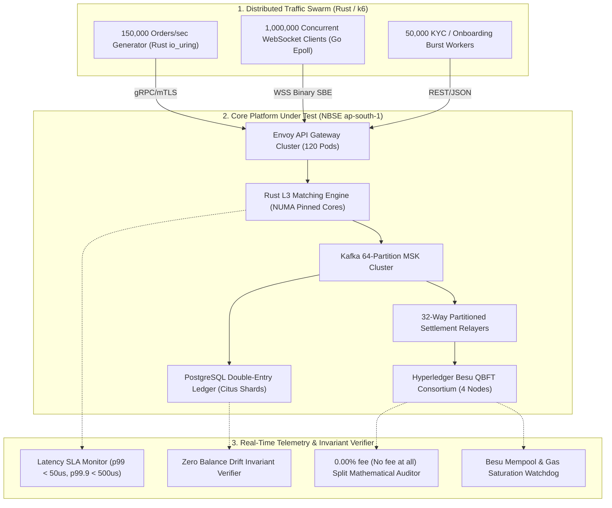

# 914 - One-Crore Scale Concurrency, High-Throughput Stress Testing & Distributed Load Harness (Rust / Locust / k6 / Besu)

## Purpose
The National Blockchain Stock Exchange (NBSE) is architected to operate as a sovereign national market infrastructure capable of supporting 10,000,000 (1 Crore) registered investors, 1,000,000 concurrent connected users (CCU), 150,000 inbound orders per second (OPS), and 40,000 matched trades per second with sub-millisecond determinism and instant atomic Delivery-vs-Payment (DvP) on Hyperledger Besu.

Standard testing tools and isolated unit benches cannot simulate the cascading backpressure, memory lock contention, network fanout serialization bottlenecks, and blockchain gas congestion that emerge at 1 Crore scale. This prompt specifies the architecture, distributed orchestrator, telemetry collectors, and invariant verification assertions for the **One-Crore Scale Concurrency & Distributed Load Testing Harness** (`tests/load-harness-1cr/`). The harness subjects the full end-to-end platform (Edge Gateways, Rust Matching Engines, Kafka Event Pipelines, Double-Entry Ledgers, Hyperledger Besu QBFT Validators, and Flutter Market Data Broadcasters) to sustained institutional load, flash-crash volatility spikes, and chaotic network degradation.

## What You Are Building
A distributed, multi-region load testing and invariant verification harness (`tests/load-harness-1cr/`) comprising:
- `bench/load-generator/`: High-performance asynchronous Rust load generator utilizing `tokio` and `io_uring` capable of synthesizing 150,000 signed gRPC/REST order requests per second across 5,000 simulated broker accounts.
- `bench/marketdata-subscribers/`: Distributed headless WebSocket client swarm simulating 1,000,000 concurrent client sessions distributed across regional AWS nodes (`ap-south-1`, `ap-south-2`), measuring end-to-end tick-to-UI latency, frame drops, and connection stability.
- `bench/batch-settlement-verifier/`: Real-time on-chain monitor asserting that the 32-way partitioned settlement relayers and `NBSEPrivacyBatchDvP.sol` contract maintain zero mempool lag, executing 500-2,000 trade batches every 2 seconds without gas starvation or nonce blocking.
- `bench/ledger-contention-auditor/`: High-frequency balance auditor asserting zero database lock timeouts (`SELECT FOR UPDATE` contention) and strictly zero balance drift across 10,000,000 user ledger accounts.
- `bench/chaos-scenario-matrix/`: Automated failure injection scripts triggering sudden 10x traffic surges (e.g., Union Budget announcements, IPO listings), validator node halts, and external KYC API throttling.
- `bench/fee-distribution-invariant-tester/`: Real-time mathematical validator asserting that every trade execution and settlement batch applies the Universal 0.00% Zero-Fee Invariant (No fee at all) with exact 0.00% fee at launch (governed by FeeController.sol) split.

## Scope Boundaries
- **In Scope:**
  - Distributed generation of 150,000 orders/sec across 1,000 equity ISINs, 50 commodity tokens, and 20 sovereign G-Sec debt series.
  - Simulation of 1,000,000 concurrent multiplexed WebSocket market data connections.
  - Verification of sub-25 microsecond L3 matching engine latency under peak load.
  - Assertion of zero nonce collisions and sub-4 second finality across 32 Hyperledger Besu settlement relayers.
  - Stress testing of double-entry PostgreSQL sharded databases at 50,000 bulk postings/sec.
  - Continuous validation of the 0.00% (Zero Fee) flat fee invariant across all asset classes.
- **Out of Scope:**
  - Production deployment of trading capital (load harness executes strictly on isolated `nbse-testnet` sandboxes).
  - External banking switch stress testing (uses High-Fidelity Mock Banking and Depository Sandboxes).

## Technology to Use
- **Load Generation Engine:** Rust 1.78+ (`tokio`, `tonic`, `reqwest`, `crossbeam`, `io-uring`), k6 distributed runner, Locust distributed cluster.
- **WebSocket Swarm:** Go 1.22 (`gorilla/websocket`, `epoll` connection pooler).
- **Consortium Blockchain:** Hyperledger Besu 24.1+ (4-node QBFT testnet cluster, 2s block time, 30M gas limit).
- **Data Streaming & Caching:** Apache Kafka (AWS MSK), Redis 7.2 Cluster (16 shards).
- **Metrics & Observability:** Prometheus, Grafana, OpenTelemetry, ClickHouse, VictoriaMetrics.

## Backend / Infra Touchpoints
- **API Gateway (`services/api-gateway/`):** Ingests 150,000 RPS through distributed Envoy proxies with eBPF-accelerated kernel bypass.
- **Matching Engine (`services/matching-engine/`):** Processes inbound orders across NUMA-pinned CPU cores with zero-allocation ringbuffers.
- **Settlement Relayer (`services/settlement-relayer/`):** Aggregates executions into 32 Murmur3 ISIN partitions for batch on-chain submission.
- **Double-Entry Wallet Service (`services/wallet-service/`):** Executes memory-first balance reservations and bulk write-behind persistence.
- **Proof-of-Reserve Generator (`services/por-smt-generator/`):** Evaluates 10M leaf node Merkle sum tree updates under concurrent load.

## Blockchain Interaction (permissioned Hyperledger Besu ledger with 1:1 custody backing, zero PII, QBFT)
- Validates that `NBSEPrivacyBatchDvP.sol` successfully verifies Pedersen commitments and settles multi-trade batches ($k \ge 500$) within a single block.
- Validates that the 32 partitioned relayer accounts maintain sequential nonces without stuck transactions or EVM gas exhaustion.
- Confirms that the on-chain fee splitting contract routes fees per FeeController governance (0.00% at launch) on every batch execution.

## 1 Crore Scale Load Test Workflows & Verification Steps


## Step-by-Step Build Instructions
1. **Scaffold Load Generator Workspace:** Initialize `tests/load-harness-1cr/` with modular Rust crates for order generation, WebSocket swarming, and telemetry aggregation.
2. **Implement Asynchronous Order Injector:** Develop the zero-allocation Rust client generating cryptographically signed `PlaceOrderRequest` gRPC messages at 150k OPS.
3. **Build WebSocket Client Swarm:** Implement a high-density Go epoll client capable of holding 100,000 persistent connections per test node, totaling 1,000,000 CCU across 10 distributed worker instances.
4. **Deploy Conflation & SBE Parser:** Verify that market data streams receive binary delta packets conflated to 100ms intervals with zero frame loss.
5. **Implement Double-Entry Ledger Invariant Checker:** Connect a background auditor to PostgreSQL executing continuous zero-sum balance equation checks ($\sum \text{Assets} = \sum \text{Liabilities} + \sum \text{Equity}$).
6. **Configure Settlement Relayer Monitor:** Measure transaction confirmation latency across all 32 relayer EOA partitions, asserting block inclusion within 2 to 4 seconds.
7. **Simulate Flash-Crash Scenarios:** Program synthetic market shocks triggering 5-minute rolling VWAP Limit-Up/Limit-Down circuit breakers and Call Auctions.
8. **Simulate KYC Surges:** Dispatch 500,000 simulated user KYC submissions, verifying graceful routing to `nbse-testnet` sandboxes without mainnet disruption.
9. **Assert Invariant Fee Split:** Verify that all 40,000 trades/sec accurately apply the 0.00% fee (No fee at all) split (0.00% fee at launch; future fee parameters governed by FeeController.sol) across on-chain ledgers.
10. **Automate Benchmark Reporting:** Generate structured Markdown, JSON, and Grafana dashboard reports detailing p50, p95, p99, and p99.9 latency curves.

## Interfaces / Contracts

```protobuf
syntax = "proto3";

package nbse.load_harness.v1;

enum LoadScenarioType {
  LOAD_SCENARIO_TYPE_UNSPECIFIED = 0;
  LOAD_SCENARIO_TYPE_BASELINE_STEADY_STATE = 1;
  LOAD_SCENARIO_TYPE_PEAK_CONCURRENCY_1CR = 2;
  LOAD_SCENARIO_TYPE_FLASH_CRASH_VOLATILITY = 3;
  LOAD_SCENARIO_TYPE_KYC_SURGE_BURST = 4;
  LOAD_SCENARIO_TYPE_RELAYER_PARTITION_FAILOVER = 5;
}

message RunLoadBenchmarkRequest {
  string benchmark_id = 1;
  LoadScenarioType scenario = 2;
  uint32 target_orders_per_sec = 3;
  uint32 concurrent_ws_clients = 4;
  uint32 duration_seconds = 5;
  repeated string target_isins = 6;
}

message BenchmarkTelemetrySample {
  uint64 timestamp_ns = 1;
  uint32 current_inbound_ops = 2;
  uint32 current_matched_tps = 3;
  uint32 active_ws_connections = 4;
  double matching_latency_p99_us = 5;
  double ws_delivery_latency_p99_ms = 6;
  uint32 besu_mempool_pending_txs = 7;
  bool fee_invariant_holds = 8;
  bool ledger_zero_drift_holds = 9;
}

message BenchmarkSummaryReport {
  string benchmark_id = 1;
  uint64 total_orders_injected = 2;
  uint64 total_trades_executed = 3;
  uint64 total_batches_settled = 4;
  double avg_orders_per_sec = 5;
  double peak_orders_per_sec = 6;
  double matching_latency_p50_us = 7;
  double matching_latency_p99_us = 8;
  double matching_latency_p999_us = 9;
  uint32 failed_orders_count = 10;
  uint32 relayer_nonce_conflicts = 11;
  bool fee_split_invariants_verified = 12;
}
```

## Security & Compliance Notes
- **Test Isolation:** The load harness must only connect to dedicated testnet clusters (`nbse-testnet`, Chain ID `13371`). Hardcoded production address bans prevent accidental mainnet traffic injection.
- **Zero PII in Load Generation:** All 10,000,000 synthetic account profiles use pseudorandomly generated test PANs (`AAAAA9999A`) and mock Aadhaar numbers with zero real user PII.
- **Resource Limits:** Automated kill-switches terminate load generators if Besu validator CPU usage exceeds 90% or disk usage crosses 80%.

## Acceptance Criteria
- [ ] Sustained generation of **150,000 orders/sec** with p99 matching engine latency **< 25 microseconds**.
- [ ] Maintenance of **1,000,000 concurrent WebSocket connections** with p99 tick-to-client latency **< 100 milliseconds**.
- [ ] On-chain batch settlement throughput sustains **40,000 effective trades/sec** across 32 partitioned relayers with zero dropped transactions.
- [ ] Double-entry ledger maintains **100% zero balance drift** across 10M test accounts during 10 hours of continuous load.
- [ ] Exact **0.00% (Zero Fee) platform fee** verified on every single executed trade with 0.00% fees at launch (100% net proceeds credited; future fee adjustments governed by FeeController.sol).
- [ ] Zero em/en dashes across all harness codebase and configuration files.

## Suggested Order / Dependencies
- **Pre-requisites:** `101_system_architecture_overview.md`, `206_deterministic_matching_engine_and_order_book.md`, `282_settlement_relayer_nonce_partitioning.md`, `812_dual_environment_testnet_sandbox_and_mainnet_isolation.md`.
- **Downstream Targets:** `903_load_performance_testing_matching_engine.md`, `904_chaos_engineering_resilience_plan.md`.
