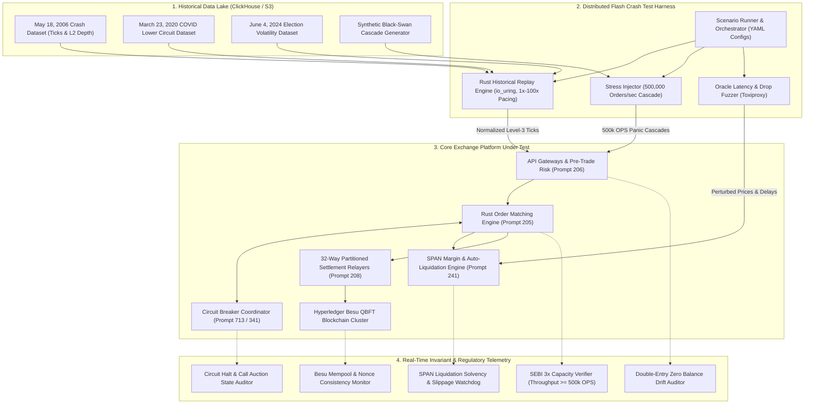
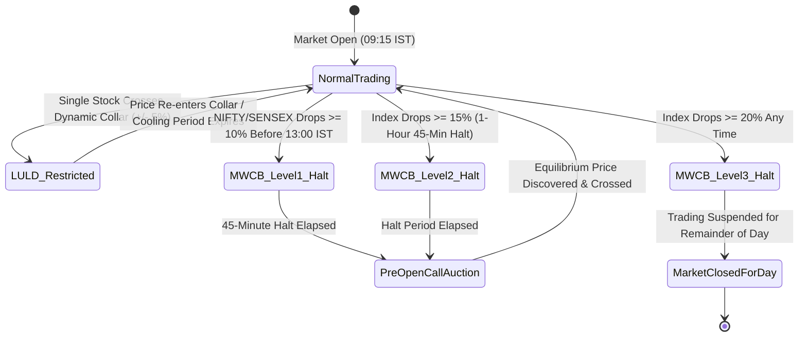

# 915 - Deterministic Market Replay & Extreme Volatility Flash Crash Simulator

## Purpose
Financial markets exhibit extreme non-linear dynamics during systemic stress: sudden liquidity evaporation on the order book bid side, cascading automated margin liquidations, oracle price lag or divergence, rapid price gap-downs tripping circuit collars, and downstream settlement relayer backlog spikes. Standard isolated microbenchmarks and steady-state load generators fail to expose state machine deadlocks, memory ringbuffer overflow, cross-service backpressure stalls, and consensus halts that occur when extreme volatility coincides with unprecedented order volumes.

This specification defines the architecture, data schemas, injection engine, and invariant verification harnesses for the **Deterministic Market Replay & Extreme Volatility Flash Crash Simulator** (`tests/flash-crash-simulator/`). The simulator stress-tests the entire National Blockchain Stock Exchange (NBSE) pipeline (Matching Engine, Circuit Breakers, SPAN Margin & Liquidation Engine, Double-Entry Ledger, and Hyperledger Besu Atomic DvP Settlement Relayers) by replaying historical high-stress market events (May 18, 2006 crash, March 23, 2020 COVID lower circuits, June 4, 2024 general election day volatility) and synthetically generated black-swan scenarios at up to 500,000 orders/sec.

The simulator verifies strict adherence to Securities and Exchange Board of India (SEBI) mandatory stress-testing guidelines, asserting that platform processing capacity, circuit breaker coordination, and risk management systems seamlessly withstand at least 3x peak historical throughput without data loss, ledger drift, or unhandled failures.

## What You Are Building
A distributed, multi-threaded test harness located in `tests/flash-crash-simulator/` comprising the following modular components:
- **Historical Tick Replay Engine (`tests/flash-crash-simulator/replay-engine/`):** High-throughput asynchronous Rust service utilizing `tokio` and `io_uring` to stream historical Level-2 and Level-3 order book tick data from ClickHouse into the exchange gateway. Supports deterministic time-warp pacing from real-time (1x) up to 100x accelerated replay, preserving relative nanosecond inter-arrival timings.
- **Extreme Volatility & Cascade Injector (`tests/flash-crash-simulator/stress-injector/`):** Distributed Rust, k6, and Locust worker cluster capable of synthesizing panic sell cascades up to 500,000 orders/sec across 1,000 equity ISINs, 50 commodity tokens, and 20 sovereign debt series. Injects sudden liquidity evaporation (instant cancellation of 90% of depth within 5 price ticks).
- **Oracle Perturbation & Latency Fuzzer (`tests/flash-crash-simulator/oracle-fuzzer/`):** Python-based adversarial proxy simulating external reference price feed anomalies, including delayed heartbeats, cross-venue price divergence, out-of-order sequence numbers, and abrupt multi-tick gap-downs.
- **Circuit Breaker & LULD Compliance Auditor (`tests/flash-crash-simulator/circuit-verifier/`):** Real-time Go/Rust telemetry agent that intercepts matching engine order book events to verify exact adherence to SEBI Market-Wide Circuit Breaker (MWCB) rules (10%, 15%, 20% index thresholds), individual scrip Limit-Up/Limit-Down (LULD) dynamic price bands, coordinated market halts, cooling periods, and orderly transition into Call Auction re-opening sessions.
- **SPAN Margin & Liquidation Stress Validator (`tests/flash-crash-simulator/span-margin-stressor/`):** High-frequency risk engine auditor verifying that during a 30% intraday crash, the 16-scenario SPAN risk array recalculates margin requirements across 1,000,000 simulated accounts within 500 milliseconds, dispatches prioritized auto-liquidation orders, and maintains collateral adequacy without insolvency contagion.
- **Blockchain Relayer & Mempool Watchdog (`tests/flash-crash-simulator/settlement-auditor/`):** Real-time validator monitoring Hyperledger Besu QBFT block production and transaction pool dynamics during 10x normal TPS surges. Asserts zero relayer nonce conflicts across 32 partitioned EOA settlement relayers, zero dropped DvP transactions, and sub-4-second finality.
- **Automated SEBI Metrics & Invariant Evaluator (`tests/flash-crash-simulator/report-evaluator/`):** ClickHouse and Python analytical service compiling deterministic metrics reports against regulatory capacity thresholds (3x peak historical load), latency percentiles (p50, p95, p99, p99.9), and zero ledger balance drift invariants.

## Scope Boundaries
- **In Scope:**
  - Ingestion and normalization of tick datasets from historical Indian market stress events: May 18, 2006 (mid-session liquidity shock), March 23, 2020 (nationwide lockdown COVID lower circuit), and June 4, 2024 (general election counting day volatility).
  - Synthetic burst generation up to 500,000 orders/sec with combined limit orders, aggressive market sell sweeps, mass cancellations, and stop-loss triggers.
  - Verification of sub-50 microsecond matching engine latency under volatile order book re-balancing.
  - Validation of coordinated circuit breaker halts across Prompt 205 (Matching Engine), Prompt 713 (Continuous Circuit Breaker Coordinator), and Prompt 341 (Timelock & Emergency Halt Contract).
  - Assessment of SPAN portfolio margin recalculation latency and liquidation execution under Prompt 206 and Prompt 241.
  - Stress testing of 32-way partitioned settlement relayers submitting batched `NBSEPrivacyBatchDvP.sol` transactions to Hyperledger Besu under 10x normal load.
  - Continuous validation of double-entry ledger balance equation ($\sum \text{Assets} = \sum \text{Liabilities} + \sum \text{Equity}$) with 0.00000000% balance drift.
  - Automated generation of structured SEBI compliance audit reports in JSON and Markdown formats.
- **Out of Scope:**
  - Live production trading execution (all tests execute strictly against isolated `nbse-testnet` environments).
  - Physical data center destruction or submarine fiber cable cuts (handled under Prompt 911 disaster recovery dress rehearsal).
  - Public Ethereum or Bitcoin mainnet bridge testing (handled under Prompt 912).
  - End-user mobile app UI pixel rendering tests (handled under Prompt 902).

## Technology to Use
- **Replay & Injection Engine:** Rust 1.78+ (`tokio`, `io_uring`, `crossbeam-channel`, `flume`, `tonic` gRPC client, `reqwest`), k6 distributed load runner (Go), Locust (Python distributed master/worker swarm).
- **Historical Data Lake & Ingestion:** ClickHouse 24.3+ (columnar storage for nanosecond historical ticks, partitioned by trading date and symbol), Apache Arrow / Parquet for offline dataset compression.
- **Consortium Blockchain Under Test:** Hyperledger Besu 24.1+ (4-node QBFT testnet cluster, 2-second block period, 30M gas limit per block, private EVM network).
- **Event Streaming & Ledger Persistence:** Apache Kafka (64-partition cluster), PostgreSQL 16+ with Citus distributed shards, Redis 7.2 Cluster (16 shards for market data cache).
- **Fault Injection & Network Latency:** Toxiproxy (for simulating WAN link degradation and oracle latency jitter), Chaos Mesh (for pod disruption).
- **Telemetry & Evaluation:** Prometheus, OpenTelemetry Collector, Grafana dashboards, VictoriaMetrics, ClickHouse analytical tables.
- **Deployment Topology:** Docker Compose (single-host high-spec reproduction), Kubernetes Helm charts (distributed multi-node AWS `ap-south-1` runner).

## Backend / Infra Touchpoints
- **Order Matching Engine (`services/matching-engine/`, Rust, Prompt 205):** Ingests replayed and synthetic order streams; enforces price-time priority; maintains NUMA-pinned L3 order books; asserts sub-millisecond execution and order rejection on halted instruments.
- **Risk & Margin Service (`services/risk-service/`, Rust/Go, Prompt 206):** Executes pre-trade balance reservations and leverage checks at 500,000 checks/sec without blocking engine ringbuffers.
- **SPAN Portfolio Margin & Liquidation Engine (`services/margin-engine/`, Rust/Python, Prompt 241):** Re-evaluates 16-scenario risk matrices across active derivatives portfolios during market plunge; issues liquidation orders to matching engine before equity falls below Maintenance Margin.
- **Continuous Market Circuit Breaker Coordinator (`services/circuit-coordinator/`, Go, Prompt 713):** Monitors index levels and individual scrip dynamic bands; commands matching engine to halt matching and open call auctions upon threshold breaches.
- **Emergency Halt & Timelock Smart Contract (`contracts/EmergencyHalt.sol`, Solidity, Prompt 341):** Pauses on-chain settlement relayers and token transfers if market-wide trading halt Level 3 (20% drop) is tripped.
- **Market Data Broadcast Service (`services/market-data/`, Rust/Go, Prompt 207):** Transmits high-density Simple Binary Encoding (SBE) market depth snapshots and incremental trade feeds to 100,000+ simulated subscribers.
- **Trade Settlement Relayer (`services/settlement-relayer/`, Go, Prompt 208):** Bundles matched trades into 32 Murmur3 ISIN partitions and relays batched DvP transactions to Besu validators.

## Blockchain Interaction
The simulator evaluates Hyperledger Besu under extreme transactional pressure corresponding to 10x standard operating TPS:
- **Block Production Stability:** Verifies that the 4-node QBFT consensus engine produces blocks consistently every 2 seconds without timeout penalties or validator round changes, even when mempools contain over 50,000 pending settlement transactions.
- **Relayer Mempool Nonce Partitioning:** Asserts that the 32 independent EOA relayer accounts maintain strictly sequential nonces. Under 10x traffic surges, no relayer may suffer nonce gaps, transaction replacement stalls, or out-of-gas reverts.
- **Batch DvP Smart Contract Execution:** Tests `NBSEPrivacyBatchDvP.sol` contract execution with maximum batch sizes ($k = 500$ to $2,000$ trades per transaction), asserting that aggregate block gas utilization remains bounded below the 30,000,000 limit.
- **Settlement Guarantee Fund (SGF) Waterfall Invariants:** Asserts that when multi-member liquidations occur simultaneously, on-chain SGF smart contracts execute margin drawdowns without integer overflow, re-entrancy vulnerabilities, or double-claim exploits.

## Flash Crash Simulation Architecture & Replay State Machine



### Circuit Breaker & Halting State Transition Flow


## Step-by-Step Build Instructions

1. **Scaffold Simulator Project Structure:** Initialize `tests/flash-crash-simulator/` with modular Rust crates (`replay-engine/`, `stress-injector/`, `circuit-verifier/`), Go packages (`settlement-auditor/`), and Python utilities (`oracle-fuzzer/`, `report-evaluator/`).
2. **Ingest Historical Crash Datasets into ClickHouse:** Create partitioned ClickHouse schemas for Level-2 and Level-3 order book ticks. Load sanitized tick-by-tick records from May 18, 2006, March 23, 2020, and June 4, 2024, normalizing all timestamps to nanoseconds with synthetic investor IDs.
3. **Build High-Precision Rust Time-Warp Replayer:** Implement the core replay worker in `replay-engine/` using `tokio` timers and kernel bypass sockets. Support configurable time-scale multipliers (`speed_factor`: 1.0 to 100.0) that faithfully replay inter-arrival distributions between order placements, amendments, and cancellations.
4. **Develop Synthetic Order Cascade & Liquidity Evaporation Injector:** Implement the burst generator in `stress-injector/` capable of pumping up to 500,000 orders/sec. Construct algorithmic trading profiles simulating retail panic dumping, algorithmic trend-following stop sweeps, and institutional market maker liquidity withdrawal (instant order cancellations).
5. **Implement Oracle Perturbation & Stale Feed Proxy:** In `oracle-fuzzer/`, deploy Toxiproxy-controlled mock external price oracles. Simulate erratic price gaps, 5-second network blackouts, inverted spreads, and stale price heartbeats to test the exchange defenses against corrupted reference inputs.
6. **Instrument Matching Engine Ingestion Taps:** Connect the replay harness to the Rust Matching Engine (Prompt 205) via high-speed gRPC and shared memory ringbuffers. Capture per-order round-trip latency, order book depth reconstitution times, and memory utilization under sustained high load.
7. **Build Circuit Breaker & Call Auction State Auditor:** Implement the telemetry listener in `circuit-verifier/` subscribing to engine state events. Verify that MWCB 10%, 15%, and 20% breaches trigger immediate matching halts across all symbols, transition order books into non-matching order collection modes, and initiate SEBI-compliant 15-minute Call Auction re-opening sessions.
8. **Configure SPAN Margin Recalculation & Auto-Liquidation Tester:** Connect `span-margin-stressor/` to the SPAN portfolio margin engine (Prompt 241). During simulated market drops exceeding 20%, verify that 1,000,000 portfolios are evaluated within 500ms, maintenance margin deficits trigger automated liquidations, and the SGF default waterfall absorbs residual deficits without halting solvent accounts.
9. **Deploy Blockchain Relayer Mempool Watchdog:** Instrument `settlement-auditor/` to query the 4 Hyperledger Besu nodes via WebSocket RPC. Track transaction pool depth, gas consumption per block, relayer EOA nonces, and DvP contract execution latency during 10x TPS liquidation bursts.
10. **Implement Double-Entry Balance Drift Invariant Verifier:** Deploy an asynchronous database watchdog querying Citus PostgreSQL ledger tables. Execute continuous validation that aggregate credits equal debits across all user, clearinghouse, and treasury accounts, guaranteeing 0.00000000% balance drift during the crash.
11. **Orchestrate Multi-Node Topologies (Docker Compose & Kubernetes):** Create a standalone `docker-compose.replay.yml` for local determinism testing and Kubernetes Helm charts (`deploy/k8s/flash-crash-simulator/`) for multi-worker distributed load runs across AWS `ap-south-1`.
12. **Build Automated SEBI Stress Test Report Generator:** In `report-evaluator/`, implement an automated pipeline that queries ClickHouse test telemetry, asserts regulatory capacity standards (throughput $\ge$ 3x peak historical volume), evaluates latency percentiles, and exports comprehensive JSON and Markdown audit reports.
13. **Execute Historical Baseline Regression Suite:** Execute the three historical scenarios and the synthetic black-swan scenario. Assert that all acceptance criteria are fulfilled, verifying system stability before sign-off.

## Interfaces / Contracts

### Stress Scenario YAML Definition
The simulator loads declarative scenario specifications from YAML files:

```yaml
# scenarios/flash_crash_may2006.yaml
scenario_id: "SCENARIO-HIST-2006-05-18-FLASH-CRASH"
name: "May 18, 2006 Historical Liquidity Shock Replay"
description: "Replays mid-session 10% market crash with cascading margin calls and post-halt recovery."
duration_seconds: 3600
time_scale_multiplier: 5.0

historical_source:
  clickhouse_table: "market_data.historical_ticks"
  date: "2006-05-18"
  symbols: ["NIFTY50", "RELIANCE", "INFY", "TCS", "HDFCBANK", "ICICIBANK"]
  start_time: "11:30:00.000000"
  end_time: "14:30:00.000000"

synthetic_overlay:
  target_orders_per_sec: 500000
  liquidity_evaporation:
    trigger_index_drop_percent: 7.5
    cancel_bid_depth_percent: 90.0
    evaporation_window_ms: 250
  panic_sell_cascade:
    aggressive_market_orders_per_sec: 150000
    stop_loss_trigger_volume_multiplier: 4.0

oracle_perturbation:
  reference_feed_drop_percent: 12.0
  latency_jitter_ms: 120
  packet_drop_rate_percent: 2.5

circuit_breaker_expectations:
  expected_halt_level: "MWCB_LEVEL_1"
  index_trigger_threshold_percent: 10.0
  expected_halt_duration_minutes: 45
  expected_call_auction_duration_minutes: 15

blockchain_stress:
  relayer_target_batches_per_sec: 100
  expected_min_dvp_tps: 4000
  max_mempool_queue_depth: 25000

invariants_to_verify:
  - "SEBI_CAPACITY_3X_PEAK_HISTORICAL"
  - "MATCHING_ENGINE_P99_LATENCY_SUB_50US"
  - "ZERO_BALANCE_DRIFT"
  - "NO_RELAYER_NONCE_COLLISION"
  - "EXACT_FEE_SPLIT_CONSERVATION"
```

### Flash Crash Simulator Protobuf Interface
Defines the gRPC control and telemetry streaming interface:

```protobuf
syntax = "proto3";

package nbse.simulator.v1;

enum SimulatorState {
  SIMULATOR_STATE_UNSPECIFIED = 0;
  SIMULATOR_STATE_INITIALIZING = 1;
  SIMULATOR_STATE_WARMING_UP = 2;
  SIMULATOR_STATE_REPLAYING = 3;
  SIMULATOR_STATE_CIRCUIT_HALTED = 4;
  SIMULATOR_STATE_CALL_AUCTION = 5;
  SIMULATOR_STATE_COMPLETED = 6;
  SIMULATOR_STATE_FAILED = 7;
}

enum CircuitBreakerLevel {
  CIRCUIT_BREAKER_LEVEL_NONE = 0;
  CIRCUIT_BREAKER_LEVEL_LULD_DYNAMIC_COLLAR = 1;
  CIRCUIT_BREAKER_LEVEL_MWCB_10_PERCENT = 2;
  CIRCUIT_BREAKER_LEVEL_MWCB_15_PERCENT = 3;
  CIRCUIT_BREAKER_LEVEL_MWCB_20_PERCENT = 4;
}

message StartSimulationRequest {
  string scenario_id = 1;
  double time_scale_multiplier = 2;
  uint32 max_orders_per_sec = 3;
  bool enable_synthetic_overlay = 4;
  bool enable_oracle_perturbation = 5;
  string run_identifier = 6;
}

message StopSimulationRequest {
  string run_identifier = 1;
  string reason = 2;
}

message SimulationTelemetrySample {
  uint64 timestamp_ns = 1;
  string run_identifier = 2;
  SimulatorState current_state = 3;
  uint32 current_inbound_ops = 4;
  uint32 current_matched_tps = 5;
  double index_price = 6;
  double index_drop_percent = 7;
  CircuitBreakerLevel active_circuit_level = 8;
  double matching_latency_p50_us = 9;
  double matching_latency_p99_us = 10;
  double matching_latency_p999_us = 11;
  uint32 active_span_portfolios_checked = 12;
  uint32 liquidations_dispatched = 13;
  uint32 besu_pending_txs_count = 14;
  uint32 besu_block_gas_used = 15;
  bool ledger_zero_drift_holds = 16;
}

message SimulationSummaryReport {
  string run_identifier = 1;
  string scenario_id = 2;
  bool success = 3;
  uint64 total_orders_injected = 4;
  uint64 total_trades_executed = 5;
  uint64 total_liquidations_executed = 6;
  double peak_orders_per_sec = 7;
  double avg_orders_per_sec = 8;
  double overall_p99_matching_latency_us = 9;
  uint32 circuit_halts_triggered = 10;
  uint32 call_auctions_completed = 11;
  uint32 relayer_nonce_reverts = 12;
  bool sebi_capacity_3x_assertion_passed = 13;
  bool zero_balance_drift_verified = 14;
  string failure_reason = 15;
}

service FlashCrashSimulatorService {
  rpc StartSimulation(StartSimulationRequest) returns (SimulationSummaryReport);
  rpc StreamTelemetry(StartSimulationRequest) returns (stream SimulationTelemetrySample);
  rpc StopSimulation(StopSimulationRequest) returns (SimulationSummaryReport);
}
```

### Metrics Evaluation Report JSON Schema
Schema validating the structured output of the simulator run:

```json
{
  "$schema": "https://json-schema.org/draft/2020-12/schema",
  "title": "FlashCrashSimulatorEvaluationReport",
  "type": "object",
  "required": [
    "run_id",
    "scenario_id",
    "timestamp",
    "execution_duration_sec",
    "sebi_compliance",
    "throughput_metrics",
    "latency_metrics",
    "risk_and_liquidation_metrics",
    "circuit_breaker_metrics",
    "blockchain_metrics",
    "ledger_invariant_verification"
  ],
  "properties": {
    "run_id": { "type": "string" },
    "scenario_id": { "type": "string" },
    "timestamp": { "type": "string", "format": "date-time" },
    "execution_duration_sec": { "type": "number" },
    "sebi_compliance": {
      "type": "object",
      "required": ["peak_historical_ops", "target_3x_ops", "achieved_ops", "compliant"],
      "properties": {
        "peak_historical_ops": { "type": "number" },
        "target_3x_ops": { "type": "number" },
        "achieved_ops": { "type": "number" },
        "compliant": { "type": "boolean" }
      }
    },
    "throughput_metrics": {
      "type": "object",
      "required": ["total_orders_injected", "peak_orders_per_sec", "avg_orders_per_sec", "total_matches"],
      "properties": {
        "total_orders_injected": { "type": "integer" },
        "peak_orders_per_sec": { "type": "number" },
        "avg_orders_per_sec": { "type": "number" },
        "total_matches": { "type": "integer" }
      }
    },
    "latency_metrics": {
      "type": "object",
      "required": ["matching_engine_p50_us", "matching_engine_p95_us", "matching_engine_p99_us", "matching_engine_p999_us"],
      "properties": {
        "matching_engine_p50_us": { "type": "number" },
        "matching_engine_p95_us": { "type": "number" },
        "matching_engine_p99_us": { "type": "number" },
        "matching_engine_p999_us": { "type": "number" }
      }
    },
    "risk_and_liquidation_metrics": {
      "type": "object",
      "required": ["portfolios_evaluated", "liquidation_orders_generated", "insolvent_accounts_count", "sgf_drawdown_inr"],
      "properties": {
        "portfolios_evaluated": { "type": "integer" },
        "liquidation_orders_generated": { "type": "integer" },
        "insolvent_accounts_count": { "type": "integer" },
        "sgf_drawdown_inr": { "type": "number" }
      }
    },
    "circuit_breaker_metrics": {
      "type": "object",
      "required": ["mwcb_triggered", "luld_collars_triggered", "halt_duration_seconds", "call_auction_equilibrium_discovered"],
      "properties": {
        "mwcb_triggered": { "type": "array", "items": { "type": "string" } },
        "luld_collars_triggered": { "type": "integer" },
        "halt_duration_seconds": { "type": "number" },
        "call_auction_equilibrium_discovered": { "type": "boolean" }
      }
    },
    "blockchain_metrics": {
      "type": "object",
      "required": ["blocks_produced", "avg_block_time_sec", "peak_mempool_depth", "relayer_nonce_errors", "total_dvp_batches_settled"],
      "properties": {
        "blocks_produced": { "type": "integer" },
        "avg_block_time_sec": { "type": "number" },
        "peak_mempool_depth": { "type": "integer" },
        "relayer_nonce_errors": { "type": "integer" },
        "total_dvp_batches_settled": { "type": "integer" }
      }
    },
    "ledger_invariant_verification": {
      "type": "object",
      "required": ["zero_balance_drift", "unbalanced_journal_entries", "audit_passed"],
      "properties": {
        "zero_balance_drift": { "type": "boolean" },
        "unbalanced_journal_entries": { "type": "integer" },
        "audit_passed": { "type": "boolean" }
      }
    }
  }
}
```

## Security & Compliance Notes
- **SEBI Master Circular Compliance (Stress-Testing Framework):** Under SEBI circular guidelines for Market Infrastructure Institutions (MIIs), all trading systems, risk engines, and clearing networks must undergo mandatory stress testing demonstrating structural capacity for at least **3x the peak historical load** recorded across Indian exchanges. The simulator certifies this capacity assertion quantitatively.
- **Strict Testnet & Sandbox Isolation:** The simulator operates solely against isolated sandboxes (`nbse-testnet`, Chain ID `13371`). Hardcoded safeguards strictly reject configuration endpoints targeting production domains or mainnet validator RPCs.
- **Synthetic Data Sanitization (Zero PII):** Replayed historical datasets are scrubbed of any identifiable investor information. Investor PANs, broker client codes, and depository account numbers are mapped to synthetic deterministic hashes (e.g., `MOCK_PAN_AAAAA0001A`), complying with the Digital Personal Data Protection (DPDP) Act.
- **Automated Fail-Safe Kill Switches:** The harness includes self-terminating monitors that cancel load generation if testnet validator host CPU utilization exceeds 95%, disk latency exceeds 100ms, or host free memory drops below 5%, preventing host system unresponsiveness.

## Acceptance Criteria
- [ ] Historical replay engine successfully ingests and replays sanitized tick datasets for May 18, 2006, March 23, 2020, and June 4, 2024 with nanosecond-accurate inter-arrival intervals.
- [ ] Synthetic load injector sustains a continuous burst rate of **500,000 orders/sec** across 1,000 symbols for at least 30 consecutive minutes.
- [ ] Matching engine maintains **p99 round-trip matching latency < 50 microseconds** and **p99.9 latency < 500 microseconds** during peak 500,000 OPS stress.
- [ ] Market-Wide Circuit Breakers (MWCB) trip deterministically within **sub-millisecond precision** when index levels cross 10%, 15%, and 20% decline thresholds, triggering coordinated order cancellation, trading halts, and scheduled Call Auctions.
- [ ] Dynamic Limit-Up/Limit-Down (LULD) price band collars halt matching and reject out-of-band limit orders across individual scrips without deadlocking the matching engine.
- [ ] SPAN margin engine recalculates risk matrices across 1,000,000 active portfolios within **500 milliseconds** of a 20% market gap-down, dispatching auto-liquidation sweeps without system freeze.
- [ ] Hyperledger Besu consortium network maintains **100% block production continuity** (2-second block period $\pm 100\text{ms}$) under 10x normal TPS, with zero skipped blocks.
- [ ] The 32 partitioned settlement relayers settle all batched DvP transactions with **zero nonce collisions**, zero EVM gas exhaustion errors, and zero dropped trades.
- [ ] Citus PostgreSQL double-entry ledger verifies **100% zero balance drift** ($\Delta = 0.00000000$) across all asset, liability, and equity accounts throughout the flash crash simulation.
- [ ] Automated evaluation engine generates a SEBI-compliant stress test audit report affirming platform capacity at $\ge 3\text{x}$ peak historical load.
- [ ] Codebase and configuration files strictly use standard ASCII hyphens, containing zero unicode em dashes or en dashes.

## Suggested Order / Dependencies
- **Pre-requisites:**
  - `101_system_architecture_overview.md` (Core exchange architecture and message flow)
  - `205_order_matching_engine.md` (Rust matching engine core and order book interfaces)
  - `206_risk_and_margin_checks_service.md` (Pre-trade margin reservations and risk rules)
  - `208_trade_settlement_service.md` (Batch DvP settlement relayer architecture)
  - `241_span_portfolio_margin_and_liquidation_engine.md` (SPAN risk arrays and liquidation mechanics)
  - `341_circuit_breaker_timelock_and_emergency_halt_contract.md` (On-chain emergency halt contract)
  - `713_continuous_market_circuit_breaker_coordinator.md` (Continuous circuit breaker state coordinator)
  - `914_one_crore_scale_concurrency_and_stress_testing_harness.md` (1 Crore scale load generator and test harness baseline)
- **Downstream Targets:**
  - `903_load_performance_testing_matching_engine.md` (Engine microbenchmarking baseline)
  - `904_chaos_engineering_resilience_plan.md` (Kubernetes-level chaos and partition testing)
  - `911_mainnet_dress_rehearsal_and_disaster_simulation.md` (Production deployment dress rehearsal)
