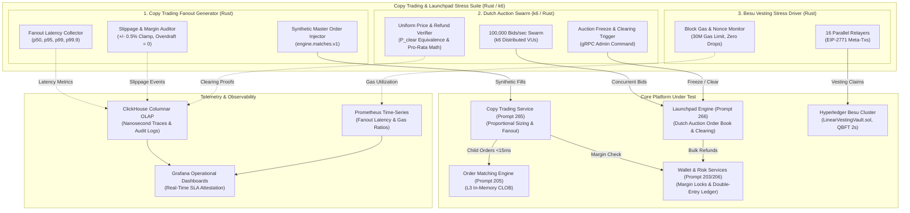

# 917 - Copy Trading Replication & Primary Dutch Auction Concurrency Stress Suite

## Purpose
Establishes the definitive architecture, stress-testing framework, and mathematical invariant verification specification for the Copy Trading Replication and Primary Dutch Auction Concurrency Stress Suite (`tests/copy-trading-launchpad-stress/`) of the National Blockchain Stock Exchange (NBSE).

Operating regulated, institutional-grade securities tokenization and primary distribution systems under SEBI (Securities and Exchange Board of India) and IFSCA (International Financial Services Centres Authority) mandates requires uncompromising real-time determinism and strict fairness. In high-volatility market scenarios, two critical concurrency bottlenecks threaten platform stability:
1. **High-Concurrency Copy Trading Fanouts (ADR-0042):** When a top-tier lead trader (Master) executes a market order, the platform must replicate the fill proportionally across up to 10,000 active followers within a strict sub-15ms latency budget. Failure to fan out child orders instantaneously induces severe execution lag, front-running vulnerability, asymmetric market impact, and catastrophic follower slippage.
2. **High-Volume Primary Dutch Auction Clearing (ADR-0044):** During primary offerings of Real-World Assets (RWA), tokenized infrastructure bonds, and private equity, Dutch auctions experience immense concurrent bidder influxes (50,000 to 100,000 bids/sec) in the closing minutes. The platform must transition from bidding to clearing deterministically, calculate the uniform clearing price ($P_{clear}$), allocate tokens pro-rata, trigger atomic refunds for excess capital, and initialize on-chain linear vesting vaults without price divergence, balance drift, or race conditions.

This stress-testing suite provides a distributed, deterministic testing harness to simulate peak transactional stress against the Copy Trading Service (Prompt 265), Launchpad Engine (Prompt 266), Order Matching Engine (Prompt 205), and Hyperledger Besu consortium settlement layer. It guarantees that follower margin overdrafts remain strictly zero, price slippage is capped at +/- 0.5%, Dutch auctions clear with mathematical uniformity, and batch vesting claims execute within EVM gas bounds.

## What You Are Building
A distributed, high-throughput load testing and invariant verification harness (`tests/copy-trading-launchpad-stress/`) comprising:
- **Copy Trading Master Fanout Stress Engine (`bench/copy-trading-fanout/`):**
  - High-performance asynchronous Rust load injection engine (`tokio`, `rdkafka`, `tonic`) capable of injecting synthetic master fills into `engine.matches.v1` and monitoring child replication dispatch to 10,000 active follower profiles per master.
  - Microsecond-precision telemetry measuring the complete fanout lifecycle: Kafka ingestion, proportional sizing math, pre-trade risk/margin validation, top-of-book slippage verification, and child order submission to the Matching Engine (Prompt 205).
  - High-Water Mark (HWM) concurrent state assertion module evaluating weekly performance fee accounting under simulated multi-million dollar portfolio updates.
- **Dutch Auction Bidder Influx Swarm (`bench/dutch-auction-bidder/`):**
  - Distributed k6 and Rust scenario runner generating up to 100,000 concurrent bids/sec across diverse price-quantity tiers, testing REST/gRPC gateways and in-memory order books.
  - State-machine transition load injector that triggers auction cutoff, order book freezing, and simultaneous clearing execution while thousands of in-flight bids arrive.
- **Clearing Transition & Pro-Rata Invariant Auditor (`bench/clearing-transition-verifier/`):**
  - Real-time mathematical verification daemon validating that the calculated clearing price ($P_{clear}$) satisfies uniform price clearing criteria, all allocations are pro-rata compliant, and 100% of excess deposited funds are refunded without dropped messages or balance discrepancies.
- **Hyperledger Besu Batch Vesting Claim Driver (`bench/besu-vesting-stress/`):**
  - Distributed EVM transaction generator simulating thousands of auction winners simultaneously executing `claimVestedTokens()` on `LinearVestingVault.sol` via 16 parallel EIP-2771 meta-transaction relayers.
  - Asserts block gas utilization, transaction throughput (150-300 claims per 2s block), and zero relayer nonce desynchronization under network congestion.
- **Containerized Stress Infrastructure (`infra/docker-compose.stress.yml`):**
  - Multi-container local orchestration provisioning a 4-node Hyperledger Besu QBFT cluster, 3-broker Apache Kafka cluster, 16-shard Redis Cluster, ClickHouse OLAP cluster, Prometheus, Grafana, and mock trading gateways.
- **ClickHouse High-Precision Ingestion Pipeline (`collector/telemetry/`):**
  - High-volume telemetry sink recording per-order nanosecond timestamps, queue wait times, execution prices, slippage metrics, and blockchain transaction receipts for post-test forensic analysis.

## Scope Boundaries
- **In Scope:**
  - High-concurrency master order replication fanouts across up to 10,000 active followers per strategy across 50 concurrent master strategies (500,000 total active follower subscriptions).
  - Nanosecond and microsecond end-to-end latency measurement across Kafka ingestion, Rust sizing, pre-trade margin check, slippage guard, and child order dispatch.
  - Strict validation of the sub-15ms p99 latency SLA for 10,000-follower fanout bursts.
  - Emulation of flash market moves to verify that child orders exceeding +/- 0.5% (50 bps) slippage are safely rejected or converted into passive limit orders without margin breach.
  - Follower drawdown circuit-breaker stress testing: rapid liquidation and detachment when follower drawdowns exceed user-defined limits (e.g., -15%).
  - Primary Dutch auction bid influx testing up to 100,000 bids/sec across 10 concurrent auction pools.
  - Verification of auction state machine: `SCHEDULED` -> `ACTIVE` -> `FROZEN` -> `CLEARING` -> `SETTLED` -> `CLAIMING`.
  - Mathematical assertion of uniform clearing price ($P_{clear}$) where all winning bidders receive identical execution pricing.
  - Pro-rata over-subscription rationing verification and atomic bulk refund verification (<1,000ms refund window).
  - Hyperledger Besu batch linear vesting claim throughput, block gas limit compliance (30M gas per 2s block), and relayer nonce queue integrity.
  - ClickHouse event persistence and Grafana dashboard visualization.
- **Out of Scope / Handled Elsewhere:**
  - Standard unit and component integration tests (handled in Prompt 901).
  - Generic one-crore core exchange matching engine load testing (handled in Prompt 914).
  - Network-level chaos and container kill testing (handled in Prompt 904).
  - Physical fiat banking clearing rails and NEFT/RTGS stress testing (handled in Prompt 212 via mock gateways).
  - Physical NSDL/CDSL depository demat settlement (handled in Prompt 213 via mock stubs).
  - Production deployment of capital or production network execution (tests run exclusively against isolated testbeds).

## Technology to Use
- **Rust 2021 (Rust 1.78+):**
  - High-performance asynchronous runtime (`tokio` multi-threaded) for synthetic master order injection, lock-free ring-buffer dispatching, and high-speed telemetry collection.
  - Network and protocol libraries: `tonic` (gRPC), `rdkafka` (high-throughput Kafka consumption and production), `crossbeam` (lock-free concurrency), `hdrhistogram` (high-dynamic-range latency recording with microsecond accuracy).
  - *Justification:* Zero-cost abstractions, deterministic memory management without garbage collection pauses, and raw throughput required to orchestrate sub-15ms multi-threaded replication benchmarks.
- **k6 (v0.50+):**
  - Distributed load generator running custom JavaScript/Go scenarios for massive HTTP/WebSocket/gRPC auction bidder simulation.
  - *Justification:* Excellent concurrency model for distributed virtual users (VUs), native metrics reporting, and low memory footprint during multi-thousand VU spikes.
- **Docker Compose & Container Infrastructure:**
  - Multi-service test harness orchestration defining CPU/memory pinning, isolated network bridges, and persistent volumes for reproducible stress runs.
- **ClickHouse (v24.3+):**
  - Ultra-high-speed columnar database optimized for ingesting tens of millions of raw latency events, bid timestamps, and execution logs per test run.
  - *Justification:* Enables complex SQL analytical queries (e.g., p99 latency by follower tier, slippage distribution percentiles) over massive datasets in milliseconds.
- **Prometheus & Grafana:**
  - Real-time time-series telemetry scraping pushgateway and microservice metrics endpoints (`copy_trade_fanout_duration_seconds`, `dutch_auction_clearing_duration_seconds`, `besu_block_gas_used_ratio`).
- **Hyperledger Besu (v24.1+):**
  - 4-node QBFT consortium testnet with 2-second block period, deterministic single-block finality, and 30M gas limit for vesting claim benchmarking.

## Backend / Infra Touchpoints
- **Copy Trading Service (Prompt 265):** Primary target under test for master trade ingestion, proportional follower calculation ($Q_f = Q_m \times \frac{E_f}{E_m}$), lot quantization, slippage guards, and child order fanouts.
- **Launchpad Engine (Prompt 266):** Primary target under test for Dutch auction order collection, order book cutoff freezing, clearing price discovery, pro-rata allocation math, and bulk refund dispatch.
- **Order Matching Engine (Prompt 205):** Ingests child replication orders and auction clearing orders; evaluated for lock contention, book queue saturation, and match execution determinism under 10,000-order burst arrivals.
- **Order Service (Prompt 204):** Validates inbound child orders, verifies idempotency keys, and routes commands into Kafka topic `order.matching.commands.v1`.
- **Risk & Margin Checks Service (Prompt 206):** Ingests pre-trade margin verification requests during fanout bursts; stressed to verify zero Redis cache lock timeouts and sub-millisecond evaluation.
- **Wallet & Account Service (Prompt 203):** Manages locked collateral for auction bidders and processes automated bulk refunds for unallocated capital.
- **On-Chain Settlement & Vesting Contracts:**
  - `LinearVestingVault.sol`: On-chain streaming token unlock contract invoked by auction winners.
  - `PerformanceFeeDistributor.sol`: Smart contract managing weekly copy trading performance fee settlements.
  - `EIP2771Forwarder.sol`: Gasless meta-transaction forwarder verified under relayer load.

## Blockchain Interaction (permissioned Hyperledger Besu ledger with 1:1 custody backing, zero PII, QBFT)
- **Consortium Parameters:**
  - 4 QBFT validator nodes, 2-second block time, deterministic single-block finality, zero reorganizations, 30,000,000 gas limit per block.
- **Batch Linear Vesting Claims Verification:**
  - Stress testing the claim phase where 10,000 successful Dutch auction participants invoke `claimVestedTokens(uint256 scheduleId)` post-auction.
  - Testing 16 parallel relayer accounts submitting batched EIP-2771 meta-transactions to `LinearVestingVault.sol`.
  - Verifying EVM gas bounds: each individual claim transaction must consume $\le 85,000$ gas, permitting up to 350 claims per 2-second block without block gas exhaustion.
  - Proving that relayer nonce queues maintain strict monotonic ordering with zero nonce gaps, transaction replacement collisions, or stuck mempool entries under peak submission pressure.
- **Zero PII and Regulatory Invariants:**
  - On-chain interactions utilize exclusively pseudonymous identifiers (`scheduleId`, keccak256 hashed user address, token contract address). Zero personal information is written to the ledger.
  - Verifying that total claimed tokens across all schedules strictly equal the total allocated tokens from the Dutch auction clearing state.



## Step-by-Step Build Instructions
1. **Initialize Harness Project Structure:**
   Create directory `tests/copy-trading-launchpad-stress/` with submodules `bench/copy-trading-fanout/`, `bench/dutch-auction-bidder/`, `bench/clearing-transition-verifier/`, `bench/besu-vesting-stress/`, `config/`, `infra/`, and `collector/`.
2. **Configure Docker Compose Stress Environment (`infra/docker-compose.stress.yml`):**
   Define containerized environment running 4 Hyperledger Besu QBFT validator nodes, a 3-node Apache Kafka cluster with topic pre-creation (`engine.matches.v1`, `order.matching.commands.v1`, `copytrading.child_orders.v1`), a 16-shard Redis 7.2 Cluster, ClickHouse, Prometheus, and Grafana.
3. **Generate Synthetic Master & Follower Seed Data (Rust):**
   Implement `tools/seed_accounts.rs` to generate 50 master trader strategies and 10,000 active follower profiles per strategy (500,000 follower subscriptions). Populate Redis with pre-computed follower equities ($E_f$), allocation percentages, leverage tiers, and max drawdown thresholds.
4. **Implement Master Order Fill Injection Module (Rust):**
   In `bench/copy-trading-fanout/src/master_injector.rs`, implement high-throughput Kafka producer emitting synthetic execution fills (`TradeMatchEvent`) to `engine.matches.v1`. Include precise nanosecond timestamp headers, master account IDs, ISIN identifiers, execution prices, and filled quantities.
5. **Implement Nanosecond Fanout Telemetry Collector (Rust):**
   In `bench/copy-trading-fanout/src/telemetry_collector.rs`, subscribe to `copytrading.child_orders.v1` and `engine.matches.v1`. Compute fanout duration:
   $$T_{\text{fanout}} = T_{\text{child\_emitted}} - T_{\text{master\_fill}}$$
   Record latency distributions into an `HdrHistogram` and stream structured JSON traces into the ClickHouse ingestion buffer.
6. **Implement Slippage & Margin Overdraft Auditor (Rust):**
   In `bench/copy-trading-fanout/src/slippage_auditor.rs`, intercept all emitted child orders and correlate with order book top-of-book prices. Verify that no child order price deviates by $> \pm 0.5\%$ from the master fill price, and assert via Wallet Service database checks that zero follower balances fall below maintenance margin requirements.
7. **Build Follower Drawdown Circuit-Breaker Scenario:**
   Implement an automated stress test simulating an adverse master execution sequence resulting in a 20% portfolio drop. Assert that all followers with a 15% stop-loss threshold are detached within $<50\text{ms}$, their pending child orders are cancelled, and risk alerts are published to `copytrading.circuit_breaker.v1`.
8. **Develop Distributed k6 Dutch Auction Bidder Swarm:**
   In `bench/dutch-auction-bidder/auction_swarm.js`, construct k6 load script simulating 50,000 to 100,000 concurrent Virtual Users submitting bids (`price`, `quantity`, `bidder_wallet`) via gRPC and REST endpoints to Launchpad Engine (Prompt 266) across descending price tiers.
9. **Implement Auction State-Machine Cutoff Stress Trigger (Rust / Go):**
   In `bench/dutch-auction-bidder/src/cutoff_trigger.rs`, inject high-frequency bid traffic up to the exact millisecond of auction transition (`ACTIVE` -> `FROZEN`). Assert that bids timestamped after the cutoff threshold are rejected deterministically with zero race conditions or order leakage.
10. **Build Uniform Clearing Price ($P_{clear}$) Verification Engine (Rust):**
    In `bench/clearing-transition-verifier/src/uniform_price_verifier.rs`, query the finalized clearing state from Launchpad Engine. Formulate mathematical verification:
    - Aggregate cumulative bid volume sorted by descending bid price: $V_{\text{cum}}(P) = \sum_{p_i \ge P} Q_i$.
    - Determine $P_{clear}$ where $V_{\text{cum}}(P_{clear}) \ge S_{\text{total}}$ (total tokens offered).
    - Assert that every winning bidder is allocated tokens strictly at $P_{clear}$, regardless of their original higher bid price.
11. **Build Pro-Rata Allocation & Bulk Refund Invariant Verifier:**
    In `bench/clearing-transition-verifier/src/refund_verifier.rs`, evaluate the pro-rata allocation fraction for clearing tier bids:
    $$F = \frac{S_{\text{total}} - V_{\text{cum}}(P > P_{clear})}{V_{\text{tier}}(P_{clear})}$$
    Assert that unallocated funds are computed exactly ($\text{Refund} = \text{Deposit} - (\text{AllocatedQty} \times P_{clear})$) and that 100% of refund commands are dispatched to Wallet Service within 1,000ms of clearing.
12. **Implement Hyperledger Besu Batch Vesting Claim Driver (Rust):**
    In `bench/besu-vesting-stress/src/vesting_driver.rs`, instantiate 16 concurrent worker tasks, each managing an EIP-2771 relayer key. Synthesize 10,000 EIP-712 signed claim requests and submit transactions to `LinearVestingVault.sol` via JSON-RPC endpoint.
13. **Implement Besu Block Gas & Nonce Integrity Monitor (Rust):**
    In `bench/besu-vesting-stress/src/gas_monitor.rs`, poll Besu blocks via WebSocket subscription. Record per-block gas utilization, transaction counts, receipt status, and relayer transaction replacement attempts. Assert gas per claim $\le 85,000$ and zero dropped transactions.
14. **Configure ClickHouse Schemas and Ingestion Engine:**
    Create SQL initialization script `collector/telemetry/clickhouse_init.sql` defining tables `copy_trade_replication_events`, `dutch_auction_clearing_events`, and `besu_vesting_claim_benchmarks`. Write high-speed batch writer in Rust buffering and flushing metrics every 500ms.
15. **Construct Prometheus Exporters & Automated CI Test Runner:**
    Implement `scripts/run-stress-suite.sh` and GitHub Actions workflow `.github/workflows/stress-suite.yml`. Configure automated pass/fail evaluation: test run exits with non-zero code if p99 fanout latency $\ge 15\text{ms}$, if any follower suffers negative margin, if uniform price clearing is violated, or if Besu block gas limits are breached.

## Interfaces / Contracts

### 1. Copy Trading Fanout Stress Scenario Configuration (`config/copy_trading_fanout_scenario.yaml`)
```yaml
scenario:
  name: "copy_trading_10k_fanout_stress"
  description: "Benchmarking sub-15ms child order replication fanout across 10,000 followers per master"
  duration_seconds: 300
  target_sla:
    fanout_p50_max_ms: 5.0
    fanout_p95_max_ms: 10.0
    fanout_p99_max_ms: 15.0
    fanout_p999_max_ms: 25.0
    max_dropped_orders_ratio: 0.00000
    max_follower_margin_overdraft: 0.00000

  masters:
    count: 50
    execution_rate_per_sec: 10
    symbols:
      - "INE002A01018" # Reliance Industries Tokenized Equity
      - "INE009A01021" # Infosys Tokenized Equity
      - "INE467B01029" # TCS Tokenized Equity
      - "INE040A01034" # HDFC Bank Tokenized Equity

  followers:
    total_active_subscriptions: 500000
    followers_per_master: 10000
    equity_distribution:
      tier_1_retail:
        count_percent: 70
        equity_range_inr: [10000, 100000]
      tier_2_hni:
        count_percent: 25
        equity_range_inr: [100001, 1000000]
      tier_3_institutional:
        count_percent: 5
        equity_range_inr: [1000001, 50000000]
    
  slippage_guard:
    max_allowable_slippage_bps: 50 # +/- 0.5%
    rejection_behavior: "REJECT_AND_ALERT" # Options: REJECT_AND_ALERT, PASSIVE_LIMIT_CONVERT
    circuit_breaker_drawdown_percent: 15.0
```

### 2. Dutch Auction Stress Scenario Configuration (`config/dutch_auction_stress_scenario.yaml`)
```yaml
scenario:
  name: "primary_dutch_auction_100k_bidders_stress"
  description: "Stress testing primary Dutch auction bidding, instant cutoff, and uniform price clearing"
  auction_parameters:
    auction_id: "AUCTION-RWA-REALESTATE-2026-001"
    token_symbol: "NBSE-BLR-OFFICE-01"
    isin: "IN0020260019"
    total_tokens_offered: 1000000 # 1,000,000 units
    floor_price_inr: 1000.00 # Floor price: 1,000 INR
    ceiling_price_inr: 1500.00 # Ceiling price: 1,500 INR
    tick_size_inr: 5.00
    bidding_duration_seconds: 180
    freeze_buffer_milliseconds: 500 # Grace buffer before hard clearing

  traffic_profile:
    total_concurrent_vus: 50000
    peak_inbound_bids_per_sec: 100000
    price_distribution:
      at_ceiling_percent: 20
      mid_range_percent: 50
      near_floor_percent: 30
    bid_size_tokens_range: [10, 500]

  clearing_verification:
    max_clearing_calculation_duration_ms: 500
    max_refund_dispatch_duration_ms: 1000
    uniform_price_tolerance_inr: 0.00 # Strict zero price deviation
    max_unaccounted_cash_drift_inr: 0.00
```

### 3. ClickHouse Telemetry Database Schemas (`collector/telemetry/clickhouse_init.sql`)
```sql
-- ClickHouse Schema for Copy Trading & Launchpad Stress Testing Harness

CREATE DATABASE IF NOT EXISTS nbse_stress_telemetry;

-- 1. Copy Trading Replication Latency & Execution Audit Table
CREATE TABLE IF NOT EXISTS nbse_stress_telemetry.copy_trade_replication_events (
    test_run_id UUID,
    event_timestamp DateTime64(6, 'Asia/Kolkata'),
    master_order_id UUID,
    master_strategy_id UUID,
    follower_id UUID,
    isin LowCardinality(String),
    side LowCardinality(String),
    master_fill_price Decimal(18, 4),
    master_fill_qty Decimal(18, 6),
    follower_equity_inr Decimal(18, 2),
    child_order_qty Decimal(18, 6),
    child_order_price Decimal(18, 4),
    slippage_bps Int32,
    latency_sizing_ns UInt64,
    latency_margin_check_ns UInt64,
    latency_fanout_dispatch_ns UInt64,
    latency_end_to_end_ns UInt64,
    dispatch_status LowCardinality(String), -- 'MATCHED', 'SLIPPAGE_REJECTED', 'MARGIN_REJECTED', 'DROPPED'
    margin_overdraft_detected UInt8
) ENGINE = MergeTree()
PARTITION BY toYYYYMMDD(event_timestamp)
ORDER BY (test_run_id, master_strategy_id, event_timestamp, follower_id)
SETTINGS index_granularity = 8192;

-- 2. Dutch Auction Clearing State & Pro-Rata Allocation Invariant Table
CREATE TABLE IF NOT EXISTS nbse_stress_telemetry.dutch_auction_clearing_events (
    test_run_id UUID,
    auction_id String,
    clearing_timestamp DateTime64(6, 'Asia/Kolkata'),
    total_bids_submitted UInt64,
    total_bids_accepted UInt64,
    total_bids_rejected_late UInt64,
    total_volume_bid Decimal(24, 6),
    total_tokens_offered Decimal(24, 6),
    clearing_price Decimal(18, 4),
    clearing_engine_duration_ms UInt32,
    refund_dispatch_duration_ms UInt32,
    total_refund_count UInt64,
    total_refund_amount_inr Decimal(24, 2),
    uniform_price_invariant_passed UInt8,
    pro_rata_conservation_passed UInt8,
    cash_drift_inr Decimal(18, 4)
) ENGINE = MergeTree()
PARTITION BY toYYYYMMDD(clearing_timestamp)
ORDER BY (test_run_id, auction_id, clearing_timestamp)
SETTINGS index_granularity = 8192;

-- 3. Besu Batch Vesting Claim Benchmarks Table
CREATE TABLE IF NOT EXISTS nbse_stress_telemetry.besu_vesting_claim_benchmarks (
    test_run_id UUID,
    block_number UInt64,
    block_timestamp DateTime64(3, 'UTC'),
    tx_hash FixedString(66),
    relayer_address FixedString(42),
    beneficiary_address FixedString(42),
    schedule_id UInt64,
    claimed_amount Decimal(24, 6),
    gas_used UInt32,
    gas_price_gwei Decimal(9, 2),
    claim_latency_ms UInt32,
    tx_status UInt8 -- 1 = Success, 0 = Revert
) ENGINE = MergeTree()
PARTITION BY toYYYYMMDD(block_timestamp)
ORDER BY (test_run_id, block_number, tx_hash)
SETTINGS index_granularity = 8192;
```

### 4. Prometheus Metric Definitions & SLA Alerting Configuration (`collector/telemetry/prometheus_rules.yaml`)
```yaml
groups:
  - name: nbse_stress_sla_rules
    rules:
      - alert: CopyTradeFanoutLatencySLAViolated
        expr: histogram_quantile(0.99, sum(rate(copy_trade_fanout_duration_seconds_bucket[1m])) by (le)) * 1000 > 15.0
        for: 5s
        labels:
          severity: critical
          team: core-trading
        annotations:
          summary: "Copy trading fanout p99 latency exceeded 15ms SLA"
          description: "Current p99 fanout latency is {{ $value }} ms under peak 10,000 follower load."

      - alert: FollowerMarginOverdraftDetected
        expr: sum(rate(copy_trade_follower_margin_overdraft_total[1m])) > 0
        for: 0s
        labels:
          severity: disaster
          team: risk-management
        annotations:
          summary: "CRITICAL: Follower margin overdraft occurred during copy trade execution"
          description: "Follower account balance breached maintenance margin threshold during slippage event."

      - alert: DutchAuctionUniformPriceViolation
        expr: dutch_auction_uniform_price_divergence_count > 0
        for: 0s
        labels:
          severity: disaster
          team: primary-markets
        annotations:
          summary: "CRITICAL: Dutch auction cleared with non-uniform pricing"
          description: "Different winning bidders received divergent clearing execution prices."

      - alert: BesuBlockGasLimitSaturated
        expr: (besu_block_gas_used / 30000000) > 0.95
        for: 10s
        labels:
          severity: warning
          team: blockchain-infra
        annotations:
          summary: "Besu block gas limit utilization exceeded 95%"
          description: "Vesting claims saturated block gas capacity: {{ $value }}."
```

## Security & Compliance Notes
- **Follower Margin Overdraft Prevention (SEBI Risk Rules):**
  Under extreme market volatility, rapid successive master orders can deplete follower free margin before prior fills settle. The stress harness specifically injects burst sequences (5 orders in $<100\text{ms}$) to assert that the Pre-Trade Risk Engine (Prompt 206) and Copy Trading Service atomically lock margin in Redis via Lua scripts or CAS operations. Follower cash or unencumbered margin must never drop below zero under any concurrency condition.
- **Strict Uniform Clearing Price Integrity (IFSCA / SEBI ICDR Regulations):**
  In primary Dutch auctions, regulatory mandates dictate that all accepted bidders pay strictly the uniform market clearing price $P_{clear}$. The verifier inspects 100% of winning allocations in ClickHouse; any price discrimination or favoritism triggers an immediate test failure and security alert.
- **Front-Running & Information Leakage Immunity:**
  In a high-fanout copy trading environment, publishing master fills across unencrypted or poorly isolated channels exposes lead trader alpha to network sniffing and front-running. The harness validates that child orders are generated within isolated, NUMA-local worker memory and dispatched via TLS-encrypted mTLS gRPC channels directly to the matching engine boundary before external public market data tickers publish the master fill.
- **Atomic Capital Refund Guarantees:**
  In over-subscribed primary auctions, blocked bidder capital represents customer property. The harness verifies that unallocated bids are refunded instantaneously ($<1,000\text{ms}$) via idempotent double-entry database transactions, preventing capital lockup or float exploitation.
- **Zero On-Chain PII Compliance:**
  Stress test telemetry and smart contract claim interactions enforce complete pseudonymous identity hashing (keccak256 hashed identity mappings). No customer names, PAN numbers, Aadhaar references, or bank accounts are ever introduced into test vectors or blockchain transaction parameters.

## Acceptance Criteria
- [ ] Distributed load testing harness (`tests/copy-trading-launchpad-stress/`) fully builds in Rust 2021 and executes reliably via Docker Compose and automated scripts.
- [ ] 10,000-follower replication fanout completes with p99 end-to-end latency strictly $<15\text{ms}$ under continuous sustained load across 50 concurrent master strategies.
- [ ] Zero dropped child orders across 1,000,000 replicated executions; 100% of dispatched orders are accounted for in the Matching Engine journal.
- [ ] Slippage guard strictly enforces the $+/- 0.5\%$ (50 bps) boundary, correctly rejecting or converting 100% of out-of-bound child orders during injected market volatility.
- [ ] Zero follower margin overdrafts or negative cash balances detected across all stress scenarios, even during 20% simulated flash crashes.
- [ ] Follower emergency detachment circuit breaker detaches 100% of breached accounts within $<50\text{ms}$ of stop-loss threshold breach.
- [ ] Dutch auction bidding swarm sustains $\ge 50,000$ bids/sec peak influx without connection drops, HTTP 5xx errors, or queue starvation.
- [ ] Dutch auction state-machine cutoff executes deterministically: 100% of bids submitted after freeze timestamp are rejected with zero race conditions.
- [ ] Uniform clearing price $P_{clear}$ is calculated within $<500\text{ms}$ for 100,000 bids, with zero price divergence across winning allocations.
- [ ] 100% of excess capital in over-subscribed Dutch auctions is refunded atomically within $<1,000\text{ms}$ post-clearing with zero rupee cash drift.
- [ ] Hyperledger Besu consortium testnet executes batch vesting claims at $\ge 150$ claims/block within the 30M gas limit, maintaining single-block finality and zero nonce desynchronization across 16 parallel relayers.
- [ ] ClickHouse captures 100% of test telemetry without packet loss, and Grafana dashboard displays real-time p50/p95/p99 latency curves and gas metrics.
- [ ] Standard ASCII hyphens used exclusively across all documentation and configuration files (zero Unicode en/em dashes).

## Suggested Order / Dependencies
- **Pre-requisites:**
  - `205_order_matching_engine.md` (Order Matching Engine and L3 book architecture).
  - `265_copy_trading_and_proportional_replication_service.md` (Core Copy Trading replication engine, sizing algorithms, and slippage guards).
  - `266_launchpad_engine_dutch_auction.md` (Primary Market Launchpad, Dutch auction state machine, and uniform clearing algorithms).
  - `914_one_crore_scale_concurrency_and_stress_testing_harness.md` (Base exchange load generation harness and telemetry standards).
- **Parallel Tasks:**
  - `913_cross_market_reconciliation_and_settlement_fuzzing.md` (Settlement fuzzing and reconciliation).
  - `915_deterministic_market_replay_and_flash_crash_simulator.md` (Deterministic market replay and volatility injection).
  - `916_formal_verification_and_symbolic_execution_testing_spec.md` (Formal verification of core settlement and vesting smart contracts).
- **Downstream Targets:**
  - `908_production_launch_rollback_runbook.md` (Production deployment verification checklist and performance criteria).
  - `909_post_launch_monitoring_slo_error_budgets.md` (Production SLO monitoring, alerting rules, and error budget enforcement).
