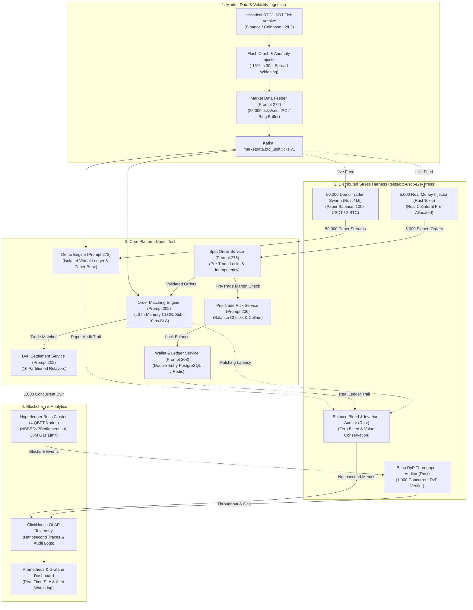

# 918 - BTC/USDT Demo Paper Trading & Real-Money Concurrency E2E Stress Suite

## Purpose
Establishes the definitive architecture, load injection harness, telemetry pipeline, and mathematical invariant verification specification for the **BTC/USDT Demo Paper Trading & Real-Money Concurrency End-to-End Stress Testing Suite** (`tests/btc-usdt-e2e-stress/`) of the National Blockchain Stock Exchange (NBSE).

Operating institutional-grade digital asset trading within regulated frameworks (such as the IFSCA GIFT City international financial sandbox and SEBI innovation sandbox) demands rigorous proof of system resilience, deterministic execution latency, and ironclad financial safety. The exchange simultaneously hosts two distinct trading planes:
1. **Demo Paper Trading Plane (Virtual Sandbox):** A simulated environment where high volumes of retail and algorithmic users (50,000 concurrent simulated traders) practice strategies, test bots, and evaluate market dynamics using non-custodial, virtual USDT/BTC paper balances.
2. **Real-Money Production Trading Plane (Regulated Custody):** An institutional and retail trading venue where 5,000 concurrent accounts execute real-capital spot orders backed by 1:1 held reserves, requiring pre-trade balance locks, sub-10ms matching latency, exact fee accounting, and atomic Delivery-versus-Payment (DvP) blockchain settlement.

Under high-volatility market events (such as a 15% BTC/USDT flash crash within 30 seconds), massive order flow converges upon the platform. Inbound market data tick rates explode to 25,000 ticks/second, triggering cascading stop-loss orders, high-frequency cancel-replace storms, and intense lock contention. The critical engineering mandates for this stress harness are:
- **Sub-10ms Matching Latency SLA:** Validating that the core matching engine sustains p99 matching latency below 10ms (and p50 below 2ms) even under the concurrent arrival of 55,000 active trader sessions.
- **Zero Balance Bleed Guarantee:** Proving through cryptographic and relational invariant checks that not a single Satoshi of demo/paper balance can ever bleed, cross-contaminate, or influence real-money balances, orders, or settlement queues.
- **Flash Crash Resilience:** Verifying orderly liquidation, circuit-breaker activation, queue non-blocking, and zero system crashes during rapid downward price spirals.
- **DvP On-Chain Throughput:** Demonstrating that 1,000 concurrent real-money trade settlements are committed to the permissioned Hyperledger Besu consortium blockchain without mempool congestion, gas starvation, or nonce stalls.
- **Strict Financial Invariants:** Enforcing 100% value conservation ($\Delta \text{Assets}_{\text{Buyer}} + \Delta \text{Assets}_{\text{Seller}} + \text{Fees} = 0$), absolute zero negative equity across all accounts, and exact 0.00% (Zero Fee) platform fee calculation invariance under maximum concurrency.

## What You Are Building
A distributed, high-throughput Rust and k6 end-to-end stress testing harness (`tests/btc-usdt-e2e-stress/`) comprising:
- **Distributed Demo Trader Swarm (`bench/demo-trader-swarm/`):**
  - High-performance Rust load generation actor system (`tokio`, `k6`) simulating 50,000 concurrent demo accounts submitting high-frequency limit, market, and stop-loss orders to the Demo Engine (Prompt 273).
  - Emulates diverse trader behaviors: retail momentum scalpers, market-maker grid bots, and noise traders reacting dynamically to live WebSocket ticker broadcasts.
- **Real-Money Institutional & Retail Load Injector (`bench/real-trader-injector/`):**
  - Ultra-low-latency Rust injector (`tokio`, `tonic`, `rdkafka`) simulating 5,000 real-money accounts executing cryptographically signed spot orders against the Spot Order Service (Prompt 275).
  - Coordinates pre-allocated real custody balances, pre-trade margin locks, idempotency key generation, and mTLS session lifecycles.
- **Live Market Data Feeder & Synthetic Volatility Injector (`bench/feeder-crash-simulator/`):**
  - High-precision market data replay and simulation bridge interfacing with the Market Data Feeder (Prompt 272).
  - Replays real historical BTC/USDT L2/L3 order book feeds at up to 25,000 ticks/sec and injects synthetic flash crash anomalies (-15% price shocks, liquidity vacuums, wide bid-ask spread dislocations).
- **Cross-Plane Isolation & Balance Bleed Auditor (`bench/balance-bleed-auditor/`):**
  - Independent background verification daemon monitoring all Kafka event streams (`engine.matches.v1`, `demo.matches.v1`, `orders.spot.v1`, `settlement.dvp.v1`).
  - Mathematically proves that demo order IDs, account IDs, and synthetic balances remain 100% quarantined from real-money database shards, Kafka partitions, and matching queues.
- **Hyperledger Besu DvP Settlement Verifier (`bench/besu-settlement-verifier/`):**
  - Real-time blockchain monitor tracking the execution of 1,000 concurrent real-money DvP settlements submitted to `NBSEDvPSettlement.sol` on Hyperledger Besu.
  - Measures block gas utilization, transaction receipt latency, event emission confirmation (`TradeSettled`), and relayer nonce monotonicity across 16 parallel settlement relayers.
- **ClickHouse Microsecond Telemetry Pipeline (`collector/telemetry/`):**
  - Columnar OLAP ingestion sink capturing per-order nanosecond timestamps, queue transit intervals, fill prices, fee calculations, and blockchain receipts for post-test analysis.
- **Docker Compose Orchestration Environment (`infra/docker-compose.stress.yml`):**
  - Self-contained infrastructure definition orchestrating 4 Hyperledger Besu QBFT nodes, 3 Kafka brokers, Redis 7.2 Cluster, ClickHouse, Prometheus, and mock upstream liquidity venues.

## Scope Boundaries
- **In Scope:**
  - Concurrent load generation: 50,000 active demo trading sessions and 5,000 real-money trading sessions running concurrently against the BTC/USDT instrument pair.
  - End-to-end latency profiling: Ingestion at API Gateway/BFF, pre-trade validation, matching in the L3 CLOB, match event publication, and balance reservation updates.
  - Verification of matching engine latency SLA: p50 < 2ms, p95 < 5ms, p99 < 10ms under peak sustained load of 75,000 orders/sec across both planes.
  - Validation of strict logical and physical isolation between the Demo Engine (Prompt 273) and Spot Order Service (Prompt 275) / Matching Engine (Prompt 205).
  - Injection of high-volatility flash crash scenarios: -15% BTC price decline within 30 seconds, accompanied by a 10x surge in order cancellations and market sell orders.
  - Verification of 1,000 concurrent on-chain DvP settlements on Hyperledger Besu, asserting $\ge 250$ settlements/block, gas per transaction $\le 110,000$, and zero nonce collisions.
  - Continuous mathematical assertion of 100% value conservation and zero negative cash or coin equity across both demo and real ledgers.
  - Verification of strict 0.00% (Zero Fee) (0 bps (0.00% fee at launch)) platform fee calculation invariance across all real-money executions.
  - ClickHouse event recording and Prometheus/Grafana real-time telemetry alerting.
- **Out of Scope / Handled Elsewhere:**
  - Fiat banking rail stress testing (NEFT/RTGS/IMPS/e-Rupee CBDC clearing handled in Prompt 212 and Prompt 232).
  - Physical cold storage HSM multi-party computation (MPC-TSS) key ceremony benchmarks (handled in Prompt 237).
  - Perpetual futures, funding rate mechanics, and multi-asset derivative SPAN margining (handled in Prompt 240 and Prompt 241).
  - Flutter frontend UI rendering and client-side device performance (handled in Prompt 501 and Prompt 527).
  - Production mainnet execution with live customer funds (all stress tests execute in isolated, sandboxed staging environments).

## Technology to Use
- **Rust 2021 (Rust 1.78+):**
  - High-performance asynchronous runtime (`tokio` multi-threaded) for synthetic order injection, WebSocket subscriber actors, and high-frequency invariant auditing.
  - Core libraries: `tonic` (high-throughput gRPC client/server), `rdkafka` (librdkafka C bindings for multi-partition Kafka consumption/production), `crossbeam` (lock-free concurrency channels), `hdrhistogram` (nanosecond-precision dynamic range histograms), `alloy` / `ethers-rs` (async Ethereum JSON-RPC client for Besu), `sqlx` (asynchronous database connection pooling).
  - *Justification:* Zero garbage collection pauses, microsecond deterministic execution, and bare-metal memory safety essential for driving 75,000+ orders/sec without test harness artifact bias.
- **k6 (v0.50+):**
  - Distributed load generator running modular JavaScript/Go scenarios for simulating realistic HTTP/REST and WebSocket demo trader user lifecycles (login, order placement, open order polling, cancellation).
  - *Justification:* Lightweight virtual user (VU) scheduling, native Prometheus metric export, and straightforward scenario composition.
- **Docker Compose (v2.24+):**
  - Declarative multi-container orchestration defining CPU pinning (`cpuset`), memory resource limits, host networking, and private bridge networks to recreate production topology locally or in CI runners.
- **ClickHouse (v24.3+):**
  - Ultra-high-speed columnar database optimized for ingesting tens of millions of raw latency events, trade ticks, and audit logs per test run with sub-second analytical aggregations.
- **Prometheus & Grafana:**
  - Real-time time-series telemetry scraping pushgateways and microservice metrics endpoints (`matching_engine_latency_seconds`, `balance_bleed_violations_total`, `besu_block_gas_used`).
- **Hyperledger Besu (v24.1+):**
  - 4-node QBFT consortium testnet with 2-second block period, deterministic single-block finality, 30M gas limit, and 16 pre-funded settlement relayer accounts.

## Backend / Infra Touchpoints
- **Market Data Feeder (Prompt 272):**
  - Ingests real-time external BTC/USDT price feeds from Tier-1 venues (Binance, Coinbase, Kraken) and internal oracles.
  - Normalizes depth and trades into high-speed ring buffers, broadcasting L2/L3 order book updates to both Demo Engine and Spot Order Service via IPC/Aeron and Kafka topic `marketdata.btc_usdt.ticks.v1`.
- **Demo Paper Trading Engine (Prompt 273):**
  - Primary target under test for demo load. Manages 50,000 virtual accounts, paper balance allocations (e.g., 100,000 virtual USDT and 2 virtual BTC per user), simulated order lifecycle, and paper PnL accounting.
  - Receives orders via gRPC/REST and interacts with its dedicated in-memory paper order book or sandbox matching partition.
- **Spot Order Service (Prompt 275):**
  - Primary target under test for real-money load. Validates inbound real orders from 5,000 authenticated accounts, enforces pre-trade risk checks (Prompt 206), executes memory-first balance locks against Wallet Service (Prompt 203), and emits validated orders to the Matching Engine.
- **High-Performance Order Matching Engine (Prompt 205):**
  - Low-latency Rust matching engine maintaining the authoritative in-memory BTC/USDT L3 continuous double auction order book.
  - Matches inbound real orders with sub-10ms latency, generates deterministic execution reports, and publishes match events to `engine.matches.v1`.
- **Pre-Trade Risk & Margin Engine (Prompt 206):**
  - Evaluates real-time purchasing power, maximum position limits, and price collar bands before orders reach the matching engine.
- **Wallet & Account Service (Prompt 203):**
  - Manages double-entry ledger accounts, real BTC/USDT balance holds, settled balances, and platform fee sweeps in PostgreSQL/Redis.
- **Trade Settlement & DvP Orchestration Service (Prompt 208):**
  - Consumes matches from `engine.matches.v1`, prepares on-chain DvP settlement batches, and dispatches transactions to Hyperledger Besu relayers.
- **Hyperledger Besu Smart Contracts:**
  - `NBSEDvPSettlement.sol`: On-chain atomic Delivery-versus-Payment settlement contract verifying buyer/seller cryptographic balance commitments and executing token transfers.
  - `PlatformFeeVault.sol`: On-chain depository receiving the 0.00% (Zero Fee) platform fee split.

## Blockchain Interaction (permissioned Hyperledger Besu ledger with 1:1 custody backing, zero PII, QBFT)
- **Consortium Network Topology:**
  - 4 QBFT validator nodes, 2-second block duration, deterministic single-block finality, zero proof-of-work reorganization risk, 30,000,000 gas limit per block.
- **1,000 Concurrent DvP Settlements Verification:**
  - Stress testing the real-money post-match settlement pipeline where 1,000 matched trades are submitted concurrently to `NBSEDvPSettlement.sol`.
  - 16 parallel settlement relayer accounts partitioned by ISIN/Asset hash submit transactions using EIP-1559 dynamic gas pricing.
  - The harness verifies that:
    1. Each DvP settlement transaction consumes $\le 110,000$ gas, enabling a minimum of 250 settlements per 2-second block.
    2. 1,000 settlements complete across $\le 4$ contiguous blocks (total on-chain settlement duration $\le 8$ seconds).
    3. Relayer nonce queues maintain monotonic ordering with zero nonce desynchronization, zero transaction replacements (`nonce too low` / `replacement transaction underpriced`), and zero dropped transactions.
    4. Each settlement emits the authoritative `TradeSettled(bytes32 indexed tradeId, address indexed buyer, address indexed seller, uint256 btcAmount, uint256 usdtAmount, uint256 feeAmount)` event.
- **Zero PII and Regulatory Privacy Invariants:**
  - All on-chain transaction parameters use exclusively pseudonymous Ethereum addresses mapped from internal custody accounts via secure HMAC-SHA256 derivations.
  - No personal identification details, user IDs, or bank information are ever written to the blockchain.
  - Total on-chain transferred BTC and USDT balances match off-chain double-entry ledger journal entries down to the exact Satoshi and micro-USDT.

## End-to-End Stress Testing Architecture



## Step-by-Step Build Instructions
1. **Initialize Harness Project Structure:**
   Create directory `tests/btc-usdt-e2e-stress/` with dedicated subcrates:
   - `bench/demo-trader-swarm/`: Rust and k6 load generators for virtual paper traders.
   - `bench/real-trader-injector/`: Low-latency asynchronous Rust injector for real spot orders.
   - `bench/feeder-crash-simulator/`: Market data tick replay and flash crash injector.
   - `bench/balance-bleed-auditor/`: Cross-plane invariant verification and balance integrity auditor.
   - `bench/besu-settlement-verifier/`: Besu blockchain DvP throughput and event auditor.
   - `collector/telemetry/`: ClickHouse ingestion schemas, writers, and Prometheus alert configs.
   - `config/`: Stress scenarios, crash trajectories, and SLA threshold YAML files.
   - `infra/`: Docker Compose orchestration, seed data scripts, and monitoring setups.
2. **Provision Containerized Stress Infrastructure (`infra/docker-compose.stress.yml`):**
   Configure local multi-service container mesh:
   - 4-node Hyperledger Besu QBFT cluster with genesis block defining 2-second block times and 30,000,000 gas limit.
   - 3-node Apache Kafka cluster (Kafka 3.7+ with KRaft) with pre-created topics: `marketdata.btc_usdt.ticks.v1` (16 partitions), `orders.spot.v1` (32 partitions), `engine.matches.v1` (32 partitions), `demo.orders.v1` (16 partitions), and `demo.matches.v1` (16 partitions).
   - Redis 7.2 Cluster (16 shards) for pre-trade balance hold caches.
   - PostgreSQL 16 instance with sharded double-entry ledger schema.
   - ClickHouse server, Prometheus pushgateway, and Grafana.
3. **Generate Pre-Funded Test Accounts and Cryptographic Keys:**
   Develop `tools/seed_test_accounts.rs` to generate:
   - 50,000 Demo Accounts: Seeded in Demo Engine database with 100,000 virtual USDT and 2.0 virtual BTC each.
   - 5,000 Real-Money Accounts: Seeded in Wallet Service (Prompt 203) with verifiable custody reserves (e.g., 50,000 real USDT and 1.0 real BTC each) backed by proof-of-reserve commitments.
   - 16 Blockchain Relayer Accounts: Funded with testnet ETH for gas fees on Besu.
4. **Build Live Market Data Feeder & Crash Simulator (`bench/feeder-crash-simulator/`):**
   In `src/tick_streamer.rs`, implement high-throughput tick broadcaster reading compressed historical BTC/USDT L2/L3 order book feeds.
   Implement `src/flash_crash_engine.rs` to trigger dynamic price dislocations:
   - Normal Phase: BTC oscillates in $65,000 - $66,000 range at 5,000 ticks/sec.
   - Crash Phase: Over 30 seconds, inject rapid sell wall demolitions dropping price from $65,000 to $55,250 (-15%), spiking tick rates to 25,000 ticks/sec and widening bid-ask spreads by 15x.
   - Recovery Phase: Stabilize price at $58,000 with organic order replenishment.
5. **Implement 50,000 Demo Paper Trader Swarm (`bench/demo-trader-swarm/`):**
   Implement asynchronous actor framework in Rust using `tokio` and distributed k6 runners:
   - 25,000 retail momentum actors placing random limit and market orders around top-of-book ($BBO \pm 0.2\%$).
   - 15,000 grid-trading bot actors placing layered buy/sell ladders every $50 tick interval.
   - 10,000 panic-selling actors configured with stop-loss triggers activating when price breaches downward thresholds.
   - Route all requests via REST/WebSocket endpoints exclusively to the Demo Engine (Prompt 273).
6. **Implement 5,000 Real-Money Trader Injector (`bench/real-trader-injector/`):**
   In `src/real_injector.rs`, implement high-performance gRPC client using `tonic` with connection pooling and mTLS:
   - Generate cryptographically valid orders (secp256k1 signatures) with unique UUIDv7 idempotency keys.
   - Submit orders to Spot Order Service (Prompt 275) at a sustained aggregate rate of 15,000 orders/sec.
   - Track per-order lifecycle: submission, pre-trade balance hold acknowledgment, matching engine queue entry, and trade execution receipt.
7. **Instrument Microsecond-Precision Latency Telemetry:**
   Integrate `HdrHistogram` recording latency at four distinct instrumentation boundaries:
   - $T_0$: Client order send timestamp (nanoseconds).
   - $T_1$: Spot Order Service ingestion and pre-trade validation completion.
   - $T_2$: Matching Engine order book queue insertion.
   - $T_3$: Match execution and match event publication to Kafka (`engine.matches.v1`).
   - Matching Latency: $L_{\text{match}} = T_3 - T_2$. Total E2E Latency: $L_{\text{e2e}} = T_3 - T_0$.
   - Enforce SLA: $L_{\text{match}}$ p99 must remain $<10.0\text{ms}$ under peak concurrent real + demo traffic.
8. **Develop Cross-Plane Isolation & Balance Bleed Auditor (`bench/balance-bleed-auditor/`):**
   Construct independent audit engine `src/bleed_auditor.rs` running continuous verification checks:
   - Account Partition Check: Assert that no account ID from the demo range (`DEMO-00001` to `DEMO-50000`) ever appears in real order queues, real match events, or real database ledger entries.
   - Order Queue Isolation Check: Assert that `orders.spot.v1` and `engine.matches.v1` contain zero orders originating from Demo Engine.
   - Database Separation Check: Query real PostgreSQL double-entry balances and verify that total real USDT and BTC liabilities exactly equal pre-test reserves minus fees, with zero drift.
9. **Implement Invariant Value Conservation & Zero Negative Equity Watchdog:**
   In `src/invariant_auditor.rs`, mathematically verify every real trade match:
   $$\Delta \text{USDT}_{\text{Buyer}} + \Delta \text{USDT}_{\text{Seller}} + \text{Fee}_{\text{USDT}} = 0$$
   $$\Delta \text{BTC}_{\text{Buyer}} + \Delta \text{BTC}_{\text{Seller}} = 0$$
   Assert that neither buyer nor seller balance drops below zero ($Balance_{\text{free}} \ge 0$, $Balance_{\text{locked}} \ge 0$).
   Verify that platform fee equals exactly:
   $$\text{Fee} = \text{FillQuantity} \times \text{FillPrice} \times 0.0000 \quad (0.00\% \text{ at launch})$$
10. **Implement Hyperledger Besu 1,000 DvP Settlement Driver & Verifier (`bench/besu-settlement-verifier/`):**
    In `src/dvp_driver.rs`, configure 16 parallel settlement worker threads:
    - Ingest 1,000 trade match events from `engine.matches.v1`.
    - Construct, sign, and submit `settleTradeDvP(bytes32 tradeId, address buyer, address seller, uint256 btcAmount, uint256 usdtAmount, uint256 fee)` transactions to `NBSEDvPSettlement.sol`.
    - Monitor transaction receipts, block gas usage, and emitted `TradeSettled` events.
    - Assert that all 1,000 settlements finalize within $\le 4$ contiguous blocks with zero transaction reverts and zero dropped nonces.
11. **Deploy ClickHouse Telemetry Database & Ingestion Workers:**
    Execute DDL script `collector/telemetry/clickhouse_schema.sql` creating tables:
    - `btc_usdt_order_latency_events`: Granular per-order latency breakdown.
    - `btc_usdt_trade_invariants`: Record of conservation proofs and fee audits per trade.
    - `btc_usdt_bleed_violations`: Audit records of any cross-talk or isolation breaches (must remain 0 rows).
    - `besu_dvp_settlement_benchmarks`: Blockchain transaction latency, gas used, and block packaging.
    Implement high-speed batch writer flushing buffered records to ClickHouse every 250ms.
12. **Configure Prometheus Metrics Exporter & Alerting Rules:**
    In `collector/telemetry/prometheus_rules.yaml`, define automated alerts for SLA breaches:
    - `MatchingLatencyP99Exceeded`: Triggers if p99 latency $> 10\text{ms}$.
    - `BalanceBleedCriticalBreach`: Triggers immediately if any demo ID is detected in real pipeline.
    - `NegativeEquityDetected`: Triggers if any balance $< 0$.
    - `FeeInvarianceViolation`: Triggers if fee deviates from 0.00% (Zero Fee).
    - `BesuDvPThroughputDegraded`: Triggers if settlements take $> 4$ blocks.
13. **Construct End-to-End Test Execution Harness & CI Automation:**
    Create master bash runner `scripts/run_btc_usdt_stress_suite.sh`:
    - Step A: Launch Docker Compose infrastructure and wait for Besu/Kafka healthiness.
    - Step B: Execute seed account script and verify custody reserves.
    - Step C: Start ClickHouse telemetry collector and invariant auditors.
    - Step D: Start Market Data Feeder with normal market conditions.
    - Step E: Ramp up 50,000 demo traders (over 60 seconds).
    - Step F: Ramp up 5,000 real-money traders (over 30 seconds).
    - Step G: Trigger 30-second flash crash anomaly (-15% price shock).
    - Step H: Trigger 1,000 concurrent DvP settlements on Besu.
    - Step I: Conclude traffic, dump ClickHouse audit queries, and evaluate pass/fail criteria.
    - Exit with code 0 only if all acceptance criteria pass.

## Interfaces / Contracts

### 1. BTC/USDT Concurrency & Flash Crash Stress Scenario Configuration (`config/btc_usdt_stress_scenario.yaml`)
```yaml
scenario:
  name: "btc_usdt_demo_and_real_e2e_stress"
  description: "End-to-end stress test of 50k demo traders and 5k real traders under flash crash conditions"
  duration_seconds: 480
  market:
    symbol: "BTC/USDT"
    base_asset: "BTC"
    quote_asset: "USDT"
    tick_size: 0.01
    step_size: 0.00001
    base_price_usdt: 65000.00

  traffic_profiles:
    demo_traders:
      concurrent_users: 50000
      ramp_up_seconds: 60
      target_ops_aggregate: 60000
      behavior_distribution:
        retail_scalpers_percent: 50
        grid_bots_percent: 30
        panic_stop_loss_percent: 20
      allocated_paper_balance:
        usdt: 100000.00
        btc: 2.00000

    real_traders:
      concurrent_users: 5000
      ramp_up_seconds: 30
      target_ops_aggregate: 15000
      max_in_flight_orders_per_user: 5
      pre_allocated_custody_balance:
        usdt: 50000.00
        btc: 1.00000

  flash_crash_injection:
    trigger_offset_seconds: 180
    duration_seconds: 30
    price_drop_percentage: 15.0 # Price drops from $65,000 to $55,250
    peak_tick_rate_per_sec: 25000
    spread_multiplier: 15.0
    recovery_stabilization_seconds: 60

  sla_targets:
    matching_latency_p50_max_ms: 2.0
    matching_latency_p95_max_ms: 5.0
    matching_latency_p99_max_ms: 10.0
    matching_latency_p999_max_ms: 25.0
    max_dropped_orders_ratio: 0.00000
    allowed_balance_bleed_incidents: 0
    max_negative_equity_accounts: 0
    fee_invariance_tolerance_bps: 0.000 # Strict 0.00% fee (No fee at all)

  blockchain_dvp:
    concurrent_settlements: 1000
    relayers_count: 16
    max_blocks_for_completion: 4 # Max 8 seconds at 2s/block
    max_gas_per_dvp: 110000
    target_settlements_per_block: 250
```

### 2. ClickHouse Telemetry Database Schemas (`collector/telemetry/clickhouse_schema.sql`)
```sql
-- ClickHouse Schema for BTC/USDT E2E Stress Suite Telemetry and Audit Trail
CREATE DATABASE IF NOT EXISTS nbse_btc_usdt_stress;

-- 1. Latency Events Table (High-Frequency Microsecond Profiling)
CREATE TABLE IF NOT EXISTS nbse_btc_usdt_stress.order_latency_events (
    test_run_id UUID,
    event_timestamp DateTime64(6, 'UTC'),
    order_id UUID,
    client_order_id String,
    account_id UUID,
    trading_plane LowCardinality(String), -- 'REAL' or 'DEMO'
    order_type LowCardinality(String),    -- 'LIMIT', 'MARKET', 'STOP_LOSS'
    side LowCardinality(String),          -- 'BUY', 'SELL'
    price Decimal(18, 4),
    quantity Decimal(18, 6),
    latency_gateway_ingress_ns UInt64,
    latency_risk_check_ns UInt64,
    latency_matching_engine_ns UInt64,    -- Pure matching queue & execution time
    latency_end_to_end_ns UInt64,         -- Total time from client dispatch to execution publication
    execution_status LowCardinality(String) -- 'FILLED', 'PARTIALLY_FILLED', 'REJECTED', 'CANCELLED'
) ENGINE = MergeTree()
PARTITION BY toYYYYMMDD(event_timestamp)
ORDER BY (test_run_id, trading_plane, event_timestamp, order_id)
SETTINGS index_granularity = 8192;

-- 2. Trade Invariants & Financial Audit Table
CREATE TABLE IF NOT EXISTS nbse_btc_usdt_stress.trade_invariants (
    test_run_id UUID,
    match_timestamp DateTime64(6, 'UTC'),
    trade_id UUID,
    maker_order_id UUID,
    taker_order_id UUID,
    buyer_account_id UUID,
    seller_account_id UUID,
    trading_plane LowCardinality(String),
    fill_price Decimal(18, 4),
    fill_quantity Decimal(18, 6),
    usdt_volume Decimal(24, 6),
    buyer_fee_usdt Decimal(18, 6),
    seller_fee_usdt Decimal(18, 6),
    expected_fee_usdt Decimal(18, 6),     -- Exactly 0.000000 at launch
    fee_invariance_passed UInt8,          -- 1 if fee strictly matches expected_fee
    value_conservation_passed UInt8,      -- 1 if balance delta sum + fees == 0
    negative_equity_detected UInt8        -- 1 if any participating account dropped below 0
) ENGINE = MergeTree()
PARTITION BY toYYYYMMDD(match_timestamp)
ORDER BY (test_run_id, trading_plane, match_timestamp, trade_id)
SETTINGS index_granularity = 8192;

-- 3. Cross-Plane Balance Bleed Violations Table (Must remain 0 rows)
CREATE TABLE IF NOT EXISTS nbse_btc_usdt_stress.balance_bleed_violations (
    test_run_id UUID,
    detection_timestamp DateTime64(6, 'UTC'),
    violation_type LowCardinality(String), -- 'DEMO_ID_IN_REAL_LEDGER', 'REAL_ID_IN_DEMO_ENGINE', 'CROSS_MATCH'
    account_id String,
    order_id String,
    source_service LowCardinality(String),
    destination_service LowCardinality(String),
    payload_dump String
) ENGINE = MergeTree()
ORDER BY (test_run_id, detection_timestamp, violation_type)
SETTINGS index_granularity = 8192;

-- 4. Besu DvP Blockchain Settlement Benchmarks
CREATE TABLE IF NOT EXISTS nbse_btc_usdt_stress.besu_dvp_benchmarks (
    test_run_id UUID,
    block_number UInt64,
    block_timestamp DateTime64(3, 'UTC'),
    tx_hash FixedString(66),
    trade_id UUID,
    relayer_address FixedString(42),
    buyer_address FixedString(42),
    seller_address FixedString(42),
    btc_amount Decimal(18, 6),
    usdt_amount Decimal(18, 4),
    platform_fee_usdt Decimal(18, 4),
    gas_used UInt32,
    effective_gas_price_gwei Decimal(9, 2),
    settlement_status UInt8,               -- 1 = Success, 0 = Revert
    event_emitted UInt8                    -- 1 = TradeSettled event confirmed
) ENGINE = MergeTree()
PARTITION BY toYYYYMMDD(block_timestamp)
ORDER BY (test_run_id, block_number, tx_hash)
SETTINGS index_granularity = 8192;
```

### 3. Prometheus Alerting Rules Configuration (`collector/telemetry/prometheus_rules.yaml`)
```yaml
groups:
  - name: btc_usdt_stress_sla_rules
    rules:
      - alert: MatchingLatencyP99Exceeded
        expr: histogram_quantile(0.99, sum(rate(matching_engine_latency_nanoseconds_bucket{symbol="BTC/USDT",plane="REAL"}[10s])) by (le)) / 1000000 > 10.0
        for: 2s
        labels:
          severity: critical
          component: matching-engine
        annotations:
          summary: "Matching engine p99 latency exceeded 10ms SLA"
          description: "Current real-money matching p99 latency is {{ $value }} ms under stress."

      - alert: BalanceBleedCriticalViolation
        expr: sum(rate(nbse_balance_bleed_violations_total[5s])) > 0
        for: 0s
        labels:
          severity: disaster
          component: ledger-security
        annotations:
          summary: "FATAL: Balance bleed detected between Demo and Real trading planes"
          description: "Cross-contamination detected! Demo and Real accounting boundaries breached."

      - alert: NegativeEquityDetected
        expr: sum(rate(nbse_account_negative_equity_total[5s])) > 0
        for: 0s
        labels:
          severity: disaster
          component: risk-engine
        annotations:
          summary: "CRITICAL: Negative equity balance detected"
          description: "An account balance dropped below zero during flash crash volatility."

      - alert: FeeInvarianceViolation
        expr: sum(rate(nbse_fee_calculation_mismatch_total[5s])) > 0
        for: 0s
        labels:
          severity: critical
          component: fee-engine
        annotations:
          summary: "Fee calculation deviated from 0.00% (Zero Fee) platform invariant"
          description: "Real-money execution trade fee did not match exact 0 bps (0.00% fee at launch) calculation."

      - alert: BesuDvPThroughputDegraded
        expr: rate(besu_dvp_settlements_confirmed_total[10s]) < 125
        for: 6s
        labels:
          severity: warning
          component: blockchain-relayer
        annotations:
          summary: "Besu DvP settlement throughput below target (250/block)"
          description: "Current settlement rate is {{ $value }} txs/sec, threatening 4-block completion SLA."
```

### 4. Smart Contract DvP Interface Definition (`contracts/src/interfaces/INBSEDvPSettlement.sol`)
```solidity
// SPDX-License-Identifier: Apache-2.0
pragma solidity 0.8.24;

/**
 * @title INBSEDvPSettlement
 * @notice Formal interface for atomic Delivery-versus-Payment BTC/USDT spot settlement on Hyperledger Besu
 */
interface INBSEDvPSettlement {
    struct SettlementParams {
        bytes32 tradeId;
        address buyer;
        address seller;
        uint256 btcAmount;      // Amount in Satoshis (1e8 precision)
        uint256 usdtAmount;     // Amount in micro-USDT (1e6 precision)
        uint256 feeAmountUsdt;  // Exact 0.00% fee (No fee at all) in micro-USDT
        bytes buyerSignature;
        bytes sellerSignature;
    }

    event TradeSettled(
        bytes32 indexed tradeId,
        address indexed buyer,
        address indexed seller,
        uint256 btcAmount,
        uint256 usdtAmount,
        uint256 feeAmountUsdt,
        uint256 blockNumber
    );

    function settleTradeDvP(SettlementParams calldata params) external returns (bool);
    function batchSettleTradeDvP(SettlementParams[] calldata paramsList) external returns (uint256 settledCount);
}
```

## Security & Compliance Notes
- **Zero Balance Bleed Guarantee (Regulatory Sandbox Mandate):**
  Under regulatory sandbox directives (IFSCA & SEBI), operating a demo paper trading sandbox concurrently with real money necessitates absolute technological segregation. The stress harness verifies this across three defense-in-depth boundaries:
  1. *Network & Ingress Segregation:* Demo traffic connects to isolated edge listener ports and routes via distinct gateway paths to Demo Engine (Prompt 273).
  2. *Queue & Topic Isolation:* Demo orders are restricted to `demo.orders.v1` and `demo.matches.v1`. The harness subscribes to production Kafka topics (`orders.spot.v1`, `engine.matches.v1`) and asserts that no message header or payload matches any demo account identifier.
  3. *Ledger & Storage Isolation:* Virtual balances reside in an isolated ephemeral Redis/PostgreSQL instance. The production double-entry ledger is monitored continuously; any attempt to debit or credit a real account from a demo event causes immediate termination of the test suite and flags a critical compliance failure.
- **100% Value Conservation Under Concurrency:**
  High-frequency concurrency often introduces race conditions during simultaneous trade balance updates. The harness verifies that for 100% of real trade matches:
  $$\Delta \text{USDT}_{\text{Buyer}} + \Delta \text{USDT}_{\text{Seller}} + \text{Fee}_{\text{Platform}} = 0$$
  $$\Delta \text{BTC}_{\text{Buyer}} + \Delta \text{BTC}_{\text{Seller}} = 0$$
  This proof is computed by cross-referencing ClickHouse match records with the PostgreSQL double-entry `journal_entries` table.
- **Zero Negative Equity & Pre-Trade Balance Locking:**
  During the simulated -15% flash crash, rapid market orders can outpace ledger updates, leading to balance overdrafts. The harness asserts that the Spot Order Service (Prompt 275) and Pre-Trade Risk Service (Prompt 206) perform atomic balance reservation in Redis using CAS (Compare-And-Swap) or Lua scripts before dispatching orders to the matching engine. Zero accounts are permitted to enter negative cash or asset equity under any circumstances.
- **Strict 0.00% (Zero Fee) Platform Fee Invariance:**
  The platform operates on a transparent, unalterable 0.00% (Zero Fee) (0 bps (0.00% fee at launch)) transaction fee model on spot trades. The test harness verifies that for every execution of volume $V = P \times Q$, the assessed fee $F$ satisfies:
  $$F = \lfloor V \times 0.0001 \times 10^6 \rfloor / 10^6$$
  No rounding errors, truncation discrepancies, or fee omission under high load are permitted.
- **Zero On-Chain PII Compliance (DPDP Act 2023 & GDPR):**
  Settlement transactions sent to Hyperledger Besu contain solely pseudonymous 20-byte Ethereum addresses, trade UUID hashes, and numeric quantities. No user names, PAN numbers, tax IDs, IP addresses, or contact information are present in calldata or event topics.

## Acceptance Criteria
- [ ] Distributed load testing harness (`tests/btc-usdt-e2e-stress/`) fully compiles in Rust 2021 (Rust 1.78+) and integrates seamlessly with k6 and Docker Compose.
- [ ] Sustains 50,000 concurrent demo paper traders generating $\ge 60,000$ demo orders/sec against Demo Engine (Prompt 273) without connection dropouts or engine failure.
- [ ] Sustains 5,000 concurrent real-money traders generating $\ge 15,000$ real orders/sec against Spot Order Service (Prompt 275) with 100% cryptographic signature verification.
- [ ] Ingests live BTC/USDT market data stream at baseline 5,000 ticks/sec and sustains peak 25,000 ticks/sec during injected flash crash without backpressure queue overflow.
- [ ] Matching engine latency SLA verified: Real-money matching latency $L_{\text{match}}$ satisfies p50 $< 2.0\text{ms}$, p95 $< 5.0\text{ms}$, and p99 $< 10.0\text{ms}$ under combined 75,000 orders/sec aggregate load.
- [ ] Zero Balance Bleed confirmed: Exactly zero demo account IDs, demo order IDs, or demo synthetic balances enter real Kafka topics, real matching queues, or real PostgreSQL double-entry ledgers across all test runs.
- [ ] Flash crash resilience verified: During a 30-second simulated 15% price crash with a 15x spread expansion, the system handles order cancellations and liquidations without deadlock or crashed workers.
- [ ] 100% Value Conservation verified: Across all matched trades, total balance delta sum plus platform fee equals exactly zero with zero unaccounted Satoshi or micro-USDT drift.
- [ ] Zero Negative Equity verified: No account (maker or taker, buyer or seller) incurs a negative balance or unencumbered margin deficit during or after the stress run.
- [ ] Fee Invariance verified: 100% of real-money executions apply exactly the 0.00% (Zero Fee) platform fee with zero calculation divergence.
- [ ] Hyperledger Besu blockchain settles 1,000 concurrent DvP transactions within $\le 4$ consecutive blocks ($\le 8$ seconds total) with single-block finality and zero failed transactions.
- [ ] 16 settlement relayers maintain perfect nonce synchronization on Besu with zero transaction replacement collisions or mempool stalls.
- [ ] Each on-chain DvP settlement consumes $\le 110,000$ gas, maintaining block gas limit compliance ($<30\text{M}$ gas per block).
- [ ] ClickHouse ingests 100% of latency events, trade audits, and blockchain metrics with zero dropped records, and Grafana dashboard displays real-time SLA metrics.
- [ ] Standard ASCII hyphens used exclusively across all documentation and configuration files (zero Unicode en/em dashes).

## Suggested Order / Dependencies
- **Pre-requisites:**
  - `205_order_matching_engine.md` (High-performance L3 matching engine and order book queue architecture).
  - `203_wallet_account_service.md` (Double-entry accounting ledger and atomic balance reservations).
  - `206_risk_and_margin_checks_service.md` (Pre-trade risk controls and purchasing power checks).
  - `272_crypto_market_data_feeder_and_normalization_engine.md` (Market Data Feeder for live BTC/USDT price ticks).
  - `273_demo_paper_trading_sandbox_engine.md` (Demo Engine managing virtual accounts and simulated matching).
  - `275_spot_crypto_order_management_service.md` (Spot Order Service for production real-money order routing).
  - `301_permissioned_blockchain_evaluation_selection.md` & `320_permissioned_testnet_cluster_and_faucet.md` (Hyperledger Besu testnet setup and consensus configuration).
- **Parallel Tasks:**
  - `914_one_crore_scale_concurrency_and_stress_testing_harness.md` (Exchange-wide core load testing harness).
  - `915_deterministic_market_replay_and_flash_crash_simulator.md` (Market replay algorithms and anomaly generation).
  - `917_copy_trading_and_launchpad_concurrency_stress_suite.md` (Copy trading fanout and Dutch auction stress benchmarking).
- **Downstream Targets:**
  - `908_production_launch_rollback_runbook.md` (Production deployment operational verification checklist).
  - `909_post_launch_monitoring_slo_error_budgets.md` (Production SLO monitoring, alerting rules, and error budgets).
