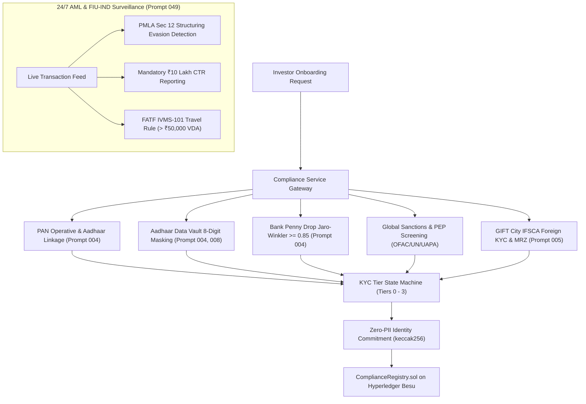

# Compliance & Regulatory Service (`services/compliance-service`)

Production-grade compliance surveillance and regulatory verification engine for the Growww / NBSE sovereign exchange, implementing statutory mandates across Prompts 000 through 049.

---

## Architecture & Responsibilities

The `compliance-service` enforces non-negotiable regulatory invariants before any domestic or international investor can deposit fiat, acquire fractional equity tokens, or settle trades on the Hyperledger Besu permissioned ledger.



---

## Key Modules & Statutory Standards

| Component | File | Statutory Authority / Prompt | Mandate & Algorithmic Rule |
| :--- | :--- | :--- | :--- |
| **PAN Verification** | `src/pan_validator.go` | Income Tax Dept / Prompt 004 | 10-char regex `^[A-Z]{5}[0-9]{4}[A-Z]$`, 4th char entity type ('P' Individual), OPERATIVE status, mandatory Aadhaar-PAN linkage (Sec 139AA). |
| **Aadhaar Data Vault** | `src/aadhaar_validator.go` | UIDAI / Prompt 004, 008 | Strict 8-digit masking (`XXXX-XXXX-1234`), zero raw 12-digit retention, opaque vault token (`ADV-TOK-...`), 14-digit CKYCR verification. |
| **Bank Penny Drop** | `src/penny_drop.go` | SEBI / Prompt 004 | Instant ₹1 IMPS/UPI penny drop, Jaro-Winkler phonetic & distance matching (threshold >= 0.85), 3rd party deposits strictly prohibited. |
| **PEP & Sanctions Engine** | `src/sanctions_pep.go` | UN / OFAC / MHA / Prompt 004, 005 | Real-time screening against UN 1267, OFAC SDN, EU, UK HMT, MHA UAPA; automated account freeze on sanctions hit; PEP EDD triggers. |
| **KYC Tier Limits** | `src/tier_limits.go` | SEBI / RBI / Prompt 004, 076 | Tier 0 (₹0), Tier 1 Basic OTP (₹25k daily / ₹1L annual), Tier 2 Full CKYC (₹5L daily / ₹25L annual), Tier 3 Institutional VCIP (₹5 Cr daily / ₹50 Cr annual). Re-KYC periodicity: Low (10y), Medium (8y), High (2y). |
| **FIU-IND Surveillance** | `src/fiu_surveillance.go` | FIU-IND / PMLA / Prompt 049 | Structuring evasion alert (2+ txs in ₹8.5L - ₹9.99L range) -> STR; single tx >= ₹10L -> CTR; VDA transfer > ₹50,000 -> IVMS-101 Travel Rule. |
| **Foreign Investor KYC** | `src/foreign_kyc.go` | IFSCA / Prompt 005 | FATF Blacklist country blocking (DPRK, Iran), ICAO 9303 MRZ passport checksums, 3D biometric PAD >= 0.85, FATCA/CRS (W-8BEN / W-9). |
| **Sandbox Guardrails** | `src/sandbox_guardrails.go` | SEBI / IFSCA / Prompt 003 | SEBI Sandbox cap (10k domestic users, ₹50k portfolio), IFSCA cap (5k foreign users, $10k portfolio), Universal Zero-Fee (0.00% launch fee). |
| **Zero-PII Commitments**| `src/identity_commitment.go`| Hyperledger Besu / Prompt 000 | Salted hash commitment `0x[a-f0-9]{64}` registered on `ComplianceRegistry.sol`; zero investor PII enters blockchain state. |

---

## Test Execution

### Go Test Suite
```bash
cd services/compliance-service
go test -v ./src
```

### Python Reference Test Suite
```bash
python3 -m unittest services/compliance-service/src/test_compliance_engine.py
```
